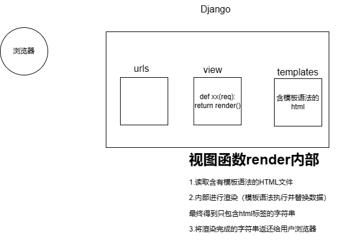

# django 基础

## 1.安装django

pip install django

安装django会出现两个

- django 框架源码
- django-admin.exe 工具，用于创建django项目中的文件和文件夹

## 2.创建项目

> django项目中会有一些默认的文件和默认的文件夹

在终端

- 打开终端

- 进入某个（项目）目录

- 执行命令创建项目

  > ...\django-admin.exe startproject 项目名称
  >
  > ```终端
  > django-admin startproject mysite
  > ```
  >
  > 

在pycharm

- 直接选择创建

> 特殊说明：
>
> - 命令行：创建的项目是标准的
> - pycharm，在标准的基础上默认加了东西
>   - templates目录
>   - setting.py文件中添加了东西
>

> 默认项目的文件介绍
>
> ```
> project_name
> 	manage.py		【项目的管理、启动项目、创建app、数据管理】
> 	project_name
> 		__init__.py
> 		settings.py	【项目配置文件】【经常操作】
> 		urls.py		【URL和函数的对应关系】【经常操作】
> 		asgi.py		【接收网络请求】【不要动】
> 		wsgi.py		【接受网络请求】【不要动】
> 
> ```
>

##  3.APP

```
-项目
	-app，用户管理【表结构，函数，html模板，css】
	-app，订单管理【表结构，函数，html模板，css】
	-app，网站【表结构，函数，html模板，css】
	。。。
	
	
注意：本项目比较简单，无需多app
```

创建app命令

```
python manage.py startapp app01
```

app目录文件介绍

```
app01
	-__init__.py
	-admin.py			【django默认提供了admin后台管理】
	-apps.py			【app启动类】
	migrations			【数据库变更记录】
		__init__.py
	models.py			【重要，对数据库操作（默认有个数据库）】
	tests.py			【单元测试，写业务不用】
	views.py			【重要，视图函数】
```

## 4.快速上手

下面必须确保

- app已经注册（不是创建

  ```python
  app01.apps.App01Config'
  ```

- 编写URL和视图函数的对应关系【urls.py中编写】

  - 先导入app的视图py
  - 后写入对应关系

- 编写视图函数【view.py】

- 启动

  - 命令行启动 python manage.py runserver
  - pycharm启动

### 4.1页面

需要写的内容（仅返回字符串

- url对应关系【urls.py】
- view.py视图函数编写【view.py】

仅返回字符串，仅仅使用HttpResponse("文本")

### 4.2templates

如果需要返回html文件

则需要返回 render(reqest,"xxx.html")

自动寻找templates目录下寻找


在视图函数中写的html文件

```
#1.首先去settings.py中的DIRS中寻找
#2.然后根据app的注册顺序去寻找templates
```

### 4.3静态文件

- 在开发过程中一般将：图片、css、js当作静态文件处理

- 静态文件默认在app里面的static中。
- 静态文件引入一般使用``


## 5.模板语法

本质上：在HTML中写一些占位符，由数据对这些占位符进行替换和处理

这个是django开发的模板语法


模板语法

- 变量`{{}}`
- 循环` `
- 条件`  `

- 其他注意事项：
  - 在模板中，列表元素通过.来访问，而不是[]




## 6.请求和响应

三个响应

- 返回字符串 HttpResponse

- 返回html内容 render(request,'xx.html',{:})

- 返回重定向地址 redirect('https://')

  > 关于重定向，其实django是告诉浏览器目的地址，从而让浏览器自行去访问，而不是django请求目的地址得到html返回给浏览器


请求相关

- 获取请求方式 request.method
- 在URL上传递值，接受这个参数 request.GET
- 获取POST请求的所有参数 request.POST

## 7.数据库操作

可以使用的方法

- mysql数据库+pymysql
- django开发操作数据库，可以通过内部的ORM框架（而不是通过pymysql）


需要安装第三方模块

pip install mysqlclient

### 7.1 ORM

ORM 可以帮助我们做两件事：

- 创建、修改、删除数据库中的表（不用自己写sql语句）【无法创建数据库】
- 操作表中的数据（不用写sql语句）

#### 7.1.1自己创建数据库

- 启动mysql服务
- 自导创建数据库

#### 7.1.2django连接数据库

在settings.py中进行配置和修改

#### 7.1.3django操作表

操作表可以分成

- 创建表
- 删除表
- 修改表

上述操作应该在models.py文件中

创建表步骤如下：

注意：app需要事先注册，否则不会提交数据库

1.model.py文件中创建类

```python
# Create your models here.
class UserInfo(models.Model):
    name = models.CharField(max_length=32)
    password = models.CharField(max_length=64)
    age = models.IntegerField()


"""
创建了上述类，可以帮助生成下面的语句
create table app01_userinfo(
    id bigint auto_crement primary key,
    name varchar(32),
    passwrod varchar(64),
    age int)
"""
```

2. 运行两条指令（正式创建数据库表
   1. 生成迁移文件 python manage.py makemigrations
   2. 应用迁移文件 python manage.py migrate

对于数据库表的删除字段和删除表，可以对类直接注释，但是如果是在类中进行字段添加，需要有一定的限制（下面有三种选择）

- 命令行设置所有值（手动写
- 添加默认值（代码default
- 可以为空（null = True

> 综上所述，如果想对表结构进行跳跳转
>
> - 在models.py文件中操作类
> - 在执行两条命令

#### 7.1.4django操作表中数据

```python
from app01.models import Department,UserInfo
def orm(request):

#1.下面六条即为添加
    # Department.objects.create(title="销售部")
    # Department.objects.create(title="IT部")
    # Department.objects.create(title="运营部")
    # UserInfo.objects.create(name="zhu",password="123")
    # UserInfo.objects.create(name="zhu",password="123")
    # UserInfo.objects.create(name="zhu",password="123")

#2.下面为删除,先筛选后删除
    UserInfo.objects.filter(id=3).delete()
    Department.objects.all().delete()

#3.下面为获取数据
    #data_list = {行，行，行} data_list获取的是QuerySet类型
    data_list = UserInfo.objects.all() #相当于select * from
    for obj in data_list:
        print(obj.id,obj.name,obj.password)

    data_list2  = UserInfo.objects.filter(id=1)
    row_obj = data_list2.first()
    print(row_obj.id,row_obj.name,row_obj.password)


#4.更新数据
    UserInfo.objects.all().update(password = 999)
    UserInfo.objects.filter(id=2).update(password = 999)
    UserInfo.objects.filter(name = "朱弘飞").update(age=999)


    return HttpResponse("成功")
```

通过上述内容可以看出，QuerySet对象可以自动动态的修改数据表中的数据

> ### 执行 SQL 语句
>
> - 当你定义一个 `QuerySet`（例如通过 `UserInfo.objects.filter(name="朱弘飞")`），你实际上是在构建一个 SQL 查询，但这个查询在这一刻还没有被执行。`QuerySet` 是懒惰的，它仅在需要评估结果（如迭代、访问元素、调用 `.count()`、`.update()` 等）时才真正执行对应的 SQL 语句。
> - 特定的操作，如 `.update()` 和 `.delete()`，会立即执行相应的 SQL `UPDATE` 或 `DELETE` 语句来修改数据库中的数据，而不需要将数据加载到 Python 内存中。

<br><br><br><br><br>

# django项目

员工管理系统

## 1.新建项目

两个删除

- 删除原有template
- 删除setting的DIRs

## 2.创建app

1. app创建

```
 python manage.py startapp app名字
```

2. app注册(setting中)

​		'app02.apps.App02Config',

## 3.设计表结构

在models.py中进行设计下面两种表

- 部门表
- 员工表

根据上述设计，可以有以下问题

1. 用户表关联的部门表是名称？还是ID？

2. 用户表关联的属性是否需要约束？

3. 部门表中的部门被删除，关联的用户表相关的行如何处理？

   1. 方式一：删除用户（级联删除

   ```
    depart = models.ForeignKey(to="Department",to_field="id",on_delete=models.CASCADE)
   ```

   1. 方式二：置为空

   ```
   depart = models.ForeignKey(to="Department",to_field="id",null=True,blank=True,on_delete=models.SET_NULL)
   ```

   

``` python
from django.db import models

# Create your models here.


class Department(models.Model):
    """ 部门表 """
    # id = models.BigAutoField(verbose_name="ID",primary_key = True)
    title = models.CharField(verbose_name="标题",max_length=32)


class UserInfo(models.Model):
    """员工表"""
    name =models.CharField(verbose_name="姓名",max_length=16)
    password=models.CharField(verbose_name="密码",max_length=64)
    age = models.IntegerField(verbose_name="年龄")
    account = models.DecimalField(verbose_name="账户余额",max_digits=10,decimal_places=2,default=0)
    create_time = models.DateTimeField(verbose_name="入职时间")

    #1.有约束
    #to 与那张表关联
    #to_field 表中的那一列关联
    # depart = models.ForeignKey(to="Department",to_field="id",on_delete=models.CASCADE)

    #2.此外在django中
    #写的depart
    #生成的数据列为depart_id

    #3.部门表删除情况如下
    #级联删除
    #置为空
    depart = models.ForeignKey(to="Department",to_field="id",null=True,blank=True,on_delete=models.SET_NULL)

    #在django中做的约束
    gender_choices = (
        (1,"男"),
        (2,"女"),
    )
    gender = models.SmallIntegerField(verbose_name="性别",choices=gender_choices)
```


注意在员工表中需要有个属性可以关联部门表

- 有约束
- 对于部门id（也可以是其他

## 4.在mysql中生成表

- 工具连接Mysql生成数据库（创建数据库

- 修改数据库配置
- django命令生成数据库表
  - makemigrations
  - migrate
- 表结构创建成功

##5.静态文件管理

static目录

## 6.部门管理

首先使用原始方式进行（目的是引出Form和ModelForm组件

### 6.1部门列表

书写步骤如下：

- urls定义映射
- views中定义函数行为
- 定义模板（利用bootstrap

## 7.模板继承

- 部门列表
- 添加部门
- 编辑部门


1. 定义模板：

   ``

2. 继承母板：

   ```html
   		
   
   ​		{%block content}
   
   ​		.....
   
   ​		
   ```

## 8.用户管理

```
insert into app02_userinfo(name,password,age,account,create_time,gender,depart_id) values ("刘东","123",23,100.68,'2010-11-11',1,1);

insert into app02_userinfo(name,password,age,account,create_time,gender,depart_id) values ("科比","999",83,1040.68,'2010-11-11',1,1);

insert into app02_userinfo(name,password,age,account,create_time,gender,depart_id) values ("六榜","6",213,10000.68,'2010-11-11',1,2);
```


django设计的操作

- 从一个表访问另一个表的实例化 

  user_obj.depart.title				#depart

- 一个表的字段限制范围时候（choices），从值对应另一个元素

​		obj_get_gender_display()		#get_gender

- 模板语法中不能加括号（会自动加


新建用户

- 原始方法：不会采用（本质）

  ```
  -数据校验麻烦
  -错误，页面上应该要有错误提示
  -页面上，每一个字段都需要我们重新写一遍
  -关联的数据，手动去获取并展示在页面
  ```

  

- Django组件

  - Form组件（小简便

    ```
    可以原始上述原始的前三点
    ```

  - ModelForm组件（最简便


原始方法流程

首先view中定义

```
def user_add(request):


    context = {
        'gender_choices':models.UserInfo.gender_choices,
        'depart_list':models.Department.objects.all()
    }
    return render(request,'user_add.html',context)
```


然后html中定义表单

```
<div class="form-group">
    <label>性别</label>
    <select class="form-control" name="gender">
    

        <option value="{{ item.0 }}">{{ item.1 }}</option>
    

    </select>
</div>
<div class="form-group">
    <label>所属部门</label>
    <select class="form-control" name="depart">
        

        <option value="{{ item.id }}">{{ item.title }}</option>
        

    </select>
</div>
```

### 8.1初识Form

**1.view.py**

```
class MyForm(Fomr):
	user = forms.CharField(widget=forms.Input)
	pwd = form.CharFiled(widget=form.Input)
	email = form.CharFiled(widget=Input)
	
	
def user_add(request):
	if request.method =="GET":
		form = MyForm()
		return render(request,"user_add.html",{"form":form})
```


**2.user_add.html**

```
<form method = "post">
	{{form.user}}
	{{form.pwd}}
	{{form.email}}
</form>


or 

<form method = "post">
	
	{{field}}
	
</form>
```

### 8.2ModelForm(推荐)


**1.model.py**

```
class UserInfo(models.Model):
    """员工表"""
    name =models.CharField(verbose_name="姓名",max_length=16)
    password=models.CharField(verbose_name="密码",max_length=64)
    age = models.IntegerField(verbose_name="年龄")
    account = models.DecimalField(verbose_name="账户余额",max_digits=10,decimal_places=2,default=0)
    create_time = models.DateTimeField(verbose_name="入职时间")

models.ForeignKey(to="Department",to_field="id",null=True,blank=True,on_delete=models.SET_NULL)

    #在django中做的约束
    gender_choices = (
        (1,"男"),
        (2,"女"),
    )
    gender = models.SmallIntegerField(verbose_name="性别",choices=gender_choices)
```


**2.views.py**

```
class MyForm(ModelForm):
	class Meta:
		mmodel = UserInfo
		fields = ["name","password","age"]
		
		
def user_add(request):
	if request.method =="GET":
		form = Myform()
		return render(request,'user_add.html',("form":form))
```


**3.user_add.html**

```
<form method = "post">
	
	{{field}}
	
</form>
```


在ModelForm中关于字段的渲染，通常采用widgets小部件来进行。

小部件可以定义字段的html属性

### 8.3Django开发小结

通过上述的步骤完成了

- 部门管理

- 用户管理

  - 用户列表

  - 新建用户

    ```
    - ModelForm 针对数据库中某个表
    - Form 
    ```

### 8.4编辑用户

- 点击编辑，跳转编辑页面（加ing编辑行的ID携带过去

- 编辑也米娜（默认数据，根据ID获取并设置到页面中

- 提交

  - 错误提示

  - 数据校验

  - 在数据库中更新

    - ```
      原始方法： models.UserInfo.filter(id=4).updagte(...)
      ```

    - ```
      ModelForm方法：
      
      添加
      form = UserModelForm(data=request.POST)
      form.save
      
      更新
      row_object = models.UserInfo.objects.Filter(id=nid).first()
      form = UserModelForm(data=request.POST,instance = row_object)
      form.save()
      
      删除
      models.UserInfo.filter(id=nid).delete()
      
      
      ps：如果需要有用户输入以外的值
      form.instance.字段名 = 值
      
      ```

## 9.靓号管理

### 9.1表结构

- ID

- mobile 
- price

- leve(choice)
- status(choice)   


```python
class PrettyNum(models.Model):
    """ 靓号表"""
    mobile = models.CharField(verbose_name="手机号", max_length=11)
    price = models.IntegerField(verbose_name="价格",default=0)

    level_choices = (
        (1, "level 1"),
        (2, "level 2"),
        (3, "level 3"),
        (4, "level 4"),
        (5, "level 5"),
    )

    level = models.SmallIntegerField(verbose_name="等级", choices=level_choices, default=1)

    stauts_choices = (
        (1, "未占用"),
        (2, "已占用")
    )

    status = models.SmallIntegerField(verbose_name="状态", choices=stauts_choices,default=2)
```


sql创建数据

```
insert into app02_prettynum(mobile,price,level,status) value ("11111111111",19,1,1)
```

### 9.2靓号列表

- URL

- 函数

  - 获取所有的靓号

  - 结合html+render将靓号展示出来

    ```
    ID 号码 价格 级别 状态
    ```

    

### 9.3新建靓号

- 列表点击跳转
- URL
- ModelForm类
- 函数
  - 实例化类的对象
  - 通过render将对象传入html中
  - 模板的循环展示所有的字段
- 点击提交
  - 数据校验
    - 方法一：正则表达式
    - 方法二：定义函数（钩子
      - def clean_字段名(self)
  - 保存到数据库
  - 跳转返回靓号列表


不允许手机号重复

```
queryset = models.PrettyNum.objects.filter(mobile="")
obj = models.PrettyNum.objects.filter(mobile="").first

exist = models.PrettyNum.objects.filter(mobile="").exists()

```

```python
def clean_mobile(self):
    txt_moblie = self.cleaned_data['mobile']
    exists = models.PrettyNum.objects.filter(mobile=txt_moblie).exists()

    if exists:
        raise forms.ValidationError("手机号已存在")

    return txt_moblie
```

### 9.4编辑靓号

- 列表页面
- URL
- 函数
  - 根据ID获取当前编辑对象
  - ModelForm配合，默认显示数据
  - 提交修改


不允许手机号重复（与新建不同的是，需要排除自身

```
exist = models.PrettyNum.objects.filter(mobile="").exculde(id=xx)
```

### 9.5搜索手机号

```python
models.PrettyNum.objects.filter(mobile="",id=xx)

data_dict={mobile="",id=xx}
models.PrettyNum.objects.filter(**data_dict)
```


```PYTHON
对于数字
models.PrettyNum.objects.filter(id=xx)		#等于
models.PrettyNum.objects.filter(id__gt=xx)	#大于
models.PrettyNum.objects.filter(id__gte=xx)	#大于等于
models.PrettyNum.objects.filter(id__lt=xx)	#小于
models.PrettyNum.objects.filter(id__lte=xx)	#小于等于


对于字符串
models.PrettyNum.objects.filter(mobile="")		#等于
models.PrettyNum.objects.filter(mobile__startwith="")	#开头
models.PrettyNum.objects.filter(mobile__endwith="")		#结尾

models.PrettyNum.objects.filter(mobile__contains="")	#包含
```

### 9.6分页管理

```python
queryset = models.PrettyNum.objects.all()

queryset = models.PrettyNum.objects.all()[0:10]
queryset = models.PrettyNum.objects.filter(id=1)[0:10]
```


- 分页的逻辑和处理规则
- 封装分页类


对get网站参数的获取处理

1. 首先对request.GET进行深拷贝
2. 然后设置拷贝对象为._mutable= True
3. 拷贝对象.setlist("字符串",[数值])
4. 拼接get参数，拷贝对象.urlenencode()

## 10.时间插件处理

## 11.ModelForm和Bootstrap

- ModelForm可以帮助我们生成HTML标签	

  ```python
  class UserModelForm(forms.ModelForm):
      name = forms.CharField(min_length=3)
  
      class Meta:
          model = models.UserInfo
          fields = ["name", "password", "age", "account", "create_time", "gender", "depart"]
  
  form = UserModelForm
  ```

  ```
  #普通的input框
  {{form.name}}	
  {form.password}
  ```

- 定义插件

  ```
       widgets={
              "name":forms.TextInput(attrs={"class":"form-control"}),
              "password":forms.PasswordInput(attrs={"class":"form-control"}),
              "age":forms.TextInput(attrs={"class":"form-control"})
          }
  ```

- 重新定义__init__方法，批量设置

  ```
      def __init__(self, *args, **kwargs):
          super().__init__(*args, **kwargs)
          for name, field in self.fields.items():
              field.widget.attrs.update({"class": "form-control"})
  
  
  ```

- 自定义类来进行继承

  ```python
  class UserModelForm(forms.ModelForm):
       def __init__(self, *args, **kwargs):
          super().__init__(*args, **kwargs)
          for name, field in self.fields.items():
              field.widget.attrs.update({"class": "form-control"})
  ```

  ```
  class UsereditModelForm(UserModelForm):
  	class Meta:
  		model = models.UserInfo
  		fields = ["name"]
  ```

  

## 12.管理员操作

## 13.用户登录

什么是cookie和session


```
http://127.0.0.1:8000/admin/list/
```

上述这种通过浏览器发送请求，在http协议中

- 无状态 & 短连接

  ```
  短连接：一次请求一次响应后断开连接
  ```

  

> 当用户与网站进行交互时，HTTP协议是一种无状态协议，服务器无法识别不同用户之间的关联性。为了解决这个问题，Web开发中引入了Cookie和Session机制。
>
> ### 理论介绍：
>
> 1. **Cookie**：
>    - Cookie是由服务器发送到用户浏览器并存储在用户本地计算机上的小型文本文件。
>    - 每次浏览器向服务器发送请求时，它都会自动将相关的Cookie信息附加到请求头中。
>    - 服务器可以读取这些Cookie，从而识别用户并提供个性化的内容。
> 2. **Session**：
>    - Session是服务器端的一种会话跟踪机制。
>    - 当用户首次访问服务器时，服务器会为该用户创建一个唯一的会话ID，并将该ID存储在Cookie中，同时在服务器端创建一个与该ID相关联的会话对象。
>    - 该会话对象用于存储用户的信息和状态，如登录状态、购物车内容等。
>    - 当用户发送后续请求时，服务器会根据Cookie中的会话ID找到对应的会话对象，从而恢复用户的状态。
>
> ### 通俗介绍：
>
> 1. **Cookie**：
>    - Cookie就像是服务员给顾客贴上的标签，标明顾客的喜好或者个人信息。每次顾客来到餐厅，服务员都会看到标签并根据标签提供个性化的服务。
> 2. **Session**：
>    - Session就像是餐厅里的VIP卡，顾客办理了VIP卡后，餐厅会记录下顾客的信息和喜好。顾客每次来到餐厅时，只需要出示VIP卡，餐厅就能根据卡上的信息为顾客提供专属的服务，而不需要再次确认顾客的身份。
>
> 总的来说，Cookie是在用户浏览器端存储的信息，用于在多次请求中识别用户；而Session是在服务器端存储的会话信息，用于跟踪用户的状态和提供个性化的服务。Cookie和Session的结合使用可以实现更加灵活和安全的用户身份识别和状态管理。

django的session默认存在数据库中


这个登录功能，不是直接写入数据库，因而使用Form来实现（而非ModelForm）


django下面的代码可以写入用户浏览器的cookie中，再写入到session中

```
request.session["info"]={"id":admin_object.id,
                         "user":admin_object.username,
                         "password":admin_object.password
                         }
```

### 13.1登录

登录成功后：

- cookie，随机字符串
- session，用户信息

​	在其他所有需要登录才能访问的页面中，都需要假如

```python
def index(request):
    info=request.session.get("info")
    if not info:
        return redirect("/login/")
    ...
```

目标是在：所有的登录视图函数都加入这个函数

由此需要引入django的中间件


### 13.2中间件体验


步骤如下

1. 定义中间件

   ```
   class M1(MiddlewareMixin):
       """中间件1"""
   
       def process_request(self,request):
           #如果方法没有返回值，则默认返回None，继续向后走
           #如果有返回值 HttpResponse,render,redirect
   
           print("M1_process_request")
   
       def process_response(self,request,response):
           print("M1_process_response")
           return response
   
   
   class M2(MiddlewareMixin):
       """中间件2"""
   
       def process_request(self,request):
           print("M2进来了")
   
       def process_response(self,request,response):
           print("M2出去了")
           return response
   
   ```

2. 应用中间件

​		在setting中设置中间件

3. 中间件的process_request
   1. 如果有返回值，则不再向后执行
   2. 如果方法没有返回值，继续向后走

### 13.3中间件的登录校验

- 编写中间件

```python
from django.shortcuts import HttpResponse,redirect
from django.middleware.common import MiddlewareMixin

class AuthMiddleware(MiddlewareMixin):
    """中间件1"""

    def process_request(self,request):
        #0.排除不需要登录就能方法的页面
        #reqyest.path_info获取当前用户请求的URL
        if request.path_info=="/login/":
            return

        #1.读取当前访问用户的session信息，如果能读到，说明已登录

        info_dict = request.session.get("info")
        print("xxxxxxxxxxxxxxxxxxxxxxx")
        print(info_dict)
        if info_dict:
            return

        #2.没有登录
        return redirect("/login/")

    def process_response(self,request,response):
        return response

```

- 应用中间件（setting设置

### 13.4注销

```python
def logout(request):
    """ 注销"""
    request.session.clear()
    return redirect("/login/")
```

### 13.5当前用户

可以利用传入模板中的request

在模板中调用session

```htmml
{{ request.session.info.user }}
```

## 14.图片验证码

```python
import random
from PIL import Image,ImageDraw,ImageFont,ImageFilter


def check_code(width=120, height=30, char_length=5, font_file='app02/static/plugins/font/kumo.ttf', font_size=28):
    code = []
    img = Image.new(mode='RGB', size=(width, height), color=(255, 255, 255))
    draw = ImageDraw.Draw(img, mode='RGB')

    def rndChar():
        """
        生成随机字母
        :return:
        """
        return chr(random.randint(65, 90))

    def rndColor():
        """
        生成随机颜色
        :return:
        """
        return (random.randint(0, 255), random.randint(10, 255), random.randint(64, 255))

    # 写文字
    font = ImageFont.truetype(font_file, font_size)
    for i in range(char_length):
        char = rndChar()
        code.append(char)
        h = random.randint(0, 4)
        draw.text([i * width / char_length, h], char, font=font, fill=rndColor())

    # 写干扰点
    for i in range(40):
        draw.point([random.randint(0, width), random.randint(0, height)], fill=rndColor())

    # 写干扰圆圈
    for i in range(40):
        draw.point([random.randint(0, width), random.randint(0, height)], fill=rndColor())
        x = random.randint(0, width)
        y = random.randint(0, height)
        draw.arc((x, y, x + 4, y + 4), 0, 90, fill=rndColor())

    # 画干扰线
    for i in range(5):
        x1 = random.randint(0, width)
        y1 = random.randint(0, height)
        x2 = random.randint(0, width)
        y2 = random.randint(0, height)

        draw.line((x1, y1, x2, y2), fill=rndColor())

    img = img.filter(ImageFilter.EDGE_ENHANCE_MORE)
    return img, ''.join(code)


if __name__ == '__main__':
    # 1. 直接打开
    img,code = check_code()
    img.show()

    # 2. 写入文件
    img,code = check_code()
    with open('code.png','wb') as f:
        img.save(f,format='png')

    # 3. 写入内存(Python3)
    # from io import BytesIO
    # stream = BytesIO()
    # img.save(stream, 'png')
    # stream.getvalue()

    # 4. 写入内存（Python2）
    # import StringIO
    # stream = StringIO.StringIO()
    # img.save(stream, 'png')
    # stream.getvalue()

    pass
```

### 14.1生成图片

pip install pillow


1.创建图片

```
from PIL import Image
img = Image.new(mode="RGB",size=(120,30),color=(255,255,255))

#在图片查看器中打开
#img.show()

#保存在本地
with open("code.png",'wb') as f:
img.save(f,format='png')
```


2.创建画笔、用于在图片上画任意内容

```python
img = Image.new(mode="RGB",size=(120,30),color=(255,255,255))
draw = ImageDraw.Draw(img,mode="RGB")
```


3.画点

```python
img = Image.new(mode="RGB",size=(120,30),color=(255,255,255))
draw = ImageDraw.Draw(img,mode="RGB")

draw.point([100,100],fill="red")
draw.point([300,300],fill=(255,255,255))
```


4.画线

```python
img = Image.new(mode="RGB",size=(120,30),color=(255,255,255))
draw = ImageDraw.Draw(img,mode="RGB")


draw.line((100,100,100,300),fill='red')
draw.line((100,100,300,100).fill=(255,255,255))
```


5.画图

```python
img = Image.new(mode="RGB",size=(120,30),color=(255,255,255))
draw = ImageDraw.Draw(img,mode="RGB")


#第一个参数：表示起始坐标和结束坐标
#第二个参数：表示开始角度
#第三个参数：表示结束角度
#第四个参数：表示颜色
draw.arc((100,100,300,300).fill="red")
```


6.写文本

```python
img = Image.new(mode="RGB",size=(120,30),color=(255,255,255))
draw = ImageDraw.Draw(img,mode="RGB")

#第一个参数：表示起始坐标
#第二个参数：表示写入内容
#第三个参数：表示颜色
draw.text([0,0].'python',"red")
```


7.特殊字体文字（如中文

```python
img = Image.new(mode="RGB",size=(120,30),color=(255,255,255))
draw = ImageDraw.Draw(img,mode="RGB")


#第一个参数：表示字体文件路径
#第二个参数：表示字体大小
font =ImageFont.truetype=("kumo.ttf",28)

#第一个参数：表示起始坐标
#第二个参数：表示写入内容
#第三个参数：表示颜色
#第四个参数：表示字体
draw.text([0,0],"python","red",font=font)
```

## 15.Ajax请求

浏览器向网站发送请求时：URL和表单的形式提交

- get
- post

特点：页面刷新


除此之外，可以给予Ajax向后台发送请求（可以不刷新

- 依赖JQuery
- 编写ajax代码

```
$.ajax({
	url:"发送的地址",
	type:"post",
	data:{
	n1:123,
	n2:456
	},
	success:function(res){
		console.log(res)
	}
})
```


关于事件的绑定

- DOM方式

```



    <div class="container">
        <h1>任务管理</h1>
        <h3>示例1</h3>
        <input type="button" class="btn btn-primary" value="点击" onclick="clickMe();">
    </div>





    <script type="text/javascript">
    function clickMe(){
        console.log("点击了按钮")
        $.ajax({
            url:"/task/ajax/",
            type:"get",
            data:{
                n1:123,
                n2:456,

            },
            success:function(res){
                console.log(res);
            }
        })
    }
    </script>



```

- jQuery方式

```



    <div class="container">
        <h1>任务管理</h1>
        <h3>示例1</h3>
        <input id="btn1" type="button" class="btn btn-primary" value="点击">
    </div>





    <script type="text/javascript">
        (function () {
            // 页面框架加载完成之后代码自动执行
            bindBtn1Event();

            function bindBtn1Event() {
                $("#btn1").click(function () {
                    $.ajax({
                        url: "/task/ajax/",
                        type: "get",
                        data: {
                            n1: 123,
                            n2: 456,

                        },
                        success: function (res) {
                            console.log(res);
                        }
                    })
                })
            }
        })

```

### 15.1GET请求

```javascript
<script type="text/javascript">
function clickMe(){
    console.log("点击了按钮")
    $.ajax({
        url:"/task/ajax/",
        type:"get",
        data:{
            n1:123,
            n2:456,

        },
        success:function(res){
            console.log(res);
        }
    })
}
</script>
```

```python
def task_ajax(request):
    request.GET
    return HttpResponse("成功了")
```

### 15.2POST请求

可以免除csrf认证

如何免除？

```python
from django.views.decorators.csrf imoport csrf_exempt

@csrf_exempt
def xxx(request):
	pass
```


```
<script type="text/javascript">
function clickMe(){
    console.log("点击了按钮")
    $.ajax({
        url:"/task/ajax/",
        type:"post",
        data:{
            n1:123,
            n2:456,

        },
        success:function(res){
            console.log(res);
        }
    })
}
</script>
```

### 15.3ajax请求的返回值

一般都会返回json，而不是返回页面

```python
import json
from django.shortcuts import render,HttpResponse


def task_ajax(request):


    data_dict = {"status":True,"data":[11,22,33,44]}
    json_string = json.dumps(data_dict)

    return HttpResponse(json_string)


或者
直接返回JsonResponse(data_dict)
```

对于ajax，前端要添加dataType:"JSON"
否则从后端得到的返回值，无法正确取得每个值


Ajax代码如下（使用JQuery）

```



    <div class="container">
        <h1>任务管理</h1>
        <h3>示例1</h3>
        <input id="btn1" type="button" class="btn btn-primary" value="点击">

        <h3>示例2</h3>
        <input id="txtUser" type="text" placeholder="姓名">
        <input id="txtAge" type="text" placeholder="年龄">
        <input id="btn2" type="button" class="btn btn-primary" value="点击">

        <h3>示例3</h3>
        <form id="form3">
            <input name="user" type="text" placeholder="姓名">
            <input name="age" type="text" placeholder="年龄">
            <input name="email" type="text" placeholder="邮箱">
            <input name="info" type="text" placeholder="介绍">
        </form>
        <input id="btn3" type="button" class="btn btn-primary" value="点击">


    </div>





    <script type="text/javascript">
        $(function () {
            // 页面框架加载完成之后代码自动执行
            bindBtn1Event();
            bindBtn2Event();
            bindBtn3Event();

            function bindBtn1Event() {
                $("#btn1").click(function () {
                    $.ajax({
                        url: "/task/ajax/",
                        type: "get",
                        data: {
                            n1: 123,
                            n2: 456,

                        },
                        dataType: "JSON",
                        success: function (res) {
                            console.log(res);
                        }
                    })
                })
            }

            function bindBtn2Event() {
                $("#btn2").click(function () {
                    $.ajax({
                        url: "/task/ajax/",
                        type: "post",
                        data: {
                            name: $("#txtUser").val(),
                            age: $("#txtAge").val()

                        },
                        dataType: "JSON",
                        success: function (res) {
                            console.log(res);
                        }
                    })

                })
            }

            function bindBtn3Event() {
                $("#btn3").click(function () {
                    $.ajax({
                        url: "/task/ajax/",
                        type: "post",
                        //下面的data可以自动获取form里面的表单，并打包
                        data: $("#form3").serialize(),
                        dataType: "JSON",
                        success: function (res) {
                            console.log(res);
                        }
                    })

                })
            }
        })

        function clickMe() {
            console.log("点击了按钮")
            $.ajax({
                url: "/task/ajax/",
                type: "get",
                data: {
                    n1: 123,
                    n2: 456,

                },
                success: function (res) {
                    console.log(res);
                }
            })
        }
    </script>



```


