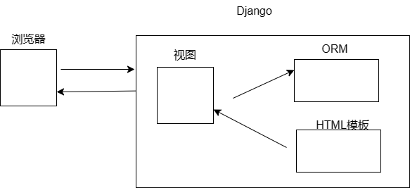
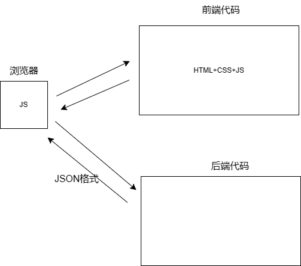
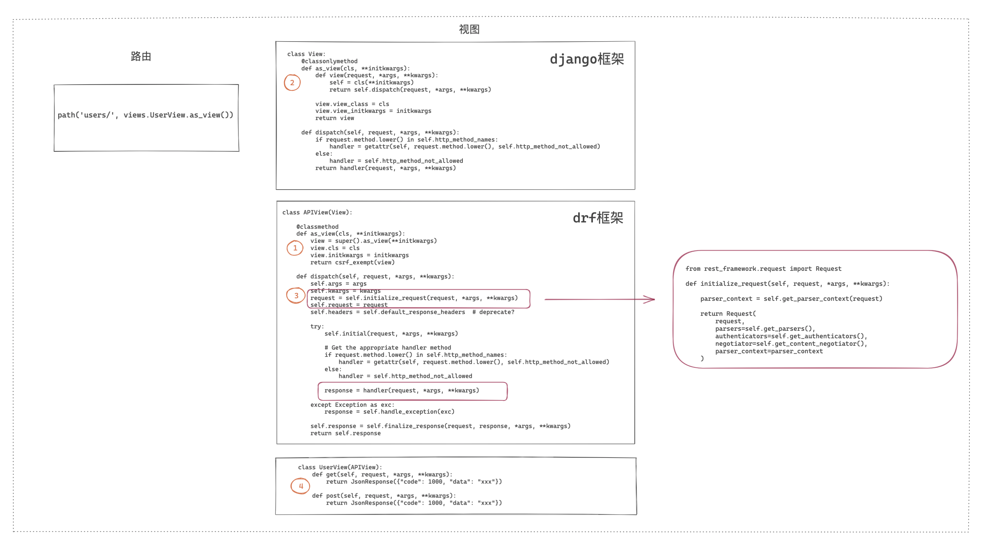
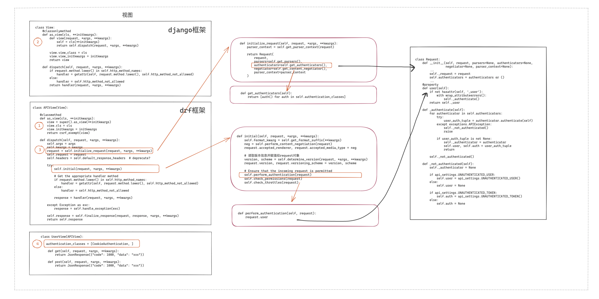
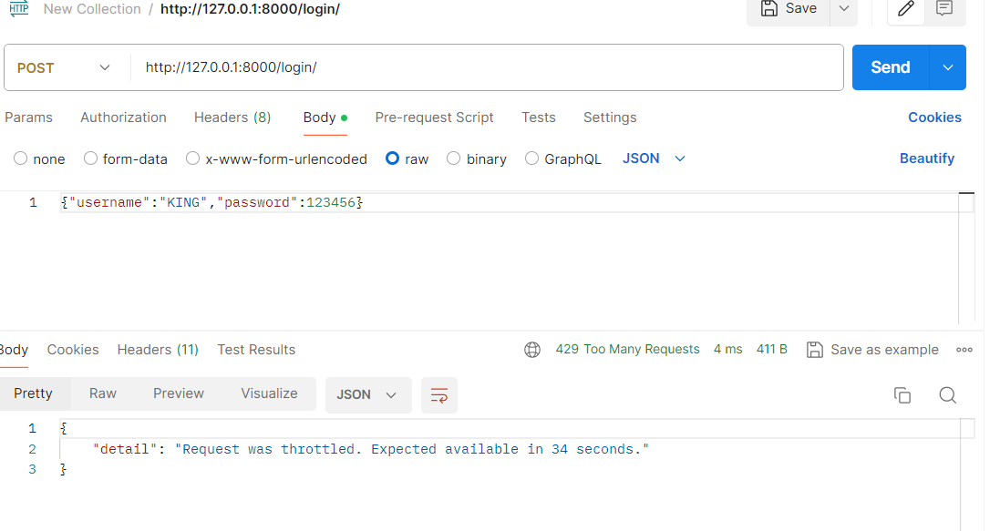
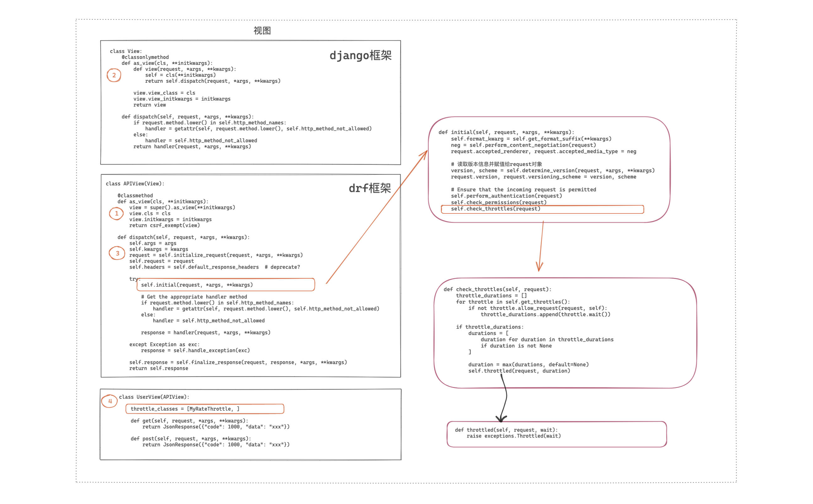

# 0.前置基础

## 0.1 HTTP介绍

<span style="font-size: 24px;">**HTTP相关知识**</span>

> HTTP（HyperText Transfer Protocol）是用于从Web服务器传输超文本到本地浏览器的传输协议。它是互联网数据交换的基础，并支持Web的交互式和无缝访问。HTTP协议定义了客户端（用户的浏览器或应用）如何与服务器进行通信的规则。
>
> **HTTP的工作方式**
>
> HTTP是一个无状态协议，意味着服务器不会保留任何数据（状态）关于客户端请求过的用户。每次请求之间都是独立的，这使得协议更简单和快速。不过，为了克服这一限制，Web应用通常使用如cookie之类的机制来维护用户状态。
>
> **HTTP请求的格式**
>
> 一个HTTP请求由以下几个部分组成：
>
> 1. **请求行**：包括方法（如GET、POST等）、请求的URL、以及HTTP版本。例如: `GET /index.html HTTP/1.1`。
>
> 2. 请求头
>
>    ：包括客户端环境信息、请求主体的格式等关键信息。请求头由关键字/值对组成，每对之间用冒号分隔。例如:
>
>    ```
>    makefileCopy codeAccept: text/html
>    User-Agent: Mozilla/5.0
>    Host: www.example.com
>    ```
>
> 3. **空行**：请求头和请求体之间的空行。
>
> 4. **请求体**（可选）：数据部分，仅在POST和PUT请求中使用，用于提交表单数据或上传文件。
>
> **HTTP响应的格式**
>
> HTTP服务器响应的格式与请求类似，包括：
>
> 1. **状态行**：包括HTTP版本、状态码（如200、404）、以及状态消息（如OK、Not Found）。例如: `HTTP/1.1 200 OK`。
>
> 2. 响应头
>
>    ：类似请求头，包含有关服务器信息、响应体格式等。例如:
>
>    ```
>    lessCopy codeContent-Type: text/html
>    Content-Length: 345
>    ```
>
> 3. **空行**：分隔响应头和响应体。
>
> 4. **响应体**：服务器返回的实际数据。
>
> **常见的HTTP请求头**
>
> 以下是一些常见的HTTP请求头：
>
> - **Accept**：指定客户端能接收的内容类型（如`text/html`）。
> - **Content-Type**：发送数据到服务器时，体的内容类型（如`application/json`）。
> - **User-Agent**：标识请求发送者的浏览器类型。
> - **Authorization**：认证信息，通常用于验证HTTP请求的访问权限。
> - **Cookie**：服务器发送到用户浏览器并保存的小数据片段，随后由浏览器在每次请求时返回给服务器。
> - **Host**：指定请求的服务器的域名。
> - **Referer**：指出请求来源的页面地址。
>
> HTTP协议简单而强大，是现代网络通信的基石之一。它支持多种类型的数据交互，并能够通过各种扩展和安全措施适应广泛的网络需求。

<br>

<span style="font-size: 24px;">**HTTP请求例子**</span>

> 假设你想从一个网站获取某个网页的内容，比如请求 `http://www.example.com/index.html` 页面。下面是这个HTTP GET请求的典型格式：
>
> **HTTP请求示例**
>
> ```
> vbnetCopy codeGET /index.html HTTP/1.1
> Host: www.example.com
> User-Agent: Mozilla/5.0 (Windows NT 10.0; Win64; x64) AppleWebKit/537.36 (KHTML, like Gecko) Chrome/58.0.3029.110 Safari/537.36
> Accept: text/html,application/xhtml+xml,application/xml;q=0.9,image/webp,*/*;q=0.8
> Accept-Language: en-US,en;q=0.5
> Connection: keep-alive
> Cookie: userID=12345; sessionToken=abcde
> ```
>
> 这里是该HTTP请求的各部分解释：
>
> 1. **请求行**：
>    - **GET** - HTTP方法/动词，表示获取资源。
>    - **/index.html** - 请求的资源路径。
>    - **HTTP/1.1** - 使用的HTTP协议版本。
> 2. **请求头**：
>    - **Host**: 指明服务器的域名（必需头，在HTTP/1.1中）。
>    - **User-Agent**: 标识发出请求的浏览器和操作系统信息。
>    - **Accept**: 告诉服务器客户端能接受哪些媒体类型，按优先级排序。
>    - **Accept-Language**: 表明客户端偏好的语言。
>    - **Connection**: 控制不再需要请求或响应后是否关闭网络连接。
>    - **Cookie**: 包含此网站设置的任何cookie。
>
> **请求无体的原因**
>
> 这个示例中的GET请求没有包含请求体，因为GET方法一般用于请求数据，而不是提交数据。请求体通常包含在如POST或PUT方法的请求中，这些方法常用于提交表单数据或上传文件。
>
> **响应示例**
>
> 服务器响应可能看起来像这样：
>
> ```
> phpCopy codeHTTP/1.1 200 OK
> Date: Tue, 18 Apr 2024 12:00:00 GMT
> Server: Apache/2.4.18 (Ubuntu)
> Content-Type: text/html; charset=UTF-8
> Content-Length: 6789
> Connection: close
> 
> <html>
> <head>
> <title>An Example Page</title>
> </head>
> <body>
> Hello, this is a sample HTML response.
> </body>
> </html>
> ```
>
> 响应的每个部分包括：
>
> 1. **状态行**：
>    - **HTTP/1.1** - 响应使用的HTTP版本。
>    - **200 OK** - 状态码及其描述，表示请求成功。
> 2. **响应头**：
>    - **Date**: 生成和发送响应的日期和时间。
>    - **Server**: 生成响应的服务器软件和版本。
>    - **Content-Type**: 响应体的媒体类型。
>    - **Content-Length**: 响应体的长度，以字节为单位。
>    - **Connection**: 表示服务器完成响应后将关闭连接。
> 3. **响应体**：
>    - 包含实际返回给客户端的HTML内容。
>
> 这个例子展示了一个完整的HTTP请求和响应的过程，希望这有助于你更好地理解HTTP通信的基本结构和工作方式。

<br>

## 0.2 django缓存

> django的缓存系统是什么？
>
> 为什么需要缓存系统？
>
> 通常怎么实现？
>
> 缓存里面存储什么？
>
> redis有什么关系？

> ​	1**.缓存系统的基本概念**
>
> 缓存（Cache）是一个临时存储区，用来存放经常访问的数据或文件。在 web 开发中，缓存的主要目的是加快数据的访问速度，并减轻主数据库的负载。例如，当用户请求一个网页时，如果这个网页的内容已经缓存在内存中，服务器就可以直接从内存中读取这个网页，而不是每次都从数据库中查询和重新生成，这大大提高了响应速度。
>
> 2. 为什么需要缓存系统
>
> - **提高响应速度**：从内存中读取数据远比从硬盘或远程数据库读取要快。
> - **减少数据库的压力**：对于热门数据（如常被访问的页面或常见查询结果），使用缓存可以减少对数据库的直接访问，从而减少数据库操作的压力。
> - **提高可扩展性**：缓存使得应用能够处理更多的用户请求，这对于用户基数大或访问量高的应用尤为重要。
>
> 3. Django 中的缓存实现
>
> 在 Django 中，缓存可以通过多种方式实现，具体取决于选择的缓存后端。Django 支持以下几种缓存方式：
>
> - **内存缓存**：数据存储在 Django 服务器的内存中。
> - **文件缓存**：数据存储在文件系统中。
> - **数据库缓存**：数据存储在数据库表中。
> - **使用 Memcached 或 Redis**：这是使用外部缓存服务器来存储数据，适用于大型网站或需要共享缓存的场景。
>
> **设置缓存**
>
> 在 `settings.py` 文件中配置缓存。例如，配置 Redis 作为缓存后端的步骤如下：
>
> ```
> CACHES = {
>     'default': {
>         'BACKEND': 'django_redis.cache.RedisCache',
>         'LOCATION': 'redis://127.0.0.1:6379/1',  # Redis服务器的地址和数据库索引
>         'OPTIONS': {
>             'CLIENT_CLASS': 'django_redis.client.DefaultClient',
>             'PASSWORD': 'your_password',  # 如果设置了Redis密码
>         }
>     }
> }
> ```
>
> 这段配置定义了默认的缓存系统，使用了 Redis 作为后端存储。
>
> 使用缓存
>
> 在 Django 应用中使用缓存通常涉及以下步骤：
>
> - 存储数据到缓存
>
>   ：
>
>   ```
>   pythonCopy codefrom django.core.cache import cache
>   cache.set('my_key', 'my_value', timeout=1000)  # 存储键值对到缓存，超时时间1000秒
>   ```
>
> - 从缓存获取数据
>
>   ：
>
>   ```
>   python
>   Copy code
>   value = cache.get('my_key')  # 从缓存获取键对应的值
>   ```
>
> - 删除缓存中的数据
>
>   ：
>
>   ```
>   python
>   Copy code
>   cache.delete('my_key')  # 删除缓存中的指定键
>   ```
>
> 4. **Redis 和 Django 缓存**
>
> Redis 是一个开源的键值数据库，它支持数据结构如字符串、哈希、列表、集合等。由于其高性能特性（数据存储在内存中），Redis 非常适合作为缓存系统。在 Django 中，Redis 可以用作缓存后端来提高数据处理速度和应用性能。
>
> **总结**
>
> 理解和实现缓存是提升 Web 应用性能的关键步骤之一。在 Django 中，通过配置缓存系统，你可以显著提高应用的响应速度和效率。选择合适的缓存后端（如 Redis）并合理地使用缓存，可以帮助你的应用更好地扩展并处理更多的用户请求。这不仅改善了用户体验，还有助于降低基础设施成本。

<br><br>


本笔记是基于b站视频所作

前置问题

1. 什么是前后端分离？

   > 程序角度：
   >
   > - 一个django程序：接受请求+处理+HTML模板+用户
   > - 两个程序
   >   - 前端：vue.js/reactjs/angular.js
   >   - 后端：django + django restframework（drf）
   >
   > 专业度角度
   >
   > - 前端，专门写前端代码+部署+版本管理+ajax请求获取
   > - 后端，API
   >
   > APP或微信小程序：
   >
   > - 前端：APP或微信小程序
   > - 后端：API

   

   

   前后端不分离

   

   

   

   前后端分离

   

   

   

   

2. 什么是drf？作用是什么？

​	drf，让我们以后写侯丹API接口时更方便

​	`  pip install django`

​	` pip install djangorestframework`


3. 必备工具：postman

​	这个工具时帮助伪造，帮助测试api的使用可以不编写前端


<br><br>

# 1.drf初步了解

## 1.1 drf初步使用


- 基于django实现
- 基于drf实现
  - 安装 pip install djangorestframework
  - 注册 rest_framework
  - 返回数据+嵌套好看的页面

```python
from rest_framework.response import Response
from rest_framework.decorators import api_view


#函数实现
@api_view(["GET"])
def login(request):
    return Response({'status': True, "message": "success"})

#类实现
class InfoView(APIView):
    def get(self,request):
        return Response({'status': True, "message": "success"})
    
    
    
 url路由
    path('login/', views.login),
    path('info/', views.InfoView.as_view()),
```


<br>

<br>

## 1.2 FBV和CBV

FBV和CBV本身django就支持，同时drf也有，但是有所区别

> FBV（Function-Based Views）和 CBV（Class-Based Views）是 Django 中用于处理 HTTP 请求的两种不同的视图方式。
>
> 1. **Function-Based Views (FBV)**:
>
>    - FBV 是使用普通的 Python 函数来定义视图的方式。
>
>    - 在 FBV 中，每个视图都是一个函数，该函数接收一个 HTTP 请求对象作为参数，并返回一个 HTTP 响应对象。
>
>    - 视图函数通常具有以下形式：
>
>      ```
>      pythonCopy codefrom django.http import HttpRequest, HttpResponse
>      
>      def my_view(request: HttpRequest) -> HttpResponse:
>          # 处理请求的逻辑
>          return HttpResponse("Hello, world!")
>      ```
>
>    - FBV 是 Django 最早的视图模式，在简单的情况下使用起来非常直观和简单。
>
> 2. **Class-Based Views (CBV)**:
>
>    - CBV 是使用基于类的视图来定义视图的方式。
>
>    - 在 CBV 中，每个视图是一个类，该类继承自 Django 提供的一些基础视图类，例如 `View`、`TemplateView`、`ListView` 等。
>
>    - 视图类通常具有以下形式：
>
>      ```
>      pythonCopy codefrom django.views import View
>      from django.http import HttpRequest, HttpResponse
>      
>      class MyView(View):
>          def get(self, request: HttpRequest) -> HttpResponse:
>              # 处理 GET 请求的逻辑
>              return HttpResponse("Hello, world!")
>      ```
>
>    - CBV 提供了一种更加结构化和面向对象的方式来组织和重用视图逻辑。
>
>    - CBV 具有很多内置的类视图，可以简化常见的任务，同时也支持更复杂的场景和自定义逻辑。

<br>

### 1.2.1django的FBV和CBV

>
> 常见的 HTTP 请求方法包括 GET、POST、PUT、DELETE、PATCH、HEAD、OPTIONS 等，其中 GET 和 POST 是最常见的两种请求方法。
>
> 1. **GET 请求**：
>    - GET 请求用于向服务器请求获取某个资源。
>    - 它通常用于从服务器获取数据，而不会对服务器状态产生任何影响。
>    - GET 请求的参数通常包含在 URL 中，可以通过查询字符串的形式传递给服务器。
>    - GET 请求是幂等的，即多次重复的 GET 请求不会对服务器产生影响。
> 2. **POST 请求**：
>    - POST 请求用于向服务器提交数据，通常用于创建新的资源或者修改服务器上的数据。
>    - POST 请求的参数通常包含在请求体中，而不是 URL 中。
>    - POST 请求对服务器状态产生影响，因此不是幂等的，即多次重复的 POST 请求可能会产生不同的结果。
>
> 除了 GET 和 POST 请求外，还有其他几种常见的 HTTP 请求方法：
>
> - **PUT 请求**：用于向服务器提交数据，通常用于更新已存在的资源。PUT 请求的语义是幂等的，即多次重复的 PUT 请求具有相同的效果。
> - **DELETE 请求**：用于请求服务器删除指定的资源。
> - **PATCH 请求**：用于向服务器局部更新资源，通常用于对资源的部分内容进行修改。
> - **HEAD 请求**：类似于 GET 请求，但服务器只返回请求头部信息而不返回实体内容。常用于检查资源是否存在、获取资源的元数据等。
> - **OPTIONS 请求**：用于获取目标资源支持的请求方法、请求头部信息等，通常用于跨域请求时进行预检查。


django的这两种方式展示表象如下：

FBV

```python
+urls.py
path('auth/', views.auth), 


+views.py
from django.http import JsonResponse
def auth(request):
    return JsonResponse({'status':True,"message":"success"})
```


CBV

```python
+urls.py
 path('user/', views.UserView.as_view())

    
+views.py
from django.http import JsonResponse
from django.views import View
def UserView(View):

    def get(self,request):
        return JsonResponse({'status':True,"message":"get"})

    def post(self,request):
        return JsonResponse({'status':True,"message":"post"})

    def put(self,requst):
        return JsonResponse({'status':True,"message":"put"})

    def delete(self,request):
        return JsonResponse({'status':True,"message":"delete"})

```

对于FBV方式，如果要根据请求的方法进行不同操作就要

`if request.method =="GET":`


无论是FBV还是CBV逻辑都是一致的(本质是相同的)

- FBV：请求函数（）
- CBV：as_views()->dispatch->请求同名函数()


<br>

### 1.2.2drf的FBV和CBV

​		drf和django的FBV、CBV的使用过程是相同的。但是drf的CBV的APIView是在继承View的基础上的类，固有区别如下

- django的是视图类，继承View
- drf的视图类，继承APIView，而APIView继承了django的View

​		具体的区别是，drf继承的APIView类中的as_view函数返回的是django的as_view函数加上csrf_exempt(view)处理

> csrf_exempt()，这个是用来免除csrf_token校验（相当于装饰器@csrf_exempt。	去除这种校验是由于前后端分离的项目要去决定的。

​		而对于dispatch函数操作，APIView有自己定义的方法，主体逻辑与View中的相同。


总结上述，APIView功能的添加体现如下：

- def as_view(...)  -> 免除了csrf认证
- def dispatch()      -> 视图执行钱、反射执行视图、视图后处理

<br>

### 1.2.3CBV的URL参数和request对象分析

```python
path('user/<int:pk>/',views.UserView.as_view()), #django
path('user/<str:dt>/',views.InfoView.as_view()), #drf
```


首先开始分析django的URL传递过程

> 1.首先访问地址/user/123 => pk = 123
>
> 2.访问视图类的as_view(通常继承View类)
>
> 3.as_view函数内部的view函数
>
> 4.在view函数内部又传递给dispatch函数
>
> 5.在dispatch函数内部，通过getattr方法反射得到了要调用的方法（get、post等）
>
> 6.传递给请求方法参数并返回


其次是drf的URL传递过程

> 1.首先访问地址/user/xxx => dt = xxx
>
> 2.访问视图类的as_view(通常继承APIView类)
>
> 3.APIView内部访问as_view函数
>
> 4.as_view函数包含了对于父类view的as_view方法调用
>
> 5.在父类as_view中的view函数内部又传递给dispatch函数（这里是APIView的dispatch）
>
> 6.在dispatch函数内部，通过getattr方法反射得到了要调用的方法（get、post等），并进行了其他相关处理
>
> 7.传递给请求方法参数并返回


再来对比django和drf的request

- django：requst是请求相关的所有数据
- drf： request是需要经过一层处理，即接受到的request不一样

> 请求相关的所有数据 - --->经过initialize_request处理
>
> 再传入到相关的方法（get、post）

具体的区别在于：

| django的request                | drf的request                                                 |
| ------------------------------ | ------------------------------------------------------------ |
| 包含requst.GET、request.POST等 | 其中request._request = django的request。此外还封装了其他内容 |

<br>

### 1.2.4 纯净项目

app要适当进行删除内容

```python
INSTALLED_APPS = [
    # 'django.contrib.admin',
    # 'django.contrib.auth',
    # 'django.contrib.contenttypes',
    # 'django.contrib.sessions',
    # 'django.contrib.messages',
    'django.contrib.staticfiles',
    'rest_framework',               #template/static
]

MIDDLEWARE = [
    'django.middleware.security.SecurityMiddleware',
    # 'django.contrib.sessions.middleware.SessionMiddleware',
    'django.middleware.common.CommonMiddleware',
    'django.middleware.csrf.CsrfViewMiddleware',
    # 'django.contrib.auth.middleware.AuthenticationMiddleware',
    # 'django.contrib.messages.middleware.MessageMiddleware',
    'django.middleware.clickjacking.XFrameOptionsMiddleware',
]

ROOT_URLCONF = 'day2.urls'

TEMPLATES = [
    {
        'BACKEND': 'django.template.backends.django.DjangoTemplates',
        'DIRS': [],
        'APP_DIRS': True,
        'OPTIONS': {
            'context_processors': [
                'django.template.context_processors.debug',
                'django.template.context_processors.request',
                # 'django.contrib.auth.context_processors.auth',
                # 'django.contrib.messages.context_processors.messages',
            ],
        },
    },
]
```

再进行setting的drf配置

```python
#drf配置
REST_FRAMEWORK = {
    "UNAUTHENTICATED_USER":lambda:"xxx"
}
```

<br>

<br>

## 1.3 drf的request对象

> 在 Django 和 Django REST Framework (DRF) 中，请求（request）对象是核心组件之一，它封装了客户端发送到服务器的所有HTTP请求信息。这些对象在处理Web请求时起到至关重要的作用，它们帮助开发者访问请求数据、方法、用户信息等，以实现丰富的应用逻辑。
>
> **Django 的 Request 对象**
>
> **什么是 Django 的 Request 对象？**
>
> Django 的 Request 对象是一个 Python 类的实例，它封装了HTTP请求的所有细节。这个对象由 Django 在每个请求的处理过程中自动创建，并作为第一个参数传递给视图函数或方法。
>
> **为什么会有这个？**
>
> Django 的 Request 对象的存在是为了提供一个简单的接口，通过这个接口，开发者可以访问关于请求的所有信息，如请求方法（GET、POST等）、上传的文件、已解析的数据、HTTP头部等等。这样的设计可以使得开发者更加方便地处理请求数据，而不必每次都从底层的环境变量中手动提取和解析这些数据。
>
> **作用**
>
> - **数据访问**：开发者可以通过 `request.GET` 和 `request.POST` 访问 GET 和 POST 参数。
> - **状态维护**：通过 `request.session` 来维护用户会话。
> - **用户信息**：通过 `request.user` 访问当前请求的用户对象。
> - **元数据访问**：如 `request.META` 访问请求的元数据，如HTTP头部信息。
>
> 
>
> **DRF 的 Request 对象**
>
> **什么是 DRF 的 Request 对象？**
>
> DRF 的 Request 对象继承自 Django 的 HttpRequest，然后加上了一些额外的功能，使其更适合用于构建API。DRF的 Request 对象包装了 Django 的 HttpRequest，并提供了额外的解析和认证功能。
>
> **为什么会有这个？**
>
> 在构建API时，常常需要处理不同格式的数据（如JSON、XML等），而 Django 的 HttpRequest 主要是设计来处理表单数据的。DRF 扩展了这一功能，使其能够更好地处理各种媒体类型的数据，同时也提供了更灵活的认证和权限管理工具。
>
> **作用**
>
> - **数据解析**：DRF 的 Request 对象使用 pluggable parsers 来解析进来的请求数据，支持多种数据格式。
> - **灵活的认证**：支持多种认证方式，如Token认证、OAuth等。
> - **请求数据的不可变性**：标准 Django 的 `request.POST` 和 `request.FILES` 是可变的，而 DRF 的 `request.data` 提供一个不可变的接口来访问解析后的请求数据。
> - **更详细的请求内容**：比如 `request.query_params` 代替了 Django 的 `request.GET`，提供了更清晰的API使用上下文。
>
> 通过提供这些封装和功能，DRF 的 Request 对象使得开发RESTful API更加直接和便捷，同时也保持了与 Django 本身的良好兼容性。


drf的request是在django上的基础上进一层进行包裹的request


本内容以两个方面进行讲解

- oop知识
- drf请求流程

<br>

### 1.3.1 oop

1. 类中的getattr方法如何触发？

```
obj = Foo("king",19)
获取成员的两种方式
obj.name

v1 = getattr(obj,"name")
```

除了上述内容之外，还可以在类中定义__ getattr __ 方法（不会影响上述两个方法使用）

```
class Foo(object):
    def __init__(self,age,name):
        self.age = age
        self.name = name

    def show(self):
        return 123

    def __getattr__(self, item):
        print("this is {}".format(item))
        return 999

obj = Foo("波冈",1)
print(obj.xxx)


输出内容
this is xxx
999
```

由上述内容可以知道，__ getattr __ 触发是在访问类**不存在的成员**时触发


2. 在面向对象中的getattribute方法，什么情况执行？

```python
def __getattribute__(self, item):
    print("this is {}".format(item))
    return 996
    
print(obj.name)
print(obj.age)

输出
this is name
996
this is age
996
```

即无论类中是否有调用的成员函数，都有去使用getattribute方法，并在这个方法下进行执行。

object有自身的getattribute方法，可以自行分情况执行，逻辑如下：

- 对象中有这个成员，直接返回值
- 对象中没有这个成员，直接报错


3. 类分析

```python
class HttpRequest(object):
    def __int__(self):
        pass

    def v1(selfs):
        print("v1")

    def v2(selfs):
        print("v2")


class Request(object):
    def __init__(self,req,xx):
        self._request = req
        self.xx = xx

    #对象中自己有的成员不会触发，没有的成员会触发
    def __getattr__(self, item):
        #item就是传入的调用成员名
        try:
            return getattr(self._request,item)          #相当于执行self._request.yyy
        except AttributeError:
            return self.__getattribute__(item)


req = HttpRequest()
req.v1()
req.v2()

request = Request(req,111)
request.xx
request._request


request.v1()
request.yyy


# request._request.v1()
# request._request.v2()
```

drf的request封装django的request对象逻辑如上述所示

```
request = HttpRequest()				#django
req = DrfRequest(request,123)		#drf

req
req._request
#不通过getattribute方法
req._request.method()
req._request.paht_into()
#通过getattribute方法
req.method()
req.paht_into()
```


<br>

### 1.3.2 request源码和参数

```python
def initialize_request(self, request, *args, **kwargs):
    """
    Returns the initial request object.
    """
    parser_context = self.get_parser_context(request)

    return Request(
        request,
        parsers=self.get_parsers(),
        authenticators=self.get_authenticators(),
        negotiator=self.get_content_negotiator(),
        parser_context=parser_context
    )
    
#此处的return就是drf的request，而参数request就是django的request对象
```

request中的参数**kwargs，其实是url中的< int:v1 >传入的



> 在 Django REST Framework（DRF）中，处理HTTP请求的方式稍有不同于标准的Django处理方式，主要是因为它使用了一个定制的`Request`对象来提供一些额外功能，特别是针对API开发的需求。以下是DRF中`Request`对象的调用和初始化过程：
>
> 1. **请求进入**
>
> 当一个HTTP请求到达Django服务器时，首先由Django的中间件和URL路由系统处理。如果请求被指派给一个使用了DRF的视图，处理流程则开始转入DRF特定的逻辑。
>
> 2. **封装为DRF `Request`对象**
>
> 在视图层之前，DRF将标准的Django `HttpRequest`对象封装到DRF的`Request`对象中。这个封装过程是由DRF的视图或视图集（例如`APIView`或`ViewSet`类）的初始处理阶段触发的，具体如下：
>
> - 当请求到达DRF视图时，`APIView`的`as_view()`方法会首先被调用。
> - 随后调用的`dispatch`方法负责实例化DRF的`Request`对象，并将原始的Django `HttpRequest`对象作为参数传递给它。
> - DRF的`Request`对象在初始化时接受这个Django的`HttpRequest`对象，并在内部保存为`_request`属性。同时，它会添加一些特定于API的功能，比如更复杂的解析器逻辑和内容协商。
>
> 3. **认证和权限检查**
>
> 在请求被完全处理之前，`APIView`的`initial`方法会被调用：
>
> - 认证：通过调用`perform_authentication`方法，该方法进一步调用`Request`对象的`.user`访问器，它会触发所有配置的认证类，试图认证当前请求。
> - 权限和节流：在认证后，DRF会检查配置的权限和节流器（throttles）是否允许这个请求继续进行。
>
> 4. **请求处理**
>
> 一旦请求通过了认证和权限检查，控制权就交给了视图函数。此时，开发者可以通过DRF的`Request`对象访问请求数据：
>
> - 使用`request.data`来访问解析后的请求体，这对于处理JSON或其他非表单格式的数据特别有用。
> - 使用`request.query_params`来访问查询参数。
> - 使用`request.files`来访问上传的文件等等。
>
> 5. **响应返回**
>
> 视图处理完请求后，通常会返回一个`Response`对象。DRF接管这个响应，并使用合适的渲染器将数据转换为客户端请求的格式（如JSON、XML等），最后将其发送回客户端。
>
> 这个过程展示了DRF如何提供一个强大且灵活的机制来处理API请求，通过封装和扩展Django的`HttpRequest`对象，增加了许多对API开发非常有用的功能。


<br><br>

## 1.4 drf认证


### 1.4.1 认证使用

用户授权

实现

- 编写类（一个类就是一个认证组件
- 应用组件

```python
from rest_framework.authentication import BaseAuthentication

class MyAuthentication(BaseAuthentication):
    def authenticate(self, request):
        # 去做获取或用认证：
        # 1.读取请求传递的token
        # 2.校验合法性
        # 3.返回值有三种
        # 	3.1 返回元组		认证成功 	request.user request.auth
        #	3.2 抛出异常		认证失败	返回错误信息
        #	3.3	返回None		 多个认证类   [类1,类2,...]   - > 匿名用户
        pass
```


示例1

```python
class MyAuthentication(BaseAuthentication):
    def authenticate(self, request):
        # 去做获取或用认证：
        # 1.读取请求传递的token
        # 2.校验合法性
        # 3.返回值有三种
        #  3.1 返回元组      认证成功   request.user request.auth
        #  3.2 抛出异常      认证失败   返回错误信息
        #  3.3    返回None     多个认证类   [类1,类2,...]   - > 匿名用户
        token = request.query_params.get("token")
        if token:
            return "king",token
        # raise AuthenticationFailed("认证失败")
        raise AuthenticationFailed({"code":2000,'error':"认证失败"})


#不需要登录
class LoginView(APIView):
    authentication_classes = []
    def get(self,request):
        return Response("LoginView")


#需要登录
class UserView(APIView):
    authentication_classes = [MyAuthentication,]
    def get(self,request):
        return Response("UserView")

class OrderView(APIView):
    authentication_classes = [MyAuthentication, ]
    def get(self,request):
        return Response("OrderView")
```


示例2（全局配置视图类）

```python
#drf配置
REST_FRAMEWORK = {
    "UNAUTHENTICATED_USER":lambda:"xxx",
    # "值":["认证组件路径"]
    "DEFAULT_AUTHENTICATION_CLASSES":["api.views.MyAuthentication",]
}


#不需要登录
class LoginView(APIView):
    authentication_classes = []
    def get(self,request):
        return Response("LoginView")


#需要登录（默认带有）
class UserView(APIView):
    def get(self,request):
        return Response("UserView")

class OrderView(APIView):
    def get(self,request):
        return Response("OrderView")
```

优先从全局搜索、再到局部搜索。

ps：认证组件不能写在view视图中。（全局，出现了循环引用）


<br>

### 1.4.2 认证面向对象-继承

```python
class APIView(object):
    authentication_classes = 读取配置文件中的列表
    
    def dispatch(self):
        self.authentication_classes
        
class UserView(APIView):
    authentication_classes = [11,22,33]
    
obj = UserView()
obj.dispatch()
```


<br>

### 1.4.3 认证组件源码



```python
class Request:
    def __init__(self,request,authenticators = None,...):
        self._request = request
        self.suthenticators = authenticators or ()
    
    @property
    def user(self):
        if not hasattr(self, '_user'):
            with wrap_attributeerrors():
                self._authenticate()
        return self._user

    @user.setter
    def user(self, value):
        self._user = value
        self._request.user = value
    
    def _authenticate(self):
        #读取每个认证组件的对象，执行authenticate方法，self为request对象
        for authenticator in self.authenticators:
            try:
                user_auth_tuple = authenticator.authenticate(self)
            except exceptions.APIException:
                self._not_authenticated()
                raise

            if user_auth_tuple is not None:
                self._authenticator = authenticator
                self.user, self.auth = user_auth_tuple
                return
            
    def _not_authenticated(self):
        self._authenticator = None

        if api_settings.UNAUTHENTICATED_USER:
            self.user = api_settings.UNAUTHENTICATED_USER()
        else:
            self.user = None

        if api_settings.UNAUTHENTICATED_TOKEN:
            self.auth = api_settings.UNAUTHENTICATED_TOKEN()
        else:
            self.auth = None       
            
    
class APIView(view):
    authentication_classes = api_settings.DEFAULT_AUTHENTICATION_CLASS
    
    def perform_authentication(self,request):
        request.user
    
    #简化
    def initial(self,request,*args,**kwargs):
        self.perform_authentication(request)
        self.check_premissions(request)
        self.check_throttles(request)
    
    def get_authenticators(self):
        #[认证类的对象,认证类的对象,认证类的对象,...]
        return [auth() for auth in self.authentication_classes]
    
    def initialize_request(self,request,*args,**kwargs):
        parser_context = self.get_parser_context(request)
        
        return Request(
        	request,
        	parsets = self.get_parsers(),
            authenticators = self.get_authenticators(),
            negotiator = self.get_content_negotiator(),
            parser_context = parser_context
        )
    
    #简化
    def dispatch(self,request,*args,**kwargs):
        #第一步 请求的封装（django的request对象+authenticators认证组件） -  > 加载认证组件的过程
        self.args = args
        self.kwargs = kwargs
        request = self.initialize_request(request, *args, **kwargs)
        self.request = request
        self.headers = self.default_response_headers
        
        #第二步:request
        self.initial(request,*args,**kwargs)
        handler = getattr(self,request.method.lower(),self.http_method_not_allowed)
        
        #第三步:执行视图函数
        response = handler(request,*args,**kwargs)
		
        self.response = self.finalize_response(request,response,*args,**kwargs)
        return self.response
    
 

class UserView(APIView):
    authentication_classes =[类1,...]
    def get(self,request):
        return Response("UserView")
```

调用流程

> 以下是 `authenticate` 方法调用的详细流程：
>
> 1. **请求到达**：当一个 HTTP 请求到达 DRF 后，框架首先将请求封装到 `Request` 对象中。
> 2. **中间件处理**：请求经过配置的各种中间件处理，尚未进入到具体的视图（view）层。
> 3. **视图处理前**：在请求达到具体的视图之前，DRF 的调度机制会先进行认证处理。这一步骤是通过视图的 `dispatch` 方法或者通过 DRF 提供的装饰器和权限类实现的。
> 4. **认证方法调用**：
>    - DRF 通过 `APIView` 或者任何继承自 `APIView` 的类的 `initial` 方法调用认证逻辑。
>    - `initial` 方法会依次调用 `perform_authentication`，该方法再调用 `request.user` 访问器。
>    - `request.user` 的获取逻辑中，DRF 会检查是否已经认证过用户。如果没有，它会通过 `request._authenticate` 方法触发具体的 `authenticate` 方法。
> 5. **执行认证类**：
>    - 在 `request._authenticate` 方法中，DRF 会遍历在视图或全局设置中指定的 `authentication_classes`，调用每个认证类的 `authenticate` 方法。
>    - 如果一个认证类返回了一个用户（通常是一个用户对象和认证信息的元组），则认证过程停止，且该用户被视为请求的发起者。
>    - 如果所有认证类都不能认证用户（都返回 `None`），则请求被视为匿名用户的请求。
>    - 如果任何一个认证类抛出了 `AuthenticationFailed` 异常，则该请求将直接返回对应的错误响应（通常是 401 或 403）。
>
> 总结
>
> `authenticate` 方法是在视图层处理之前被调用的，作为请求处理链中的一个重要部分，它决定了用户的认证状态，从而影响到权限控制和后续的请求处理。这个机制确保了在处理业务逻辑之前，用户的身份和权限已经得到了妥当的验证和确认

认证组件源码：

- 加载认证组件，本质就是实例化每个认证类的对象，并封装到request对象

<br>


### 1.4.4 多个认证类

1. 都返回None，都没有认证成功，视图是否会被执行？

   视图函数会执行，只不过self.user 和self.auth为None

   ```python
   class URLAuthentication(BaseAuthentication):
       def authenticate(self, request):
           token = request.query_params.get("token")
           if token:
               return "king",token
           return
   
   #请求头    
   class HeaderAuthentication(BaseAuthentication):
       def authenticate(self, request):
           token = request.meta.get("token")
           if token:
               return "king",token
           return
   
   #请求体     
   class BodyAuthentication(BaseAuthentication):
       def authenticate(self, request):
           token = request.data.get("token")
           if token:
               return "king",token
           return
       
   class NoAuthentication(BaseAuthentication):
       def authenticate(self, request):
           raise AuthenticationFailed("认证失败的具体原因")
       
   class OrderView(APIView):
   	authentication_class= [URLAuthentication,HeaderAuthentication,BodyAuthentication,NoAuthentication]
       def get(self,request):
           return Response("OrderView")
   
   ```

<br>


### 1.4.5 认证-状态码一致问题

```python
class MyAuthentication(BaseAuthentication):
    def authenticate(self, request):
        token = request.query_params.get("token")
        if token:
            return "king",token
        # raise AuthenticationFailed("认证失败")
        raise AuthenticationFailed({"code":2000,'error':"认证失败"})
    
    def authenticate_header(self,request):
        return "token"
```

```python
#APIView中

def handle_exception(self, exc):
    """
    Handle any exception that occurs, by returning an appropriate response,
    or re-raising the error.
    """
    if isinstance(exc, (exceptions.NotAuthenticated,
                        exceptions.AuthenticationFailed)):
        # WWW-Authenticate header for 401 responses, else coerce to 403
        #执行get_authenticate_header方法
        auth_header = self.get_authenticate_header(self.request)

        if auth_header:
            exc.auth_header = auth_header
        else:
            exc.status_code = status.HTTP_403_FORBIDDEN

    exception_handler = self.get_exception_handler()

    context = self.get_exception_handler_context()
    response = exception_handler(exc, context)

    if response is None:
        self.raise_uncaught_exception(exc)

    response.exception = True
    return response


def get_authenticate_header(self, request):
    authenticators = self.get_authenticators()
    if authenticators:
        return authenticators[0].authenticate_header(request)
```

> ### 为什么选择 `authenticators[0]` 的 `authenticate_header`？
>
> 当没有认证成功时（即所有的认证类都未能认证该请求），DRF 需要决定返回什么样的 `WWW-Authenticate` 头部来指示客户端如何进行认证。这个头部在客户端显示的401 Unauthorized响应中是非常重要的，因为它告诉客户端应该如何响应认证失败。
>
> 在DRF的默认实现中，`get_authenticate_header` 方法仅从第一个认证类 (`authenticators[0]`) 获取 `authenticate_header`。这是因为：
>
> 1. **简化和清晰**：假设有多个认证方式，理论上需要发送多个 `WWW-Authenticate` 值。然而，实际上，客户端可能会对多个值感到困惑，不清楚优先采用哪种方式。选择第一个认证类作为主要提示可以简化客户端的处理逻辑。
> 2. **优先顺序**：认证类在 `authentication_classes` 中的顺序代表了它们的优先级。通常，开发者会将最常用或最优先的认证方式放在列表的前面。

<br>


### 1.4.6 认证扩展-子类约束

本节内容与drf无关，是python开发常见内容


```python
class Foo(object):
    def f1(self):
        raise NotImplementedError("...")

class News(Foo):
    def f1(self):
        print("1234")
```

对于写了raise NotImplementedError的方法，继承后**必须重写并实现**

> ### 为什么使用 `NotImplementedError`？
>
> 1. **明确接口要求**：通过在方法中加入 `raise NotImplementedError`，可以清楚地告诉其他开发者这个方法是一个接口，需要在子类中进行具体实现。这样做有助于维护代码的整洁性和一致性。
> 2. **促进良好的设计**：这种模式鼓励使用抽象基类（abstract base class, ABC）来定义类的基本功能和接口。这是软件开发中常用的设计模式，有助于减少代码的重复并提高代码的可维护性。
> 3. **提高代码的安全性**：如果子类没有实现必要的方法而试图使用它，Python 会抛出错误。这有助于在开发过程中早期发现问题，避免在生产环境中因为接口实现不完整而导致的错误。

<br><br>

## 1.5 案例-用户登录和认证

> 在 Django 和 Django REST Framework（DRF）中，处理请求对象的方式有所不同，因为 DRF 在标准的 Django `HttpRequest` 对象之上提供了额外的封装和功能。这使得 DRF 更适用于构建 RESTful APIs。以下是两者获取请求数据的详细方法：
>
> **Django 中获取请求数据**
>
> 在 Django 中，请求数据通过 `HttpRequest` 对象访问，该对象在视图函数或类中作为第一个参数传入。以下是常用方法来获取请求数据：
>
> 1. **GET 数据**：通过 `request.GET` 访问，这是一个类似字典的对象，包含所有的 HTTP GET 参数。通常用于查询字符串参数。
>
>    ```
>    pythonCopy codedef my_view(request):
>        search_query = request.GET.get('search', '')
>        # process search_query
>    ```
>
> 2. **POST 数据**：通过 `request.POST` 访问，这也是一个类似字典的对象，包含所有 HTTP POST 参数。通常用于表单数据。
>
>    ```
>    pythonCopy codedef my_view(request):
>        username = request.POST.get('username', '')
>        password = request.POST.get('password', '')
>        # process form data
>    ```
>
> 3. **请求体（Raw Data）**：通过 `request.body` 访问，这返回请求的原始数据。需要自己解析这些数据（如 JSON）。
>
>    ```
>    pythonCopy codeimport json
>    
>    def my_view(request):
>        data = json.loads(request.body)
>        # use data
>    ```
>
> 4. **文件**：通过 `request.FILES` 访问，这是一个类似字典的对象，包含所有上传的文件。
>
>    ```
>    pythonCopy codedef my_view(request):
>        uploaded_file = request.FILES.get('file')
>        # handle file
>    ```
>
> 5. **其他属性**：如 `request.method` 来检查请求类型（GET, POST, 等等），`request.user` 来获取当前登录的用户。
>
> **Django REST Framework 中获取请求数据**
>
> DRF 使用扩展了的 `Request` 对象，提供了额外的解析功能和对请求数据的灵活处理。以下是在 DRF 中获取请求数据的方法：
>
> 1. **请求数据（Data）**：通过 `request.data` 访问，这适用于访问解析后的请求内容，不论是来自 JSON、XML 还是表单数据。
>
>    ```
>    pythonCopy codefrom rest_framework.decorators import api_view
>    
>    @api_view(['POST'])
>    def my_view(request):
>        username = request.data.get('username', '')
>        # handle data
>    ```
>
> 2. **查询参数（Query Params）**：通过 `request.query_params` 访问，类似于 Django 的 `request.GET`。
>
>    ```
>    pythonCopy code@api_view(['GET'])
>    def my_view(request):
>        search_query = request.query_params.get('search', '')
>        # process query params
>    ```
>
> 3. **文件**：与 Django 相同，通过 `request.FILES` 访问。
>
>    ```
>    pythonCopy code@api_view(['POST'])
>    def my_view(request):
>        uploaded_file = request.FILES.get('file')
>        # handle file
>    ```
>
> 4. **请求方法**：通过 `request.method` 来检查请求的类型。
>
> **总结**
>
> 尽管 Django 和 DRF 都提供了访问 HTTP 请求数据的机制，但 DRF 的 `request` 对象更适合于构建 API，因为它自动处理不同内容类型的数据解析，并提供了更一致的接口来访问这些数据。这使得在构建 API 时，可以更容易地处理来自客户端的各种数据格式。


**1.创建用户表（model.py**

```python
class UserInfo(models.Moel):
    #用户表
    username = models.CharField(verbose_name="用户名",max_length=32)
    password = models.CharField(verbose_name="密码",max_length=64)
    #临时方式，jwt
    token = models.CharField(verbose_name="TOKEN",max_length=64,null=True,blank=True)
```

**2.数据库迁移**

​	` python manage.py makemigrations`

​	`python manage.py migrate`

**3.写url路由和view视图类**

``` python
#不需要登录
class LoginView(APIView):
    authentication_classes = []
    def post(self,request):
        #1.接受用户提交的用户名和密码
        #2.数据库校验是否存在
        return Response("LoginView:post")
```

**4.使用postman进行post请求模拟**

**5.编写视图类的post处理**

```python
# 不需要登录
class LoginView(APIView):
    authentication_classes = []

    def post(self, request):
        # 1.接受用户提交的用户名和密码
        # print(request.query_params) #获取url参数
        user = request.data.get("username")
        pwd = request.data.get("password")

        # 2.数据库校验是否存在
        user_object = models.UserInfo.objects.filter(username=user, password=pwd).first()
        if not user_object:
            return Response({"code": code.ERROR_CODE, "msg": "用户名或密码错误"})

        # 3.正确，生成token
        token = str(uuid.uuid4())
        user_object.token = token
        user_object.save()
        return Response({"status":True,"data": token})
```

**6.其他视图类的认证（配置认证组件，authenticate）**

```python
#URL中
class QueryParamsAuthentication(BaseAuthentication):
    def authenticate(self, request):
        token = request.query_params.get("token")
        user_object = models.UserInfo.objects.filter(token=token).first()
        if user_object:
            return user_object, token #request.user = 用户对象；requst.auth=token
        return

    def authenticate_header(self, request):
        return "API"

#请求头中
class HeaderAuthentication(BaseAuthentication):
    def authenticate(self, request):
        token = request.META.get("HTTP_AUTHORIZATION")
        user_object = models.UserInfo.objects.filter(token=token).first()
        if user_object:
            return user_object, token #request.user = 用户对象；requst.auth=token
        return

    def authenticate_header(self, request):
        return "API"


class NoAuthentication(BaseAuthentication):
    def authenticate(self, request):
        raise AuthenticationFailed({"status":False,"msg":"认证失败"})

    def authenticate_header(self, request):
        return "API"
```

```python
"DEFAULT_AUTHENTICATION_CLASSES":[
    "ext.auth.QueryParamsAuthentication",
    "ext.auth.HeaderAuthentication",
    "ext.auth.NoAuthentication",
]
```


<br><br>


## 1.6 权限

### 1.6.1 权限概述

认证组件 = [认证类，认证类，认证类]			-> 	执行每个认证类中的authenticate方法

- 认证成功或失败，不会在执行后续的认证类
- 返回None，执行后续的认证类


权限组件 = [权限类，权限类，权限类]			-> 	执行每个认证类中的has_permission方法

- 执行所有的权限类，返回True通过，返回False表示不通过

默认情况下，保证所有的权限类中的has_permission方法都返回True(就是且的关系)，

但是也可以手动修改，变成部分或的关系。（学会源码流程，扩展+自定义）


<br>

### 1.6.2 快速使用

**1.编写权限类**

```python
import random

from rest_framework.permissions import BasePermission

class MyPermission(BasePermission):
    def has_permission(self, request, view):
        #获取请求中的数据，然后进行校验...
        v1 = random.randint(1,3)
        if v1 == 2:
            return True
        return False
```


**2.应用权限类**

- 方法一：局部权限类添加permission_classes = [权限类]

- 方法二：全局setting配置DEFAULT_PERMISSION_CLASSES

  ```python
      "DEFAULT_PERMISSION_CLASSES": [
          "ext.per.MyPermission",
      ]
  ```

  <br>


### 1.6.3 权限错误信息和多个权限类

`{"detail": "You do not have permission to perform this action."}`，是默认的错误信息。

本节学习如何自定义权限错误信息。

<br>

在权限类中添加类变量message = {}，即可自定义权限认证的错误信息

`message = {"status":False,"msg":"无权访问"}`

对于多个权限类而言，依次进行权限判断，如果有一个不返回True（默认），则不会执行视图类中的函数（如get函数、post函数）

<br>


### 1.6.4 权限源码流程

> 在 Django REST Framework (DRF) 中，权限系统是通过权限类来实现的，这些类定义了是否允许用户执行特定的操作。这里我将介绍权限检查的执行流程，以及如何通过源代码来理解这一过程。
>
> **权限代码的执行过程**
>
> 1. **请求处理**：
>    - 当一个请求到达 DRF 的视图时，首先通过视图的 `dispatch` 方法进行初步的处理。这是处理任何请求的入口点，无论是 GET、POST 还是其他 HTTP 方法。
> 2. **调用 `.initial()` 方法**：
>    - 在 `dispatch` 方法中，会首先调用 `.initial()` 方法，该方法负责设置一些初始状态并进行初步的安全检查，包括认证和权限检查。
> 3. **执行认证**：
>    - `.initial()` 方法会调用 `.perform_authentication()`，该方法通过认证类（如 TokenAuthentication, SessionAuthentication 等）来确认请求的用户。
> 4. **权限检查**：
>    - 认证完成后，`.initial()` 方法接着调用 `.check_permissions()`。这个方法遍历视图设置的所有权限类实例（如 IsAuthenticated, IsAdminUser 等），调用它们的 `.has_permission()` 方法。
> 5. **详细的权限方法**：
>    - `.has_permission()` 方法通常需要两个参数：请求 (`request`) 和视图 (`view`)。每个权限类根据这些信息判断是否允许请求继续执行。
> 6. **决定响应**：
>    - 如果任何一个 `.has_permission()` 方法返回 `False`，DRF 会抛出一个 `PermissionDenied` 异常，该请求会被终止，并返回适当的 HTTP 状态码（通常是 403 Forbidden）。
>    - 如果所有的权限检查都通过，则请求会继续执行相应的视图方法（如 `get()`, `post()` 等）。
>
> **源码分析**
>
> 以下是 DRF 源码中相关部分的一个简化版本，帮助理解权限检查是如何实现的：
>
> ```
> pythonCopy code# 在 views.py 中
> class APIView:
>     def dispatch(self, request, *args, **kwargs):
>         # 初始化，包括认证和权限检查
>         self.initial(request, *args, **kwargs)
>         # 根据 HTTP 方法调用相应的处理函数
>         handler = getattr(self, request.method.lower(), self.http_method_not_allowed)
>         response = handler(request, *args, **kwargs)
>         return self.finalize_response(request, response, *args, **kwargs)
> 
>     def initial(self, request, *args, **kwargs):
>         # 执行认证
>         self.perform_authentication(request)
>         # 检查权限
>         self.check_permissions(request)
> 
>     def check_permissions(self, request):
>         for permission in self.get_permissions():
>             if not permission.has_permission(request, self):
>                 self.permission_denied(request)
> 
> # 在 permissions.py 中
> class IsAuthenticated(BasePermission):
>     def has_permission(self, request, view):
>         return request.user and request.user.is_authenticated
> ```
>
> **总结**
>
> DRF 的权限系统设计得非常模块化，允许你轻松地添加或修改权限逻辑。权限类通过 `.has_permission()` 方法独立决定是否接受或拒绝请求，这提供了很大的灵活性来定义复杂的访问控制逻辑。理解这些内部工作原理有助于开发者更好地利用 DRF 构建安全且强大的 API。

<br>

权限执行过程涉及函数

```python
class APIView(View):
    permission_classes=全局配置
    def dispatch(self, request, *args, **kwargs):
        self.args = args
        self.kwargs = kwargs
        request = self.initialize_request(request, *args, **kwargs)
        self.request = request
        self.headers = self.default_response_headers  # deprecate?

        try:
            self.initial(request, *args, **kwargs)
            # Get the appropriate handler method
            if request.method.lower() in self.http_method_names:
                handler = getattr(self, request.method.lower(),
                                  self.http_method_not_allowed)
            else:
                handler = self.http_method_not_allowed

            response = handler(request, *args, **kwargs)

        except Exception as exc:
            response = self.handle_exception(exc)

        self.response = self.finalize_response(request, response, *args, **kwargs)
        return self.response
    
    
    def initial(self, request, *args, **kwargs):
        # 执行认证，循环执行每个authticate方法，失败抛出异常；成功给request.user/auth赋值
        self.perform_authentication(request)
        # 检查权限，
        self.check_permissions(request) 
		self.check_throttles(request)
        
    def check_permissions(self, request):
        for permission in self.get_permissions():
            if not permission.has_permission(request, self):
                self.permission_denied(
                    request,
                    message=getattr(permission, 'message', None),
                    code=getattr(permission, 'code', None)
                )

    def get_permissions(self):
        return [permission() for permission in self.permission_classes] 
   
	#抛出的异常被dispatch的try捕获
    def permission_denied(self, request, message=None, code=None):
        if request.authenticators and not request.successful_authenticator:
            raise exceptions.NotAuthenticated()
        raise exceptions.PermissionDenied(detail=message, code=code)
                
        

class OrderView(APIView):
    permission_classes = [per.MyPermission]
    def get(self, request):
        return Response({"status":True,"data":[11,22,33,44]})
```


应用场景：经理角色、当前订单时他手下创建

默认权限组件：必须满足所有条件


<br>

### 1.6.5 权限组件的扩展

功能整改：满足任意条件（就是改且变成或 A || B ||  C）

修改代码：check_permission (默认是循环所有权限组件)

```python
def check_permissions(self, request):
    no_permission_objects = []
    for permission in self.get_permissions():
        # 如果存在任意：权限满足条件，则直接return
        if permission.has_permission(request, self):
           return
    	else:
            no_permission_objects.append(permission)
   	self.permission_denied(
                    request,
                    message=getattr(no_permission_objects[0], 'message', None),
                    code=getattr(permission, 'code', None)
                )

```

推荐将其写到自己的视图类中，因为视图类继承了APIView，重写check_permissions方法，可以针对不同的视图类进行权限校验逻辑。

如果想在多个视图类中批量使用这种权限校验逻辑，可以仿写类似bootstrap的方式，在一个新py文件中写一个继承APIView的工具类，而在想要使用这种逻辑的视图类，直接继承这个工具类，而不继承APIView

```python
from rest_framework.views import APIView


class NbApiView(APIView):
    def check_permissions(self, request):
        no_permission_objects = []
        for permission in self.get_permissions():
            # 如果存在任意：权限满足条件，则直接return
            if permission.has_permission(request, self):
                return
            else:
                no_permission_objects.append(permission)

        self.permission_denied(
            request,
            message=getattr(no_permission_objects[0], 'message', None),
            code=getattr(permission, 'code', None)
        )
        
        
 from ext.view import NbApiView

class OrderView(NbApiView):
    permission_classes = [MyPermission1,MyPermission2,MyPermission3]
    def get(self, request):
        return Response({"status":True,"data":[11,22,33,44]})       
```


<br>


### 1.6.6 案例：权限处理

1.定义模型类

```python
class UserInfo(models.Model):
    #用户表
    role     = models.IntegerField(verbose_name="角色",choices=((1,"总监"),(1,"经理"),(3,"员工")),default=3)
    username = models.CharField(verbose_name="用户名",max_length=32)
    password = models.CharField(verbose_name="密码",max_length=64)
    #临时方式，jwt
    token = models.CharField(verbose_name="TOKEN",max_length=64,null=True,blank=True)
```

2.设置权限组件

```python
from rest_framework.permissions import BasePermission

class UserPermission(BasePermission):
    message = {"status":False,"msg":"无权访问1"}
    def has_permission(self, request, view):
        print(request.user)
        if request.user.role == 3:
            return True
        return False

class ManagerPermission(BasePermission):
    message = {"status":False,"msg":"无权访问2"}
    def has_permission(self, request, view):
        if request.user.role == 2:
            return True
        return False


class BossPermission(BasePermission):
    message = {"status":False,"msg":"无权访问3"}
    def has_permission(self, request, view):
        if request.user.role == 1:
            return True
        return False
```

3.重写check_permission方法

```python
from rest_framework.views import APIView


class NbApiView(APIView):
    def check_permissions(self, request):
        no_permission_objects = []
        for permission in self.get_permissions():
            # 如果存在任意：权限满足条件，则直接return
            if permission.has_permission(request, self):
                return
            else:
                no_permission_objects.append(permission)

        self.permission_denied(
            request,
            message=getattr(no_permission_objects[0], 'message', None),
            code=getattr(permission, 'code', None)
        )
```

4.视图函数编写

```python
class UserView(NbApiView):
    #员工、经理、总监
    permission_classes = [per.UserPermission,per.ManagerPermission,per.BossPermission]
    def get(self, request):
        return Response("UserView")


class OrderView(NbApiView):
    #总监、经理
    permission_classes = [per.ManagerPermission,per.BossPermission]
    def get(self, request):
        return Response({"status":True,"data":[11,22,33,44]})

class AvaterView(NbApiView):
    #总监、员工
    permission_classes = [per.BossPermission,per.UserPermission]
```

5.url路由编写

```python
path('order/',views.OrderView.as_view()),
path('user/', views.UserView.as_view()),
path('avater/', views.AvaterView.as_view()),
```

经过上述五步处理，可以划分不同用户访问不同页面的不同权限。

<br>
<br>

问题1：如果开发过程中发现drf的request对象不好用，换成另外一个request对象要如何处理？

回答1：可以自定义dispatch中的initialize_request方法，具体操作是在自己视图类中重写该方法

<br>

问题2：drf的认证、权限组件与django的中间件有什么关系？

回答2：drf的认证、权限组件的执行时间后于中间件处理，前者的执行在中间件process_view执行之后

> 在 Django REST Framework (DRF) 中，认证和权限组件与 Django 的中间件系统虽然都是处理请求的关键部分，但它们在架构和执行流程中的角色和作用不同。了解它们之间的差异有助于更好地设计和理解 Web 应用的安全和访问控制机制。
>
> 认证和权限组件
>
> **认证** 和 **权限** 组件在 DRF 中是专门用于处理 API 请求安全性的。它们分别负责确认请求者的身份（认证）和确定请求者是否有权执行特定操作或访问特定资源（权限）。
>
> 1. **认证组件**：在 DRF 中，认证组件主要通过在视图或视图集中设置 `authentication_classes` 来定义。这些认证类负责解析请求中的信息（如令牌、cookies、HTTP头等）以确定请求者的身份。认证过程通常在视图的初始处理阶段进行，即在视图的具体逻辑执行之前。
> 2. **权限组件**：权限检查则通过在视图中设置 `permission_classes` 来定义。每当请求达到视图层时，权限组件会根据认证的结果来判断请求者是否有足够的权限执行请求的操作。如果权限检查失败，DRF 会拒绝请求并返回相应的 HTTP 状态码。
>
> Django 中间件
>
> **中间件** 是 Django 请求/响应处理的一个可插拔系统，可以在请求从 URL 路由到视图之前以及从视图返回响应之后进行处理。中间件对所有请求都起作用，是请求处理流程中的全局处理层。
>
> - **作用范围广**：中间件可以影响 Django 应用中的每个请求和响应。常见用途包括请求预处理、安全控制（如跨站请求伪造保护）、用户会话管理、内容渲染处理等。
> - **处理流程**：在 Django 的请求处理架构中，中间件的执行顺序非常重要，因为中间件可以在请求进入视图之前以及响应返回给客户端之前执行代码。
>
> 认证、权限与中间件的关系
>
> 虽然认证和权限组件以及中间件都是请求处理的一部分，但它们在请求生命周期中的职责和执行时间点有所不同：
>
> - **执行时间**：中间件可以在请求到达任何视图之前执行，而认证和权限检查通常是在请求到达特定视图时才进行的。
> - **目标和范围**：中间件通常用于处理跨应用的全局任务，如安全性、会话管理等。而认证和权限组件专注于为特定的视图或操作提供安全性和访问控制。
> - **灵活性和特定性**：DRF 的认证和权限组件提供了针对 REST API 特别定制的安全性功能，允许在视图级别细粒度控制。而中间件则提供了一种影响整个应用请求和响应流程的方式。
>
> 总之，认证和权限组件专注于保护特定的视图和操作，确保只有适当授权的用户可以访问和执行操作。而中间件则提供了一个更为广泛的框架，适用于处理请求的前期和后期，影响整个应用的请求和响应。在设计 API 和 Web 应用时，这两者可以互补使用，以增强应用的安全性和效率。

<br>

> 在 Python 中，类方法是一种特殊的方法，它是定义在类内部的，但并不是操作特定实例的属性。类方法绑定到类本身而不是类的实例。这意味着类方法可以在没有创建类的实例的情况下调用，它的第一个参数通常是指向类的引用，习惯上命名为 `cls`。
>
> **类方法的定义和用途**
>
> 类方法通过在方法定义前使用 `@classmethod` 装饰器来标识。这个装饰器是 Python 的内置装饰器之一，它修改方法的调用方式，使得方法第一个参数是类本身而非类的实例。
>
> 类方法用于执行与整个类相关的操作，而不是操作类的某个特定实例的数据。这些操作包括：
>
> 1. **工厂方法**：类方法常用作工厂方法。这种方法利用类方法创建类的实例，可能基于不同的输入参数返回不同类的实例。
> 2. **配置类**：可以用类方法修改或配置整个类的状态或行为，例如修改类属性。
> 3. **访问类属性**：类方法可以用来访问和修改类级别的属性。
>
> **示例代码**
>
> 下面是一个包含类方法的简单 Python 类的例子：
>
> ```
> pythonCopy codeclass Person:
>     species = "Homo sapiens"
> 
>     def __init__(self, name, age):
>         self.name = name
>         self.age = age
> 
>     @classmethod
>     def get_species(cls):
>         return cls.species
> 
>     @classmethod
>     def create_toddler(cls, name):
>         return cls(name, age=2)
> 
> # 使用类方法
> print(Person.get_species())  # 输出: Homo sapiens
> 
> # 使用类方法创建实例
> toddler = Person.create_toddler("John")
> print(toddler.name, toddler.age)  # 输出: John 2
> ```
>
> 在这个例子中：
>
> - `get_species` 是一个类方法，它返回类属性 `species`。注意它是如何使用 `cls` 来访问类属性的。
> - `create_toddler` 也是一个类方法，用作工厂方法来创建 `Person` 类的实例，它为创建的实例指定了固定的 `age` 值。
>
> **类方法 vs 静态方法 vs 实例方法**
>
> - **实例方法**：需要一个类的实例作为其第一个参数（习惯上命名为 `self`），并且可以访问和修改对象的状态。
> - **类方法**：需要类本身作为其第一个参数（习惯上命名为 `cls`），可以访问和修改类的状态。
> - **静态方法**：不需要类或实例的引用作为参数（使用 `@staticmethod` 装饰器），主要用于命名空间内的函数，它既不需要访问类属性也不需要访问实例属性。


<br><br>


## 1.7 限流

### 1.7.1基本逻辑

开发过程中，某个接口不想让用户访问过于频繁，限流机制。 例如：平台显示1小时发10次、ip限制、验证码、防止爬虫

限制访问频率：

- 已登录用户：用户信息主键、ID、用户名
- 未登录用户：IP唯一标识符+算法js

如何限制？（假如10分钟三次

“919295”：[16:46,16:45,16:41,16:40]    #标识和访问时间

1. 获取当前时间 16:45
2. 当前时间-10分钟=计数开始时间 16:35
3. 删除小于16:35
4. 计算长度
   - 超过，错误
   - 未超，访问


### 1.7.2 快速使用

1.同样需要创建限流组件，继承限流类（BaseThrottle、SimpleRateThrottle...)

```python
class BaseThrottle:
	#核心
    def allow_request(self, request, view):
        raise NotImplementedError('.allow_request() must be overridden')

    #获取唯一表示（ip
    def get_ident(self, request):
        ...

    def wait(self):
        return None
    
    
    
 class SimpleRateThrottle(BaseThrottle):
    cache = default_cache
    timer = time.time
    cache_format = 'throttle_%(scope)s_%(ident)s'
    scope = None
    THROTTLE_RATES = api_settings.DEFAULT_THROTTLE_RATES

    def __init__(self):...

    def get_cache_key(self, request, view):
        raise NotImplementedError('.get_cache_key() must be overridden')

    def get_rate(self):
        if not getattr(self, 'scope', None):
            msg = ("You must set either `.scope` or `.rate` for '%s' throttle" %
                   self.__class__.__name__)
            raise ImproperlyConfigured(msg)

        try:
            return self.THROTTLE_RATES[self.scope]
        except KeyError:
            msg = "No default throttle rate set for '%s' scope" % self.scope
            raise ImproperlyConfigured(msg)

    def parse_rate(self, rate):
        if rate is None:
            return (None, None)
        num, period = rate.split('/')
        num_requests = int(num)
        duration = {'s': 1, 'm': 60, 'h': 3600, 'd': 86400}[period[0]]
        return (num_requests, duration)

    def allow_request(self, request, view):
        if self.rate is None:
            return True

        self.key = self.get_cache_key(request, view)
        if self.key is None:
            return True

        self.history = self.cache.get(self.key, [])
        self.now = self.timer()

        while self.history and self.history[-1] <= self.now - self.duration:
            self.history.pop()
        if len(self.history) >= self.num_requests:
            return self.throttle_failure()
        return self.throttle_success()

    def throttle_success(self):
        self.history.insert(0, self.now)
        self.cache.set(self.key, self.history, self.duration)
        return True

    def throttle_failure(self):
        return False

    def wait(self):
        if self.history:
            remaining_duration = self.duration - (self.now - self.history[-1])
        else:
            remaining_duration = self.duration

        available_requests = self.num_requests - len(self.history) + 1
        if available_requests <= 0:
            return None

        return remaining_duration / float(available_requests)
    
    
 
class MyThrottle(SimpleRateThrottle):
    scope = "xxx"
    def get_cache_key(self, request, view):
        if request.user:
            ident = request.user.pk         #用户ID
        else:
            ident = self.get_ident(request) #获取请求用户IP(去reqeuest中找请求头
			#cache_format = 'throttle_%{scope}s_%{ident}s'
            return self.cache_format %{'scope':self.scope,'ident':ident}
```

2.限流组件应用(写在视图类中)

`throttle_classes = [throttle.MyThrottle]`

3.配置访问频率(写在限流组件中，也可以配置到全局)

` THROTTLE_RATES = {"xxx":"5/m"}`

4.设置缓存（导入django.core.cache 里面的cache，在限流组件中写）

` cache = default_cache`

5.设置redis配置（setting中）

```python
#配置文件中的redis的缓存的配置
CACHES = {
    "default":{
        "BACKEND":"django_redis.cache.RedisCache",
        "LOCATION":"redis://127.0.0.1:6379",
        "OPTIONS":{
            "CLIENT_CLASS":"django_redis.client.DefaultClient",
            "PASSWORD":""
        }
    }
}
```

6.postman测试login视图

 

频率也可以全局配置

```python
"DEFAYKT_THROTTLE_RATES":{
    "xxx":"5/m",
    "x1":"3/m"
}
```

ps:为什么使用redis，主要是出于性能等方面的考虑，如果不设置cahce为redis配置，那么默认使用内存


简化使用流程

- 编写类
  1. 编写类
  2. 安装django-redis配置->settings.py
  3.  安装django-redis
  4. 启动redis服务
- 应用类
  5. 局部应用


<br>

### 1.7.3 限流源码和具体实现


> 在 Django REST Framework (DRF) 中，限流（throttling）是一种用于控制客户端对 API 访问速率的机制。这个机制旨在保护 API 免受过度使用或滥用，并且能够确保服务的稳定性和可靠性。下面我将详细介绍 DRF 中限流的执行过程和涉及的代码。
>
> **1.限流的配置**
>
> 首先，在 DRF 中配置限流器，你需要在 settings.py 文件中定义 `DEFAULT_THROTTLE_CLASSES` 和 `DEFAULT_THROTTLE_RATES`：
>
> ```
> pythonCopy codeREST_FRAMEWORK = {
>     'DEFAULT_THROTTLE_CLASSES': [
>         'rest_framework.throttling.AnonRateThrottle',
>         'rest_framework.throttling.UserRateThrottle'
>     ],
>     'DEFAULT_THROTTLE_RATES': {
>         'anon': '100/day',
>         'user': '1000/day'
>     }
> }
> ```
>
> 这里配置了两种限流器：一种针对匿名用户，一种针对认证用户，并分别设定了每日的请求限额。
>
> **2. 限流器类的实现**
>
> 限流器通常继承自 `BaseThrottle` 类，并实现以下方法：
>
> - `allow_request(self, request, view)`: 决定是否允许当前请求。
> - `wait(self)`: 如果请求被限流，返回客户端应等待的秒数，直到下一次请求可能被允许。
>
> 以下是一个简单的自定义限流器示例：
>
> ```
> pythonCopy codefrom rest_framework.throttling import SimpleRateThrottle
> 
> class MyThrottle(SimpleRateThrottle):
>     scope = 'mythrottle'
> 
>     def get_cache_key(self, request, view):
>         if request.user.is_authenticated:
>             ident = request.user.pk
>         else:
>             ident = self.get_ident(request)
>         return f"{self.scope}_{ident}"
> ```
>
> 在 settings.py 中配置此限流器的频率：
>
> ```
> pythonCopy codeREST_FRAMEWORK = {
>     'DEFAULT_THROTTLE_RATES': {
>         'mythrottle': '10/min'
>     }
> }
> ```
>
> **3. 限流的执行流程**
>
> 当 API 请求到达 DRF 时，请求会经过以下步骤处理：
>
> - **请求分发**: 请求被分发到相应的视图。
> - **前置检查**: 在视图的 `dispatch` 方法中，调用 `initial()` 方法进行一些前置检查，包括权限检查、认证和限流。
> - **限流检查**: 在 `initial()` 方法中，会调用 `check_throttles()` 方法，此方法遍历视图指定的所有限流器，调用每个限流器的 `allow_request()` 方法来决定是否允许当前请求。
>
> 如果任何限流器的 `allow_request()` 方法返回 `False`，则生成 `429 Too Many Requests` 响应，请求不会进一步处理。如果所有限流器都允许请求，请求才会继续到达视图方法进行处理。
>
> **4. 限流数据的存储**
>
> DRF 使用 Django 的缓存框架来存储限流数据，通常这些数据是以时间戳或请求计数的形式存储在后端缓存（如 Redis）中。每次请求都会更新这些缓存数据。
>
> 在 Django REST Framework (DRF) 中，限流（throttling）是一种用于控制客户端对 API 访问速率的机制。这个机制旨在保护 API 免受过度使用或滥用，并且能够确保服务的稳定性和可靠性。下面我将详细介绍 DRF 中限流的执行过程和涉及的代码。
>
> **1. 限流的配置**
>
> 首先，在 DRF 中配置限流器，你需要在 settings.py 文件中定义 `DEFAULT_THROTTLE_CLASSES` 和 `DEFAULT_THROTTLE_RATES`：
>
> ```
> pythonCopy codeREST_FRAMEWORK = {
>     'DEFAULT_THROTTLE_CLASSES': [
>         'rest_framework.throttling.AnonRateThrottle',
>         'rest_framework.throttling.UserRateThrottle'
>     ],
>     'DEFAULT_THROTTLE_RATES': {
>         'anon': '100/day',
>         'user': '1000/day'
>     }
> }
> ```
>
> 这里配置了两种限流器：一种针对匿名用户，一种针对认证用户，并分别设定了每日的请求限额。
>
> **2. 限流器类的实现**
>
> 限流器通常继承自 `BaseThrottle` 类，并实现以下方法：
>
> - `allow_request(self, request, view)`: 决定是否允许当前请求。
> - `wait(self)`: 如果请求被限流，返回客户端应等待的秒数，直到下一次请求可能被允许。
>
> 以下是一个简单的自定义限流器示例：
>
> ```
> pythonCopy codefrom rest_framework.throttling import SimpleRateThrottle
> 
> class MyThrottle(SimpleRateThrottle):
>     scope = 'mythrottle'
> 
>     def get_cache_key(self, request, view):
>         if request.user.is_authenticated:
>             ident = request.user.pk
>         else:
>             ident = self.get_ident(request)
>         return f"{self.scope}_{ident}"
> ```
>
> 在 settings.py 中配置此限流器的频率：
>
> ```
> pythonCopy codeREST_FRAMEWORK = {
>     'DEFAULT_THROTTLE_RATES': {
>         'mythrottle': '10/min'
>     }
> }
> ```
>
> **3. 限流的执行流程**
>
> 当 API 请求到达 DRF 时，请求会经过以下步骤处理：
>
> - **请求分发**: 请求被分发到相应的视图。
> - **前置检查**: 在视图的 `dispatch` 方法中，调用 `initial()` 方法进行一些前置检查，包括权限检查、认证和限流。
> - **限流检查**: 在 `initial()` 方法中，会调用 `check_throttles()` 方法，此方法遍历视图指定的所有限流器，调用每个限流器的 `allow_request()` 方法来决定是否允许当前请求。
>
> 如果任何限流器的 `allow_request()` 方法返回 `False`，则生成 `429 Too Many Requests` 响应，请求不会进一步处理。如果所有限流器都允许请求，请求才会继续到达视图方法进行处理。
>
> **4. 限流数据的存储**
>
> DRF 使用 Django 的缓存框架来存储限流数据，通常这些数据是以时间戳或请求计数的形式存储在后端缓存（如 Redis）中。每次请求都会更新这些缓存数据。
>
> **总结**
>
> 限流的执行涉及多个组件和步骤，从设置限流策略、实现限流器，到请求的实际检查和决策处理。通过灵活地配置和实现限流器，可以有效地管理和保护 API 资源。理解这一流程有助于设计更健壮、更可靠的 API 服务。
>
> 限流的执行涉及多个组件和步骤，从设置限流策略、实现限流器，到请求的实际检查和决策处理。通过灵活地配置和实现限流器，可以有效地管理和保护 API 资源。理解这一流程有助于设计更健壮、更可靠的 API 服务。



1. 对象加载

   获取每个限流类的对象，初始化（读取限制的配置，获取到时间间隔和访问次数）---> num_request,duration

2. allow_request是否限流

```python
class SimpleRateThrottle(BaseThrottle):
    cache = default_cache
    timer = time.time
    cache_format = 'throttle_%(scope)s_%(ident)s'
    scope = None
    #这个是配置文件里面找
    THROTTLE_RATES = api_settings.DEFAULT_THROTTLE_RATES


    def __init__(self):
        if not getattr(self, 'rate', None):
            # self.rate = "5/m"
            self.rate = self.get_rate()
         #5=5    m=60
        self.num_requests, self.duration = self.parse_rate(self.rate)

    def get_cache_key(self, request, view):
        raise NotImplementedError('.get_cache_key() must be overridden')

    def get_rate(self):
        if not getattr(self, 'scope', None):
            msg = ("You must set either `.scope` or `.rate` for '%s' throttle" %
                   self.__class__.__name__)
            raise ImproperlyConfigured(msg)

        try:
            # THROTTLE_RATES = {"xxx":"5/m"} --> 5/m
            return self.THROTTLE_RATES[self.scope]
        except KeyError:
            msg = "No default throttle rate set for '%s' scope" % self.scope
            raise ImproperlyConfigured(msg)

    def parse_rate(self, rate):
        if rate is None:
            return (None, None)
        num, period = rate.split('/')
        num_requests = int(num)
        duration = {'s': 1, 'm': 60, 'h': 3600, 'd': 86400}[period[0]]
        return (num_requests, duration)

    def allow_request(self, request, view):
        if self.rate is None:
            return True
		
        #获取用户的唯一标识，这里是自己定义的继承该类的子类（即限流组件）
        self.key = self.get_cache_key(request, view)
        if self.key is None:
            return True

        #获取历史访问记录[16:45,...]
        self.history = self.cache.get(self.key, [])
        #获取当前的时间戳
        self.now = self.timer()
		
        #判断当前是否存在历史并且历史最后一个记录是不是在当前时间-允许的时间范围内
        while self.history and self.history[-1] <= self.now - self.duration:
            self.history.pop()
        #如果历史中的记录大于等于允许访问的次数
        if len(self.history) >= self.num_requests:
            return self.throttle_failure()
        return self.throttle_success()

    def throttle_success(self):
        self.history.insert(0, self.now)
        self.cache.set(self.key, self.history, self.duration)
        return True

    def throttle_failure(self):
        return False

    def wait(self):
        if self.history:
            #还要等待多久
            remaining_duration = self.duration - (self.now - self.history[-1])
        else:
            remaining_duration = self.duration

        available_requests = self.num_requests - len(self.history) + 1
        if available_requests <= 0:
            return None

        return remaining_duration / float(available_requests)
    
     def throttled(self, request, wait):
        raise exceptions.Throttled(wait)
    


class MyThrottle(SimpleRateThrottle):
    scope = "xxx"
    THROTTLE_RATES = {"xxx":"5/m"}
    cache = default_cache
    def get_cache_key(self, request, view):
        print(request.user)
        if request.user:
            ident = request.user.pk         #用户ID
        else:
            ident = self.get_ident(request) #获取请求用户IP(去reqeuest中找请求头
        print(ident)
        return self.cache_format %{'scope':self.scope,'ident':ident}


Class APIView(View):
    permission_classes = 全局配置
    
    def get_throttles(self):
        #throttle_classes=[MyThrottle,]
        return [throttle() for throttle in self.throttle_classes]    
    
    def check_throttles(self, request):
        throttle_durations = []
        #循环每个对象
        for throttle in self.get_throttles():
            #执行父类的allow_request，如果返回True则进行下一个限流类
            if not throttle.allow_request(request, self):
                throttle_durations.append(throttle.wait())
        if throttle_durations:
            durations = [
                duration for duration in throttle_durations
                if duration is not None
            ]
			#得到所有限流里面最大的限流时间
            duration = max(durations, default=None)
            #下面这个代码是抛出异常
            self.throttled(request, duration)
                
                
    def initial(self, request, *args, **kwargs):
        self.perform_authentication(request)
        self.check_permissions(request)
        self.check_throttles(request)
    
    def dispatch(self, request, *args, **kwargs):
        self.args = args
        self.kwargs = kwargs
        request = self.initialize_request(request, *args, **kwargs)
        self.request = request
        self.headers = self.default_response_headers  # deprecate?

        try:
            self.initial(request, *args, **kwargs)

            # Get the appropriate handler method
            if request.method.lower() in self.http_method_names:
                handler = getattr(self, request.method.lower(),
                                  self.http_method_not_allowed)
            else:
                handler = self.http_method_not_allowed

            response = handler(request, *args, **kwargs)

        except Exception as exc:
            response = self.handle_exception(exc)

        self.response = self.finalize_response(request, response, *args, **kwargs)
        return self.response
    
    
```

如果想要定制错误信息可以仿照Throttled类中的内容进行类的重写

```python
class Throttled(APIException):
    status_code = status.HTTP_429_TOO_MANY_REQUESTS
    default_detail = _('Request was throttled.')
    extra_detail_singular = _('Expected available in {wait} second.')
    extra_detail_plural = _('Expected available in {wait} seconds.')
    default_code = 'throttled'

    def __init__(self, wait=None, detail=None, code=None):
        if detail is None:
            detail = force_str(self.default_detail)
        if wait is not None:
            wait = math.ceil(wait)
            detail = ' '.join((
                detail,
                force_str(ngettext(self.extra_detail_singular.format(wait=wait),
                                   self.extra_detail_plural.format(wait=wait),
                                   wait))))
        self.wait = wait
        super().__init__(detail, code)
```


<br>

关于wait方法我有问题？

> ```python
> def wait(self):
>     if self.history:
>         #还要等待多久
>         remaining_duration = self.duration - (self.now - self.history[-1])
>     else:
>         remaining_duration = self.duration
> 
>     available_requests = self.num_requests - len(self.history) + 1
>     if available_requests <= 0:
>         return None
> 
>     return remaining_duration / float(available_requests)
> ```
>
> 这个wait方法有些奇怪？几个问题？
>
> 1. if self.history里面的else什么情况下会触发
> 2. available_requests 这个参数一般情况都是1？小于等于0的情况，我想到的只有固定设置num_requests为负数的时候（怎么回事？
> 3. 最后返回的为什么要除以float(availabel_requests)，这个值除了小于等于0、等于1，大于1的情况我不理解？

<br>

### 1.7.4 限流案例

