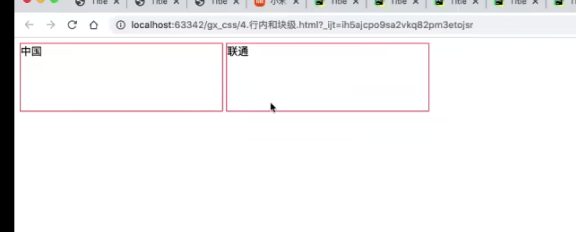

前言和要求：

- CSS样式是专门“美化”标签。
- 基础CSS，写简单页面&看懂和改
- 模块、调整和修改


# 1.快速了解


```html
#此处的style就是一种样式

```


# 2.CSS应用方式

### 2.1 在标签上

```html

```


### 2.2head标签中

head中写入style标签

```html
#在head标签中写入
<style>
    .c1{
        color:red;
    }
</style>

#在对应的标签中的class赋值c1
<h1 class = 'c1'>
    用户登录
</h1>
```


### 2.3写到文件中

先写css文件

```css
.C1{
    height:100px;
}

.c2{
    color:red;
}
```

并在对应html中导入

```html
#在head标签中写入link标签
#rel 属性在 HTML 中用于定义当前文档与被链接文档之间的关系
<link rel="stylesheet" href="common.css"/>
```


# 3.CSS选择器

- 类选择器

  ```html
  .C1{
  
  }
  #html中找class="c1"的标签
  ```

- ID选择器

  ```html
  #C1{
  
  }
  #html中找id="C1"的标签
  ```

- 标签选择器

- 属性选择器

  ```
  input[type="text"]{
  
  }
  
  #c1[xx=""]{
  }
  ```

- 后代选择器

  ```html
  #找后代
  .yy li{
  
  }
  
  #找儿子
  .yy > li{
  
  }
  
  ```


注意：多个样式覆盖问题

```html
#一般跟随style的写的顺序覆盖
<style>
    .c1{
        
    }
    .c2{
        
    }
</style>

#也可通过下面方法禁止覆盖
<style>
    .c1{
        color:red !important;
    }
    .c2{
        color:blue;
    }
</style>

<div class="c1 c2">

</div>
```


# 4.具体的样式

## 4.1高度和宽度

使用方法：

- 固定值
- 宽度百分比（高度不支持

注意事项：

- 宽度支持百分比，高度不支持
- 行内标签：默认无效
- 块级标签：默认有效（但一般情况右侧区域空白也不给用


## 4.2 块级和行内标签

- 块级
- 行内
- css样式：标签 display：inline-block

inline-block可以使得具有行级和块级标签的性质



此外可以通过display：inline或display：block可以强制转换


## 4.3 字体和颜色

- color 字体颜色
  - RGB
  - 颜色英文
- font-size 字体大小
  - px值
  - 大小英文 （large
- font-weight 字体加粗
  - 数值
- font-family 字体风格


## 4.4 文字对齐方式

- text-align 水平居中
- line-height 垂直居中 
  - 一般的方式
  - 数值等于height的px


## 4.5 浮动

- 行内标签（可以直接使用
  - float:right;	#右边浮动
  - float:left;       #左边浮动
- 块级标签（需注意，浮动会改变块级标签的霸道）

注意：

​	如果让标签浮动起来后，就会脱离文档流。

​	可能无法将父标签撑起来（比如div需要依靠子标签撑起宽高），从而导致父标签的style无法显示。

​	有一个解决的方法是在最后一个子标签的加上属性style="clear:both"

```html
<div style="background-color:blue">
    <div class="item"></div>
    <div class="item"></div>
    <div class="item"></div>
    <div class="item"></div>
    <div style="clear:both;"></div>
</div>
```


## 4.6内边距

内边距，内部设置的边距padding


## 4.7外边距

外边距，自身距离别人的距离


## 4.8设置透明度

```css
#0到1
opacity:0.5
```


# 5.CSS知识点

## 5.1 hover（伪类）

两种使用：

- xx:hover{}
- xx:hover .jj{}


## 5.2 after（伪类）

after可以在标签内部尾部添加东西


```html
<!DOCTYPE html>
<html lang="en">
<head>
    <meta charset="UTF-8">
    <title>Title</title>
  <style>
    .c1:after{
      content: " shit";
    }

    .item {
      float: left;
    }

    .clearfix:after{
      content: "";
      display: block;
      clear: both;
    }


  </style>
</head>
<body>
<div class="c1">king</div>

<div class="clearfix">
  <div class="item"></div>
  <div class="item"></div>
  <div class="item"></div>
  <div class="item"></div>
</div>

</body>
</html>
```


## 5.3 position

三种定位：

- fixd

  固定在窗口的某个位置

  ```html
  #返回顶部
        .back{
          position: fixed;
          width: 60px;
          height: 60px;
          border: 1px solid red;
          right:10px;
          bottom: 50px;
        }
  ```

- relative

- absolute


```html
<!DOCTYPE html>
<html lang="en">
<head>
    <meta charset="UTF-8">
    <title>Title</title>
  <style>
    .c1{
      height: 300px;
      width: 500px;
      border: 1px solid red;
      margin:100px;
      position: relative;
    }

    .c1 .c2{
      height: 59px;
      width: 59px;
      background-color: #80ff7f;
      position: absolute;
      right: 0;
    }

  </style>
</head>
<body>
<div class="c1">
  <div class="c2">

  </div>
</div>
</body>
</html>
```

- **相对定位**：是相对于元素自己的原始位置进行定位。
- **绝对定位**：是相对于最近的已定位的祖先元素进行定位，如果不存在这样的祖先元素，则相对于HTML文档本身定位。


## 5.4 border

border：边框大小 边框样式 边框颜色

注意：边框颜色可以设置透明色


# 案例

## 1.Flask中应用

实践css应用

问题：Flask框架开发不方便

- 每次都需重启
- 规定有些文件必须放在特定的文件夹
- 每次新建一个页面
  - 函数  @app.route
  - HTML文件

有无一种方式：可以快速编写前端代码并查看效果，在最后再页面集成到Flask中：pycharm提供了一种便携的方法——可以通过点击直接浏览


## 2.小米商场-顶部

区域集中技巧

- 对于一个div可以进行下面代码进行左右居中

  ```css
  #第一个参数为上下，第二个参数为左右
  margin:0 auto
  ```

  

```html
<!DOCTYPE html>
<html lang="en">
<head>
    <meta charset="UTF-8">
    <title>Title</title>
    <style>

      body{
        margin: 0;
      }

      a {
        text-decoration: none;
      }


      .header{
        background-color: #333;
      }

      .container{
        width: 1226px;
        margin:0 auto;
      }

      .header .menu{
        float: left;
        color: white;
      }

      .header .account{
        float: right;
        color: white;
      }

      .header a {
          color: #b0b0b0;
          line-height: 40px;
          display: inline-block;
          font-size: 12px;
          margin-right: 10px;
      }

    </style>

</head>
<body>
<div class="header">
  <div class="container">
    <div class="menu">
      <a href="">小米官网</a>
      <a href="">小米商场</a>
      <a href="">小米澎湃OS</a>
      <a href="">IoT</a>
      <a href="">云服务</a>
      <a href="">天星数科</a>
      <a href="">有品</a>
      <a href="">小爱开放平台</a>
      <a href="">资质证照</a>
      <a href="">协议规则</a>
      <a href="">下载app</a>
      <a href="">Select Localtion</a>
    </div>
    <div class="account">
      <a href="">登录</a>
      <a href="">注册</a>
      <a href="">消息通知</a>
    </div>
    <div style="clear:both"></div>

  </div>

</div>

</body>
</html>
```


总结

- body标签，默认有个边距，造成页面四边都有白色间隙

  ```css
  body{
  	margin:0;
  }
  ```

- 内容居中

  - 文本居中

    text-align:center;

  - 区域居中

    自己有宽度+magin-left:auto; margin-right-auto;

- 如果父亲没有高度，会被孩子撑起

- 如果存在浮动，一定记得处理

  ```html
  #加到最后
  <div style="clear:both">
      
  </div>
  ```

- 注意使用f12分析其他网址前端

- 关于布局划分和分析


## 3.小米商城-二级

接下来开始二级菜单


步骤如下

1. 划分区域
2. 搭建骨架
3. logo区域
4. 菜单区域
5. 搜索区域（未做）


## 4.小米商城-整合


小结：

- a标签是行内标签，行内标签的高度、内外边距，默认无效。
- 对于垂直方向居中
  - 文本直接 line-height
  - 图片+边距
- a标签默认有下划线
- :hover表明鼠标放上的事件


## 5.小米商场-推荐

步骤如下：

1. 划分区域
2. 骨架搭建
3. 实现区域


## 6.fiexd 对话框

```html
<!DOCTYPE html>
<html lang="en">
<head>
    <meta charset="UTF-8">
    <title>Title</title>
  <style>
    body{
      margin:0;
    }

    .dialog{
      position: fixed;
      height: 300px;
      width: 500px;
      background-color: white;
      left:0;
      right:0;
      top: 200px;
      margin:0 auto;
      z-index: 1000;
    }

    .mask{
      background-color: black;
      position:fixed;
      left: 0;
      right: 0;
      top:0;
      bottom:0;
      opacity: 0.7;
      z-index: 999;

    }


  </style>
</head>
<body>
<div style="height:1000px; "></div>
<div class="mask"></div>
<div class="dialog">  </div>
</body>
</html>
```

总结

- z-index绝对那个在上面，否则fiexd会按body里面的顺序放

- 对于fiexd，margin：0 auto不能直接使用来使其水平居中

  而是要事先设置left和right为0，再设置margin：auto


## 7.下载app

```html
<!DOCTYPE html>
<html lang="en">
<head>
    <meta charset="UTF-8">
    <title>Title</title>
    <style>

      body{
        margin: 0;
      }

      a {
        text-decoration: none;
      }


      .header{
        background-color: #333;
      }

      .container{
        width: 1226px;
        margin:0 auto;
      }

      .header .menu{
        float: left;
        color: white;
      }

      .header .account{
        float: right;
        color: white;
      }

      .header a {
          color: #b0b0b0;
          line-height: 40px;
          display: inline-block;
          font-size: 12px;
          margin-right: 10px;
      }

      .header a:hover{
        color: white;
      }

      .sub-header{
        height: 100px;
      }

     .sub-header .ht{
        height: 100px;
      }

      .sub-header .logo{
        width: 234px;

        float: left;
      }

      .sub-header .menu-list{
        float: left;
        line-height: 100px;
      }

      .sub-header .search{
        float: right;

      }

      .sub-header .logo a{
        margin-top: 22px;
        display: inline-block;
      }

      .sub-header .logo a img{
        height: 56px;
        width: 56px;
      }

      .sub-header .menu-list a{
        display: inline-block;
        padding: 0 20px;
        color: #333;
        font-size: 16px;
      }

      .sub-header .menu-list a:hover{
        color: #ff6700;
      }

      .slider .sd-img{
        width: 1226px;
        height: 460px;
      }

      .slider .sd-img img{
        width: 100%;
        height: 100%;
      }

      .left-float{
        float: left;
      }

      .margin_set1{
        margin-left:14px
      }

      .margin_set2{
        margin-left: 15px;
      }

      .news{
        margin-top: 14px;
      }

      .news .channel{
        height:164px ;
        width:228px ;
        background-color:#5f5750;
        padding: 3px;
      }

      .news .list-item{
        height: 170px;
        width: 316px;

      }

      .news .list-item img{
        width: 100%;
        height: 100%;
      }

      .news .channel .item{
        height: 82px;
        width: 76px;
        text-align: center;
      }

      .news .channel .item img{
        height: 24px;
        width: 24px;
        margin: 0 auto 4px;
        display: block;
      }

      .news .channel .item a{
        display: inline-block;
        padding-top: 18px;
        font-size: 12px;
        color: #fff;
        opacity: 0.7;
      }

      .news .channel .item a:hover{
        opacity: 1;
      }

      .app{
        position: relative;
      }

      .app .download{
        position: absolute;
        height: 100px;
        width: 100px;
        display: none;
      }

      .app:hover .download{
        display: block;
      }


    </style>

</head>
<body>
<div class="header">
  <div class="container">
    <div class="menu">
      <a href="">小米官网</a>
      <a href="">小米商场</a>
      <a href="">小米澎湃OS</a>
      <a href="">IoT</a>
      <a href="">云服务</a>
      <a href="">天星数科</a>
      <a href="">有品</a>
      <a href="">小爱开放平台</a>
      <a href="">资质证照</a>
      <a href="">协议规则</a>
      <a href="" class="app">下载app
        <div class="download">
          
        </div>  
      </a>
      <a href="">Select Localtion</a>
    </div>
    <div class="account">
      <a href="">登录</a>
      <a href="">注册</a>
      <a href="">消息通知</a>
    </div>
    <div style="clear:both"></div>

  </div>

</div>
<div class="sub-header">
  <div class="container">
    <div class="ht logo">
      <a href="">
        
      </a>
    </div>
    <div class="ht menu-list">
      <a href="">xiaomi手机</a>
      <a href="">Redmi手机</a>
      <a href="">电视</a>
      <a href="">笔记本</a>
      <a href="">平板</a>
    </div>
    <div class="ht search">搜索</div>
    <div style="clear:both"></div>
  </div>

</div>
<div class="slider">
  <div class="container">
    <div class="sd-img">
      
    </div>
  </div>
</div>
<div class="news">
  <div class="container">
    <div class="channel left-float">
      <div class="item left-float">
        <a href="">
          
          <span>保证服务</span>
        </a>
      </div>
      <div class="item left-float">
        <a href="">
          
          <span>企业团购</span>
        </a>
      </div>
      <div class="item left-float">
        <a href="">
          
          <span>F码通道</span>
        </a>
      </div>
      <div class="item left-float">
        <a href="">
          
          <span>米粉卡</span>
        </a>
      </div>
      <div class="item left-float">
        <a href="">
          
          <span>以旧换新</span>
        </a>
      </div>
      <div class="item left-float">
        <a href="">
          
          <span>话费充值</span>
        </a>
      </div>
      <div style="clear: both"></div>
    </div>
    <div class="list-item left-float margin_set1">
      
    </div>
    <div class="list-item left-float margin_set2">
      
    </div>
    <div class="list-item left-float margin_set2">
      
    </div>
    <div style="clear: both"></div>
  </div>
</div>
</body>
</html>
```

总结

- 使用related容器内部absolute，实现相对位置
- 并使用hover和display：none实现鼠标悬停展示
