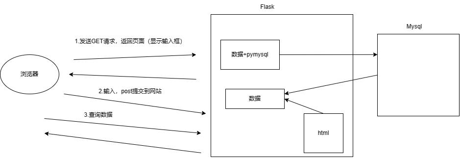

- python相关：基础、函数、数据相关、面向、模块

- 前端开发：html、css、JavaScript【静态页面】

  ```
  java+前端 python+前端 Go+前端  【动态页面】
  ```

  - 静态页面，写死了
  - 动态页面，页面的数据可以实时的修改和展示


# 1.初识网站

- 默认编写的是静态的效果
- 动态：需要用到Web框架的功能


对于目前而言，什么可以做数据的存储

- txt文件
- excel文件

存储数据有专业的软件：数据库管理系统（例如Mysql


Mysql可以分成两部分

- 解析指令
- 文件夹/文件存储


mysql连接和发送指令有三种方法

- python代码等
- 图形化界面
- Mysql自带工具


摘要

- MySQL的安装
- MySQL的启动和关闭
- 指令(*)
- python第三方模块


# 2.Msyql安装

- data目录是mysql数据库数据存储的位置

  ps：免安装版本需要自行配置

- my.ini配置端口和安装目录


# 3.Mysql启动

- 临时启动
- 制作服务


# 4.连接测试

mysql连接和发送指令有三种方法

- python代码等
- 图形化界面
- Mysql自带工具 （安装目录下的mysql.exe，也就是课程常用的黑框)
  - 默认-P 3306 -h127.0.0.1
  - 可以设置系统环境变量
  - 操作时mysql -u root -p、


设置密码

在mysql环境下，使用

```
5.7 set password = password("...")
8.0  ALTER USER 'root'@'loacalhost' IDENTIFIED BY '密码'
```


# 5.数据库指令

1. 查看数据库

   ```
   SHOW DATABASES;
   ```

2. 删除数据库

   ```
   DROP DATABASE IF EXISTS database_name;
   ```

3. 创建数据库

   ```
   CREATE DATABASE 数据库名字 character set utf8;
   ```

4. 退出exit;
5. 进入数据库（use database_name)
6. 查看数据库所有数据表（show tables;）


# 6.数据表指令

``` 
进入数据库
	-use 数据库;

查看当前数据库所有表
	-show tables;
```

- 创建表

  ```
  CREATE TABLE 表名称(
  	列名称 类型,
  	列名称 类型,			// not null 不允许为空
  	列名称 类型			//null 运行为空，默认
  )default charset =uft8
  
  列名 int default 3      //默认值为3
  id int primary key		//主键不允许为空，也不允许重复
  
  
  
  主键一般表示当前行的数据编号，所以一般会加上auto_increment
  表示自增，即不用手动传入值
  
  
  
  ```

- 查看表结构

  - show columns from 表名;
  - desc 表名;

- 删除表

  ```
  drop table 表名称;
  ```

- 表内数据插入

  - 单行插入

    ```
    INSERT INTO TALBLE_NAME(,,,) VALUES(,,,);
    ```

  - 批量插入

    ```
    INSERT INTO TABLE_NAME(,,,) VALUES(),(),()...;
    ```

- 查看表内数据

  - 所有select * from 表名;


mysql常用数据类型：	

1. 整型

   - tinyint（8bit分有符号和无符号）

   - int（32bit）

   - bigint

2. 小数

   - float

   - double

   - decimal(m,d)（精准数）

     ```
     salary decimal(8,2)
     
     准确的小数值，m是数字总个数，d是小数后个数，m最大65
     d最大30
     ```

3. 字符串

   - char(m<255)，查询速度快

     ```
     mobile char(11)
     定长字符串,无论是否达到
     ```

   - varchar(m<?)，节省空间

     ```
     mobile varchar(11)
     变长字符串,真实数据多长就按多长
     ```

   - text(M)

     ```
     text可以保存很多个字符
     ```

   - mediumtext //2**24-1

   - longtext      //2**32-1

   - datatime 含时分秒

   - data 不含时分秒


```
CREATE TABLE TB7(
id int not null primary key auto_increment,
name varchar(64) not null,
password varchar(64) not null,
email varchar(64) not null,
age tinyint unsigned,
salary decimal(10,2),
ctime datetime
)default charset=uft8;


insert into tb7(name,password,email,age,salary,ctime) values("king","123","123@qq.com",15,1544644,"2011-11-12 11:11:10");
```


# 7.数据行操作

1. 新增数据 inset into 表名(列名，列名),values(值，值);

2. 删除数据

   ```
   DELETE FROM 表名;
   DELETE FROM 表名 WHERE 条件;
   DELETE FROM 表名 WHERE 条件1 and 条件2;
   ```

3. 修改数据

   ```
   UPDATE 表名 set 列=值;
   UPDATE 表名 set 列=值,列=值;
   UPDATE 表名 set 列=值 where 条件;
   
   update tb7 set password = "hhh";
   update tb7 set age = age + 10 where id > 5;
   ```

4. 查询数据

   ```\
   SELECT  FROM 表名称;
   SELECT 列名称,列名称 FROM 表名称;
   SELECT 列名称,列名称 FROM 表名称 WHRER 条件;
   ```

   


# 8.忘记密码操作

修改mysql配置，重新启动mysql（无账号模式），进入后再重新设置密码，然后改回要密码模式


# 9.小结

一般情况下：

- 创建数据库
- 创建表结构

都是需要提前通过工具和命令创建

但是，表中的数据一般动态程序来实现增删改查


# 10.python结合案例：员工管理

- 使用MySQL内置工具

  - 创建数据库：unicom

  - 数据一张表：admin

    ```
    表名：admin
    列：
    	id，整形，自增，主键
    	username 字符串 不为空
    	password 字符串 不为空
    	mobile 字符串 不为空
    ```

- python代码实现：

  - 添加用户
  - 删除用户
  - 查看用户
  - 更新用户信息


## 创建表结构

1. 创建数据库
2. 创建数据表


## python操作MySQL

1. 安装pymysql


禁止字符串拼接，而采用%s，因为可以SQL注入

> 当`username = "' ' or '1'='1'"`时。
>
> ### 第一个例子：字符串拼接（不安全）
>
> ```
> pythonCopy codeusername = "' ' or '1'='1'"
> sql = "SELECT * FROM users WHERE username = '%s'" % username
> cursor.execute(sql)
> ```
>
> 在这种情况下，变量`username`的值会直接被插入到SQL语句中，完成字符串的拼接。因此，最终的SQL语句将变为：
>
> ```
> sqlCopy code
> SELECT * FROM users WHERE username = '' ' or '1'='1''
> ```
>
> 攻击者通过在输入中包含SQL代码（`' ' or '1'='1'`），使得SQL语句逻辑被修改为一个总是为真的条件（`'1'='1'`），从而可能返回所有用户的记录。这是一次成功的SQL注入攻击，因为攻击者能够通过构造输入绕过了原本的意图。
>
> ### 第二个例子：参数化查询（安全）
>
> ```
> pythonCopy codeusername = "' ' or '1'='1'"
> sql = "SELECT * FROM users WHERE username
> ```
>
> = %s" cursor.execute(sql, (username,))
>
> ```
> sqlCopy code
> 在这种情况下，即使`username`的值是`"' ' or '1'='1'"`，这个值会被数据库处理为一个普通的字符串字面值，而不是SQL指令的一部分。因此，数据库会查找用户名确实等于`" ' ' or '1'='1'"`的记录，而不是执行`'1'='1'`这样的条件判断。最终的SQL命令在数据库中执行时，会寻找一个实际用户名等于字符串`" ' ' or '1'='1'"`的用户，而不是尝试执行注入的SQL代码。
> 
> ### 区别在于：
> 
> - **字符串拼接**：直接将用户输入拼接到SQL语句中，如果用户输入包含SQL关键字或逻辑，这些输入会被数据库解释执行，从而引发SQL注入的安全风险。
> - **参数化查询**：用户输入被视为查询参数的值，与SQL语句本身分开处理。即使输入中包含潜在的恶意代码，这些代码也仅仅被视为字符串的一部分，而不会被数据库解释执行。这种方法防止了SQL注入，因为它保证了SQL语句的结构不会被用户输入影响。
> 
> 总之，参数化查询通过预先定义SQL语句的结构，并将用户输入作为查询参数传递，有效避免了SQL注入攻
> ```


2. 创建数据

```python
import pymysql

# 连接MySQL
conn = pymysql.connect(host="127.0.0.1",
                       port=33061,
                       user='root',
                       password="1qaz2wsx3edc",
                       charset="utf8",
                       db='unicom')
cursor = conn.cursor(cursor=pymysql.cursors.DictCursor)
while True:
    user = input("用户名：")
    if user.upper() =="Q":
        break
    pwd = input("密码：")
    moblie = input("手机号：")


    #2.发送指令(前往不要用字符串格式化去做SQL的拼接，因为有安全隐患SQL注入）
    sql ="insert into admin(username,password,mobile) values(%s,%s,%s)"
    cursor.execute(sql,[user,pwd,moblie])
    conn.commit()

# 3.关闭
cursor.close()
conn.close()
```

修改数据表数据，需要commit函数调用


3.查询数据

```python
import pymysql

# 连接MySQL
conn = pymysql.connect(host="127.0.0.1",
                       port=33061,
                       user='root',
                       password="1qaz2wsx3edc",
                       charset="utf8",
                       db='unicom')
cursor = conn.cursor(cursor=pymysql.cursors.DictCursor)
while True:
    user = input("用户名：")
    if user.upper() =="Q":
        break
    pwd = input("密码：")
    moblie = input("手机号：")


    #2.发送指令(前往不要用字符串格式化去做SQL的拼接，因为有安全隐患SQL注入）
    sql ="select * from admin where id > %s"
    cursor.execute(sql,[2,])
    data_list = cursor.fetchall()
    print(data_list)
    for row_dict in data_list:
        print(row_dict)

# 3.关闭
cursor.close()
conn.close()
```

注意查询操作不需要.commit操作

查询有

- fetchall()			//字典列表
- fetchone()         //字典


4.删除数据

5.修改数据

上述操作同上1和2


小结：

- 在进行新增、删除、修改时，一定记得commit
- 在进行查询时，不需要commit，但是需要fetchall/fetchone（默认
- 对于SQL语句不要使用python字符串格式化进行拼接（会被SQL注入


# 11. FLASK+MYSQL

Flask+MySQL




完成两个功能：

- 添加数据
- 查询数据