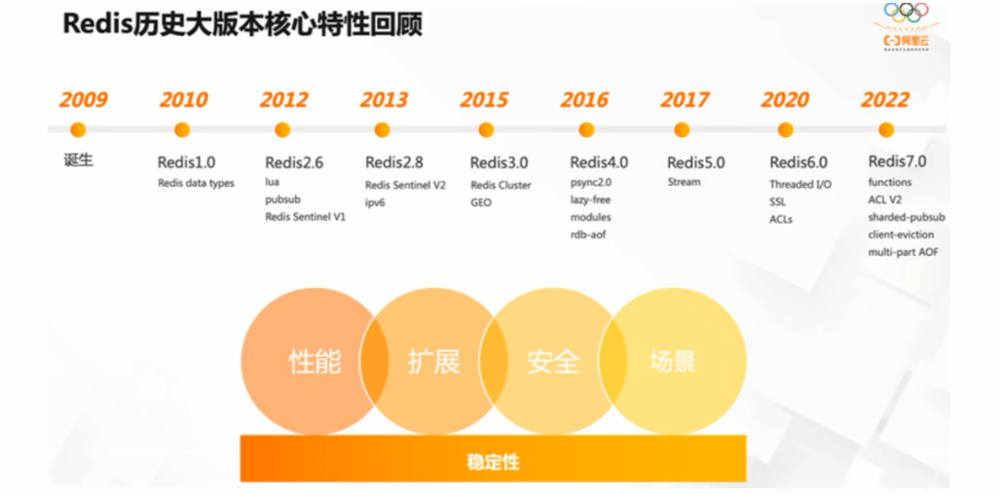

# 1.Redis入门概述


## 1.1 Redis是什么？

全程：REmote Dictionary Server(远程字典服务器)

<br>

官网解释：Remote Dictionary Server是完全开源的，使用ANSIC语言便编写遵守BSD协议，是一个高性能的Key-Value数据库提高了丰富的数据结构，例如String、Hash、List、Set、SortedSet等等。数据是**存在内存中的**，同时Redis支持事务，持久化、LUA脚本、发布/订阅、缓存淘汰、流技术等多种功能特性提供了主从模式、Redis sentinel和Redis Cluster集群架构方案。

<br>

> Redis（Remote Dictionary Server）是一种开源的内存数据库，它广泛用于缓存、会话管理、实时数据分析和消息队列等场景。以下是Redis的一些关键特点：
>
> 1. **内存存储**：Redis将所有数据存储在内存中，提供极高的读写速度，使其非常适合需要高性能的数据存储和缓存需求。
> 2. **多种数据结构**：Redis支持多种数据结构，包括字符串（String）、哈希（Hash）、列表（List）、集合（Set）和有序集合（Sorted Set），此外还支持位图（bitmaps）、HyperLogLogs、地理空间索引（Geospatial Indexes）等。
> 3. **持久化**：虽然Redis是内存数据库，但它提供了多种持久化机制，如RDB（Redis Database File）快照和AOF（Append Only File）日志，以确保数据在服务器重启时不会丢失。
> 4. **高可用性和分布式**：Redis支持主从复制（master-slave replication），可以通过Redis Sentinel实现高可用性，通过Redis Cluster实现分布式存储和水平扩展。
> 5. **事务支持**：Redis支持事务操作，确保一系列命令的原子执行。
> 6. **Lua脚本**：Redis支持使用Lua脚本进行复杂的操作，脚本可以保证在单个原子操作中执行。
> 7. **发布/订阅**：Redis提供发布/订阅（pub/sub）消息机制，允许消息在不同客户端之间进行实时传递。
>
> 这些特点使Redis不仅可以作为缓存使用，还可以作为消息队列、会话存储、实时分析系统等多种应用场景的解决方案。

> ### BSD协议
>
> BSD协议（Berkeley Software Distribution License）是一种宽松的开源许可证，允许代码自由使用、修改和分发。主要特点包括：
>
> 1. **自由使用和分发**：可以自由使用、修改和分发源代码及其修改版本。
> 2. **保留版权声明**：分发的源代码和二进制文件必须保留原作者的版权声明。
> 3. **免责声明**：作者不对代码的使用承担任何责任。
>
> 因为BSD协议对使用者限制少，所以它被广泛用于许多开源项目。
>
> ### Lua脚本
>
> Lua是一种轻量级的、高效的嵌入式脚本语言，常用于游戏开发、嵌入式设备以及其他需要高性能脚本的应用中。它的主要特点包括：
>
> 1. **简单易学**：语法简单，容易上手。
> 2. **高性能**：解释执行效率高，适合嵌入到C/C++程序中作为脚本引擎。
> 3. **可嵌入性**：设计为嵌入式语言，可以轻松嵌入到其他应用程序中。
>
> 在Redis中，Lua脚本用于执行复杂的原子操作，确保在一个事务中执行多条命令。
>
> ### 事务支持
>
> 在数据库和其他数据存储系统中，事务是一个确保数据一致性和完整性的机制。事务支持的主要特点包括：
>
> 1. **原子性（Atomicity）**：事务中的所有操作要么全部成功，要么全部回滚，不会产生部分执行的情况。
> 2. **一致性（Consistency）**：事务执行前后，数据库从一个一致性状态转变到另一个一致性状态。
> 3. **隔离性（Isolation）**：事务的执行不会被其他事务干扰，即并发事务之间相互隔离。
> 4. **持久性（Durability）**：一旦事务提交，数据将被永久保存，即使系统崩溃也不会丢失。
>
> 在Redis中，通过MULTI、EXEC、DISCARD和WATCH等命令，可以实现事务操作，确保一系列命令按顺序原子执行。

<br>

<br>

## 1.2 Redis能干什么？

在传统数据库中，例如Mysql，由于不堪重负，引入了Redis进行分担处理


 与传统关系数据库mysql相比，Redis是Key-value数据库（NoSQL一种）

- redis的时间复杂度o(1)

- Redis数据操作主要在内存，mysql主要在磁盘

- Redis在某些场景使用中要优于mysql，例如计数器和排行榜
- Redis通常用于特定场景，需要和Mysql配合

由此上述分析，可以知道，两者不是竞争关系。


> ### 学习 Redis 之前
>
> 1. **数据存储方式有限**：
>    - **仅依赖数据库**：主要依赖传统的关系型数据库（如 MySQL、PostgreSQL）或其他 NoSQL 数据库（如 MongoDB）来存储和检索数据。
>    - **缓存实现复杂**：如果需要缓存机制，通常需要自己实现缓存逻辑和数据同步机制，可能会面临缓存失效、数据不一致等问题。
> 2. **性能问题**：
>    - **高延迟**：在高并发场景下，数据库可能成为性能瓶颈，导致请求处理延迟增加。
>    - **I/O 负载高**：大量的读写请求直接打到数据库，导致数据库负载高，影响整体系统性能。
> 3. **开发复杂度**：
>    - **手工优化**：需要手动优化数据库查询和索引，处理复杂的事务和锁定机制，以提升性能。
>    - **有限的工具**：缺少高效的工具来实现一些常见的后端功能，如消息队列、发布/订阅、会话存储等。
>
> ### 学习 Redis 之后
>
> 1. **数据存储方式多样化**：
>    - **键值存储**：可以使用 Redis 作为高效的键值存储，适用于缓存、会话存储等场景。
>    - **数据结构丰富**：Redis 支持多种数据结构（如字符串、哈希、列表、集合、有序集合），可以灵活应对不同的数据存储需求。
> 2. **显著的性能提升**：
>    - **低延迟**：Redis 以内存存储为主，具有极低的访问延迟，能显著提升系统的响应速度。
>    - **减轻数据库负载**：通过将高频访问的数据缓存在 Redis 中，减少对数据库的直接访问，降低数据库负载。
> 3. **开发效率提高**：
>    - **内置丰富功能**：Redis 提供了丰富的内置功能，如持久化、发布/订阅、事务、Lua 脚本等，简化了开发工作。
>    - **简化复杂逻辑**：通过使用 Redis，可以简化很多复杂的后端逻辑，比如会话管理、分布式锁、计数器等。
> 4. **更好的扩展性**：
>    - **分布式特性**：Redis 支持分布式架构，如 Redis Cluster 和 Redis Sentinel，可以轻松实现高可用和负载均衡。
>    - **弹性扩展**：在高并发场景下，可以通过增加 Redis 节点来扩展系统的处理能力，提升系统的扩展性。
>
> ### 具体应用场景
>
> 1. **缓存机制**：例如，用户登录后的会话信息可以存储在 Redis 中，加快验证速度。
> 2. **排行榜系统**：使用 Redis 的有序集合实现高效的排行榜系统。
> 3. **实时统计**：例如，在电商平台中记录用户点击和购买行为的实时统计。
> 4. **消息队列**：利用 Redis 的列表或流数据类型，实现简单的消息队列系统。
> 5. **分布式锁**：使用 Redis 实现分布式锁，确保多个进程间的互斥访问。
>
> 通过学习 Redis，你可以有效地解决性能瓶颈、简化开发逻辑、提高系统的扩展性和可靠性。这使得你在开发高性能、高可用的后端系统时具备更多的工具和方法。

Reids的主流功能可以分为以下几种：

1. 分布式缓存，挡在mysql数据库之前的带刀护卫
2. 内存存储和持久化（RDB+AOF），redis支持异步将内存中的数据写到硬盘上，同时不影响继续服务（比如断电，
3. 高可用架构搭配：单机、主从、哨兵、集群
4. 缓存穿透、击穿、雪崩
5. 分布式锁
6. 队列(Redis提供list和set操作，是的Redis能作为一个很好的消息队列平台来使用)
7. 排行+点赞
8. ...

<br>

如下为redis总的功能概述


<br>

**优势**

 性能极高-Redis读的速度是110000次/秒，写的速度是81000次/秒

 Redis数据类型丰富，不仅仅支持简单的Key-Value类型的数据，同时还提供list，set，zset，hash等数据结构的存储

 Redis支持数据的持久化，可以将内存中的数据保持在磁盘中，重启的时候可以再次加载进行使用

 Redis支持数据的备份，即master-slave模式的数据备份

<br>


**小总结**


> ### 发展历史趋势
>
> #### 1. 分布式系统的兴起
>
> 随着互联网和大数据时代的到来，传统的单机系统逐渐无法满足高并发、大规模数据处理和服务扩展的需求。因此，分布式系统得到了广泛的应用和发展。
>
> - **早期的分布式系统**：90年代末和2000年代初，大型互联网公司开始采用分布式系统架构，如分布式数据库、分布式存储系统等。这些系统需要解决分布式环境下的数据一致性、并发控制和系统可靠性等问题。
>
> #### 2. 并发控制和同步机制的需求
>
> 随着分布式系统规模的扩大，节点数量的增加以及数据访问的并发需求，出现了对并发控制和同步机制更为严格的要求。
>
> - **分布式锁的出现**：为了确保在分布式环境下对共享资源的互斥访问，分布式锁成为了一种重要的解决方案。最早的分布式锁实现是基于数据库的悲观锁和乐观锁，后来发展出基于分布式算法和分布式协议的分布式锁方案。
>
> #### 3. 分布式计数的需求
>
> 随着互联网应用的发展，对实时统计和计数的需求日益增加，特别是需要多节点共享和更新统一计数的场景。
>
> - **分布式计数器的出现**：分布式计数器是为了解决多节点并发更新计数值的问题而提出的。它需要考虑并发访问的一致性和原子性，因此在设计上引入了分布式事务、分布式锁等机制来确保计数器操作的正确性。
>
> #### 4. 技术的发展和应用
>
> 随着分布式系统技术的不断发展和优化，分布式锁和分布式计数器也在不断演化和改进。
>
> - **分布式锁的进化**：从最初的基于数据库锁和分布式锁服务（如 ZooKeeper、etcd）到现在的基于 Redis 的分布式锁，技术逐步演化出更高效、更可靠的实现方式。
> - **分布式计数器的优化**：随着 NoSQL 数据库和分布式缓存技术的兴起，分布式计数器的实现也越来越多样化和高效化，例如利用 Redis 的原子操作实现分布式计数器。
>
> #### 5. 现代应用和未来趋势
>
> 在当今的云计算和微服务架构中，分布式锁和分布式计数器仍然是设计和实现分布式系统中不可或缺的核心组件。未来，随着大数据、人工智能和物联网等技术的发展，这些技术和概念将继续演化和应用到更多复杂和高级的场景中。
>
> ### 总结
>
> 分布式锁和分布式计数器作为分布式系统中的重要组成部分，经历了从初期的需求和挑战到现代的技术解决方案的演进过程。它们的发展历史反映了分布式系统在处理并发控制、数据一致性和系统可靠性方面的不断探索和进步。理解这些技术背后的发展历程，有助于我们更好地应用和设计分布式系统，提升系统的性能和稳定性。

<br>

> 在 Redis 中，持久化是指将数据保存在内存中的同时，周期性地将数据存储到磁盘中，以便在系统重启或崩溃后能够恢复数据。Redis 提供了两种主要的持久化方式：RDB（Redis Database）快照持久化和 AOF（Append-Only File）日志持久化。
>
> ### 什么是持久化？
>
> 持久化是一种技术手段，通过将数据从易失性存储（如内存）转移到非易失性存储（如磁盘）中，以确保数据在系统重启或故障后仍然可以被恢复。这对需要保证数据可靠性的应用来说非常重要。
>
> ### RDB 持久化
>
> RDB（Redis Database）持久化是通过创建数据的快照并将其保存到磁盘中来实现的。它会在某个时间点将所有数据进行快照，并保存到一个 RDB 文件中。
>
> **特点**：
>
> - **时间点快照**：RDB 是在某个特定的时间点创建整个数据集的快照。
> - **低资源占用**：生成快照的过程比较高效，不会占用大量 CPU 和内存资源。
> - **恢复速度快**：恢复时只需加载 RDB 文件中的数据即可。
> - **数据丢失风险**：由于是周期性保存快照，如果 Redis 意外崩溃，可能会丢失自上次快照以来的新数据。
>
> **配置**：
>
> ```
> save 900 1      # 如果 900 秒内至少有 1 个 key 发生变化，则触发 RDB 持久化
> save 300 10     # 如果 300 秒内至少有 10 个 key 发生变化，则触发 RDB 持久化
> save 60 10000   # 如果 60 秒内至少有 10000 个 key 发生变化，则触发 RDB 持久化
> ```
>
> ### AOF 持久化
>
> AOF（Append-Only File）持久化通过记录每一个写操作到日志文件（appendonly.aof）中实现。每当有写操作发生时，Redis 会将该操作追加到 AOF 文件末尾。
>
> **特点**：
>
> - **逐条记录操作**：AOF 会记录每个写操作，这使得数据恢复更加精确。
> - **数据安全性高**：AOF 可以配置为在每次写操作后立即同步到磁盘，从而最大限度地减少数据丢失风险。
> - **文件较大**：由于记录了所有的写操作，AOF 文件通常比 RDB 文件大。
> - **重写机制**：AOF 文件会随着时间变得很大，Redis 提供了 AOF 重写机制来生成一个较小的等效文件。
>
> **配置**：
>
> ```
> appendonly yes                # 启用 AOF 持久化
> appendfsync always            # 每次有写操作后立即同步到磁盘（最安全但最慢）
> # appendfsync everysec        # 每秒同步一次（折中方案）
> # appendfsync no              # 由操作系统决定何时同步（最快但最不安全）
> ```
>
> ### 持久化的选择
>
> - **RDB 持久化**：适用于对数据持久化要求不太严格，且希望减少持久化对性能影响的场景。RDB 适合做定期备份。
> - **AOF 持久化**：适用于需要高数据安全性，能够容忍较高持久化开销的场景。AOF 提供了更细粒度的数据恢复能力。
>
> ### 组合使用
>
> Redis 支持同时启用 RDB 和 AOF 持久化，以结合两者的优点。在这种配置下，Redis 在重启时会优先使用 AOF 文件进行数据恢复，因为 AOF 通常包含最新的数据。
>
> **配置示例**：
>
> ```
> bash复制代码save 900 1
> save 300 10
> save 60 10000
> appendonly yes
> appendfsync everysec
> ```
>
> 这样配置可以确保在高性能和数据安全之间取得平衡。

<br>

<br>

## 1.3 redis在哪里下载？

英文：https://redis.io/

中文：http://www.redis.cn/ https://www.redis.com.cn/documentation.html


文档资料

Redis源码地址：https://github.com/redis/redis

Redis在线测试地址(不用下载也能玩)：https://try.redis.io/

Redis命令参考：http://doc.redisfans.com/


<br>

## 1.4 redis的迭代演化及redis7新特性




Redis版本迭代推演介绍：

 几个里程碑式的重要版本:如上图：redis历史版本回顾

 命名规则：Redis从发布至今，已经有十余年的时光了，一直遵循着自己的命名规则:

1. 版本号第二位如果是奇数，则为非稳定版本，如2.7、2.9、3.1
2. 版本号第二位如果是偶数，则为稳定版，如、、版本号第二位如果是偶数，则为稳定版，如2.6、2.8、3.2
3. 当前奇数版本就是下一个稳定版本的开发版，如2.9版本就是3.0版本的开发版本
4. 我们可以通过redis.io官网来下载自己感兴趣的版本进行源码阅读
5. 历史发布版本的源码：https://download.redis.io/releases/

Redis7.0新特性概述：

https://github.com/redis/redis/releases可以查询到历史发布版本，我们可以看到Redis7的新特性：


<br>

主要的部分新特性：

1.Redis Functions


2.Client-eviction


3.Multi-part AOF


4.ACL v2 权限控制


5.新增命令（目前不用关心）

```
新增ZMPOP，BZMPOP，LMPOP，BLMPOP等新命令，对于EXPIRE和SET命令，新增了更多的命令参数选项。例如，ZMPOP的格式如下：ZMPOP numkeys key [key ...] MIN|MAX [COUNT count],而BZMPOP是ZMPOP的阻塞版本。
```


6.listpack替代ziplist

```
listpack是用来替代ziplist的新数据结构，在7.0版本已经没有ziplist的配置了（6.0版本仅部分数据类型作为过渡阶段在使用）
```


7.底层性能提升(和编码关系不大)


<br>

本次将对Redis7的一部分新特性做说明(not all)

总体概述

大体和之前的redis版本保持一致和稳定，主要是自身底层性能和**资源利用率上的优化和提高**，如果生产上系统稳定，**不用着急升级到最新redis7版本**，如果从零开始新系统，直接上redis7.0-GA版。

| 多AOF文件支持                      | 7.0 版本中一个比较大的变化就是 aof 文件由一个变成了多个，主要分为两种类型:基本文件(base files)、增量文件(incr files)，请注意这些文件名称是复数形式说明每一类文件不仅仅只有一个。在此之外还引入了一个清单文件(manifest) 用于跟踪文件以及文件的创建和应用顺序(恢复) |
| ---------------------------------- | ------------------------------------------------------------ |
| config命令增强                     | 对于Config Set 和Get命令，支持在一次调用过程中传递多个配置参数。例如，现在我们可以在执行一次Config Set命今中更改多个参数: config set maxmemory 10000001 maxmemory-clients 50% port 6399 |
| 限制客户端内存使用 Client-eviction | 一旦 Redis 连接较多，再加上每个连接的内存占用都比较大的时候， Redis总连接内存占用可能会达到maxmemory的上限，可以增加允许限制所有客户端的总内存使用量配置项，redis.config 中对应的配置项 //两种配置形式:指定内存大小、基于 maxmemory 的百分比。 maxmemory-client 1g maxmemory-client 10% |
| listpack紧凑列表调整               | listpack 是用来替代 ziplist 的新数据结构，在 7.0 版本已经没有 ziplist 的配置了 (6.0版本仅部分数据类型作为过渡阶段在使用）listpack已经替换了ziplist类似hash-max-ziplist-entries 的配置 |
| 访问安全性增强ACLV2                | 在redis.conf配置文件中protected-mode默认为yes，只有当你希望你的客户端在没有授权的情况下可以连接到Redis server的时候可以将protect-mode设置为no |
| redis function                     | Redis函数，一种新的通过服务端脚本扩展Redis的方式，函数与数据本身一起存储。简言之，redis自己要去抢夺Lua脚本的饭碗 |
| RDB保存时间调整                    | 将持久化文件RDB的保存规则发生了改变，尤其是时间记录频度变化  |
| 命令新增和变动                     | Zset (有序集合)增加 ZMPOP、BZMPOP、ZINTERCARD 等命令 Set (集合)增加 SINTERCARD 命令 LIST(列表)增加 LMPOP、BLMPOP ，从提供的键名列表中的第一个非空列表键中弹出一个或多个元素。 |
| 性能资源利用率、安全等改进         | 自身底层部分优化改动，Redis核心在许多方面进行了重构和改进主动碎片整理V2:增强版主动碎片整理，配合Jemalloc版本更新，更快更智能，延时更低 HyperLogLog改进:在Redis5.0中，HyperLogLog算法得到改进，优化了计数统计时的内存使用效率，7更加优秀更好的内存统计报告 如果不是为了API向后兼容，我们将不再使用slave一词......（政治正确） |

<br>

<br>

# 2.Redis安装和配置

## 2.1 redis安装

前提要求：

- linux
- 64位
- gcc


查看字节redis版本

redis -server -v


具体安装流程如下：

- wget安装
- 解压
- make编译
- 安装 sudo make install

<br>

安装的默认地址在usr/local/bin

安装后可以查看到有以下几个文件

| 文件名           | 描述                                             |
| ---------------- | ------------------------------------------------ |
| redis-benchmark  | 性能测试工具，服务启动后运行该命令可以查看性能。 |
| redis-check-aof  | 修复有问题的 AOF 文件。                          |
| redis-check-dump | 修复有问题的 dump.rdb 文件。                     |
| redis-cli        | 客户端，操作入口。                               |
| redis-sentinel   | Redis 集群使用工具。                             |
| redis-server     | Redis 服务器启动命令。                           |


## 2.2 配置redis.conf

一般将redis.conf原来的配置文件复制一份进行修改，

1.要配置的内容如下

1. 默认daemonize no 改成daemonize yse
2. 默认protected-mode yes 改为 protected-mode no
3. 默认bind 127.0.0.1 改为注释掉或本机IP地址
4. 添加redis密码，即改为requirepass 你自己的密码

| 配置项           | 修改前                     | 修改后                                          | 说明                                     |
| ---------------- | -------------------------- | ----------------------------------------------- | ---------------------------------------- |
| `daemonize`      | `daemonize no`             | `daemonize yes`                                 | 将 Redis 以守护进程方式运行。            |
| `protected-mode` | `protected-mode yes`       | `protected-mode no`                             | 关闭保护模式，允许外部连接。             |
| `bind`           | `bind 127.0.0.1`           | `# bind 127.0.0.1` 或者 `bind <你的本机IP地址>` | 注释掉或绑定到本机IP地址以允许远程访问。 |
| `requirepass`    | `# requirepass <password>` | `requirepass <你的密码>`                        | 设置 Redis 密码以增加安全性。            |

> 1. **daemonize**
>
> - **默认值**：`daemonize no`
> - **修改为**：`daemonize yes`
>
> 作用：
>
> - 将 Redis 服务器设置为后台运行（守护进程模式）。当设置为 `yes` 时，Redis 会在启动后转为后台运行，而不是在终端中占用当前会话。
>
> 为什么配置：
>
> - 在生产环境中，为了能够让 Redis 作为系统服务运行，通常建议将其配置为守护进程模式。这使得 Redis 能够独立于用户会话运行，在系统重启后也能自动启动服务。
>
> 2. **protected-mode**
>
> - **默认值**：`protected-mode yes`
> - **修改为**：`protected-mode no`
>
> 作用：
>
> - 保护模式是 Redis 的一项安全特性。启用该模式时，如果 Redis 服务器没有配置绑定 IP 地址（`bind`）或没有设置密码（`requirepass`），它将拒绝来自外部的连接。
>
> 为什么配置：
>
> - **禁用保护模式**可能是为了让 Redis 能够允许外部连接（例如，当你在服务器上有多个 Redis 客户端连接时）。然而，这样做风险较大，因为如果没有妥善的安全配置（如设置密码和严格控制 IP 地址），可能会导致安全漏洞。因此，在生产环境中，通常建议依然开启保护模式，同时配置合适的安全策略（如绑定特定的 IP 地址和启用密码）。
>
> 3. **bind**
>
> - **默认值**：`bind 127.0.0.1`
> - **修改为**：注释掉或设置为服务器的本机 IP 地址
>
> 作用：
>
> - `bind` 指定 Redis 服务器监听的 IP 地址。在默认配置下，Redis 只会接受来自本机（`127.0.0.1`）的连接。
>
> 为什么配置：
>
> - **注释掉**：允许 Redis 接受来自所有网络接口的连接（即来自任意 IP 的连接）。这在需要让其他机器连接到 Redis 服务器时是必要的。
> - **设置为本机 IP 地址**：这样可以限制 Redis 只接受来自特定 IP 的连接，提高安全性。只有特定的客户端或服务能够连接到 Redis。
>
> 4. **requirepass**
>
> - **默认值**：未设置
> - **修改为**：`requirepass 你自己的密码`
>
> 作用：
>
> - 为 Redis 添加访问密码，只有提供正确密码的客户端才能连接到 Redis 服务器。
>
> 为什么配置：
>
> - **安全性**：默认情况下，Redis 不要求密码，任何能够访问 Redis 服务器的用户都可以连接并执行命令。设置密码是为了防止未授权的访问。虽然 Redis 在生产环境中常用于内部通信，但增加密码保护可以增强安全性，尤其是在对外暴露的服务中。


<br>

2.配置redis运行的redis.conf文件，并启动redis服务

redis-server /myredis/redis7.conf配置

<br>

3.ps命令查看是否启动进程（6379是否启动）

ps -ef|grep redis|grep -v grep

<br>

4.连接服务

redis-cli -a 123456 -p 6379（默认）

<br>

5.helloworld

客户端设置

127.0.0.1:6379> set k1 hellowrold
OK
127.0.0.1:6379> get k1
"hellowrold"
127.0.0.1:6379> 

<br>

6.退出redis连接（退出客户端）

quit

<br>

7.关闭redis服务器

单实例关闭：redis-cli -a 密码 shutdown

多实例关闭，指定端口关闭：redis-cli -a 密码 -p 6379 shutdown


# 3.redis 10大类型

## 3.1总体概述

10大数据类型均指value，key类型固定为字符串

10大数据类型分别是：

- 字符串string
- 列表list
- 哈希表hash
- 集合Set
- 有序集合ZSet
- 地理空间GEO
- 基数统计HyperLogLog
- 位图bitmap
- 位域bitfield
- 流Stream

