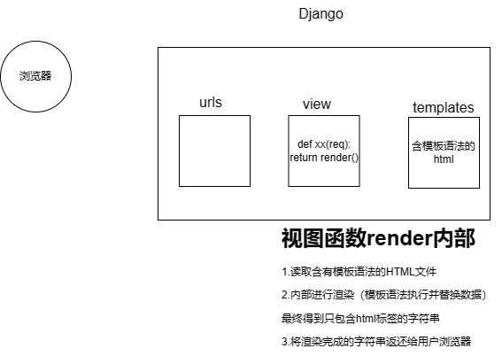
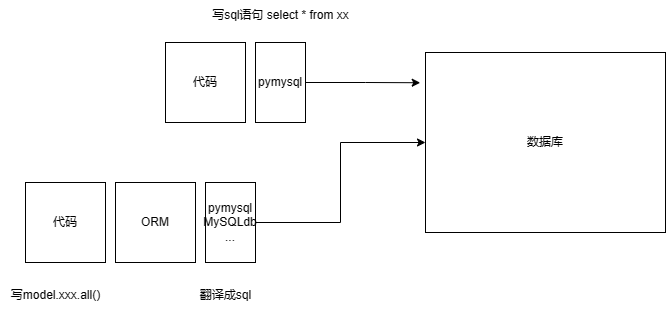
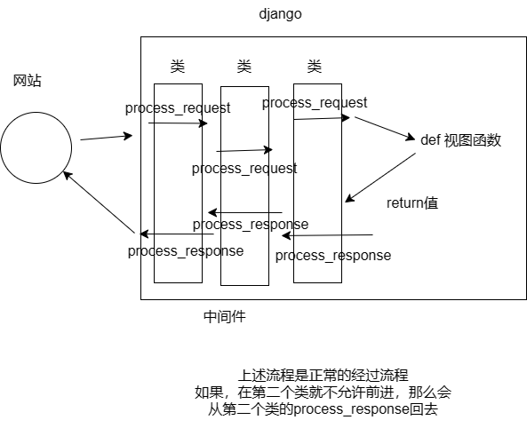

# django 基础

## 1.安装django

pip install django

安装django会出现两个

- django 框架源码
- django-admin.exe 工具，用于创建django项目中的文件和文件夹

## 2.创建项目

> django项目中会有一些默认的文件和默认的文件夹

在终端

- 打开终端

- 进入某个（项目）目录

- 执行命令创建项目

  > ...\django-admin.exe startproject 项目名称
  >
  > ```终端
  > django-admin startproject mysite
  > ```
  >
  > 

在pycharm

- 直接选择创建

> 特殊说明：
>
> - 命令行：创建的项目是标准的
> - pycharm，在标准的基础上默认加了东西
>   - templates目录
>   - setting.py文件中添加了东西
>

> 默认项目的文件介绍
>
> ```
> project_name
> 	manage.py		【项目的管理、启动项目、创建app、数据管理】
> 	project_name
> 		__init__.py
> 		settings.py	【项目配置文件】【经常操作】
> 		urls.py		【URL和函数的对应关系】【经常操作】
> 		asgi.py		【接收网络请求】【不要动】
> 		wsgi.py		【接受网络请求】【不要动】
> 
> ```
>

##  3.APP

```
-项目
	-app，用户管理【表结构，函数，html模板，css】
	-app，订单管理【表结构，函数，html模板，css】
	-app，网站【表结构，函数，html模板，css】
	。。。
	
	
注意：本项目比较简单，无需多app
```

创建app命令

```
python manage.py startapp app01
```

app目录文件介绍

```
app01
	-__init__.py
	-admin.py			【django默认提供了admin后台管理】
	-apps.py			【app启动类】
	migrations			【数据库变更记录】
		__init__.py
	models.py			【重要，对数据库操作（默认有个数据库）】
	tests.py			【单元测试，写业务不用】
	views.py			【重要，视图函数】
```

## 4.快速上手

下面必须确保

- app已经注册（不是创建

  ```python
  app01.apps.App01Config'
  ```

- 编写URL和视图函数的对应关系【urls.py中编写】

  - 先导入app的视图py
  - 后写入对应关系

- 编写视图函数【view.py】

- 启动

  - 命令行启动 python manage.py runserver
  - pycharm启动

### 4.1页面

需要写的内容（仅返回字符串

- url对应关系【urls.py】
- view.py视图函数编写【view.py】

仅返回字符串，仅仅使用HttpResponse("文本")

### 4.2templates

如果需要返回html文件

则需要返回 render(reqest,"xxx.html")

自动寻找templates目录下寻找


在视图函数中写的html文件

```
#1.首先去settings.py中的DIRS中寻找
#2.然后根据app的注册顺序去寻找templates
```

### 4.3静态文件

- 在开发过程中一般将：图片、css、js当作静态文件处理

- 静态文件默认在app里面的static中。
- 静态文件引入一般使用``

### 4.4 CBV和FBV

在Django中，视图(View)分为基于函数的视图（Function-Based Views，FBV）和基于类的视图（Class-Based Views，CBV）。这两种视图均用于处理请求和返回响应，但在组织代码和重用方面有所不同。以下是它们的调用和使用方法的对比：

#### 基于函数的视图 (FBV)

**定义和使用：**

FBV是最为简单直接的方式，它是一个Python函数，接收一个`HttpRequest`对象并返回一个`HttpResponse`对象。

示例代码：

```python
from django.http import HttpResponse
from django.shortcuts import render

def my_view(request):
    if request.method == 'POST':
        # 处理POST请求
        return HttpResponse('This is a POST request')
    else:
        # 处理GET请求
        return HttpResponse('This is a GET request')

# 在urls.py中配置URL：
from django.urls import path
from .views import my_view

urlpatterns = [
    path('my-view/', my_view, name='my_view'),
]
```

#### 基于类的视图 (CBV)

**定义和使用：**

CBV使用Python类实现视图，通过类的方法来处理请求。它提供了更好的代码组织和更灵活的重用性。

示例代码：

```python
from django.http import HttpResponse
from django.views import View

class MyView(View):
    def get(self, request):
        # 处理GET请求
        return HttpResponse('This is a GET request')

    def post(self, request):
        # 处理POST请求
        return HttpResponse('This is a POST request')

# 在urls.py中配置URL：
from django.urls import path
from .views import MyView

urlpatterns = [
    path('my-view/', MyView.as_view(), name='my_view'),
]
```

优缺点对比

| 特性           | 基于函数的视图 (FBV)                       | 基于类的视图 (CBV)                           |
| -------------- | ------------------------------------------ | -------------------------------------------- |
| **代码简洁性** | 简单直观，适合小型和简单的视图逻辑         | 代码相对复杂，但有助于组织和重用逻辑         |
| **重用性**     | 困难，需要手工重用代码                     | 通过继承和Mixin机制实现代码重用              |
| **类继承**     | 不适用                                     | 支持类的继承，有利于构建复杂的视图层次结构   |
| **装饰器使用** | 可直接使用Django提供的函数装饰器           | 需要使用`method_decorator`将装饰器应用于方法 |
| **可读性**     | 对简单和单一功能的视图，易于理解           | 对于复杂逻辑，类结构有助于分离职责和逻辑     |
| **扩展性**     | 扩展能力有限，复杂逻辑需要更多的代码和方法 | 提供更多可扩展的框架，支持多种Pre-build功能  |


- **FBV**适合简单的小型应用模块，快速实现简单功能。
- **CBV**适合需要多功能、复杂逻辑的大型项目，可以通过面向对象的特性来组织和简化视图代码。

根据项目的特定需求和复杂性，合理选择使用FBV或CBV，以提高开发效率和代码的可维护性。


<br>

## 5.模板语法

本质上：在HTML中写一些占位符，由数据对这些占位符进行替换和处理

这个是django开发的模板语法


模板语法

- 变量`{{}}`
- 循环` `
- 条件`  `

- 其他注意事项：
  - 在模板中，列表元素通过.来访问，而不是[]




## 6.请求和响应

三个响应

- 返回字符串 HttpResponse

- 返回html内容 render(request,'xx.html',{:})

- 返回重定向地址 redirect('https://')

  > 关于重定向，其实django是告诉浏览器目的地址，从而让浏览器自行去访问，而不是django请求目的地址得到html返回给浏览器


请求相关

- 获取请求方式 request.method
- 在URL上传递值，接受这个参数 request.GET
- 获取POST请求的所有参数 request.POST

## 7.数据库操作

可以使用的方法

- mysql数据库+pymysql
- django开发操作数据库，可以通过内部的ORM框架（而不是通过pymysql）




需要安装第三方模块

pip install mysqlclient

### 7.1 ORM

ORM 可以帮助我们做两件事：

- 创建、修改、删除数据库中的表（不用自己写sql语句）【无法创建数据库】
- 操作表中的数据（不用写sql语句）

#### 7.1.1自己创建数据库

- 启动mysql服务
- 自导创建数据库

#### 7.1.2django连接数据库

在settings.py中进行配置和修改

#### 7.1.3django操作表

操作表可以分成

- 创建表
- 删除表
- 修改表

上述操作应该在models.py文件中

创建表步骤如下：

注意：app需要事先注册，否则不会提交数据库

1.model.py文件中创建类

```python
# Create your models here.
class UserInfo(models.Model):
    name = models.CharField(max_length=32)
    password = models.CharField(max_length=64)
    age = models.IntegerField()


"""
创建了上述类，可以帮助生成下面的语句
create table app01_userinfo(
    id bigint auto_crement primary key,
    name varchar(32),
    passwrod varchar(64),
    age int)
"""
```

2. 运行两条指令（正式创建数据库表
   1. 生成迁移文件 python manage.py makemigrations
   2. 应用迁移文件 python manage.py migrate

对于数据库表的删除字段和删除表，可以对类直接注释，但是如果是在类中进行字段添加，需要有一定的限制（下面有三种选择）

- 命令行设置所有值（手动写
- 添加默认值（代码default
- 可以为空（null = True

> 综上所述，如果想对表结构进行跳跳转
>
> - 在models.py文件中操作类
> - 在执行两条命令

#### 7.1.4django操作表中数据

```python
from app01.models import Department,UserInfo
def orm(request):

#1.下面六条即为添加
    # Department.objects.create(title="销售部")
    # Department.objects.create(title="IT部")
    # Department.objects.create(title="运营部")
    # UserInfo.objects.create(name="zhu",password="123")
    # UserInfo.objects.create(name="zhu",password="123")
    # UserInfo.objects.create(name="zhu",password="123")

#2.下面为删除,先筛选后删除
    UserInfo.objects.filter(id=3).delete()
    Department.objects.all().delete()

#3.下面为获取数据
    #data_list = {行，行，行} data_list获取的是QuerySet类型
    data_list = UserInfo.objects.all() #相当于select * from
    for obj in data_list:
        print(obj.id,obj.name,obj.password)

    data_list2  = UserInfo.objects.filter(id=1)
    row_obj = data_list2.first()
    print(row_obj.id,row_obj.name,row_obj.password)


#4.更新数据
    UserInfo.objects.all().update(password = 999)
    UserInfo.objects.filter(id=2).update(password = 999)
    UserInfo.objects.filter(name = "朱弘飞").update(age=999)


    return HttpResponse("成功")
```

通过上述内容可以看出，QuerySet对象可以自动动态的修改数据表中的数据

> ### 执行 SQL 语句
>
> - 当你定义一个 `QuerySet`（例如通过 `UserInfo.objects.filter(name="朱弘飞")`），你实际上是在构建一个 SQL 查询，但这个查询在这一刻还没有被执行。`QuerySet` 是懒惰的，它仅在需要评估结果（如迭代、访问元素、调用 `.count()`、`.update()` 等）时才真正执行对应的 SQL 语句。
> - 特定的操作，如 `.update()` 和 `.delete()`，会立即执行相应的 SQL `UPDATE` 或 `DELETE` 语句来修改数据库中的数据，而不需要将数据加载到 Python 内存中。


###  7.2  数据库关联

在 Django 中，数据模型的关联关系主要包括以下几种：

1. **一对多关系（Many-to-One）：**
   - 使用 `ForeignKey` 实现。
   - 一个对象与多个对象相关，但多个对象只能与一个对象关联。
2. **多对多关系（Many-to-Many）：**
   - 使用 `ManyToManyField` 实现。
   - 一个对象可以与多个对象关联，多个对象也可以与一个对象关联。
3. **一对一关系（One-to-One）：**
   - 使用 `OneToOneField` 实现。
   - 一个对象与另一个对象相互唯一关联。

#### 7.2.1 一对多关系

在一对多关系中，一个对象可以与多个对象相关，但多个对象只能与一个对象关联。比如，一个客户可以下多个订单。

**示例：客户和订单**

```
pythonCopy code# app/models.py
from django.db import models

class Customer(models.Model):
    name = models.CharField(max_length=100)

    def __str__(self):
        return self.name

class Order(models.Model):
    customer = models.ForeignKey(Customer, on_delete=models.CASCADE)
    order_date = models.DateField()

    def __str__(self):
        return f"Order for {self.customer} on {self.order_date}"
```

**解释：**

- `customer` 字段是 `ForeignKey`，实现了多对一关系。
- `on_delete=models.CASCADE` 表示当关联的 `Customer` 被删除时，相关的 `Order` 也将被删除。

**数据操作：**

```
pythonCopy code# 创建一个客户
customer = Customer.objects.create(name="John Doe")

# 创建多个订单
order1 = Order.objects.create(customer=customer, order_date="2024-05-01")
order2 = Order.objects.create(customer=customer, order_date="2024-05-02")

# 获取客户的所有订单
orders = Order.objects.filter(customer=customer)
print([order.order_date for order in orders])  # 输出: ['2024-05-01', '2024-05-02']
```

#### 7.2.2 多对多关系

在多对多关系中，一个对象可以与多个对象关联，多个对象也可以与一个对象关联。比如，一个学生可以选修多门课程，每门课程也可以有多名学生。

**示例：学生和课程**

```
pythonCopy code# app/models.py
from django.db import models

class Student(models.Model):
    name = models.CharField(max_length=100)

    def __str__(self):
        return self.name

class Course(models.Model):
    name = models.CharField(max_length=100)
    students = models.ManyToManyField(Student, related_name='courses')

    def __str__(self):
        return self.name
```

**解释：**

- `students` 字段是 `ManyToManyField`，实现了多对多关系。
- `related_name` 定义了反向查询的名称，可以通过 `student.courses.all()` 获取学生的所有课程。

**数据操作：**

```
pythonCopy code# 创建多个学生
alice = Student.objects.create(name="Alice")
bob = Student.objects.create(name="Bob")

# 创建一门课程
course1 = Course.objects.create(name="Math 101")

# 将学生添加到课程
course1.students.add(alice, bob)

# 获取课程的所有学生
students = course1.students.all()
print([student.name for student in students])  # 输出: ['Alice', 'Bob']

# 获取学生的所有课程
courses = alice.courses.all()
print([course.name for course in courses])  # 输出: ['Math 101']
```

#### 7.2.3一对一关系

在一对一关系中，一个对象与另一个对象相互唯一关联。比如，一个用户可以有一个唯一的用户档案。

**示例：用户和用户档案**

```
pythonCopy code# app/models.py
from django.db import models

class User(models.Model):
    name = models.CharField(max_length=100)

    def __str__(self):
        return self.name

class UserProfile(models.Model):
    user = models.OneToOneField(User, on_delete=models.CASCADE)
    address = models.CharField(max_length=200)
    phone_number = models.CharField(max_length=15)

    def __str__(self):
        return f"Profile of {self.user}"
```

**解释：**

- `user` 字段是 `OneToOneField`，实现了一对一关系。
- `on_delete=models.CASCADE` 表示当关联的 `User` 被删除时，相关的 `UserProfile` 也将被删除。

**数据操作：**

```
pythonCopy code# 创建一个用户
user = User.objects.create(name="Jane Doe")

# 创建关联的用户档案
profile = UserProfile.objects.create(user=user, address="456 Elm Street", phone_number="987-654-3210")

# 获取用户的档案
print(profile.address)  # 输出: '456 Elm Street'
print(user.userprofile.phone_number)  # 输出: '987-654-3210'
```

#### 7.2.4 总结

1. **一对多关系（Many-to-One）：**
   - 使用 `ForeignKey`。
   - 适用于如客户与订单、作者与书籍的关系。
2. **多对多关系（Many-to-Many）：**
   - 使用 `ManyToManyField`。
   - 适用于如学生与课程、演员与电影的关系。
3. **一对一关系（One-to-One）：**
   - 使用 `OneToOneField`。
   - 适用于如用户与档案、员工与工位的关系。

#### 7.2.5 其他相关关系

- **自关联：**
  - 一个模型与自身关联，比如树形结构中的父子节点关系。
  - 使用 `ForeignKey` 或 `ManyToManyField` 实现。
- **抽象基类：**
  - 允许创建一个共享字段和方法的抽象模型类，子类继承它们。
  - 使用 `abstract = True`。
- **多表继承：**
  - 子类继承父类模型的字段并具有自己的独立表。
  - 使用 `Multi-table inheritance`。

模型之间的关联不仅可以发生在同一个文件或应用中，还可以跨应用关联，这通常称为**跨文件关联**。主要的关联方式仍然是使用 `ForeignKey`、`OneToOneField` 和 `ManyToManyField`。它们与在同一个应用中的关联方式几乎完全相同。


## 8.身份认证

###  8.1 介绍 

身份认证是验证用户身份的过程，确保用户是他们所声称的那个人。在Web应用程序中，身份认证通常涉及以下几个步骤：

1. **用户输入凭据**：
   - 用户使用用户名/密码组合、OAuth令牌或其他形式的凭据登录。

2. **验证凭据**：
   - 应用服务器检查用户提交的凭据是否与其数据库中存储的数据匹配。

3. **创建会话或令牌**：
   - 验证成功后，服务器通常会创建一个会话，或生成一个JWT（JSON Web Token）或其他令牌，以标识用户。这个令牌会在后续请求中用于验证用户身份。

4. **访问控制**：
   - 根据用户的身份及其权限等级，决定是否允许访问特定资源或功能。


使用场景

- **Web应用登录**：
  - 用户通过身份认证登录到电商网站、社交媒体或企业应用。

- **API访问**：
  - 使用API密钥或OAuth令牌进行身份认证，保障API资源的安全。

- **企业级应用**：
  - 结合LDAP、SAML等方案，实现复杂的企业用户认证和单点登录（SSO）。


Django中的身份认证

在Django中，身份认证是通过`django.contrib.auth`模块进行管理的，其中包括：

- **用户模型（User Model）**：用于存储用户信息和凭据。
- **认证后端（Authentication Backends）**：处理凭据验证的逻辑，实现自定义认证方案。
- **中间件**：自动管理用户登录状态和会话。
- **装饰器和权限系统**：控制视图访问权限，确保只有授权用户能够访问。

Django还支持集成第三方认证机制，如社会化登录（例如Google、Facebook登录）和第三方身份提供商的OAuth或OpenID连接。这些机制通常需要第三方库如`django-allauth`或`social-auth-app-django`。这些扩展大大简化了集成多种身份认证方法的过程。

<br>

### 8.2 身份验证vs表单验证

身份认证和表单验证虽然都涉及用户数据的处理，但它们的目的、流程和作用略有不同。

#### 表单验证

**目的**：

- 确保用户提交的表单数据符合预期格式和要求。

**流程**：
1. 用户提交表单数据。
2. 服务器端进行验证，检查数据类型（如字符串、数字等）以及格式（如电子邮件格式、电话号码格式）。
3. 验证通过：数据被进一步处理（如存储到数据库）。
4. 验证失败：表单返回错误，用户需进行修改。

**作用**：
- 保证数据完整性及安全性，防止错误或恶意输入（如SQL注入）。

#### 身份认证

**目的**：
- 确认用户的身份，确保他们有权访问系统中的资源或功能。

**流程**：
1. 用户提交凭据（如用户名和密码）。
2. 服务器查验凭据与存储信息是否匹配。
3. 匹配成功：创建会话或令牌，用户被识别为已登录。
4. 匹配失败：拒绝访问，并可能要求重新输入凭据。

**作用**：
- 确保系统资源和信息的安全，防止未经授权的访问。

#### 相似性和差异

**相似性**：

- 两者都涉及用户提交的数据。
- 都需要对输入进行验证检查。
- 在Web应用中都依赖后端逻辑处理。

**差异**：
- 表单验证专注于检查字段的格式和完整性，身份认证专注于验证用户身份。
- 表单验证通常是身份认证的前一道关卡（确保凭据格式正确），但身份验证包含逻辑更为复杂。（检查凭据与系统信息是否匹配）

虽然身份认证涉及表单数据，但它的目标和工作流程超出了单纯验证数据的正确性，强调用户身份的合法性和安全性。

当然！以下是身份认证和表单验证在使用场景以及Django中的实现方式的对比表格：

| 特性           | 身份认证                                          | 表单验证                                           |
| -------------- | ------------------------------------------------- | -------------------------------------------------- |
| **目的**       | 验证用户身份，确保用户是其声称的对象              | 验证表单输入的正确性和格式完整性                   |
| **使用场景**   | 用户登录、权限管理、API访问控制                   | 用户注册、信息提交、数据输入校验                   |
| **Django实现** | - 使用`django.contrib.auth`模块                   | - 使用`django.forms`模块                           |
|                | - 使用默认用户模型或自定义用户模型                | - 定义自定义的表单类，包含字段及其验证逻辑         |
|                | - 认证后端（如LDAP、OAuth）                       | - 使用内置验证器或自定义验证器进行字段验证         |
|                | - 使用中间件管理用户会话和身份状态                | - 表单类负责整个验证逻辑，通常在视图中使用         |
| **成功结果**   | 创建会话或返回JWT令牌，完成身份认证，提供访问权限 | 数据验证通过，通常会继续被保存或处理，如存入数据库 |
| **失败结果**   | 拒绝访问，返回身份认证错误信息                    | 返回错误信息，要求用户修改其输入并重新提交         |
| **相关组件**   | - 用户模型（User Model）                          | - Form类与ModelForm类                              |
|                | - 认证后端、权限装饰器和中间件                    | - 各种字段验证器及自定义验证逻辑                   |
| **安全性**     | 保护敏感资源及数据，防止未经授权的访问            | 保证数据输入的完整性和正确性，避免恶意输入或错误   |

这张表格清晰地展示了身份认证和表单验证在使用目的、应用场景和Django实现方式上的不同之处。通过理解这些，可以更好地针对不同需求选择合适的技术实现。

### 8.3 身份认证和权限控制

身份认证和权限控制在Django中是息息相关但又有所不同的两部分。以下是两者的详细区别和联系：

#### 身份认证

**身份认证（Authentication）**：指的是确认用户的身份。主要关注的是“你是谁”。

**Django中的实现**：

- Django提供了`django.contrib.auth`模块用于处理用户的身份认证。
- 用户需要输入用户名和密码来验证自己的身份。
- 认证成功后，通常会创建一个用户会话或JWT令牌以维持用户的登录状态，确保只有经过身份认证的用户才能执行特定操作或访问某些页面。

**场景**：

- 用户登录时，系统检查凭据是否匹配。
- 对于需要确保用户身份的API请求，每个请求都可能需要用户认证信息。

#### 权限控制

**权限控制（Authorization）**：是在身份认证之后进一步确认用户可以做什么。主要关注的是“你可以做什么”。

**Django中的实现**：
- 使用权限系统来定义不同用户或用户组能够访问哪些资源和执行哪些操作。
- Django内置了一个权限系统与用户模型关联，可以为用户分配组和特定的权限。
- 可以使用Django的`@permission_required`装饰器或者`PermissionRequiredMixin`类来保护特定视图，使得只有具有特定权限的用户才能访问这些视图。

**场景**：
- 在管理后台界面，只有管理员用户可以添加或删除其他用户。
- 在博客平台中，普通用户可以创建和编辑自己的文章，但只有具有编辑作者权限的用户可以审核和发布其他用户的文章。

#### 联系与整合

1. **先身份认证，后权限控制**：
   - 一个用户必须首先被认证（通过登录或其他方式确认身份），然后其权限才会被检查以确认其是否有权访问某些资源。

2. **权限基于身份**：
   - 用户的权限是附加在其身份上的，即在认证其身份后，系统会根据其身份分配的权限来授予或拒绝访问。

3. **统一管理**：
   - Django通过`django.contrib.auth`模块整合了身份认证和基本的权限管理，使得开发者可以较为轻松地维护应用的安全性。

通过理解身份认证和权限控制的区别与联系，可以更有效地设计安全可靠的Web应用，确保只让合适的人访问合适的资源。这个体系在Django中被高度集成并且可扩展，以满足各种复杂应用的需求。


### 8.4 身份认证的实现

当然，我可以通过表格的形式来比较Django身份认证中的`auth`和中间件在实现身份认证时的优缺点。

| 特点           | Django `auth`                                                | Django 中间件                                                |
| -------------- | ------------------------------------------------------------ | ------------------------------------------------------------ |
| **概述**       | `auth` 是Django内置的身份认证系统，提供标准且安全的方法进行用户验证、登录、登出等功能。 | 中间件是Django请求处理过程的一部分，可以自定义认证逻辑。     |
| **使用便捷性** | 非常简便，提供一整套的认证和权限管理功能，只需简单配置即可使用。 | 需要自定义中间件，增加一定的复杂性，适合于需要复杂条件和额外处理的场景。 |
| **安全性**     | 经过社区长期验证，安全机制较为健全，默认采用哈希密码存储等安全策略。 | 取决于自定义实现，安全性由开发人员负责，容易出错。           |
| **灵活性**     | 提供基本和大多数常用的功能，支持扩展但需要遵循一定的接口。   | 高度灵活，可以完全根据需求自定义处理流程，但实现相对复杂。   |
| **配置难度**   | 较低，只需配置认证后端和使用现有视图或表单即可。             | 较高，需要编写自定义中间件类以及处理请求和响应。             |
| **维护难度**   | 较低，由于`auth`模块被广泛使用和测试，问题较少。             | 较高，自定义实现可能导致可维护性差，需要进行大量的测试。     |
| **适用场景**   | 适用于大多数Web应用的标准用户认证需求，如用户登录、注册。    | 适合需要复杂的请求处理逻辑、额外验证步骤或多种认证方式结合的场景。 |
| **性能影响**   | 标准实现效率较高，对性能影响较小。                           | 如果实现不当，可能对请求处理性能有一定影响。                 |


- **使用 Django `auth`**:
  - 比较适合于常规项目，可以快速集成并提供良好的安全保障。
  - 在不需要特殊处理的情况下优先使用，因其稳定性和社区支持。

- **使用 Django 中间件**:
  - 如果你的项目具有特殊的认证需求，中间件提供了灵活性，可以在请求的各个阶段进行自定义处理。
  - 适用于需要预处理请求或需要支持多种认证流的环境，但需注意安全和维护成本。

根据项目的具体需求选择合适的身份认证方案，可以提升开发效率并确保安全性和可维护性。


<br>

#### 8.4.1 auth模块

​	`django.contrib.auth`模块是Django内置的身份认证系统。这一模块实现了一整套用户身份验证和权限管理功能，非常适合开发中小型Web应用。

常见功能

1. **用户管理**：
   - 用户创建、更新、删除。
   - 用户分组及权限管理。
   - 超级用户（管理员）和普通用户的区分。

2. **身份验证**：
   - 提供用于认证用户的功能（如登录和登出）。
   - 支持会话管理系统。

3. **密码管理**：
   - 提供安全的密码加密和验证方法。
   - 提供密码重设等功能。

4. **权限管理**：
   - 基于用户和组的权限系统。
   - 可以限制用户执行特定操作的权限。

##### 常用的组件和方法

1. `User` 模型

**功能**:

- Django内置的用户模型，用于存储和管理用户信息。

**常用字段**:

- `username`: 用户名，唯一标识。
- `password`: 加密存储的密码。
- `email`: 用户电子邮件。
- `is_staff`: 是否具有管理员权限。
- `is_active`: 用户是否处于活跃状态。
- `is_superuser`: 是否为超级用户，拥有所有权限。

**常用方法**:
- `create_user(username, password=None, **extra_fields)`: 创建一个新用户并将其保存到数据库中。

- `set_password(raw_password)`: 设置用户的密码，自动处理哈希运算。
  
- `check_password(raw_password)`: 验证布贸or密码是否与存储的哈希密码匹配。

**示例**:
```python
from django.contrib.auth.models import User

# 创建一个用户
user = User.objects.create_user(username='john', password='secret', email='john@example.com')

# 验证密码
if user.check_password('secret'):
    print("Password is correct!")

# 设置新密码
user.set_password('new_password')
user.save()
```

2. `authenticate()` 方法

**功能**:
- 验证提供的用户名和密码是否正确。

**实现机制**:
- 搜索匹配的用户并检查密码。
- 调用时可能需要传递`request`对象和关键词参数。

**示例**:
```python
from django.contrib.auth import authenticate

user = authenticate(username='john', password='secret')
if user is not None:
    print("Authenticated successfully!")
else:
    print("Authentication failed.")
```

3. `login()` 方法

**功能**:
- 将用户标记为已登录，并建立会话。
  

**实现机制**:

- 通过Django的会话框架管理用户会话。

**示例**:
```python
from django.contrib.auth import login

def user_login(request):
    username = request.POST.get('username')
    password = request.POST.get('password')
    user = authenticate(request, username=username, password=password)
    if user is not None:
        login(request, user)  # 开启用户会话
        return redirect('home')
    else:
        print("Invalid login attempt")
```

4. `logout()` 方法

**功能**:
- 注销用户并结束会话。

**实现机制**:
- 清除当前用户的会话数据。

**示例**:
```python
from django.contrib.auth import logout

def user_logout(request):
    logout(request)
    return redirect('home')
```

5. `@login_required` 装饰器

**功能**:
- 限制视图函数只能被已登录用户访问。

**实现机制**:
- 如果用户未登录，自动重定向到登录页面。

**示例**:
```python
from django.contrib.auth.decorators import login_required

@login_required
def protected_view(request):
    return render(request, 'protected.html')
```

<br>


##### 不常用的组件和方法

1. Permissions and Groups

- **Permissions**:

  **功能**:
  - 设置和检验用于访问不同功能和资源的权限。
  
  **示例**:
  ```python
  user.has_perm('app_label.permission_codename')
  ```

- **Groups**:

  **功能**:
  - 将用户分组，并为组赋予权限以简化权限管理。

  **示例**:
  ```python
  from django.contrib.auth.models import Group
  
  # 创建一个新的用户组
  editors_group, created = Group.objects.get_or_create(name='Editors')
  
  # 将用户加入该组
  user.groups.add(editors_group)
  ```

2. 自定义用户模型

- **AbstractUser**:

  **功能**:
  - 对内置用户模型的简单扩展。
  
  **使用场景**:
  - 添加额外字段，如年龄、地址等，同时保留密码和会话管理。
  
  **示例**:
  ```python
  from django.contrib.auth.models import AbstractUser

  class CustomUser(AbstractUser):
      bio = models.TextField(blank=True, null=True)
  ```

- **AbstractBaseUser**:

  **功能**:
  - 更灵活的基类，允许完全自定义用户模型，需自行实现用户名字段唯一性和身份验证方法。

  **示例**:
  ```python
  from django.contrib.auth.models import AbstractBaseUser, BaseUserManager
  
  class CustomUserManager(BaseUserManager):
      def create_user(self, email, password=None, **extra_fields):
          email = self.normalize_email(email)
          user = self.model(email=email, **extra_fields)
          user.set_password(password)
          user.save(using=self._db)
          return user
  
  class CustomUser(AbstractBaseUser):
      email = models.EmailField(unique=True)
      USERNAME_FIELD = 'email'
      objects = CustomUserManager()
  ```

3. 信号 (Signals)

**功能**:
- 监控用户登录事件。
  

**常用信号**:
- `user_logged_in`, `user_logged_out`, `user_login_failed`.

**示例**:
```python
from django.contrib.auth.signals import user_logged_in
from django.dispatch import receiver

@receiver(user_logged_in)
def on_user_logged_in(sender, request, user, **kwargs):
    print(f"{user.username} has logged in.")
```


<br>

##### auth基本使用流程

以下是一般使用Django身份认证系统的标准流程。

###### 1. 设置和配置

确保项目中已经包含`django.contrib.auth`模块，且在`settings.py`的`INSTALLED_APPS`中已激活。

###### 2. 用户模型

- Django默认的用户模型可以满足大多数基本需求，但如果有特殊需求，可以扩展或替代默认的用户模型。
- 对用户模型的操作，例如创建用户、检查用户密码等，通过Django的`User`模型来进行。

###### 3. 用户注册和认证

- **用户注册**：通常你需要允许用户自己注册账户。这可以通过创建一个自定义视图处理用户输入的注册信息。
- **登录和登出**：使用Django内置的视图函数`auth.views.LoginView`和`auth.views.LogoutView`简单实现登录和登出功能。

###### 4. 实现登录视图

下面是如何用Django实现一个简单的登录视图：

```python
from django.shortcuts import render, redirect
from django.contrib.auth import authenticate, login
from django.contrib import messages

def user_login(request):
    if request.method == 'POST':
        username = request.POST.get('username')
        password = request.POST.get('password')
        user = authenticate(request, username=username, password=password)
        if user is not None:
            login(request, user)
            return redirect('home')
        else:
            messages.error(request, 'Invalid username or password.')
    return render(request, 'accounts/login.html')
```

###### 5. 授权管理

基于权限的访问控制可以通过给用户分配权限或分组来实现。在视图中，你可以使用装饰器或者类来检查用户权限：

- 使用装饰器`@login_required`确保视图只能被认证用户访问。
- 使用装饰器`@permission_required`确保用户具有特定权限。

###### 6. 登出功能

使用Django的`logout`函数来实现用户登出功能：

```python
from django.contrib.auth import logout

def user_logout(request):
    logout(request)
    return redirect('home')
```

> 为什么Django的auth系统有效
>
> 1. **安全性**：
>    - 使用安全的密码存储方法（例如加盐的散列）。
>    - 内置防护策略（如CSRF保护）和会话管理机制。
>
> 2. **易用性**：
>    - 提供现成的类和函数，可以很容易定制。
>    - 管理后台带有强大的用户和权限管理界面。
>
> 3. **集成性**：
>    - 自带应用能与Django其他功能无缝集成，比如中间件、模板系统等。
>


Django的auth系统提供了一个全面且可扩展的框架来管理用户认证和权限控制。在此基础上，你可以根据需求增加自定义功能，使得Web应用的用户管理变得既安全又高效。了解其基本流程对开发更复杂的认证机制至关重要。


### 8.5 身份认证的应用


**故事背景**

小明是一位业余摄影师，他热爱在网上分享他的摄影作品。为了展示和销售他的作品，小明决定创建一个线上博客网站。这个网站不仅允许小明上传和管理他的照片，还提供一个商城功能，让访问者可以购买他的作品。为了保护他的作品并确保只有他才能管理这些内容，身份认证成为了网站必要的功能之一。

**需求场景**

小明的网站需要一个用户账户系统，通过它能够区分普通访问者和他这个管理员。普通访问者可以浏览和购买照片，而小明需要拥有更高权限的管理员账户，以便能够：

1. 登录后台上传、编辑或删除照片。
2. 查看购买订单和发货管理。
3. 管理访问者的评论和留言。

为了使得这个账户系统不仅便利，还有助于保护小明的作品，网站需要实现严格的身份认证机制。

**为何需要身份认证**

- **保护管理功能**：小明是唯一的管理员，他需要通过身份认证来防止其他人未经授权地访问管理员功能。
- **个性化用户体验**：提供给用户的个性化视图，使管理员看到不同于普通访问者的界面。
- **保障安全交易**：确保支付和订单信息被妥善保护，避免数据被盗用。

Django身份认证实现

为了满足这个需求，小明的网站使用Django内置的身份认证系统。以下是实现的关键步骤示例：

1. **用户登录视图**

   小明的网站需要一个登录页面，只有通过正确的邮箱和密码认证后，才能访问管理员后台：

   ```python
   from django.shortcuts import render, redirect
   from django.contrib.auth import authenticate, login
   from django.contrib import messages

   def admin_login(request):
       if request.method == 'POST':
           email = request.POST.get('email')
           password = request.POST.get('password')
           user = authenticate(request, username=email, password=password)
           if user is not None and user.is_staff:  # 确保是管理员账户
               login(request, user)
               return redirect('admin_dashboard')  # 重定向到管理员后台
           else:
               messages.error(request, 'Invalid credentials or you do not have permission.')
       return render(request, 'accounts/login.html')
   ```

2. **URL配置**

   配置使得登录页面可以通过访问特定的URL：

   ```python
   from django.urls import path
   from . import views

   urlpatterns = [
       path('login/', views.admin_login, name='admin_login'),
   ]
   ```

3. **用户角色配置**

   在用户管理系统中，确保小明的账户具备管理员权限（`is_staff=True`），以便他能够通过身份认证访问管理功能。


### 8.6 auth认证 vs drf认证

当然可以！以下是对 Django `auth` 系统和 DRF `authentication` 系统的更详细描述和比较，包括它们的定义、适用场景、优缺点、使用示例等。

#### 1. 定义

- **Django `auth` 系统**：
  Django 提供了一个内置的用户认证系统，用于用户管理、权限控制和用户会话管理。它支持基本的用户注册、登录、注销、密码管理等功能。

- **DRF `authentication` 系统**：
  Django Rest Framework 提供了多种认证机制，专门为 RESTful API 设计。它支持多种认证方法，如 Token 认证、Session 认证、Basic 认证、JWT 认证等，方便 API 的用户身份验证。

#### 2. 适用场景

- **Django `auth` 系统**：
  - 适用于传统的 Web 应用。
  - 用于需要用户登录、注销和会话管理的场景。
  - 适合那些使用 Django 的模板系统进行页面渲染的项目。

- **DRF `authentication` 系统**：
  - 适用于 RESTful API。
  - 用于需要提供用户身份验证的 API 接口。
  - 适合前后端分离的项目，尤其是需要跨域请求的场景。

#### 3. 返回形式

- **Django `auth` 系统**：
  - 通常通过 `request.user` 来访问当前登录的用户对象。
  - 返回的是 `User` 对象，包含用户的所有信息。

- **DRF `authentication` 系统**：
  - 通过认证类返回用户对象，返回值可以是 `User` 对象或 `None`（如果未认证）。
  - 可以通过 `request.user` 访问当前用户。

#### 4. 优缺点

| 特性     | Django `auth` 系统                                           | DRF `authentication` 系统                                    |
| -------- | ------------------------------------------------------------ | ------------------------------------------------------------ |
| **优点** | 1. 内置于 Django，使用简单 <br> 2. 提供全面的用户管理和权限控制 | 1. 支持多种认证方式 <br> 2. 更灵活，适应不同 API 需求        |
| **缺点** | 1. 主要支持 session 认证，不适合 API <br> 2. 不适合跨域请求  | 1. 需要配置，增加复杂性 <br> 2. 不同认证方式的实现可能较繁琐 |

#### 5. 使用示例

**Django `auth` 系统 示例：**

这是一个基本的登录视图，用户通过表单提交用户名和密码，进行认证。

```python
from django.contrib.auth import authenticate, login
from django.shortcuts import render, redirect

def my_login_view(request):
    if request.method == 'POST':
        username = request.POST['username']
        password = request.POST['password']
        user = authenticate(request, username=username, password=password)
        if user is not None:
            login(request, user)
            return redirect('home')  # 重定向到主页
        else:
            return render(request, 'login.html', {'error': 'Invalid credentials'})
    return render(request, 'login.html')
```

**DRF `authentication` 系统 示例：**

这是一个使用 Token 认证的 API 视图，只有经过身份验证的用户才能访问。

```python
from rest_framework.views import APIView
from rest_framework.response import Response
from rest_framework.authentication import TokenAuthentication
from rest_framework.permissions import IsAuthenticated

class MyProtectedView(APIView):
    authentication_classes = [TokenAuthentication]  # 使用 Token 认证
    permission_classes = [IsAuthenticated]  # 只有认证用户才能访问

    def get(self, request):
        content = {'message': 'Hello, {}'.format(request.user.username)}
        return Response(content)
```

在 Django 中，DRF 认证返回的用户（`request.user`）和 Django `auth` 系统中的用户（`django.contrib.auth.models.User`）实际上是同一个用户对象。这是因为 DRF 认证系统是基于 Django 的 `auth` 系统构建的。

1. **用户模型**：
   - Django 的 `auth` 系统使用 `User` 模型来表示用户。该模型包含用户的基本信息（如用户名、密码、电子邮件等）。
2. **DRF 认证**：
   - 当使用 DRF 的认证机制（如 Token 认证或 Session 认证）时，认证过程会将请求的用户信息解析为 `User` 对象。
   - 通过 `request.user` 可以访问当前认证的用户，该对象是 Django `auth` 系统中的同一个 `User` 实例。

Django `auth` 系统和 DRF `authentication` 系统各自针对不同的应用场景提供了认证机制。Django `auth` 更适合传统 Web 应用，而 DRF `authentication` 则为 RESTful API 提供了灵活的认证方式。根据项目需求，开发者可以选择合适的认证机制。

<br>


### 8.6 其他


#### 自定义用户模型

如果需要自定义存储用户数据，可以通过自定义用户模型来实现，Django提供了扩展及替换默认用户模型的灵活性。以下是自定义用户模型的一般步骤：

步骤一：自定义用户模型

1. **使用`AbstractUser`扩展**

   继承`AbstractUser`可以在保留现有功能的基础上拓展字段。

   ```python
   from django.contrib.auth.models import AbstractUser
   from django.db import models

   class CustomUser(AbstractUser):
       # 添加自定义字段
       bio = models.TextField(blank=True, null=True)
       birth_date = models.DateField(null=True, blank=True)
   ```

2. **使用`AbstractBaseUser`创建全新用户模型**

   如果需要完全自定义，可以继承`AbstractBaseUser`，同时需要指定`UserManager`。

   ```python
   from django.contrib.auth.models import AbstractBaseUser, BaseUserManager
   from django.db import models
   
   class CustomUserManager(BaseUserManager):
       def create_user(self, email, password=None, **extra_fields):
           if not email:
               raise ValueError('The Email field must be set')
           email = self.normalize_email(email)
           user = self.model(email=email, **extra_fields)
           user.set_password(password)
           user.save(using=self._db)
           return user
   
       def create_superuser(self, email, password=None, **extra_fields):
           extra_fields.setdefault('is_staff', True)
           extra_fields.setdefault('is_superuser', True)
           return self.create_user(email, password, **extra_fields)
   
   class CustomUser(AbstractBaseUser):
       email = models.EmailField(unique=True)
       name = models.CharField(max_length=50)
       USERNAME_FIELD = 'email'
       REQUIRED_FIELDS = ['name']
   
       objects = CustomUserManager()
   ```

步骤二：修改Django设置

- 在项目的`settings.py`中，将默认的用户模型替换为自定义模型。

  ```python
  AUTH_USER_MODEL = 'yourapp.CustomUser'
  ```

  - 这里 `yourapp` 是包含 `CustomUser` 模型的应用名称。

步骤三：应用迁移

- 确保数据库结构符合自定义用户模型的定义。

  ```bash
  python manage.py makemigrations
  python manage.py migrate
  ```

步骤四：使用自定义用户模型

- 在整个项目中始终使用 `get_user_model()` 来获取用户模型，不要直接引用 `User` 模型。

  ```python
  from django.contrib.auth import get_user_model
  
  User = get_user_model()
  ```

小结

- **扩展用户模型**: 若仅需添加字段，推荐继承 `AbstractUser`。
- **重写用户模型**: 需要完全自定义身份认证的结构时，继承 `AbstractBaseUser`。
- **确保一致性**: 一旦定义自定义用户模型，应在整个项目中始终使用，以确保数据一致性和功能的正常运作。

利用自定义用户模型，你可以更好地适应项目的特定需求，同时保持与Django 的 `auth` 认证系统的完美集成。

<br>


#### create_user说明

在Django中，对于创建用户实例，`create_user`方法与`create`方法的区别主要在于安全性和功能性，特别是在处理用户密码时：

差异与原因

1. **密码哈希处理**:
   - **`create_user`**: 该方法会自动调用`set_password`来对用户的密码进行哈希处理。Django使用PBKDF2等安全的哈希算法来存储密码，以防止明文密码被存储。
   - **`create`**: 使用`create`方法时，密码不会自动哈希处理。传递给`create`的密码将直接以明文形式存储在数据库中，在大多数情况下，这会导致安全隐患。

2. **内置的额外逻辑**:
   - **`create_user`**: 除了处理密码外，还可能包含额外的用户相关初始化逻辑，比如设置默认值、信号发送等。
   - **`create`**: 主要功能是直接创建并保存数据库记录，适用于那些不需要额外处理的普通模型实例。

使用场景

- **`create_user`**: 应用于创建用户时，以确保密码安全且遵循用户模型创建的最佳实践。
- **`create`**: 用于创建不涉及到特殊处理逻辑的其他模型实例。

示例

在创建用户时应使用`create_user`方法：

```python
user = User.objects.create_user(username='john', password='secure_password', email='john@example.com')
```

这确保密码通过Django的密码哈希系统存储，确保安全性。

自定义扩展

如果你自定义了用户模型并实现自定义管理器，你仍然可以定义类似的方法：

```python
class CustomUserManager(BaseUserManager):
    def create_user(self, email, password=None, **extra_fields):
        if not email:
            raise ValueError('The Email field must be set')
        email = self.normalize_email(email)
        user = self.model(email=email, **extra_fields)
        user.set_password(password)
        user.save(using=self._db)
        return user
```

这里的`set_password`确保密码哈希化并安全存储。

#### @login_required默认登录url

在Django的`@login_required`装饰器中，重定向到登录页面的URL是通过Django的设置来确定的，主要通过`LOGIN_URL`和`LOGIN_REDIRECT_URL`进行配置。在默认情况下，如果你使用`@login_required`装饰器限制访问，Django会自动将未登录用户重定向到配置的登录页面。

确定登录页面的URL

1. **LOGIN_URL 设置**

   - `LOGIN_URL`是一个常量，你可以在你的Django项目的`settings.py`文件中配置它。
   - 它指定了未登录用户在访问需要登录的页面时将被重定向到的URL。

   ```python
   # settings.py

   LOGIN_URL = '/accounts/login/'  # 这里的URL是示例，请根据你的项目路径设置
   ```

2. **示例应用**

   在视图函数中使用`@login_required`装饰器：

   ```python
   from django.contrib.auth.decorators import login_required
   from django.http import HttpResponse

   @login_required
   def my_protected_view(request):
       return HttpResponse("You are logged in and can see this content!")
   ```

3. **默认行为**

   - 当一个未登录用户试图访问被`@login_required`修饰的视图时，Django会查找`settings.py`中的`LOGIN_URL`的值。
   - 如果未设置`LOGIN_URL`，Django将使用`/accounts/login/`作为默认值。
   - 要重定向到自定义登录页面，只需将`LOGIN_URL`设置为所需的登录页面的URL路径。

4. **LOGIN_REDIRECT_URL 设置**

   - 此设置指定了一旦登录成功后，用户将被重定向到的URL。
   - 默认情况下，这是`/accounts/profile/`，但可以在`settings.py`中更改。
   
   ```python
   # settings.py
   
   LOGIN_REDIRECT_URL = '/dashboard/'  # 登录成功后重定向的页面
   ```

通过配置`LOGIN_URL`和`LOGIN_REDIRECT_URL`，你可以灵活地控制未登录用户被重定向到哪个页面进行登录，以及登录成功后他们将被导向到哪个页面。确保将这些URL配置为与你项目的URL匹配的路径，以确保用户体验的顺畅。


<br><br><br><br><br>

# django项目

员工管理系统

## 1.新建项目

两个删除

- 删除原有template
- 删除setting的DIRs

## 2.创建app

1. app创建

```
 python manage.py startapp app名字
```

2. app注册(setting中)

​		'app02.apps.App02Config',

## 3.设计表结构

在models.py中进行设计下面两种表

- 部门表
- 员工表

根据上述设计，可以有以下问题

1. 用户表关联的部门表是名称？还是ID？

2. 用户表关联的属性是否需要约束？

3. 部门表中的部门被删除，关联的用户表相关的行如何处理？

   1. 方式一：删除用户（级联删除

   ```
    depart = models.ForeignKey(to="Department",to_field="id",on_delete=models.CASCADE)
   ```

   1. 方式二：置为空

   ```
   depart = models.ForeignKey(to="Department",to_field="id",null=True,blank=True,on_delete=models.SET_NULL)
   ```

   

``` python
from django.db import models

# Create your models here.


class Department(models.Model):
    """ 部门表 """
    # id = models.BigAutoField(verbose_name="ID",primary_key = True)
    title = models.CharField(verbose_name="标题",max_length=32)


class UserInfo(models.Model):
    """员工表"""
    name =models.CharField(verbose_name="姓名",max_length=16)
    password=models.CharField(verbose_name="密码",max_length=64)
    age = models.IntegerField(verbose_name="年龄")
    account = models.DecimalField(verbose_name="账户余额",max_digits=10,decimal_places=2,default=0)
    create_time = models.DateTimeField(verbose_name="入职时间")

    #1.有约束
    #to 与那张表关联
    #to_field 表中的那一列关联
    # depart = models.ForeignKey(to="Department",to_field="id",on_delete=models.CASCADE)

    #2.此外在django中
    #写的depart
    #生成的数据列为depart_id

    #3.部门表删除情况如下
    #级联删除
    #置为空
    depart = models.ForeignKey(to="Department",to_field="id",null=True,blank=True,on_delete=models.SET_NULL)

    #在django中做的约束
    gender_choices = (
        (1,"男"),
        (2,"女"),
    )
    gender = models.SmallIntegerField(verbose_name="性别",choices=gender_choices)
```


注意在员工表中需要有个属性可以关联部门表

- 有约束
- 对于部门id（也可以是其他

## 4.在mysql中生成表

- 工具连接Mysql生成数据库（创建数据库

- 修改数据库配置
- django命令生成数据库表
  - makemigrations
  - migrate
- 表结构创建成功

##5.静态文件管理

static目录

## 6.部门管理

首先使用原始方式进行（目的是引出Form和ModelForm组件

### 6.1部门列表

书写步骤如下：

- urls定义映射
- views中定义函数行为
- 定义模板（利用bootstrap

## 7.模板继承

- 部门列表
- 添加部门
- 编辑部门


1. 定义模板：

   ``

2. 继承母板：

   ```html
   
   {%block content}
   ...
   
   ```

## 8.用户管理

```
insert into app02_userinfo(name,password,age,account,create_time,gender,depart_id) values ("刘东","123",23,100.68,'2010-11-11',1,1);

insert into app02_userinfo(name,password,age,account,create_time,gender,depart_id) values ("科比","999",83,1040.68,'2010-11-11',1,1);

insert into app02_userinfo(name,password,age,account,create_time,gender,depart_id) values ("六榜","6",213,10000.68,'2010-11-11',1,2);
```


django设计的操作

- 从一个表访问另一个表的实例化 

  `user_obj.depart.title				#depart`

- 一个表的字段限制范围时候（choices），从值对应另一个元素

​		`obj_get_gender_display()		#get_gender`

- 模板语法中不能加括号（会自动加


新建用户

- 原始方法：不会采用（本质）

  ```
  -数据校验麻烦
  -错误，页面上应该要有错误提示
  -页面上，每一个字段都需要我们重新写一遍
  -关联的数据，手动去获取并展示在页面
  ```

  

- Django组件

  - Form组件（小简便

    ```
    可以原始上述原始的前三点
    ```

  - ModelForm组件（最简便


原始方法流程

首先view中定义

```
def user_add(request):


    context = {
        'gender_choices':models.UserInfo.gender_choices,
        'depart_list':models.Department.objects.all()
    }
    return render(request,'user_add.html',context)
```


然后html中定义表单

```
<div class="form-group">
    <label>性别</label>
    <select class="form-control" name="gender">
    

        <option value="{{ item.0 }}">{{ item.1 }}</option>
    

    </select>
</div>
<div class="form-group">
    <label>所属部门</label>
    <select class="form-control" name="depart">
        

        <option value="{{ item.id }}">{{ item.title }}</option>
        

    </select>
</div>
```

### 8.1初识Form

**1.view.py**

```
class MyForm(Fomr):
	user = forms.CharField(widget=forms.Input)
	pwd = form.CharFiled(widget=form.Input)
	email = form.CharFiled(widget=Input)
	
	
def user_add(request):
	if request.method =="GET":
		form = MyForm()
		return render(request,"user_add.html",{"form":form})
```


**2.user_add.html**

```
<form method = "post">
	{{form.user}}
	{{form.pwd}}
	{{form.email}}
</form>


or 

<form method = "post">
	
	{{field}}
	
</form>
```

### 8.2ModelForm(推荐)


**1.model.py**

```
class UserInfo(models.Model):
    """员工表"""
    name =models.CharField(verbose_name="姓名",max_length=16)
    password=models.CharField(verbose_name="密码",max_length=64)
    age = models.IntegerField(verbose_name="年龄")
    account = models.DecimalField(verbose_name="账户余额",max_digits=10,decimal_places=2,default=0)
    create_time = models.DateTimeField(verbose_name="入职时间")

models.ForeignKey(to="Department",to_field="id",null=True,blank=True,on_delete=models.SET_NULL)

    #在django中做的约束
    gender_choices = (
        (1,"男"),
        (2,"女"),
    )
    gender = models.SmallIntegerField(verbose_name="性别",choices=gender_choices)
```


**2.views.py**

```
class MyForm(ModelForm):
	class Meta:
		mmodel = UserInfo
		fields = ["name","password","age"]
		
		
def user_add(request):
	if request.method =="GET":
		form = Myform()
		return render(request,'user_add.html',("form":form))
```


**3.user_add.html**

```
<form method = "post">
	
	{{field}}
	
</form>
```


在ModelForm中关于字段的渲染，通常采用widgets小部件来进行。

小部件可以定义字段的html属性

### 8.3Django开发小结

通过上述的步骤完成了

- 部门管理

- 用户管理

  - 用户列表

  - 新建用户

    ```
    - ModelForm 针对数据库中某个表
    - Form 
    ```

### 8.4编辑用户

- 点击编辑，跳转编辑页面（加ing编辑行的ID携带过去

- 编辑也米娜（默认数据，根据ID获取并设置到页面中

- 提交

  - 错误提示

  - 数据校验

  - 在数据库中更新

    - ```
      原始方法： models.UserInfo.filter(id=4).updagte(...)
      ```

    - ```
      ModelForm方法：
      
      添加
      form = UserModelForm(data=request.POST)
      form.save
      
      更新
      row_object = models.UserInfo.objects.Filter(id=nid).first()
      form = UserModelForm(data=request.POST,instance = row_object)
      form.save()
      
      删除
      models.UserInfo.filter(id=nid).delete()
      
      
      ps：如果需要有用户输入以外的值
      form.instance.字段名 = 值
      
      ```

## 9.靓号管理

### 9.1表结构

- ID

- mobile 
- price

- leve(choice)
- status(choice)   


```python
class PrettyNum(models.Model):
    """ 靓号表"""
    mobile = models.CharField(verbose_name="手机号", max_length=11)
    price = models.IntegerField(verbose_name="价格",default=0)

    level_choices = (
        (1, "level 1"),
        (2, "level 2"),
        (3, "level 3"),
        (4, "level 4"),
        (5, "level 5"),
    )

    level = models.SmallIntegerField(verbose_name="等级", choices=level_choices, default=1)

    stauts_choices = (
        (1, "未占用"),
        (2, "已占用")
    )

    status = models.SmallIntegerField(verbose_name="状态", choices=stauts_choices,default=2)
```


sql创建数据

```
insert into app02_prettynum(mobile,price,level,status) value ("11111111111",19,1,1)
```

### 9.2靓号列表

- URL

- 函数

  - 获取所有的靓号

  - 结合html+render将靓号展示出来

    ```
    ID 号码 价格 级别 状态
    ```

    

### 9.3新建靓号

- 列表点击跳转
- URL
- ModelForm类
- 函数
  - 实例化类的对象
  - 通过render将对象传入html中
  - 模板的循环展示所有的字段
- 点击提交
  - 数据校验
    - 方法一：正则表达式
    - 方法二：定义函数（钩子
      - def clean_字段名(self)
  - 保存到数据库
  - 跳转返回靓号列表


不允许手机号重复

```
queryset = models.PrettyNum.objects.filter(mobile="")
obj = models.PrettyNum.objects.filter(mobile="").first

exist = models.PrettyNum.objects.filter(mobile="").exists()

```

```python
def clean_mobile(self):
    txt_moblie = self.cleaned_data['mobile']
    exists = models.PrettyNum.objects.filter(mobile=txt_moblie).exists()

    if exists:
        raise forms.ValidationError("手机号已存在")

    return txt_moblie
```

### 9.4编辑靓号

- 列表页面
- URL
- 函数
  - 根据ID获取当前编辑对象
  - ModelForm配合，默认显示数据
  - 提交修改


不允许手机号重复（与新建不同的是，需要排除自身

```
exist = models.PrettyNum.objects.filter(mobile="").exculde(id=xx)
```

### 9.5搜索手机号

```python
models.PrettyNum.objects.filter(mobile="",id=xx)

data_dict={mobile="",id=xx}
models.PrettyNum.objects.filter(**data_dict)
```


```PYTHON
对于数字
models.PrettyNum.objects.filter(id=xx)		#等于
models.PrettyNum.objects.filter(id__gt=xx)	#大于
models.PrettyNum.objects.filter(id__gte=xx)	#大于等于
models.PrettyNum.objects.filter(id__lt=xx)	#小于
models.PrettyNum.objects.filter(id__lte=xx)	#小于等于


对于字符串
models.PrettyNum.objects.filter(mobile="")		#等于
models.PrettyNum.objects.filter(mobile__startwith="")	#开头
models.PrettyNum.objects.filter(mobile__endwith="")		#结尾

models.PrettyNum.objects.filter(mobile__contains="")	#包含
```

### 9.6分页管理

```python
queryset = models.PrettyNum.objects.all()

queryset = models.PrettyNum.objects.all()[0:10]
queryset = models.PrettyNum.objects.filter(id=1)[0:10]
```


- 分页的逻辑和处理规则
- 封装分页类


对get网站参数的获取处理

1. 首先对request.GET进行深拷贝
2. 然后设置拷贝对象为._mutable= True
3. 拷贝对象.setlist("字符串",[数值])
4. 拼接get参数，拷贝对象.urlenencode()

## 10.时间插件处理

## 11.ModelForm和Bootstrap

- ModelForm可以帮助我们生成HTML标签	

  ```python
  class UserModelForm(forms.ModelForm):
      name = forms.CharField(min_length=3)
  
      class Meta:
          model = models.UserInfo
          fields = ["name", "password", "age", "account", "create_time", "gender", "depart"]
  
  form = UserModelForm
  ```

  ```
  #普通的input框
  {{form.name}}	
  {form.password}
  ```

- 定义插件

  ```
       widgets={
              "name":forms.TextInput(attrs={"class":"form-control"}),
              "password":forms.PasswordInput(attrs={"class":"form-control"}),
              "age":forms.TextInput(attrs={"class":"form-control"})
          }
  ```

- 重新定义__init__方法，批量设置

  ```
      def __init__(self, *args, **kwargs):
          super().__init__(*args, **kwargs)
          for name, field in self.fields.items():
              field.widget.attrs.update({"class": "form-control"})
  
  
  ```

- 自定义类来进行继承

  ```python
  class UserModelForm(forms.ModelForm):
       def __init__(self, *args, **kwargs):
          super().__init__(*args, **kwargs)
          for name, field in self.fields.items():
              field.widget.attrs.update({"class": "form-control"})
  ```

  ```
  class UsereditModelForm(UserModelForm):
  	class Meta:
  		model = models.UserInfo
  		fields = ["name"]
  ```

  

## 12.管理员操作

## 13.用户登录

什么是cookie和session


```
http://127.0.0.1:8000/admin/list/
```

上述这种通过浏览器发送请求，在http协议中

- 无状态 & 短连接

  ```
  短连接：一次请求一次响应后断开连接
  ```

  

> 当用户与网站进行交互时，HTTP协议是一种无状态协议，服务器无法识别不同用户之间的关联性。为了解决这个问题，Web开发中引入了Cookie和Session机制。
>
> ### 理论介绍：
>
> 1. **Cookie**：
>    - Cookie是由服务器发送到用户浏览器并存储在用户本地计算机上的小型文本文件。
>    - 每次浏览器向服务器发送请求时，它都会自动将相关的Cookie信息附加到请求头中。
>    - 服务器可以读取这些Cookie，从而识别用户并提供个性化的内容。
> 2. **Session**：
>    - Session是服务器端的一种会话跟踪机制。
>    - 当用户首次访问服务器时，服务器会为该用户创建一个唯一的会话ID，并将该ID存储在Cookie中，同时在服务器端创建一个与该ID相关联的会话对象。
>    - 该会话对象用于存储用户的信息和状态，如登录状态、购物车内容等。
>    - 当用户发送后续请求时，服务器会根据Cookie中的会话ID找到对应的会话对象，从而恢复用户的状态。
>
> ### 通俗介绍：
>
> 1. **Cookie**：
>    - Cookie就像是服务员给顾客贴上的标签，标明顾客的喜好或者个人信息。每次顾客来到餐厅，服务员都会看到标签并根据标签提供个性化的服务。
> 2. **Session**：
>    - Session就像是餐厅里的VIP卡，顾客办理了VIP卡后，餐厅会记录下顾客的信息和喜好。顾客每次来到餐厅时，只需要出示VIP卡，餐厅就能根据卡上的信息为顾客提供专属的服务，而不需要再次确认顾客的身份。
>
> 总的来说，Cookie是在用户浏览器端存储的信息，用于在多次请求中识别用户；而Session是在服务器端存储的会话信息，用于跟踪用户的状态和提供个性化的服务。Cookie和Session的结合使用可以实现更加灵活和安全的用户身份识别和状态管理。

django的session默认存在数据库中


这个登录功能，不是直接写入数据库，因而使用Form来实现（而非ModelForm）


django下面的代码可以写入用户浏览器的cookie中，再写入到session中

```
request.session["info"]={"id":admin_object.id,
                         "user":admin_object.username,
                         "password":admin_object.password
                         }
```

### 13.1登录

登录成功后：

- cookie，随机字符串
- session，用户信息

​	在其他所有需要登录才能访问的页面中，都需要假如

```python
def index(request):
    info=request.session.get("info")
    if not info:
        return redirect("/login/")
    ...
```

目标是在：所有的登录视图函数都加入这个函数

由此需要引入django的中间件



### 13.2中间件体验

步骤如下

1. 定义中间件

   ```
   class M1(MiddlewareMixin):
       """中间件1"""
   
       def process_request(self,request):
           #如果方法没有返回值，则默认返回None，继续向后走
           #如果有返回值 HttpResponse,render,redirect
   
           print("M1_process_request")
   
       def process_response(self,request,response):
           print("M1_process_response")
           return response
   
   
   class M2(MiddlewareMixin):
       """中间件2"""
   
       def process_request(self,request):
           print("M2进来了")
   
       def process_response(self,request,response):
           print("M2出去了")
           return response
   
   ```

2. 应用中间件

​		在setting中设置中间件

3. 中间件的process_request
   1. 如果有返回值，则不再向后执行
   2. 如果方法没有返回值，继续向后走

### 13.3中间件的登录校验

- 编写中间件

```python
from django.shortcuts import HttpResponse,redirect
from django.middleware.common import MiddlewareMixin

class AuthMiddleware(MiddlewareMixin):
    """中间件1"""

    def process_request(self,request):
        #0.排除不需要登录就能方法的页面
        #reqyest.path_info获取当前用户请求的URL
        if request.path_info=="/login/":
            return

        #1.读取当前访问用户的session信息，如果能读到，说明已登录

        info_dict = request.session.get("info")
        print("xxxxxxxxxxxxxxxxxxxxxxx")
        print(info_dict)
        if info_dict:
            return

        #2.没有登录
        return redirect("/login/")

    def process_response(self,request,response):
        return response

```

- 应用中间件（setting设置

### 13.4注销

```python
def logout(request):
    """ 注销"""
    request.session.clear()
    return redirect("/login/")
```

### 13.5当前用户

可以利用传入模板中的request

在模板中调用session

```htmml
{{ request.session.info.user }}
```

## 14.图片验证码

```python
import random
from PIL import Image,ImageDraw,ImageFont,ImageFilter


def check_code(width=120, height=30, char_length=5, font_file='app02/static/plugins/font/kumo.ttf', font_size=28):
    code = []
    img = Image.new(mode='RGB', size=(width, height), color=(255, 255, 255))
    draw = ImageDraw.Draw(img, mode='RGB')

    def rndChar():
        """
        生成随机字母
        :return:
        """
        return chr(random.randint(65, 90))

    def rndColor():
        """
        生成随机颜色
        :return:
        """
        return (random.randint(0, 255), random.randint(10, 255), random.randint(64, 255))

    # 写文字
    font = ImageFont.truetype(font_file, font_size)
    for i in range(char_length):
        char = rndChar()
        code.append(char)
        h = random.randint(0, 4)
        draw.text([i * width / char_length, h], char, font=font, fill=rndColor())

    # 写干扰点
    for i in range(40):
        draw.point([random.randint(0, width), random.randint(0, height)], fill=rndColor())

    # 写干扰圆圈
    for i in range(40):
        draw.point([random.randint(0, width), random.randint(0, height)], fill=rndColor())
        x = random.randint(0, width)
        y = random.randint(0, height)
        draw.arc((x, y, x + 4, y + 4), 0, 90, fill=rndColor())

    # 画干扰线
    for i in range(5):
        x1 = random.randint(0, width)
        y1 = random.randint(0, height)
        x2 = random.randint(0, width)
        y2 = random.randint(0, height)

        draw.line((x1, y1, x2, y2), fill=rndColor())

    img = img.filter(ImageFilter.EDGE_ENHANCE_MORE)
    return img, ''.join(code)


if __name__ == '__main__':
    # 1. 直接打开
    img,code = check_code()
    img.show()

    # 2. 写入文件
    img,code = check_code()
    with open('code.png','wb') as f:
        img.save(f,format='png')

    # 3. 写入内存(Python3)
    # from io import BytesIO
    # stream = BytesIO()
    # img.save(stream, 'png')
    # stream.getvalue()

    # 4. 写入内存（Python2）
    # import StringIO
    # stream = StringIO.StringIO()
    # img.save(stream, 'png')
    # stream.getvalue()

    pass
```

### 14.1生成图片

pip install pillow


1.创建图片

```
from PIL import Image
img = Image.new(mode="RGB",size=(120,30),color=(255,255,255))

#在图片查看器中打开
#img.show()

#保存在本地
with open("code.png",'wb') as f:
img.save(f,format='png')
```


2.创建画笔、用于在图片上画任意内容

```python
img = Image.new(mode="RGB",size=(120,30),color=(255,255,255))
draw = ImageDraw.Draw(img,mode="RGB")
```


3.画点

```python
img = Image.new(mode="RGB",size=(120,30),color=(255,255,255))
draw = ImageDraw.Draw(img,mode="RGB")

draw.point([100,100],fill="red")
draw.point([300,300],fill=(255,255,255))
```


4.画线

```python
img = Image.new(mode="RGB",size=(120,30),color=(255,255,255))
draw = ImageDraw.Draw(img,mode="RGB")


draw.line((100,100,100,300),fill='red')
draw.line((100,100,300,100).fill=(255,255,255))
```


5.画图

```python
img = Image.new(mode="RGB",size=(120,30),color=(255,255,255))
draw = ImageDraw.Draw(img,mode="RGB")


#第一个参数：表示起始坐标和结束坐标
#第二个参数：表示开始角度
#第三个参数：表示结束角度
#第四个参数：表示颜色
draw.arc((100,100,300,300).fill="red")
```


6.写文本

```python
img = Image.new(mode="RGB",size=(120,30),color=(255,255,255))
draw = ImageDraw.Draw(img,mode="RGB")

#第一个参数：表示起始坐标
#第二个参数：表示写入内容
#第三个参数：表示颜色
draw.text([0,0].'python',"red")
```


7.特殊字体文字（如中文

```python
img = Image.new(mode="RGB",size=(120,30),color=(255,255,255))
draw = ImageDraw.Draw(img,mode="RGB")


#第一个参数：表示字体文件路径
#第二个参数：表示字体大小
font =ImageFont.truetype=("kumo.ttf",28)

#第一个参数：表示起始坐标
#第二个参数：表示写入内容
#第三个参数：表示颜色
#第四个参数：表示字体
draw.text([0,0],"python","red",font=font)
```

## 15.Ajax请求

浏览器向网站发送请求时：URL和表单的形式提交

- get
- post

特点：页面刷新


除此之外，可以给予Ajax向后台发送请求（可以不刷新

- 依赖JQuery
- 编写ajax代码

```
$.ajax({
	url:"发送的地址",
	type:"post",
	data:{
	n1:123,
	n2:456
	},
	success:function(res){
		console.log(res)
	}
})
```


关于事件的绑定

- DOM方式

```



    <div class="container">
        <h1>任务管理</h1>
        <h3>示例1</h3>
        <input type="button" class="btn btn-primary" value="点击" onclick="clickMe();">
    </div>





    <script type="text/javascript">
    function clickMe(){
        console.log("点击了按钮")
        $.ajax({
            url:"/task/ajax/",
            type:"get",
            data:{
                n1:123,
                n2:456,

            },
            success:function(res){
                console.log(res);
            }
        })
    }
    </script>



```

- jQuery方式

```



    <div class="container">
        <h1>任务管理</h1>
        <h3>示例1</h3>
        <input id="btn1" type="button" class="btn btn-primary" value="点击">
    </div>





    <script type="text/javascript">
        (function () {
            // 页面框架加载完成之后代码自动执行
            bindBtn1Event();

            function bindBtn1Event() {
                $("#btn1").click(function () {
                    $.ajax({
                        url: "/task/ajax/",
                        type: "get",
                        data: {
                            n1: 123,
                            n2: 456,

                        },
                        success: function (res) {
                            console.log(res);
                        }
                    })
                })
            }
        })

```

### 15.1GET请求

```javascript
<script type="text/javascript">
function clickMe(){
    console.log("点击了按钮")
    $.ajax({
        url:"/task/ajax/",
        type:"get",
        data:{
            n1:123,
            n2:456,

        },
        success:function(res){
            console.log(res);
        }
    })
}
</script>
```

```python
def task_ajax(request):
    request.GET
    return HttpResponse("成功了")
```

### 15.2POST请求

可以免除csrf认证

如何免除？

```python
from django.views.decorators.csrf imoport csrf_exempt

@csrf_exempt
def xxx(request):
	pass
```


```
<script type="text/javascript">
function clickMe(){
    console.log("点击了按钮")
    $.ajax({
        url:"/task/ajax/",
        type:"post",
        data:{
            n1:123,
            n2:456,

        },
        success:function(res){
            console.log(res);
        }
    })
}
</script>
```

### 15.3ajax请求的返回值

一般都会返回json，而不是返回页面

```python
import json
from django.shortcuts import render,HttpResponse


def task_ajax(request):


    data_dict = {"status":True,"data":[11,22,33,44]}
    json_string = json.dumps(data_dict)

    return HttpResponse(json_string)


或者
直接返回JsonResponse(data_dict)
```

对于ajax，前端要添加dataType:"JSON"
否则从后端得到的返回值，无法正确取得每个值


Ajax代码如下（使用JQuery）

```



    <div class="container">
        <h1>任务管理</h1>
        <h3>示例1</h3>
        <input id="btn1" type="button" class="btn btn-primary" value="点击">

        <h3>示例2</h3>
        <input id="txtUser" type="text" placeholder="姓名">
        <input id="txtAge" type="text" placeholder="年龄">
        <input id="btn2" type="button" class="btn btn-primary" value="点击">

        <h3>示例3</h3>
        <form id="form3">
            <input name="user" type="text" placeholder="姓名">
            <input name="age" type="text" placeholder="年龄">
            <input name="email" type="text" placeholder="邮箱">
            <input name="info" type="text" placeholder="介绍">
        </form>
        <input id="btn3" type="button" class="btn btn-primary" value="点击">


    </div>





    <script type="text/javascript">
        $(function () {
            // 页面框架加载完成之后代码自动执行
            bindBtn1Event();
            bindBtn2Event();
            bindBtn3Event();

            function bindBtn1Event() {
                $("#btn1").click(function () {
                    $.ajax({
                        url: "/task/ajax/",
                        type: "get",
                        data: {
                            n1: 123,
                            n2: 456,

                        },
                        dataType: "JSON",
                        success: function (res) {
                            console.log(res);
                        }
                    })
                })
            }

            function bindBtn2Event() {
                $("#btn2").click(function () {
                    $.ajax({
                        url: "/task/ajax/",
                        type: "post",
                        data: {
                            name: $("#txtUser").val(),
                            age: $("#txtAge").val()

                        },
                        dataType: "JSON",
                        success: function (res) {
                            console.log(res);
                        }
                    })

                })
            }

            function bindBtn3Event() {
                $("#btn3").click(function () {
                    $.ajax({
                        url: "/task/ajax/",
                        type: "post",
                        //下面的data可以自动获取form里面的表单，并打包
                        data: $("#form3").serialize(),
                        dataType: "JSON",
                        success: function (res) {
                            console.log(res);
                        }
                    })

                })
            }
        })

        function clickMe() {
            console.log("点击了按钮")
            $.ajax({
                url: "/task/ajax/",
                type: "get",
                data: {
                    n1: 123,
                    n2: 456,

                },
                success: function (res) {
                    console.log(res);
                }
            })
        }
    </script>



```


# django回顾

## Django开发

- 安装Django

  ```
  pip install django
  ```

- 创建Django项目

  ```
  django-admin startproject mysite
  ```

  ps：也可以使用pycharm创建。

- 创建app

  ```
  python manage.py startapp app01
  
  ```

- setting注册app（app01.apps.App01Config

- 配置静态文件路径和模板路径

- 配置数据库相关操作(Mysql)

  - 第三方模块

    ```
    pip install mysqlcient
    ```

  - 自己先去MySQL创建一个数据库

  - 配置数据库连接settings.py

  - 在app下的models.py编写数据库字段类

  - 执行两个命令

    ```
    python managy.py makemigrations
    python manage.py migrate
    ```

- 在urls.py，路由（URL和函数的对应关系）

- 在views.py，视图函数，编写业务逻辑

- 在templates目录，编写HTML模板（含有模板语法，继承）

- ModelForm & Form，可以方便开发增删改查

  - 生成HTML标签
  - 请求数据进行校验
  - 保存到数据库
  - 获取错误信息

- Cookie和Session，用户登录信息保存起来。

- 中间件，基于中间件实现用户认证（基于 proecess_request和process_response）

- ORM操作

  ```
  models.模型名.object.filter(id="xxx")
  models.模型名.object.filter(id="xxx").order_by("-id")
  ```

- 分页组件

### 1.Ajax请求

### 2.订单

```python
class Order(models.Model):
    """ 订单"""
    oid = models.CharField(verbose_name="订单号",max_length=64)
    title = models.CharField(verbose_name="名称",max_length=32)
    price = models.IntegerField(verbose_name="价格")

    status_choices = (
        (1,"待支付"),
        (2,"已支付"),
    )

    status = models.SmallIntegerField(verbose_name="状态",choices=status_choices,default=1)


    admin = models.ForeignKey(verbose_name="管理员",to=Admin,on_delete=models.CASCADE)
```


想要去数据库获数据时：对象/字典

```python
#对象，当前行的所有数据
row_object = models.Order.objects.filter(id=uid).first()
row_object.id


#字典
row_dict = models.Order.objects.filter(id=uid).values("id","title"),first()
```


```python
#queryset =[obj,obj]
queryset = models.Order.objects.all()

#queryset = [{obj},{obj}]
queryset = models.Order.objects.all().values("id","title")


#queryset = [{1,"xx"},...]
queryset = models.Order.objects.all().values_list("id","title")
```

### 3.图表

- highchart，国外
- echarts，国内

### 4.文件上传

#### 4.1 基本操作

```html
前端
    <form action="post" enctype="multipart/form-data">
        
        <input type="text" name="username">
        <input type="file" name="username">
        <input type="submit" value="提 交">
    </form>

后端
    print(request.POST)
    print(request.FILES)
```

#### 案例：批量上传数据

```python
def depart_multi(request):
    """批量新建（excel文件）"""

    #1.获取用户上传从文件对象
    file_objcet = request.FILES.get("exc")
    print(type(file_objcet))
    #2.对象传递給openpyxl，有openpyxl读取文件内容
    wb = load_workbook(file_objcet)
    sheet = wb.worksheets[0]

    #3.循环获取每一行（从第二行开始
    for row in sheet.iter_rows(min_row=2):
        text = row[0].value
        data_exist = models.Department.objects.filter(title=text).exists()
        if not data_exist:
            models.Department.objects.create(title=text)


    return redirect("/depart/list/")
```

```html
<div>
    <div class="panel panel-default">
        <!-- Default panel contents -->
        <div class="panel-heading">批量上传</div>
        <div class="panel-body">
            <form action="/depart/multi/" enctype="multipart/form-data" method="post">
                
                <div class="form-group">
                    <input type="file" name="exc">
                </div>

                <input type="submit" value="上传" class="btn btn-xs btn-info">
            </form>
        </div>
    </div>
</div>
```

#### 案例：混合数据（Form）

提交页面时：用户输入数据+文件（输入不能为空、报错）

- Form生成html标签：type=file
- 表单的验证
- form.cleaned_data 获取数据+文件对象

```python
from django.shortcuts import render, HttpResponse
from django import forms
from app02.utils.Bootstrap import BootStrapForm
from app02 import models
import os


def upload_list(request):
    if request.method == "GET":
        return render(request, "upload_list.html")

    print(request.POST)
    print(request.FILES)

    file_object = request.FILES.get("avater")
    print(file_object.name)

    f = open("a1.png", mode='wb')
    for chunk in file_object.chunks():
        f.write(chunk)
    f.close()

    return HttpResponse(",,,")


class UpForm(BootStrapForm):
    bootstrap_exclude_fields = ['img']

    name = forms.CharField(label="姓名")
    age = forms.IntegerField(label="年龄")
    img = forms.FileField(label="头像")


def upload_form(request):
    title = "form上传"
    if request.method == "GET":
        form = UpForm()

        context = {
            "form": form,
            "title": title
        }
        return render(request, "upload_form.html", context)
    form = UpForm(data=request.POST, files=request.FILES)

    context = {
        "form": form,
        "title": title
    }
    if form.is_valid():
        print(form.cleaned_data)
        #1.读取图片内容，写入到文件夹冰获取文件的路径
        image_object = form.cleaned_data.get("img")
        # file_paht = "app02/static/img/{}".format(image_object.name)
        db_file_path = os.path.join("static","img","upload",image_object.name)
        file_path = os.path.join("app02",db_file_path)

        f = open(file_path,mode ="wb")
        for chunk in image_object.chunks():
            f.write(chunk)
        f.close()
        #2.将图片文件路径写入到数据库
        models.Boss.objects.create(
            name = form.cleaned_data["name"],
            age  = form.cleaned_data["age"],
            img = db_file_path,
        )
        return HttpResponse("上传成功")

    return render(request, "upload_form.html", context)
```

注意：目前，所有的静态文件都只能放在static目录中


在django的开发过程中两个特殊的文件夹：

- static，存放静态文件的路径，包括：css、js、项目图片
- media，用户上传数据的目录

#### 4.2启用media

在url.py中进行配置

```python
re_path(r'^media/(?P<path>.*)$', serve, {'document_root': settings.MEDIA_ROOT})
```

在settings.py中进行配置

```python
import os
MEDIA_ROOT = os.path.join(BASE_DIR,"media")
MEDIA_URL  = "/admin/"
```

在浏览器上访问地址


#### 案例：混合数据（ModelForm）

models.py

```python
class City(models.Model):
    name = models.CharField(verbose_name="名称",max_length=32)
    count = models.IntegerField(verbose_name="人口")
    #注意img区别Form实现上传，本质上数据库也是CharField
    #可以自动保存数据,支持upload_to,为media下目录
    img = models.FileField(verbose_name="logo",max_length=128,upload_to='city/')
```

定义ModelForm

```python
class UpModelForm(BootstrapModelForm):
    bootstrap_exclude_fields = ['img']
    class Meta:
        model = models.City
        fields = "__all__"
```

视图

```python
def upload_Modelform(request):
    title = "ModelForm上传"
    if request.method == "GET":
        form = UpModelForm()
        context = {
            "form": form,
            "title": title,
        }
        return render(request, "upload_form.html", context)
    form = UpModelForm(data=request.POST, files=request.FILES)

    context = {
        "form": form,
        "title": title,
    }
    if form.is_valid():
        #对于ModelForm可以save保存
        #将上传路径（media/city）+ 字段值写入数据库
        form.save()
        return HttpResponse("ModelForm上传成功")
    return render(request, "upload_form.html", context)
```


小结，对于上传文件

- 可以手动去写

  ```python
  file_object = request.FILES.get('exc')
  ...
  ```

  

- Form组件（表单验证）

  ```python
  request.POST
  file_object = request.FILES.get("exc")
  
  具体文件操作还是手动
  ```

  

- ModelForm组件(表单验证+自动保存数据库+自动保存文件)

  ```python
  -Media文件夹配置
  -Models.py定义文件
  ```

  

