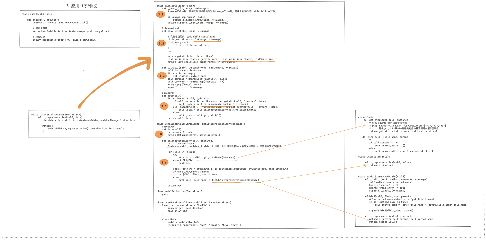
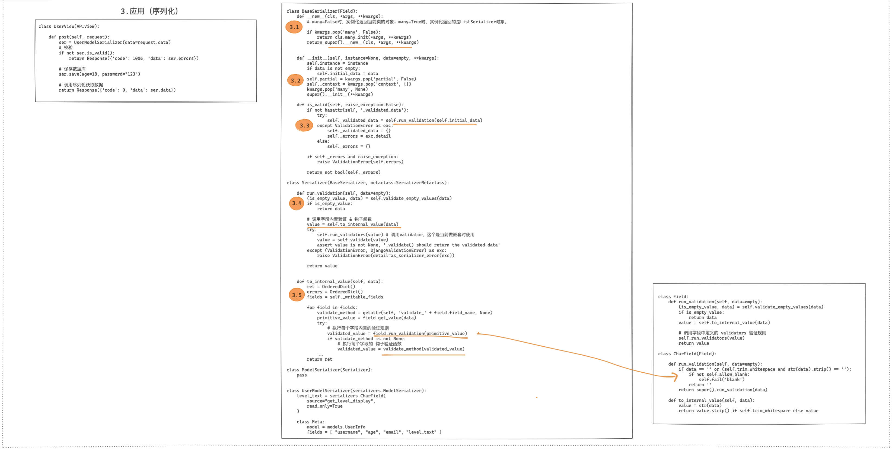

# 0.前置基础

## 0.1 HTTP介绍

<span style="font-size: 24px;">**HTTP相关知识**</span>

> HTTP（HyperText Transfer Protocol）是用于从Web服务器传输超文本到本地浏览器的传输协议。它是互联网数据交换的基础，并支持Web的交互式和无缝访问。HTTP协议定义了客户端（用户的浏览器或应用）如何与服务器进行通信的规则。
>
> **HTTP的工作方式**
>
> HTTP是一个无状态协议，意味着服务器不会保留任何数据（状态）关于客户端请求过的用户。每次请求之间都是独立的，这使得协议更简单和快速。不过，为了克服这一限制，Web应用通常使用如cookie之类的机制来维护用户状态。
>
> **HTTP请求的格式**
>
> 一个HTTP请求由以下几个部分组成：
>
> 1. **请求行**：包括方法（如GET、POST等）、请求的URL、以及HTTP版本。例如: `GET /index.html HTTP/1.1`。
>
> 2. 请求头
>
>    ：包括客户端环境信息、请求主体的格式等关键信息。请求头由关键字/值对组成，每对之间用冒号分隔。例如:
>
>    ```
>    makefileCopy codeAccept: text/html
>    User-Agent: Mozilla/5.0
>    Host: www.example.com
>    ```
>
> 3. **空行**：请求头和请求体之间的空行。
>
> 4. **请求体**（可选）：数据部分，仅在POST和PUT请求中使用，用于提交表单数据或上传文件。
>
> **HTTP响应的格式**
>
> HTTP服务器响应的格式与请求类似，包括：
>
> 1. **状态行**：包括HTTP版本、状态码（如200、404）、以及状态消息（如OK、Not Found）。例如: `HTTP/1.1 200 OK`。
>
> 2. 响应头
>
>    ：类似请求头，包含有关服务器信息、响应体格式等。例如:
>
>    ```
>    lessCopy codeContent-Type: text/html
>    Content-Length: 345
>    ```
>
> 3. **空行**：分隔响应头和响应体。
>
> 4. **响应体**：服务器返回的实际数据。
>
> **常见的HTTP请求头**
>
> 以下是一些常见的HTTP请求头：
>
> - **Accept**：指定客户端能接收的内容类型（如`text/html`）。
> - **Content-Type**：发送数据到服务器时，体的内容类型（如`application/json`）。
> - **User-Agent**：标识请求发送者的浏览器类型。
> - **Authorization**：认证信息，通常用于验证HTTP请求的访问权限。
> - **Cookie**：服务器发送到用户浏览器并保存的小数据片段，随后由浏览器在每次请求时返回给服务器。
> - **Host**：指定请求的服务器的域名。
> - **Referer**：指出请求来源的页面地址。
>
> HTTP协议简单而强大，是现代网络通信的基石之一。它支持多种类型的数据交互，并能够通过各种扩展和安全措施适应广泛的网络需求。

<br>

<span style="font-size: 24px;">**HTTP请求例子**</span>

> 假设你想从一个网站获取某个网页的内容，比如请求 `http://www.example.com/index.html` 页面。下面是这个HTTP GET请求的典型格式：
>
> **HTTP请求示例**
>
> ```
> vbnetCopy codeGET /index.html HTTP/1.1
> Host: www.example.com
> User-Agent: Mozilla/5.0 (Windows NT 10.0; Win64; x64) AppleWebKit/537.36 (KHTML, like Gecko) Chrome/58.0.3029.110 Safari/537.36
> Accept: text/html,application/xhtml+xml,application/xml;q=0.9,image/webp,*/*;q=0.8
> Accept-Language: en-US,en;q=0.5
> Connection: keep-alive
> Cookie: userID=12345; sessionToken=abcde
> ```
>
> 这里是该HTTP请求的各部分解释：
>
> 1. **请求行**：
>    - **GET** - HTTP方法/动词，表示获取资源。
>    - **/index.html** - 请求的资源路径。
>    - **HTTP/1.1** - 使用的HTTP协议版本。
> 2. **请求头**：
>    - **Host**: 指明服务器的域名（必需头，在HTTP/1.1中）。
>    - **User-Agent**: 标识发出请求的浏览器和操作系统信息。
>    - **Accept**: 告诉服务器客户端能接受哪些媒体类型，按优先级排序。
>    - **Accept-Language**: 表明客户端偏好的语言。
>    - **Connection**: 控制不再需要请求或响应后是否关闭网络连接。
>    - **Cookie**: 包含此网站设置的任何cookie。
>
> **请求无体的原因**
>
> 这个示例中的GET请求没有包含请求体，因为GET方法一般用于请求数据，而不是提交数据。请求体通常包含在如POST或PUT方法的请求中，这些方法常用于提交表单数据或上传文件。
>
> **响应示例**
>
> 服务器响应可能看起来像这样：
>
> ```
> phpCopy codeHTTP/1.1 200 OK
> Date: Tue, 18 Apr 2024 12:00:00 GMT
> Server: Apache/2.4.18 (Ubuntu)
> Content-Type: text/html; charset=UTF-8
> Content-Length: 6789
> Connection: close
> 
> <html>
> <head>
> <title>An Example Page</title>
> </head>
> <body>
> Hello, this is a sample HTML response.
> </body>
> </html>
> ```
>
> 响应的每个部分包括：
>
> 1. **状态行**：
>    - **HTTP/1.1** - 响应使用的HTTP版本。
>    - **200 OK** - 状态码及其描述，表示请求成功。
> 2. **响应头**：
>    - **Date**: 生成和发送响应的日期和时间。
>    - **Server**: 生成响应的服务器软件和版本。
>    - **Content-Type**: 响应体的媒体类型。
>    - **Content-Length**: 响应体的长度，以字节为单位。
>    - **Connection**: 表示服务器完成响应后将关闭连接。
> 3. **响应体**：
>    - 包含实际返回给客户端的HTML内容。
>
> 这个例子展示了一个完整的HTTP请求和响应的过程，希望这有助于你更好地理解HTTP通信的基本结构和工作方式。

<br>

## 0.2 django缓存

> django的缓存系统是什么？
>
> 为什么需要缓存系统？
>
> 通常怎么实现？
>
> 缓存里面存储什么？
>
> redis有什么关系？

> ​	1**.缓存系统的基本概念**
>
> 缓存（Cache）是一个临时存储区，用来存放经常访问的数据或文件。在 web 开发中，缓存的主要目的是加快数据的访问速度，并减轻主数据库的负载。例如，当用户请求一个网页时，如果这个网页的内容已经缓存在内存中，服务器就可以直接从内存中读取这个网页，而不是每次都从数据库中查询和重新生成，这大大提高了响应速度。
>
> 2. 为什么需要缓存系统
>
> - **提高响应速度**：从内存中读取数据远比从硬盘或远程数据库读取要快。
> - **减少数据库的压力**：对于热门数据（如常被访问的页面或常见查询结果），使用缓存可以减少对数据库的直接访问，从而减少数据库操作的压力。
> - **提高可扩展性**：缓存使得应用能够处理更多的用户请求，这对于用户基数大或访问量高的应用尤为重要。
>
> 3. Django 中的缓存实现
>
> 在 Django 中，缓存可以通过多种方式实现，具体取决于选择的缓存后端。Django 支持以下几种缓存方式：
>
> - **内存缓存**：数据存储在 Django 服务器的内存中。
> - **文件缓存**：数据存储在文件系统中。
> - **数据库缓存**：数据存储在数据库表中。
> - **使用 Memcached 或 Redis**：这是使用外部缓存服务器来存储数据，适用于大型网站或需要共享缓存的场景。
>
> **设置缓存**
>
> 在 `settings.py` 文件中配置缓存。例如，配置 Redis 作为缓存后端的步骤如下：
>
> ```
> CACHES = {
>     'default': {
>         'BACKEND': 'django_redis.cache.RedisCache',
>         'LOCATION': 'redis://127.0.0.1:6379/1',  # Redis服务器的地址和数据库索引
>         'OPTIONS': {
>             'CLIENT_CLASS': 'django_redis.client.DefaultClient',
>             'PASSWORD': 'your_password',  # 如果设置了Redis密码
>         }
>     }
> }
> ```
>
> 这段配置定义了默认的缓存系统，使用了 Redis 作为后端存储。
>
> 使用缓存
>
> 在 Django 应用中使用缓存通常涉及以下步骤：
>
> - 存储数据到缓存
>
>   ：
>
>   ```
>   pythonCopy codefrom django.core.cache import cache
>   cache.set('my_key', 'my_value', timeout=1000)  # 存储键值对到缓存，超时时间1000秒
>   ```
>
> - 从缓存获取数据
>
>   ：
>
>   ```
>   python
>   Copy code
>   value = cache.get('my_key')  # 从缓存获取键对应的值
>   ```
>
> - 删除缓存中的数据
>
>   ：
>
>   ```
>   python
>   Copy code
>   cache.delete('my_key')  # 删除缓存中的指定键
>   ```
>
> 4. **Redis 和 Django 缓存**
>
> Redis 是一个开源的键值数据库，它支持数据结构如字符串、哈希、列表、集合等。由于其高性能特性（数据存储在内存中），Redis 非常适合作为缓存系统。在 Django 中，Redis 可以用作缓存后端来提高数据处理速度和应用性能。
>
> **总结**
>
> 理解和实现缓存是提升 Web 应用性能的关键步骤之一。在 Django 中，通过配置缓存系统，你可以显著提高应用的响应速度和效率。选择合适的缓存后端（如 Redis）并合理地使用缓存，可以帮助你的应用更好地扩展并处理更多的用户请求。这不仅改善了用户体验，还有助于降低基础设施成本。

<br><br>

## 0.3 JSON格式

> JSON 详细介绍
>
> JSON（JavaScript Object Notation）是一种轻量级的数据交换格式。它是基于 JavaScript 对象表示法的文本格式，但它与语言无关，可以在不同的编程语言之间交换数据。
>
> JSON 格式
>
> - **对象（Object）：** 由花括号 `{}` 包围，并由键值对组成。键是字符串，值可以是任何 JSON 数据类型。
>
> ```
> jsonCopy code{
>     "name": "Alice",
>     "age": 30,
>     "is_student": false,
>     "skills": ["Python", "Machine Learning"],
>     "address": {
>         "street": "123 Maple Street",
>         "city": "Wonderland"
>     }
> }
> ```
>
> - **数组（Array）：** 由方括号 `[]` 包围，并由值组成。值可以是任何 JSON 数据类型。
>
> ```
> jsonCopy code[
>     "Alice",
>     "Bob",
>     "Charlie"
> ]
> ```
>
> - 数据类型：
>   - 字符串（String）：用双引号 `""` 包围。
>   - 数字（Number）：整数和浮点数。
>   - 布尔值（Boolean）：`true` 或 `false`。
>   - 空值（Null）：`null`。
>
> JSON 的优势
>
> 1. **轻量级：** 相对于 XML，JSON 的数据结构更简单，数据量更少。
> 2. **可读性好：** JSON 是纯文本格式，并且结构清晰，容易阅读和理解。
> 3. **可移植性强：** 不依赖特定编程语言，可以在不同系统和环境之间方便地传输和解析。
> 4. **支持多语言：** 各种编程语言都有丰富的 JSON 库支持。
>
> Python 中的 JSON 使用
>
> Python 的 `json` 模块提供了 JSON 序列化和反序列化的功能。
>
> ```
> pythonCopy codeimport json
> 
> # 示例字典数据
> data = {
>     "name": "Alice",
>     "age": 30,
>     "is_student": False,
>     "skills": ["Python", "Machine Learning"],
>     "address": {
>         "street": "123 Maple Street",
>         "city": "Wonderland"
>     }
> }
> 
> # 将字典转换为 JSON 字符串
> json_str = json.dumps(data, indent=4)
> print("JSON 字符串:\n", json_str)
> 
> # 将 JSON 字符串转换回字典
> data_loaded = json.loads(json_str)
> print("还原后的字典:\n", data_loaded)
> 
> # 将字典保存到文件
> with open("data.json", "w") as f:
>     json.dump(data, f, indent=4)
> 
> # 从文件加载 JSON 数据
> with open("data.json", "r") as f:
>     data_from_file = json.load(f)
> print("从文件加载的数据:\n", data_from_file)
> ```
>
> **输出：**
>
> ```
> jsonCopy codeJSON 字符串:
>  {
>     "name": "Alice",
>     "age": 30,
>     "is_student": false,
>     "skills": [
>         "Python",
>         "Machine Learning"
>     ],
>     "address": {
>         "street": "123 Maple Street",
>         "city": "Wonderland"
>     }
> }
> 还原后的字典:
>  {'name': 'Alice', 'age': 30, 'is_student': False, 'skills': ['Python', 'Machine Learning'], 'address': {'street': '123 Maple Street', 'city': 'Wonderland'}}
> 从文件加载的数据:
>  {'name': 'Alice', 'age': 30, 'is_student': False, 'skills': ['Python', 'Machine Learning'], 'address': {'street': '123 Maple Street', 'city': 'Wonderland'}}
> ```
>
> JSON 与 XML 的区别
>
> 1. 数据结构
>    - JSON：
>      - 使用键值对表示对象。
>      - 使用列表表示数组。
>      - 纯文本数据结构，更容易读取和解析。
>    - XML：
>      - 使用嵌套标签表示结构。
>      - 标签有属性和内容。
>      - 数据结构复杂。
>
> **JSON 格式：**
>
> ```
> jsonCopy code{
>     "name": "Alice",
>     "age": 30
> }
> ```
>
> **XML 格式：**
>
> ```
> xmlCopy code<person>
>     <name>Alice</name>
>     <age>30</age>
> </person>
> ```
>
> 1. **解析难度**
>    - JSON：
>      - 更容易解析，轻量级。
>      - 原生支持 JavaScript。
>    - XML：
>      - 解析和构建复杂。
>      - 更强大的文档描述能力。
> 2. **数据类型支持**
>    - JSON：
>      - 支持常见的基本数据类型：字符串、数字、布尔值、数组、对象和空值。
>      - 缺乏对二进制数据的直接支持。
>    - XML：
>      - 所有内容都是字符串。
>      - 可以使用 CDATA 来包含二进制数据。
>      - 支持自定义复杂数据类型和结构。
> 3. **可扩展性和文档验证**
>    - JSON：
>      - 没有标准化的验证机制。
>      - JSON Schema 是一种非正式的验证方式。
>    - XML：
>      - 支持 DTD 和 XML Schema 验证机制。
>      - 更适合文档交换和描述。
> 4. **数据传输效率**
>    - **JSON：** 通常比 XML 更轻量级，占用带宽更少，解析速度更快。
>    - **XML：** 标签较多且嵌套深时会增加数据量和解析复杂度。
>
> Python 中的 XML 使用
>
> Python 中处理 XML 可以使用内置的 `xml.etree.ElementTree` 模块。
>
> ```
> pythonCopy codeimport xml.etree.ElementTree as ET
> 
> # 示例 XML 数据
> xml_data = """<?xml version="1.0"?>
> <data>
>     <person>
>         <name>Alice</name>
>         <age>30</age>
>         <is_student>false</is_student>
>         <skills>
>             <skill>Python</skill>
>             <skill>Machine Learning</skill>
>         </skills>
>         <address>
>             <street>123 Maple Street</street>
>             <city>Wonderland</city>
>         </address>
>     </person>
> </data>
> """
> 
> # 解析 XML 数据
> root = ET.fromstring(xml_data)
> 
> # 获取根元素名称
> print("根元素:", root.tag)
> 
> # 遍历每个 person 元素
> for person in root.findall("person"):
>     name = person.find("name").text
>     age = person.find("age").text
>     is_student = person.find("is_student").text
>     skills = [skill.text for skill in person.find("skills").findall("skill")]
>     street = person.find("address/street").text
>     city = person.find("address/city").text
> 
>     print("姓名:", name)
>     print("年龄:", age)
>     print("是否为学生:", is_student)
>     print("技能:", skills)
>     print("地址:", f"{street}, {city}")
> ```
>
> **输出：**
>
> ```
> makefileCopy code根元素: data
> 姓名: Alice
> 年龄: 30
> 是否为学生: false
> 技能: ['Python', 'Machine Learning']
> 地址: 123 Maple Street, Wonderland
> ```
>
> 总结
>
> - **JSON 优势：**
>   - 更简单和轻量级。
>   - 易于阅读和编写。
>   - 广泛支持不同的编程语言。
> - **XML 优势：**
>   - 更适合结构化文档。
>   - 支持文档验证。
>   - 支持自定义复杂数据结构。
> - **选择：**
>   - 对于轻量级数据传输，通常选择 JSON。
>   - 对于需要复杂验证、命名空间、或文档描述的场景，可以选择 XML。

JSON 语法综合介绍

JSON（JavaScript Object Notation）是一种轻量级的数据交换格式，具有简单、可读、易于解析的特点。它主要由对象、数组、键值对和其他数据类型组成。

基本结构

JSON 的基本结构由两个部分组成：

1. **对象（Object）：** 由花括号 `{}` 包围的键值对集合。
2. **数组（Array）：** 由方括号 `[]` 包围的值集合。

数据类型

1. 对象（Object）：
   - 花括号 `{}` 包围的键值对集合。
   - 键是字符串，必须用双引号 `""` 包围。
   - 值可以是任何 JSON 数据类型。

```
jsonCopy code{
    "name": "Alice",
    "age": 30,
    "is_student": false,
    "skills": ["Python", "Machine Learning"],
    "address": {
        "street": "123 Maple Street",
        "city": "Wonderland"
    }
}
```

1. 数组（Array）：
   - 由方括号 `[]` 包围的值集合。
   - 可以包含任何 JSON 数据类型的值，包括对象、数组等。

```
jsonCopy code[
    "Alice",
    "Bob",
    "Charlie"
]
```

**嵌套数组和对象：**

```
jsonCopy code{
    "students": [
        {
            "name": "Alice",
            "age": 30
        },
        {
            "name": "Bob",
            "age": 25
        }
    ]
}
```

1. 字符串（String）：
   - 由双引号 `""` 包围的字符序列。
   - 支持 Unicode 字符。

```
jsonCopy code{
    "message": "Hello, 世界!",
    "escaped": "She said: \"Hello!\""
}
```

1. 数字（Number）：
   - 整数或浮点数。

```
jsonCopy code{
    "integer": 42,
    "floating": 3.14159
}
```

1. 布尔值（Boolean）：
   - 仅两个值：`true` 和 `false`。

```
jsonCopy code{
    "is_active": true,
    "is_student": false
}
```

1. 空值（Null）：
   - 只有一个值：`null`。

```
jsonCopy code{
    "unknown": null
}
```

JSON 语法规则

- **键必须是字符串：** 由双引号 `""` 包围。
- **值可以是：** 对象、数组、字符串、数字、布尔值或空值。
- **对象中的键值对：** 以逗号 `,` 分隔。
- **对象的最后一个键值对之后不能有逗号。**
- **数组中的元素：** 以逗号 `,` 分隔。
- **数组的最后一个元素之后不能有逗号。**

示例

**正确的 JSON：**

```
jsonCopy code{
    "name": "Alice",
    "age": 30,
    "skills": ["Python", "Machine Learning"],
    "is_active": true,
    "address": {
        "street": "123 Maple Street",
        "city": "Wonderland"
    }
}
```

**错误的 JSON：**

```
jsonCopy code{
    "name": "Alice",  // 单行注释是不允许的
    "age": 30,
    "skills": ["Python", "Machine Learning"], // 最后一个键值对之后不能有逗号
    "is_active": true,
    "address": {
        "street": "123 Maple Street",
        "city": "Wonderland",
    }  // 最后一个键值对之后不能有逗号
}
```

JSON 转换与解析

Python 提供了 `json` 模块用于 JSON 数据的转换和解析。

将 Python 对象转换为 JSON 字符串

- 使用 `json.dumps()` 函数。

```
pythonCopy codeimport json

# 示例 Python 对象
data = {
    "name": "Alice",
    "age": 30,
    "is_student": False,
    "skills": ["Python", "Machine Learning"],
    "address": {
        "street": "123 Maple Street",
        "city": "Wonderland"
    }
}

# 转换为 JSON 字符串
json_str = json.dumps(data, indent=4)
print("JSON 字符串:\n", json_str)
```

**输出：**

```
jsonCopy codeJSON 字符串:
 {
    "name": "Alice",
    "age": 30,
    "is_student": false,
    "skills": [
        "Python",
        "Machine Learning"
    ],
    "address": {
        "street": "123 Maple Street",
        "city": "Wonderland"
    }
}
```

将 JSON 字符串转换为 Python 对象

- 使用 `json.loads()` 函数。

```
pythonCopy codeimport json

# 示例 JSON 字符串
json_str = '''{
    "name": "Alice",
    "age": 30,
    "is_student": false,
    "skills": ["Python", "Machine Learning"],
    "address": {
        "street": "123 Maple Street",
        "city": "Wonderland"
    }
}'''

# 解析 JSON 字符串
data = json.loads(json_str)
print("还原后的 Python 对象:\n", data)
```

**输出：**

```
jsonCopy code还原后的 Python 对象:
 {'name': 'Alice', 'age': 30, 'is_student': False, 'skills': ['Python', 'Machine Learning'], 'address': {'street': '123 Maple Street', 'city': 'Wonderland'}}
```

将 JSON 保存到文件和从文件读取

- **保存到文件：** 使用 `json.dump()` 函数。
- **从文件读取：** 使用 `json.load()` 函数。

```
pythonCopy codeimport json

# 示例 Python 对象
data = {
    "name": "Alice",
    "age": 30,
    "is_student": False,
    "skills": ["Python", "Machine Learning"],
    "address": {
        "street": "123 Maple Street",
        "city": "Wonderland"
    }
}

# 保存到文件
with open("data.json", "w") as f:
    json.dump(data, f, indent=4)

# 从文件读取
with open("data.json", "r") as f:
    data_from_file = json.load(f)
print("从文件加载的数据:\n", data_from_file)
```

**输出：**

```
jsonCopy code从文件加载的数据:
 {'name': 'Alice', 'age': 30, 'is_student': False, 'skills': ['Python', 'Machine Learning'], 'address': {'street': '123 Maple Street', 'city': 'Wonderland'}}
```

总结

1. **JSON 数据结构：**
   - 对象：键值对的集合，由 `{}` 包围。
   - 数组：值的集合，由 `[]` 包围。
2. **JSON 数据类型：**
   - 字符串、数字、布尔值、空值、对象、数组。
3. **语法规则：**
   - 键必须是字符串，双引号包围。
   - 对象和数组的最后一个键值对或元素后不能有逗号。
4. **Python 与 JSON 的相互转换：**
   - 使用 `json.dumps()` 和 `json.loads()` 函数。
   - 使用 `json.dump()` 和 `json.load()` 进行文件操作。

<br><br>

## 0.4 django的多app

在 Django 项目中，多个应用（app）之间的关联和相互调用是很常见的需求。Django 提供了各种方式来实现这一目标，包括模型间的外键关系、URL 路由、跨应用视图和模板调用等。

###  0.4.1 关联概念

1. **模型关联（外键关系、OneToOne、ManyToMany）：** 在不同应用的模型之间建立数据库关系。
2. **URL 路由共享：** 一个应用可以调用另一个应用的 URL。
3. **视图调用：** 一个应用可以直接调用另一个应用的视图。
4. **模板调用：** 在模板中引用其他应用的模板。
5. **跨应用信号：** 使用信号机制实现不同应用之间的通信。

创建示例项目和应用

**1. 创建 Django 项目**

```
bash
Copy code
django-admin startproject myproject
```

**2. 创建两个应用**

```
bashCopy codecd myproject
python manage.py startapp app1
python manage.py startapp app2
```

**3. 注册应用**

在 `settings.py` 中添加两个新应用。

```
pythonCopy code# settings.py
INSTALLED_APPS = [
    ...
    'app1',
    'app2',
]
```

### 0.4.2 模型关联（外键关系、OneToOne、ManyToMany）

假设我们在 `app1` 中有一个 `Author` 模型，在 `app2` 中有一个 `Book` 模型。我们可以通过外键来关联这两个模型。

**app1/models.py**

```
pythonCopy code# app1/models.py
from django.db import models

class Author(models.Model):
    name = models.CharField(max_length=100)

    def __str__(self):
        return self.name
```

**app2/models.py**

```
pythonCopy code# app2/models.py
from django.db import models
from app1.models import Author

class Book(models.Model):
    title = models.CharField(max_length=100)
    author = models.ForeignKey(Author, on_delete=models.CASCADE)

    def __str__(self):
        return self.title
```

**迁移和创建数据库表：**

```
bashCopy codepython manage.py makemigrations
python manage.py migrate
```

**在管理界面中注册模型：**

**app1/admin.py**

```
pythonCopy code# app1/admin.py
from django.contrib import admin
from .models import Author

admin.site.register(Author)
```

**app2/admin.py**

```
pythonCopy code# app2/admin.py
from django.contrib import admin
from .models import Book

admin.site.register(Book)
```

### 0.4.3 URL 路由共享

假设 `app1` 有一个视图 `author_list`，需要在 `app2` 中调用它。

**app1/views.py**

```
pythonCopy code# app1/views.py
from django.shortcuts import render
from .models import Author

def author_list(request):
    authors = Author.objects.all()
    return render(request, 'app1/author_list.html', {'authors': authors})
```

**app1/urls.py**

```
pythonCopy code# app1/urls.py
from django.urls import path
from . import views

urlpatterns = [
    path('authors/', views.author_list, name='author_list'),
]
```

**app2/urls.py**

```
pythonCopy code# app2/urls.py
from django.urls import path
from . import views

urlpatterns = [
    path('books/', views.book_list, name='book_list'),
]
```

**在主 URL 路由中包含两个应用的路由：**

**myproject/urls.py**

```
pythonCopy code# myproject/urls.py
from django.contrib import admin
from django.urls import path, include

urlpatterns = [
    path('admin/', admin.site.urls),
    path('app1/', include('app1.urls')),
    path('app2/', include('app2.urls')),
]
```

**在 `app2` 的视图中调用 `app1` 的 URL：**

**app2/views.py**

```
pythonCopy code# app2/views.py
from django.shortcuts import render
from .models import Book

def book_list(request):
    books = Book.objects.all()
    return render(request, 'app2/book_list.html', {'books': books})
```

**app2/templates/app2/book_list.html**

```
htmlCopy code<!DOCTYPE html>
<html>
<head>
    <title>Book List</title>
</head>
<body>
    <h1>Book List</h1>
    <ul>
    
        <li>{{ book.title }} by {{ book.author.name }}</li>
    
    </ul>

    <a href="">View Authors</a>
</body>
</html>
```

### 0.4.4 视图调用

如果 `app1` 需要在它的视图中调用 `app2` 的视图逻辑，可以直接导入并调用。

**app2/views.py**

```
pythonCopy code# app2/views.py
from django.shortcuts import render
from .models import Book

def book_list(request):
    books = Book.objects.all()
    return render(request, 'app2/book_list.html', {'books': books})
```

**app1/views.py**

```
pythonCopy code# app1/views.py
from django.shortcuts import render
from .models import Author
from app2.views import book_list  # 引入 app2 的视图

def author_and_book_list(request):
    authors = Author.objects.all()
    books_response = book_list(request)  # 调用 app2 的视图
    books = books_response.context_data['books']
    return render(request, 'app1/author_and_book_list.html', {'authors': authors, 'books': books})
```

**app1/urls.py**

```
pythonCopy code# app1/urls.py
from django.urls import path
from . import views

urlpatterns = [
    path('authors_books/', views.author_and_book_list, name='author_and_book_list'),
]
```

**app1/templates/app1/author_and_book_list.html**

```
htmlCopy code<!DOCTYPE html>
<html>
<head>
    <title>Author and Book List</title>
</head>
<body>
    <h1>Author and Book List</h1>

    <h2>Authors</h2>
    <ul>
    
        <li>{{ author.name }}</li>
    
    </ul>

    <h2>Books</h2>
    <ul>
    
        <li>{{ book.title }} by {{ book.author.name }}</li>
    
    </ul>
</body>
</html>
```

### 0.4.5 模板调用

可以在一个应用的模板中直接引用另一个应用的模板。

**app1/templates/app1/author_list.html**

```
htmlCopy code<!DOCTYPE html>
<html>
<head>
    <title>Author List</title>
</head>
<body>
    <h1>Author List</h1>
    <ul>
    
        <li>{{ author.name }}</li>
    
    </ul>

    
</body>
</html>
```

**app2/templates/app2/book_snippet.html**

```
htmlCopy code<h2>Books</h2>
<ul>

    <li>{{ book.title }} by {{ book.author.name }}</li>

</ul>
```

**app2/views.py**

```
pythonCopy code# app2/views.py
from django.shortcuts import render
from .models import Book

def book_snippet(request):
    books = Book.objects.all()
    return render(request, 'app2/book_snippet.html', {'books': books})
```

### 0.4.6 跨应用信号

Django 信号可以用于在不同应用间进行通知和通信。

**在 `app1` 中定义信号**

**app1/signals.py**

```
pythonCopy code# app1/signals.py
from django.dispatch import Signal

# 定义一个自定义信号
author_created = Signal(providing_args=["name"])
```

**在 `app1` 中触发信号**

**app1/models.py**

```
pythonCopy code# app1/models.py
from django.db import models
from .signals import author_created

class Author(models.Model):
    name = models.CharField(max_length=100)

    def save(self, *args, **kwargs):
        super().save(*args, **kwargs)
        # 触发信号
        author_created.send(sender=self.__class__, name=self.name)

    def __str__(self):
        return self.name
```

**在 `app2` 中接收信号**

**app2/signals.py**

```
pythonCopy code# app2/signals.py
from django.dispatch import receiver
from app1.signals import author_created

@receiver(author_created)
def author_created_handler(sender, **kwargs):
    print(f"New author created: {kwargs['name']}")
```

**在 `app2` 的 `apps.py` 中连接信号**

**app2/apps.py**

```
pythonCopy code# app2/apps.py
from django.apps import AppConfig

class App2Config(AppConfig):
    default_auto_field = 'django.db.models.BigAutoField'
    name = 'app2'

    def ready(self):
        import app2.signals
```

**在 `settings.py` 中配置 `app2` 应用**

```
pythonCopy code# settings.py
INSTALLED_APPS = [
    ...
    'app2.apps.App2Config',
]
```

### 0.4.7 总结

- **模型关联：** 使用外键、OneToOne、ManyToMany 建立不同应用的模型之间的关系。
- **URL 路由共享：** 一个应用的视图可以在另一个应用的模板或视图中被调用。
- **视图调用：** 可以直接在一个应用的视图中调用另一个应用的视图逻辑。
- **模板调用：** 使用 `include` 标签在模板中引用其他应用的模板片段。
- **跨应用信号：** 通过信号机制在不同应用之间实现通知和通信。

<br><br>


## 0.5 __ new __ 方法

> **`__new__` 方法详解**
>
> `__new__` 方法是 Python 对象的构造方法。它负责在内存中创建并返回一个新的实例，而 `__init__` 方法在实例创建后初始化该实例。通常，`__new__` 方法在定制类时不常用，但对于不可变类型（如元组、字符串）或定制对象（如元类），它显得非常重要。
>
> `__new__` 与 `__init__` 的区别
>
> 1. **调用顺序：**
>    - `__new__` 方法在 `__init__` 方法之前被调用。
>    - `__new__` 方法创建实例，而 `__init__` 方法初始化实例。
> 2. **参数：**
>    - `__new__` 通常接受与 `__init__` 相同的参数，但第一个参数是类本身（`cls`）。
>    - `__init__` 的第一个参数是实例（`self`）。
> 3. **返回值：**
>    - `__new__` 必须返回一个新创建的实例。
>    - `__init__` 无需返回值（通常返回 `None`）。
>
> `__new__` 方法的参数
>
> - `cls`：当前类。
> - `*args`：位置参数，传递给类的构造方法。
> - `**kwargs`：关键字参数，传递给类的构造方法。
>
> 元类 `__new__` 方法的参数包括：
>
> 1. **`cls`：** 当前元类本身（类似于普通类方法中的 `self`）。
> 2. **`name`：** 正在创建的类的名称（字符串）。
> 3. **`bases`：** 正在创建的类的基类（父类）元组。
> 4. **`attrs`：** 包含正在创建的类的属性字典，包括所有方法和字段。
>
> `__new__` 的基本示例
>
> ```
> pythonCopy codeclass MyClass:
>     def __new__(cls, *args, **kwargs):
>         print(f"Creating instance of {cls}")
>         instance = super().__new__(cls)
>         return instance
> 
>     def __init__(self, name):
>         print(f"Initializing instance with name={name}")
>         self.name = name
> 
> # 实例化 MyClass
> obj = MyClass("John")
> 
> # 输出：
> # Creating instance of <class '__main__.MyClass'>
> # Initializing instance with name=John
> ```
>
> 使用 `__new__` 自定义不可变类型
>
> 不可变类型如字符串、元组和整数，在初始化后无法修改，因此需要在 `__new__` 中完成定制。
>
> **例子：**
>
> ```
> pythonCopy codeclass CustomStr(str):
>     def __new__(cls, value):
>         # 在这里我们可以修改字符串的值
>         value = value.upper()
>         return super().__new__(cls, value)
> 
>     def __init__(self, value):
>         # `__init__` 被调用，但因为 `str` 是不可变类型，所以这里无法修改字符串的值
>         print(f"CustomStr initialized with value={value}")
> 
> custom_string = CustomStr("hello")
> print(custom_string)  # 输出：HELLO
> ```
>
> **使用 `__new__` 实现单例模式**
>
> 通过 `__new__` 方法，可以确保某个类只创建一个实例。
>
> ```
> pythonCopy codeclass Singleton:
>     _instance = None
> 
>     def __new__(cls, *args, **kwargs):
>         if not cls._instance:
>             cls._instance = super().__new__(cls, *args, **kwargs)
>         return cls._instance
> 
>     def __init__(self, name):
>         self.name = name
> 
> # 创建 Singleton 实例
> s1 = Singleton("Instance1")
> s2 = Singleton("Instance2")
> 
> # 判断两个实例是否相同
> print(s1 is s2)  # 输出：True
> print(s1.name)  # 输出：Instance2
> ```
>
> 元类中的 `__new__` 方法
>
> 元类中的 `__new__` 方法主要用于自定义类的创建过程。
>
> ```
> pythonCopy codeclass MyMeta(type):
>     def __new__(cls, name, bases, dct):
>         print(f"Creating class {name} with metaclass {cls}")
>         dct['new_method'] = lambda self: "New Method"
>         return super().__new__(cls, name, bases, dct)
> 
> class MyClass(metaclass=MyMeta):
>     def greet(self):
>         return "Hello!"
> 
> instance = MyClass()
> print(instance.greet())         # 输出：Hello!
> print(instance.new_method())    # 输出：New Method
> ```
>
> **解释：**
>
> - `MyMeta.__new__` 方法：
>   - 参数 `cls`：表示元类本身。
>   - 参数 `name`：类的名称。
>   - 参数 `bases`：类继承的基类。
>   - 参数 `dct`：类的属性和方法字典。
>
> `__new__` 方法的总结
>
> - **基本概念：**
>   - `__new__` 用于创建新实例。
>   - 对于不可变类型或自定义对象来说非常重要。
>   
> - **参数解释：**
>   - `cls`：当前类。
>   - `*args` 和 `**kwargs`：传递给类构造方法的参数。
>   
> - **主要功能：**
>   - 确保创建特定的实例。
>   - 修改不可变对象的初始化行为。
>   - 通过元类自定义类的创建过程。
>   
> - **典型应用：**
>   - 不可变类型的定制化行为。
>   - 单例模式。
>   - 元类的 `__new__` 方法。
>   
>   

## 0.6 @property

`@property`

- **用途**：将一个方法转换为只读属性，使得可以通过点符号（.`属性名`）来访问该属性。
- **优势**：提供对属性的控制，支持延迟计算、只读属性和数据验证。

```python
python复制代码class MyClass:
    def __init__(self, value):
        self._value = value

    @property
    def value(self):
        """通过点符号访问属性时调用的方法"""
        return self._value

    @value.setter
    def value(self, new_value):
        """通过点符号设置属性值时调用的方法"""
        if new_value < 0:
            raise ValueError("Value cannot be negative")
        self._value = new_value

    @value.deleter
    def value(self):
        """通过del关键字删除属性时调用的方法"""
        del self._value

# 使用示例
obj = MyClass(10)
print(obj.value)  # 通过点符号访问属性，输出：10

obj.value = 20    # 通过点符号设置属性值
print(obj.value)  # 输出：20

del obj.value     # 通过del关键字删除属性
# print(obj.value)  # 试图访问已删除的属性会引发AttributeError
```


<br><br>

本笔记是基于b站视频所作

前置问题

1. 什么是前后端分离？

   > 程序角度：
   >
   > - 一个django程序：接受请求+处理+HTML模板+用户
   > - 两个程序
   >   - 前端：vue.js/reactjs/angular.js
   >   - 后端：django + django restframework（drf）
   >
   > 专业度角度
   >
   > - 前端，专门写前端代码+部署+版本管理+ajax请求获取
   > - 后端，API
   >
   > APP或微信小程序：
   >
   > - 前端：APP或微信小程序
   > - 后端：API

   

   

   前后端不分离

   

   

   

   前后端分离

   

   

   

   

2. 什么是drf？作用是什么？

​	drf，让我们以后写侯丹API接口时更方便

​	`  pip install django`

​	` pip install djangorestframework`


3. 必备工具：postman

​	这个工具时帮助伪造，帮助测试api的使用可以不编写前端


## 0.7 meta

在django中meta：model、ModelForm


> Django 中的 `Meta` 类用于定义模型的元数据。通过使用 `Meta` 类，你可以控制模型的行为和数据库表的属性。下面是 `Meta` 类的详细介绍及各个参数的使用方法。
>
> ### `Meta` 类的常见参数
>
> #### `db_table`
>
> 用于指定模型对应的数据库表的名称。如果不指定，Django 会使用应用名和模型名生成表名。
>
> ```
> python复制代码class Blog(models.Model):
>     title = models.CharField(max_length=255)
> 
>     class Meta:
>         db_table = 'my_custom_blog_table'
> ```
>
> #### `ordering`
>
> 用于指定查询结果的默认排序顺序。可以使用字段名称排序，也可以在字段名前加上 `-` 进行降序排序。
>
> ```
> python复制代码class Blog(models.Model):
>     title = models.CharField(max_length=255)
>     created_at = models.DateTimeField(auto_now_add=True)
> 
>     class Meta:
>         ordering = ['-created_at']  # 按创建时间降序排序
> ```
>
> #### `verbose_name` 和 `verbose_name_plural`
>
> 用于定义模型的单数和复数名称，这些名称会在 Django 管理后台和其他地方显示。
>
> ```
> python复制代码class Blog(models.Model):
>     title = models.CharField(max_length=255)
> 
>     class Meta:
>         verbose_name = '博客'
>         verbose_name_plural = '博客'
> ```
>
> #### `unique_together`
>
> 用于定义联合唯一约束，确保指定字段的组合是唯一的。这个在 Django 2.2 后被 `UniqueConstraint` 取代。
>
> ```
> python复制代码class Blog(models.Model):
>     title = models.CharField(max_length=255)
>     user = models.ForeignKey(User, on_delete=models.CASCADE)
> 
>     class Meta:
>         unique_together = (('title', 'user'),)  # 确保每个用户的标题唯一
> ```
>
> #### `constraints`
>
> 用于定义更多复杂的约束，比如联合唯一约束、检查约束等。
>
> ```
> python复制代码from django.db import models
> 
> class Blog(models.Model):
>     title = models.CharField(max_length=255)
>     user = models.ForeignKey(User, on_delete=models.CASCADE)
> 
>     class Meta:
>         constraints = [
>             models.UniqueConstraint(fields=['title', 'user'], name='unique_blog_title_user')
>         ]
> ```
>
> #### `abstract`
>
> 用于定义抽象基类。抽象基类不会在数据库中创建表，主要用于继承。
>
> ```
> python复制代码class TimestampedModel(models.Model):
>     created_at = models.DateTimeField(auto_now_add=True)
>     updated_at = models.DateTimeField(auto_now=True)
> 
>     class Meta:
>         abstract = True
> 
> class Blog(TimestampedModel):
>     title = models.CharField(max_length=255)
> ```
>
> #### `permissions`
>
> 用于定义自定义权限。可以为模型添加额外的权限，便于在权限管理系统中使用。
>
> ```
> python复制代码class Blog(models.Model):
>     title = models.CharField(max_length=255)
> 
>     class Meta:
>         permissions = [
>             ("can_publish", "Can publish blogs"),
>         ]
> ```
>
> #### `indexes`
>
> 用于定义数据库索引。索引可以加速查询，但也会增加一些存储开销和维护时间。
>
> ```
> python复制代码class Blog(models.Model):
>     title = models.CharField(max_length=255)
>     created_at = models.DateTimeField(auto_now_add=True)
> 
>     class Meta:
>         indexes = [
>             models.Index(fields=['created_at']),
>         ]
> ```
>
> #### `get_latest_by`
>
> 用于指定模型中哪一个字段是用来确定最近的对象的。常用于模型的 `latest()` 方法。
>
> ```
> python复制代码class Blog(models.Model):
>     title = models.CharField(max_length=255)
>     created_at = models.DateTimeField(auto_now_add=True)
> 
>     class Meta:
>         get_latest_by = 'created_at'
> ```
>
> #### `default_related_name`
>
> 用于指定模型的默认反向关系名称。Django 默认会为外键创建反向关系名称，可以通过此参数进行自定义。
>
> ```
> python复制代码class Author(models.Model):
>     name = models.CharField(max_length=255)
> 
> class Blog(models.Model):
>     title = models.CharField(max_length=255)
>     author = models.ForeignKey(Author, on_delete=models.CASCADE)
> 
>     class Meta:
>         default_related_name = 'blogs'
> ```
>
> 这样，`author.blogs.all()` 就可以用于获取某个作者的所有博客。
>
> ### 完整示例
>
> 综合以上所有参数，下面是一个包含各种 `Meta` 参数的完整模型示例：
>
> ```
> python复制代码from django.db import models
> 
> class Author(models.Model):
>     name = models.CharField(max_length=255)
> 
> class Blog(models.Model):
>     title = models.CharField(max_length=255)
>     content = models.TextField()
>     created_at = models.DateTimeField(auto_now_add=True)
>     updated_at = models.DateTimeField(auto_now=True)
>     author = models.ForeignKey(Author, on_delete=models.CASCADE)
> 
>     class Meta:
>         db_table = 'blog_table'
>         ordering = ['-created_at']
>         verbose_name = '博客'
>         verbose_name_plural = '博客'
>         unique_together = (('title', 'author'),)
>         constraints = [
>             models.UniqueConstraint(fields=['title', 'author'], name='unique_blog_title_author')
>         ]
>         indexes = [
>             models.Index(fields=['created_at']),
>         ]
>         get_latest_by = 'created_at'
>         default_related_name = 'blogs'
>         permissions = [
>             ("can_publish", "Can publish blogs"),
>         ]
> ```
>
> 通过合理使用 `Meta` 类中的各个参数，你可以控制 Django 模型的各种行为，从而更好地满足项目需求。 

<br><br>

## 0.8 F表达式

> 在 Django 中，可以使用 F 表达式来实现数据库字段的增减操作，而无需先将字段的当前值从数据库中取出再加减后再保存回去，这样可以避免并发操作时的数据不一致性问题。具体来说，对于你描述的需求，可以使用 F 表达式来实现对博客的评论数和赞数的自动更新。
>
> ### 使用 F 表达式的示例
>
> 假设有以下 Django 模型：
>
> ```
> python复制代码from django.db import models
> 
> class Blog(models.Model):
>     title = models.CharField(max_length=100)
>     content = models.TextField()
>     comment_count = models.IntegerField(default=0)
>     favor_count = models.IntegerField(default=0)
> 
> class Favor(models.Model):
>     blog = models.ForeignKey(Blog, on_delete=models.CASCADE, related_name='favors')
>     user = models.ForeignKey(User, on_delete=models.CASCADE)
>     create_datetime = models.DateTimeField(auto_now_add=True)
> 
> class Comment(models.Model):
>     blog = models.ForeignKey(Blog, on_delete=models.CASCADE, related_name='comments')
>     user = models.ForeignKey(User, on_delete=models.CASCADE)
>     content = models.TextField()
>     create_datetime = models.DateTimeField(auto_now_add=True)
> ```
>
> #### 增加赞功能实现
>
> 当用户添加赞时，除了在 Favor 表中创建记录外，还需要更新对应博客的赞数：
>
> ```
> python复制代码from django.db.models import F
> 
> def add_favor(blog_id, user_id):
>     # 创建 Favor 记录
>     favor = Favor.objects.create(blog_id=blog_id, user_id=user_id)
> 
>     # 更新对应博客的赞数
>     Blog.objects.filter(id=blog_id).update(favor_count=F('favor_count') + 1)
> 
>     return favor
> ```
>
> #### 删除赞功能实现
>
> 当用户取消赞时，除了从 Favor 表中删除记录外，也要相应地减少对应博客的赞数：
>
> ```
> python复制代码def delete_favor(blog_id, user_id):
>     # 删除 Favor 记录
>     Favor.objects.filter(blog_id=blog_id, user_id=user_id).delete()
> 
>     # 更新对应博客的赞数
>     Blog.objects.filter(id=blog_id).update(favor_count=F('favor_count') - 1)
> ```
>
> #### 增加评论功能实现
>
> 当用户添加评论时，除了在 Comment 表中创建记录外，还需要更新对应博客的评论数：
>
> ```
> python复制代码def add_comment(blog_id, user_id, content):
>     # 创建 Comment 记录
>     comment = Comment.objects.create(blog_id=blog_id, user_id=user_id, content=content)
> 
>     # 更新对应博客的评论数
>     Blog.objects.filter(id=blog_id).update(comment_count=F('comment_count') + 1)
> 
>     return comment
> ```
>
> #### 删除评论功能实现
>
> 当用户删除评论时，除了从 Comment 表中删除记录外，也要相应地减少对应博客的评论数：
>
> ```
> python复制代码def delete_comment(comment_id):
>     # 获取评论对应的博客 ID
>     blog_id = Comment.objects.get(id=comment_id).blog_id
> 
>     # 删除 Comment 记录
>     Comment.objects.filter(id=comment_id).delete()
> 
>     # 更新对应博客的评论数
>     Blog.objects.filter(id=blog_id).update(comment_count=F('comment_count') - 1)
> ```
>
> ### F 表达式的作用
>
> F 表达式允许在数据库层级上执行增减操作，而不是在 Python 层级将字段值取出、加减后再存回数据库，这样可以保证操作的原子性和并发安全性。使用 F 表达式还可以利用数据库的原生功能来执行更新操作，避免不必要的数据传输和性能损耗。
>
> 在 Django 中，F 表达式支持对整数、浮点数和日期时间字段进行加减操作，并且可以与其他数据库查询条件和表达式结合使用，非常灵活和强大。


<br><br>

<br>

# 1.drf初步了解

## 1.1 drf初步使用

对于视图函数

- 基于django实现
- 基于drf实现
  - 安装 pip install djangorestframework
  - 注册 rest_framework
  - 返回数据+嵌套好看的页面

```python
from rest_framework.response import Response
from rest_framework.decorators import api_view


#函数实现
@api_view(["GET"])
def login(request):
    return Response({'status': True, "message": "success"})

#类实现
class InfoView(APIView):
    def get(self,request):
        return Response({'status': True, "message": "success"})
    
    
    
 url路由
    path('login/', views.login),
    path('info/', views.InfoView.as_view()),
```


<br>

<br>

## 1.2 FBV和CBV

FBV和CBV本身django就支持，同时drf也有，但是有所区别

> FBV（Function-Based Views）和 CBV（Class-Based Views）是 Django 中用于处理 HTTP 请求的两种不同的视图方式。
>
> 1. **Function-Based Views (FBV)**:
>
>    - FBV 是使用普通的 Python 函数来定义视图的方式。
>
>    - 在 FBV 中，每个视图都是一个函数，该函数接收一个 HTTP 请求对象作为参数，并返回一个 HTTP 响应对象。
>
>    - 视图函数通常具有以下形式：
>
>      ```
>      pythonCopy codefrom django.http import HttpRequest, HttpResponse
>      
>      def my_view(request: HttpRequest) -> HttpResponse:
>          # 处理请求的逻辑
>          return HttpResponse("Hello, world!")
>      ```
>
>    - FBV 是 Django 最早的视图模式，在简单的情况下使用起来非常直观和简单。
>
> 2. **Class-Based Views (CBV)**:
>
>    - CBV 是使用基于类的视图来定义视图的方式。
>
>    - 在 CBV 中，每个视图是一个类，该类继承自 Django 提供的一些基础视图类，例如 `View`、`TemplateView`、`ListView` 等。
>
>    - 视图类通常具有以下形式：
>
>      ```
>      pythonCopy codefrom django.views import View
>      from django.http import HttpRequest, HttpResponse
>      
>      class MyView(View):
>          def get(self, request: HttpRequest) -> HttpResponse:
>              # 处理 GET 请求的逻辑
>              return HttpResponse("Hello, world!")
>      ```
>
>    - CBV 提供了一种更加结构化和面向对象的方式来组织和重用视图逻辑。
>
>    - CBV 具有很多内置的类视图，可以简化常见的任务，同时也支持更复杂的场景和自定义逻辑。

<br>

### 1.2.1django的FBV和CBV

>
> 常见的 HTTP 请求方法包括 GET、POST、PUT、DELETE、PATCH、HEAD、OPTIONS 等，其中 GET 和 POST 是最常见的两种请求方法。
>
> 1. **GET 请求**：
>    - GET 请求用于向服务器请求获取某个资源。
>    - 它通常用于从服务器获取数据，而不会对服务器状态产生任何影响。
>    - GET 请求的参数通常包含在 URL 中，可以通过查询字符串的形式传递给服务器。
>    - GET 请求是幂等的，即多次重复的 GET 请求不会对服务器产生影响。
> 2. **POST 请求**：
>    - POST 请求用于向服务器提交数据，通常用于创建新的资源或者修改服务器上的数据。
>    - POST 请求的参数通常包含在请求体中，而不是 URL 中。
>    - POST 请求对服务器状态产生影响，因此不是幂等的，即多次重复的 POST 请求可能会产生不同的结果。
>
> 除了 GET 和 POST 请求外，还有其他几种常见的 HTTP 请求方法：
>
> - **PUT 请求**：用于向服务器提交数据，通常用于更新已存在的资源。PUT 请求的语义是幂等的，即多次重复的 PUT 请求具有相同的效果。
> - **DELETE 请求**：用于请求服务器删除指定的资源。
> - **PATCH 请求**：用于向服务器局部更新资源，通常用于对资源的部分内容进行修改。
> - **HEAD 请求**：类似于 GET 请求，但服务器只返回请求头部信息而不返回实体内容。常用于检查资源是否存在、获取资源的元数据等。
> - **OPTIONS 请求**：用于获取目标资源支持的请求方法、请求头部信息等，通常用于跨域请求时进行预检查。


django的这两种方式展示表象如下：

FBV

```python
+urls.py
path('auth/', views.auth), 


+views.py
from django.http import JsonResponse
def auth(request):
    return JsonResponse({'status':True,"message":"success"})
```


CBV

```python
+urls.py
 path('user/', views.UserView.as_view())

    
+views.py
from django.http import JsonResponse
from django.views import View
def UserView(View):

    def get(self,request):
        return JsonResponse({'status':True,"message":"get"})

    def post(self,request):
        return JsonResponse({'status':True,"message":"post"})

    def put(self,requst):
        return JsonResponse({'status':True,"message":"put"})

    def delete(self,request):
        return JsonResponse({'status':True,"message":"delete"})

```

对于FBV方式，如果要根据请求的方法进行不同操作就要

`if request.method =="GET":`


无论是FBV还是CBV逻辑都是一致的(本质是相同的)

- FBV：请求函数（）
- CBV：as_views()->dispatch->请求同名函数()


<br>

### 1.2.2drf的FBV和CBV

​		drf和django的FBV、CBV的使用过程是相同的。但是drf的CBV的APIView是在继承View的基础上的类，固有区别如下

- django的是视图类，继承View
- drf的视图类，继承APIView，而APIView继承了django的View

​		具体的区别是，drf继承的APIView类中的as_view函数返回的是django的as_view函数加上csrf_exempt(view)处理

> csrf_exempt()，这个是用来免除csrf_token校验（相当于装饰器@csrf_exempt。	去除这种校验是由于前后端分离的项目要去决定的。

​		而对于dispatch函数操作，APIView有自己定义的方法，主体逻辑与View中的相同。


总结上述，APIView功能的添加体现如下：

- def as_view(...)  -> 免除了csrf认证
- def dispatch()      -> 视图执行前、反射执行视图、视图后处理

<br>

### 1.2.3CBV的URL参数和request对象分析

```python
path('user/<int:pk>/',views.UserView.as_view()), #django
path('user/<str:dt>/',views.InfoView.as_view()), #drf
```


首先开始分析django的URL传递过程

> 1.首先访问地址/user/123 => pk = 123
>
> 2.访问视图类的as_view(通常继承View类)
>
> 3.as_view函数内部的view函数
>
> 4.在view函数内部又传递给dispatch函数
>
> 5.在dispatch函数内部，通过getattr方法反射得到了要调用的方法（get、post等）
>
> 6.传递给请求方法参数并返回


其次是drf的URL传递过程

> 1.首先访问地址/user/xxx => dt = xxx
>
> 2.访问视图类的as_view(通常继承APIView类)
>
> 3.APIView内部访问as_view函数
>
> 4.as_view函数包含了对于父类view的as_view方法调用
>
> 5.在父类as_view中的view函数内部又传递给dispatch函数（这里是APIView的dispatch）
>
> 6.在dispatch函数内部，通过getattr方法反射得到了要调用的方法（get、post等），并进行了其他相关处理
>
> 7.传递给请求方法参数并返回


再来对比django和drf的request

- django：requst是请求相关的所有数据
- drf： request是需要经过一层处理，即接受到的request不一样

> 请求相关的所有数据 - --->经过initialize_request处理
>
> 再传入到相关的方法（get、post）

具体的区别在于：

| django的request                | drf的request                                                 |
| ------------------------------ | ------------------------------------------------------------ |
| 包含requst.GET、request.POST等 | 其中request._request = django的request。此外还封装了其他内容 |

<br>

### 1.2.4 纯净项目

直接创建django，会有一些多余的组件不需要使用，因此对app要适当进行删除内容

```python
INSTALLED_APPS = [
    # 'django.contrib.admin',
    # 'django.contrib.auth',
    # 'django.contrib.contenttypes',
    # 'django.contrib.sessions',
    # 'django.contrib.messages',
    'django.contrib.staticfiles',
    'rest_framework',               #template/static
]

MIDDLEWARE = [
    'django.middleware.security.SecurityMiddleware',
    # 'django.contrib.sessions.middleware.SessionMiddleware',
    'django.middleware.common.CommonMiddleware',
    'django.middleware.csrf.CsrfViewMiddleware',
    # 'django.contrib.auth.middleware.AuthenticationMiddleware',
    # 'django.contrib.messages.middleware.MessageMiddleware',
    'django.middleware.clickjacking.XFrameOptionsMiddleware',
]

ROOT_URLCONF = 'day2.urls'

TEMPLATES = [
    {
        'BACKEND': 'django.template.backends.django.DjangoTemplates',
        'DIRS': [],
        'APP_DIRS': True,
        'OPTIONS': {
            'context_processors': [
                'django.template.context_processors.debug',
                'django.template.context_processors.request',
                # 'django.contrib.auth.context_processors.auth',
                # 'django.contrib.messages.context_processors.messages',
            ],
        },
    },
]
```

再进行setting的drf配置

```python
#drf配置
REST_FRAMEWORK = {
    "UNAUTHENTICATED_USER":lambda:"xxx" //None也可以
}
```

> 为什么要添加"UNAUTHENTICATED_USER":None, ?
>
> 提示错误是INSTALLED_APPS中没有'django.contrib.contenttypes'，这是因为drf里面内部在页面展示的时候，需要用到用户信息（匿名用户），默认情况下调用Request类中的方法_not_authenticated，里面会判断是否配置了UNAUTHENTICATED_USER，而在这个过程中会调用app组件


<br>

<br>

## 1.3 drf的request对象

> 在 Django 和 Django REST Framework (DRF) 中，请求（request）对象是核心组件之一，它封装了客户端发送到服务器的所有HTTP请求信息。这些对象在处理Web请求时起到至关重要的作用，它们帮助开发者访问请求数据、方法、用户信息等，以实现丰富的应用逻辑。
>
> **Django 的 Request 对象**
>
> **什么是 Django 的 Request 对象？**
>
> Django 的 Request 对象是一个 Python 类的实例，它封装了HTTP请求的所有细节。这个对象由 Django 在每个请求的处理过程中自动创建，并作为第一个参数传递给视图函数或方法。
>
> **为什么会有这个？**
>
> Django 的 Request 对象的存在是为了提供一个简单的接口，通过这个接口，开发者可以访问关于请求的所有信息，如请求方法（GET、POST等）、上传的文件、已解析的数据、HTTP头部等等。这样的设计可以使得开发者更加方便地处理请求数据，而不必每次都从底层的环境变量中手动提取和解析这些数据。
>
> **作用**
>
> - **数据访问**：开发者可以通过 `request.GET` 和 `request.POST` 访问 GET 和 POST 参数。
> - **状态维护**：通过 `request.session` 来维护用户会话。
> - **用户信息**：通过 `request.user` 访问当前请求的用户对象。
> - **元数据访问**：如 `request.META` 访问请求的元数据，如HTTP头部信息。
>
> 
>
> **DRF 的 Request 对象**
>
> **什么是 DRF 的 Request 对象？**
>
> DRF 的 Request 对象继承自 Django 的 HttpRequest，然后加上了一些额外的功能，使其更适合用于构建API。DRF的 Request 对象包装了 Django 的 HttpRequest，并提供了额外的解析和认证功能。
>
> **为什么会有这个？**
>
> 在构建API时，常常需要处理不同格式的数据（如JSON、XML等），而 Django 的 HttpRequest 主要是设计来处理表单数据的。DRF 扩展了这一功能，使其能够更好地处理各种媒体类型的数据，同时也提供了更灵活的认证和权限管理工具。
>
> **作用**
>
> - **数据解析**：DRF 的 Request 对象使用 pluggable parsers 来解析进来的请求数据，支持多种数据格式。
> - **灵活的认证**：支持多种认证方式，如Token认证、OAuth等。
> - **请求数据的不可变性**：标准 Django 的 `request.POST` 和 `request.FILES` 是可变的，而 DRF 的 `request.data` 提供一个不可变的接口来访问解析后的请求数据。
> - **更详细的请求内容**：比如 `request.query_params` 代替了 Django 的 `request.GET`，提供了更清晰的API使用上下文。
>
> 通过提供这些封装和功能，DRF 的 Request 对象使得开发RESTful API更加直接和便捷，同时也保持了与 Django 本身的良好兼容性。


drf的request是在django上的基础上进一层进行包裹的request


本内容以两个方面进行讲解

- oop知识
- drf请求流程

<br>

### 1.3.1 oop

该内容是python的一些语法知识，并非直接的drf内容，但由于drf中涉及这些方法，因此下面开始对涉及内容进行介绍。

1. 类中的getattr方法如何触发？

```
obj = Foo("king",19)
获取成员的两种方式
obj.name
v1 = getattr(obj,"name")
```

除了上述内容之外，还可以在类中定义__ getattr __ 方法（不会影响上述两个方法使用）

```
class Foo(object):
    def __init__(self,age,name):
        self.age = age
        self.name = name

    def show(self):
        return 123

    def __getattr__(self, item):
        print("this is {}".format(item))
        return 999

obj = Foo("波冈",1)
print(obj.xxx)


输出内容
this is xxx
999
```

由上述内容可以知道，__ getattr __ 触发是在访问类**不存在的成员**时触发


2. 在面向对象中的getattribute方法，什么情况执行？

```python
def __getattribute__(self, item):
    print("this is {}".format(item))
    return 996
    
print(obj.name)
print(obj.age)

输出
this is name
996
this is age
996
```

即无论类中是否有调用的成员函数，都有去使用getattribute方法，并在这个方法下进行执行。

object有自身的getattribute方法，可以自行分情况执行，逻辑如下：

- 对象中有这个成员，直接返回值
- 对象中没有这个成员，直接报错


3. 类分析

```python
class HttpRequest(object):
    def __int__(self):
        pass

    def v1(selfs):
        print("v1")

    def v2(selfs):
        print("v2")


class Request(object):
    def __init__(self,req,xx):
        self._request = req
        self.xx = xx

    #对象中自己有的成员不会触发，没有的成员会触发
    def __getattr__(self, item):
        #item就是传入的调用成员名
        try:
            return getattr(self._request,item)          #相当于执行self._request.yyy
        except AttributeError:
            return self.__getattribute__(item)


req = HttpRequest()
req.v1()
req.v2()

request = Request(req,111)
request.xx
request._request


request.v1()
request.yyy


# request._request.v1()
# request._request.v2()
```

drf的request封装django的request对象逻辑如上述所示

```shell
request = HttpRequest()				#django
req = DrfRequest(request,123)		#drf

req
req._request
#不通过getattribute方法
req._request.method()
req._request.paht_into()
#通过getattribute方法
req.method()
req.paht_into()
```

<br>

### 1.3.2 request源码和参数

```python
def initialize_request(self, request, *args, **kwargs):
    """
    Returns the initial request object.
    """
    parser_context = self.get_parser_context(request)

    return Request(
        request,
        parsers=self.get_parsers(),
        authenticators=self.get_authenticators(),
        negotiator=self.get_content_negotiator(),
        parser_context=parser_context
    )
    
#此处的return就是drf的request，而参数request就是django的request对象
```

request中的参数**kwargs，其实是url中的< int:v1 >传入的


> 在 Django REST Framework（DRF）中，处理HTTP请求的方式稍有不同于标准的Django处理方式，主要是因为它使用了一个定制的`Request`对象来提供一些额外功能，特别是针对API开发的需求。以下是DRF中`Request`对象的调用和初始化过程：
>
> 1. **请求进入**
>
> 当一个HTTP请求到达Django服务器时，首先由Django的中间件和URL路由系统处理。如果请求被指派给一个使用了DRF的视图，处理流程则开始转入DRF特定的逻辑。
>
> 2. **封装为DRF `Request`对象**
>
> 在视图层之前，DRF将标准的Django `HttpRequest`对象封装到DRF的`Request`对象中。这个封装过程是由DRF的视图或视图集（例如`APIView`或`ViewSet`类）的初始处理阶段触发的，具体如下：
>
> - 当请求到达DRF视图时，`APIView`的`as_view()`方法会首先被调用。
> - 随后调用的`dispatch`方法负责实例化DRF的`Request`对象，并将原始的Django `HttpRequest`对象作为参数传递给它。
> - DRF的`Request`对象在初始化时接受这个Django的`HttpRequest`对象，并在内部保存为`_request`属性。同时，它会添加一些特定于API的功能，比如更复杂的解析器逻辑和内容协商。
>
> 3. **认证和权限检查**
>
> 在请求被完全处理之前，`APIView`的`initial`方法会被调用：
>
> - 认证：通过调用`perform_authentication`方法，该方法进一步调用`Request`对象的`.user`访问器，它会触发所有配置的认证类，试图认证当前请求。
> - 权限和节流：在认证后，DRF会检查配置的权限和节流器（throttles）是否允许这个请求继续进行。
>
> 4. **请求处理**
>
> 一旦请求通过了认证和权限检查，控制权就交给了视图函数。此时，开发者可以通过DRF的`Request`对象访问请求数据：
>
> - 使用`request.data`来访问解析后的请求体，这对于处理JSON或其他非表单格式的数据特别有用。
> - 使用`request.query_params`来访问查询参数。
> - 使用`request.files`来访问上传的文件等等。
>
> 5. **响应返回**
>
> 视图处理完请求后，通常会返回一个`Response`对象。DRF接管这个响应，并使用合适的渲染器将数据转换为客户端请求的格式（如JSON、XML等），最后将其发送回客户端。
>
> 这个过程展示了DRF如何提供一个强大且灵活的机制来处理API请求，通过封装和扩展Django的`HttpRequest`对象，增加了许多对API开发非常有用的功能。

为什么在as_view中返回的是view，而不是view()？前者不是返回函数本身吗？这里不是要返回view函数调用吗？

<br><br>

## 1.4 drf认证

功能

- **验证用户的身份**，确保请求是来自合法用户。

目的

- 确保应用的安全性，保护数据和服务不被未授权的用户访问。

发展历史

- **早期 Web 开发：** 用户需要输入用户名和密码来访问网站，使用的是简单的表单认证。
- **传统的身份验证：** 后来引入了 Cookie 和会话机制，通过会话来保持用户的登录状态。
- **现代 REST API：** 对于 API 接口，传统的 Cookie 机制不适用，因此引入了基于令牌（Token）的身份验证和 OAuth2 等更复杂的机制。

> 使用场景（故事）
>
> **故事背景：** 小明刚开始学习编程，他决定建立一个 API 平台供他的小伙伴们共享图片。小明了解到，为了防止外人随便上传或删除图片，他需要验证用户身份。于是他学习了 DRF 的认证机制。
>
> 1. **基于会话的认证（SessionAuthentication）：**
>
>    - **适用场景：** 用户访问需要保持状态的 Web 应用，比如 Django 自带的管理界面。
>    - **工作原理：** 用户登录后，会在 Cookie 中保存一个会话 ID。每次请求时，服务器会通过会话 ID 验证用户身份。
>
>    ```
>    pythonCopy codefrom rest_framework.authentication import SessionAuthentication
>    
>    class MyAPIView(APIView):
>        authentication_classes = [SessionAuthentication]
>        ...
>    ```
>
>    **小故事：**
>
>    - 小明首先让小伙伴们登录他的图片共享平台，然后通过会话来确保每个用户都能看到自己的图片并上传新图片。
>
> 2. **基于令牌的认证（TokenAuthentication）：**
>
>    - **适用场景：** 提供给移动应用和外部客户端的 API。
>    - **工作原理：** 用户在首次登录时，服务器会生成一个令牌（Token）。之后用户在每次请求时提供这个令牌来证明自己的身份。
>
>    ```
>    pythonCopy codefrom rest_framework.authentication import TokenAuthentication
>    
>    class MyAPIView(APIView):
>        authentication_classes = [TokenAuthentication]
>        ...
>    ```
>
>    **小故事：**
>
>    - 小明发现他的朋友们希望通过移动应用上传和查看图片，他于是使用 TokenAuthentication 机制分发令牌。大家在手机应用中输入令牌后，就能随时随地访问 API 了。
>
> 3. **基于 OAuth2 的认证（OAuth2Authentication）：**
>
>    - **适用场景：** 集成第三方服务，比如使用 Google、Facebook 登录。
>    - **工作原理：** 用户通过第三方服务登录后，获取访问令牌（Access Token），使用该令牌访问 API。
>
>    ```
>    pythonCopy codefrom oauth2_provider.contrib.rest_framework import OAuth2Authentication
>                                              
>    class MyAPIView(APIView):
>        authentication_classes = [OAuth2Authentication]
>        ...
>    ```
>
>    **小故事：**
>
>    - 小明的小伙伴们抱怨每次登录都要输入用户名和密码，觉得很麻烦。小明于是引入了 OAuth2，通过 Google 或 Facebook 登录，这样大家就可以一键登录并直接访问 API 了

### 1.4.1 认证使用

用户授权

实现

- 编写类（一个类就是一个认证组件
- 应用组件

```python
from rest_framework.authentication import BaseAuthentication

class MyAuthentication(BaseAuthentication):
    def authenticate(self, request):
        # 去做获取或用认证：
        # 1.读取请求传递的token
        # 2.校验合法性
        # 3.返回值有三种
        # 	3.1 返回元组		认证成功 	request.user request.auth
        #	3.2 抛出异常		认证失败	返回错误信息
        #	3.3	返回None		 多个认证类   [类1,类2,...]   - > 匿名用户
        pass
```


示例1

```python
class MyAuthentication(BaseAuthentication):
    def authenticate(self, request):
        # 去做获取或用认证：
        # 1.读取请求传递的token
        # 2.校验合法性
        # 3.返回值有三种
        #  3.1 返回元组      认证成功   request.user request.auth
        #  3.2 抛出异常      认证失败   返回错误信息
        #  3.3    返回None     多个认证类   [类1,类2,...]   - > 匿名用户
        token = request.query_params.get("token")
        if token:
            return "king",token
        # raise AuthenticationFailed("认证失败")
        raise AuthenticationFailed({"code":2000,'error':"认证失败"})


#不需要登录
class LoginView(APIView):
    authentication_classes = []
    def get(self,request):
        return Response("LoginView")


#需要登录
class UserView(APIView):
    authentication_classes = [MyAuthentication,]
    def get(self,request):
        return Response("UserView")

class OrderView(APIView):
    authentication_classes = [MyAuthentication, ]
    def get(self,request):
        return Response("OrderView")
```


示例2（全局配置视图类）

```python
#drf配置
REST_FRAMEWORK = {
    "UNAUTHENTICATED_USER":lambda:"xxx",
    # "值":["认证组件路径"]
    "DEFAULT_AUTHENTICATION_CLASSES":["api.views.MyAuthentication",]
}


#不需要登录
class LoginView(APIView):
    authentication_classes = []
    def get(self,request):
        return Response("LoginView")


#需要登录（默认带有）
class UserView(APIView):
    def get(self,request):
        return Response("UserView")

class OrderView(APIView):
    def get(self,request):
        return Response("OrderView")
```

优先从全局搜索、再到局部搜索。

ps：认证组件不能写在view视图中。（全局，出现了循环引用）


<br>

### 1.4.2 认证面向对象-继承

```python
class APIView(object):
    authentication_classes = 读取配置文件中的列表
    
    def dispatch(self):
        self.authentication_classes
        
class UserView(APIView):
    authentication_classes = [11,22,33]
    
obj = UserView()
obj.dispatch()
```


<br>

### 1.4.3 认证组件源码


```python
class Request:
    def __init__(self,request,authenticators = None,...):
        self._request = request
        self.suthenticators = authenticators or ()
    
    @property
    def user(self):
        if not hasattr(self, '_user'):
            with wrap_attributeerrors():
                self._authenticate()
        return self._user

    @user.setter
    def user(self, value):
        self._user = value
        self._request.user = value
    
    def _authenticate(self):
        #读取每个认证组件的对象，执行authenticate方法，self为request对象
        for authenticator in self.authenticators:
            try:
                user_auth_tuple = authenticator.authenticate(self)
            except exceptions.APIException:
                self._not_authenticated()
                raise

            if user_auth_tuple is not None:
                self._authenticator = authenticator
                self.user, self.auth = user_auth_tuple
                return
            
    def _not_authenticated(self):
        self._authenticator = None

        if api_settings.UNAUTHENTICATED_USER:
            self.user = api_settings.UNAUTHENTICATED_USER()
        else:
            self.user = None

        if api_settings.UNAUTHENTICATED_TOKEN:
            self.auth = api_settings.UNAUTHENTICATED_TOKEN()
        else:
            self.auth = None       
            
    
class APIView(view):
    authentication_classes = api_settings.DEFAULT_AUTHENTICATION_CLASS
    
    def perform_authentication(self,request):
        request.user
    
    #简化
    def initial(self,request,*args,**kwargs):
        self.perform_authentication(request)
        self.check_premissions(request)
        self.check_throttles(request)
    
    def get_authenticators(self):
        #[认证类的对象,认证类的对象,认证类的对象,...]
        return [auth() for auth in self.authentication_classes]
    
    def initialize_request(self,request,*args,**kwargs):
        parser_context = self.get_parser_context(request)
        
        return Request(
        	request,
        	parsets = self.get_parsers(),
            authenticators = self.get_authenticators(),
            negotiator = self.get_content_negotiator(),
            parser_context = parser_context
        )
    
    #简化
    def dispatch(self,request,*args,**kwargs):
        #第一步 请求的封装（django的request对象+authenticators认证组件） -  > 加载认证组件的过程
        self.args = args
        self.kwargs = kwargs
        request = self.initialize_request(request, *args, **kwargs)
        self.request = request
        self.headers = self.default_response_headers
        
        #第二步:request
        self.initial(request,*args,**kwargs)
        handler = getattr(self,request.method.lower(),self.http_method_not_allowed)
        
        #第三步:执行视图函数
        response = handler(request,*args,**kwargs)
		
        self.response = self.finalize_response(request,response,*args,**kwargs)
        return self.response
    
 

class UserView(APIView):
    authentication_classes =[类1,...]
    def get(self,request):
        return Response("UserView")
```

调用流程

> 以下是 `authenticate` 方法调用的详细流程：
>
> 1. **请求到达**：当一个 HTTP 请求到达 DRF 后，框架首先将请求封装到 `Request` 对象中。
> 2. **中间件处理**：请求经过配置的各种中间件处理，尚未进入到具体的视图（view）层。
> 3. **视图处理前**：在请求达到具体的视图之前，DRF 的调度机制会先进行认证处理。这一步骤是通过视图的 `dispatch` 方法或者通过 DRF 提供的装饰器和权限类实现的。
> 4. **认证方法调用**：
>    - DRF 通过 `APIView` 或者任何继承自 `APIView` 的类的 `initial` 方法调用认证逻辑。
>    - `initial` 方法会依次调用 `perform_authentication`，该方法再调用 `request.user` 访问器。
>    - `request.user` 的获取逻辑中，DRF 会检查是否已经认证过用户。如果没有，它会通过 `request._authenticate` 方法触发具体的 `authenticate` 方法。
> 5. **执行认证类**：
>    - 在 `request._authenticate` 方法中，DRF 会遍历在视图或全局设置中指定的 `authentication_classes`，调用每个认证类的 `authenticate` 方法。
>    - 如果一个认证类返回了一个用户（通常是一个用户对象和认证信息的元组），则认证过程停止，且该用户被视为请求的发起者。
>    - 如果所有认证类都不能认证用户（都返回 `None`），则请求被视为匿名用户的请求。
>    - 如果任何一个认证类抛出了 `AuthenticationFailed` 异常，则该请求将直接返回对应的错误响应（通常是 401 或 403）。
>
> 总结
>
> `authenticate` 方法是在视图层处理之前被调用的，作为请求处理链中的一个重要部分，它决定了用户的认证状态，从而影响到权限控制和后续的请求处理。这个机制确保了在处理业务逻辑之前，用户的身份和权限已经得到了妥当的验证和确认

认证组件源码：

- 加载认证组件，本质就是实例化每个认证类的对象，并封装到request对象

<br>


### 1.4.4 多个认证类

1. 都返回None，都没有认证成功，视图是否会被执行？

   视图函数会执行，只不过self.user 和self.auth为None

   ```python
   #URL中
   class URLAuthentication(BaseAuthentication):
       def authenticate(self, request):
           token = request.query_params.get("token")
           if token:
               return "king",token
           return
   
   #请求头    
   class HeaderAuthentication(BaseAuthentication):
       def authenticate(self, request):
           token = request.meta.get("token")
           if token:
               return "king",token
           return
   
   #请求体     
   class BodyAuthentication(BaseAuthentication):
       def authenticate(self, request):
           token = request.data.get("token")
           if token:
               return "king",token
           return
       
   class NoAuthentication(BaseAuthentication):
       def authenticate(self, request):
           raise AuthenticationFailed("认证失败的具体原因")
       
   class OrderView(APIView):
   	authentication_class= [URLAuthentication,HeaderAuthentication,BodyAuthentication,NoAuthentication]
       def get(self,request):
           return Response("OrderView")
   
   ```

<br>


### 1.4.5 认证-状态码一致问题

```python
class MyAuthentication(BaseAuthentication):
    def authenticate(self, request):
        token = request.query_params.get("token")
        if token:
            return "king",token
        # raise AuthenticationFailed("认证失败")
        raise AuthenticationFailed({"code":2000,'error':"认证失败"})
    
    def authenticate_header(self,request):
        return "token"
```

```python
#APIView中

def handle_exception(self, exc):
    """
    Handle any exception that occurs, by returning an appropriate response,
    or re-raising the error.
    """
    if isinstance(exc, (exceptions.NotAuthenticated,
                        exceptions.AuthenticationFailed)):
        # WWW-Authenticate header for 401 responses, else coerce to 403
        #执行get_authenticate_header方法
        auth_header = self.get_authenticate_header(self.request)

        if auth_header:
            exc.auth_header = auth_header
        else:
            exc.status_code = status.HTTP_403_FORBIDDEN

    exception_handler = self.get_exception_handler()

    context = self.get_exception_handler_context()
    response = exception_handler(exc, context)

    if response is None:
        self.raise_uncaught_exception(exc)

    response.exception = True
    return response


def get_authenticate_header(self, request):
    authenticators = self.get_authenticators()
    if authenticators:
        return authenticators[0].authenticate_header(request)
```

> ### 为什么选择 `authenticators[0]` 的 `authenticate_header`？
>
> 当没有认证成功时（即所有的认证类都未能认证该请求），DRF 需要决定返回什么样的 `WWW-Authenticate` 头部来指示客户端如何进行认证。这个头部在客户端显示的401 Unauthorized响应中是非常重要的，因为它告诉客户端应该如何响应认证失败。
>
> 在DRF的默认实现中，`get_authenticate_header` 方法仅从第一个认证类 (`authenticators[0]`) 获取 `authenticate_header`。这是因为：
>
> 1. **简化和清晰**：假设有多个认证方式，理论上需要发送多个 `WWW-Authenticate` 值。然而，实际上，客户端可能会对多个值感到困惑，不清楚优先采用哪种方式。选择第一个认证类作为主要提示可以简化客户端的处理逻辑。
> 2. **优先顺序**：认证类在 `authentication_classes` 中的顺序代表了它们的优先级。通常，开发者会将最常用或最优先的认证方式放在列表的前面。

<br>


### 1.4.6 认证扩展-子类约束

本节内容与drf无关，是python开发常见内容


```python
class Foo(object):
    def f1(self):
        raise NotImplementedError("...")

class News(Foo):
    def f1(self):
        print("1234")
```

对于写了raise NotImplementedError的方法，继承后**必须重写并实现**

> ### 为什么使用 `NotImplementedError`？
>
> 1. **明确接口要求**：通过在方法中加入 `raise NotImplementedError`，可以清楚地告诉其他开发者这个方法是一个接口，需要在子类中进行具体实现。这样做有助于维护代码的整洁性和一致性。
> 2. **促进良好的设计**：这种模式鼓励使用抽象基类（abstract base class, ABC）来定义类的基本功能和接口。这是软件开发中常用的设计模式，有助于减少代码的重复并提高代码的可维护性。
> 3. **提高代码的安全性**：如果子类没有实现必要的方法而试图使用它，Python 会抛出错误。这有助于在开发过程中早期发现问题，避免在生产环境中因为接口实现不完整而导致的错误。

<br><br>

## 1.5 案例-用户登录和认证

> 在 Django 和 Django REST Framework（DRF）中，处理请求对象的方式有所不同，因为 DRF 在标准的 Django `HttpRequest` 对象之上提供了额外的封装和功能。这使得 DRF 更适用于构建 RESTful APIs。以下是两者获取请求数据的详细方法：
>
> **Django 中获取请求数据**
>
> 在 Django 中，请求数据通过 `HttpRequest` 对象访问，该对象在视图函数或类中作为第一个参数传入。以下是常用方法来获取请求数据：
>
> 1. **GET 数据**：通过 `request.GET` 访问，这是一个类似字典的对象，包含所有的 HTTP GET 参数。通常用于查询字符串参数。
>
>    ```
>    pythonCopy codedef my_view(request):
>        search_query = request.GET.get('search', '')
>        # process search_query
>    ```
>
> 2. **POST 数据**：通过 `request.POST` 访问，这也是一个类似字典的对象，包含所有 HTTP POST 参数。通常用于表单数据。
>
>    ```
>    pythonCopy codedef my_view(request):
>        username = request.POST.get('username', '')
>        password = request.POST.get('password', '')
>        # process form data
>    ```
>
> 3. **请求体（Raw Data）**：通过 `request.body` 访问，这返回请求的原始数据。需要自己解析这些数据（如 JSON）。
>
>    ```
>    pythonCopy codeimport json
>    
>    def my_view(request):
>        data = json.loads(request.body)
>        # use data
>    ```
>
> 4. **文件**：通过 `request.FILES` 访问，这是一个类似字典的对象，包含所有上传的文件。
>
>    ```
>    pythonCopy codedef my_view(request):
>        uploaded_file = request.FILES.get('file')
>        # handle file
>    ```
>
> 5. **其他属性**：如 `request.method` 来检查请求类型（GET, POST, 等等），`request.user` 来获取当前登录的用户。
>
> **Django REST Framework 中获取请求数据**
>
> DRF 使用扩展了的 `Request` 对象，提供了额外的解析功能和对请求数据的灵活处理。以下是在 DRF 中获取请求数据的方法：
>
> 1. **请求数据（Data）**：通过 `request.data` 访问，这适用于访问解析后的请求内容，不论是来自 JSON、XML 还是表单数据。
>
>    ```
>    pythonCopy codefrom rest_framework.decorators import api_view
>    
>    @api_view(['POST'])
>    def my_view(request):
>        username = request.data.get('username', '')
>        # handle data
>    ```
>
> 2. **查询参数（Query Params）**：通过 `request.query_params` 访问，类似于 Django 的 `request.GET`。
>
>    ```
>    pythonCopy code@api_view(['GET'])
>    def my_view(request):
>        search_query = request.query_params.get('search', '')
>        # process query params
>    ```
>
> 3. **文件**：与 Django 相同，通过 `request.FILES` 访问。
>
>    ```
>    pythonCopy code@api_view(['POST'])
>    def my_view(request):
>        uploaded_file = request.FILES.get('file')
>        # handle file
>    ```
>
> 4. **请求方法**：通过 `request.method` 来检查请求的类型。
>
> **总结**
>
> 尽管 Django 和 DRF 都提供了访问 HTTP 请求数据的机制，但 DRF 的 `request` 对象更适合于构建 API，因为它自动处理不同内容类型的数据解析，并提供了更一致的接口来访问这些数据。这使得在构建 API 时，可以更容易地处理来自客户端的各种数据格式。


**1.创建用户表（model.py**

```python
class UserInfo(models.Moel):
    #用户表
    username = models.CharField(verbose_name="用户名",max_length=32)
    password = models.CharField(verbose_name="密码",max_length=64)
    #临时方式，jwt
    token = models.CharField(verbose_name="TOKEN",max_length=64,null=True,blank=True)
```

**2.数据库迁移**

​	` python manage.py makemigrations`

​	`python manage.py migrate`

**3.写url路由和view视图类**

``` python
#不需要登录
class LoginView(APIView):
    authentication_classes = []
    def post(self,request):
        #1.接受用户提交的用户名和密码
        #2.数据库校验是否存在
        return Response("LoginView:post")
```

**4.使用postman进行post请求模拟**

**5.编写视图类的post处理**

```python
# 不需要登录
class LoginView(APIView):
    authentication_classes = []

    def post(self, request):
        # 1.接受用户提交的用户名和密码
        # print(request.query_params) #获取url参数
        user = request.data.get("username")
        pwd = request.data.get("password")

        # 2.数据库校验是否存在
        user_object = models.UserInfo.objects.filter(username=user, password=pwd).first()
        if not user_object:
            return Response({"code": code.ERROR_CODE, "msg": "用户名或密码错误"})

        # 3.正确，生成token
        token = str(uuid.uuid4())
        user_object.token = token
        user_object.save()
        return Response({"status":True,"data": token})
```

**6.其他视图类的认证（配置认证组件，authenticate）**

```python
#URL中
class QueryParamsAuthentication(BaseAuthentication):
    def authenticate(self, request):
        token = request.query_params.get("token")
        user_object = models.UserInfo.objects.filter(token=token).first()
        if user_object:
            return user_object, token #request.user = 用户对象；requst.auth=token
        return

    def authenticate_header(self, request):
        return "API"

#请求头中
class HeaderAuthentication(BaseAuthentication):
    def authenticate(self, request):
        token = request.META.get("HTTP_AUTHORIZATION")
        user_object = models.UserInfo.objects.filter(token=token).first()
        if user_object:
            return user_object, token #request.user = 用户对象；requst.auth=token
        return

    def authenticate_header(self, request):
        return "API"


class NoAuthentication(BaseAuthentication):
    def authenticate(self, request):
        raise AuthenticationFailed({"status":False,"msg":"认证失败"})

    def authenticate_header(self, request):
        return "API"
```

```python
"DEFAULT_AUTHENTICATION_CLASSES":[
    "ext.auth.QueryParamsAuthentication",
    "ext.auth.HeaderAuthentication",
    "ext.auth.NoAuthentication",
]
```


<br><br>


## 1.6 权限

功能

- **控制用户能否访问特定数据和功能**。

目的

- 保护特定数据和功能，只允许授权的用户访问。

发展历史

- **早期的权限控制：** 用户在登录后获得不同级别的权限，使用用户名或角色进行验证。
- **现代权限控制：** 针对 API 的权限控制更加灵活，可以基于用户、组、角色或自定义规则。

> 使用场景（故事）
>
> **故事背景：** 小明的图片共享平台上线后，越来越多的小伙伴开始使用，但有些朋友上传了不合适的内容。于是小明决定给他的朋友们设定不同的权限，确保每个人只能做他们被允许做的事情。
>
> 1. **只允许登录用户访问（IsAuthenticated）：**
>
>    - **适用场景：** 需要确保 API 只对经过身份验证的用户开放。
>
>    ```
>    pythonCopy codefrom rest_framework.permissions import IsAuthenticated
>    
>    class MyPrivateAPIView(APIView):
>        permission_classes = [IsAuthenticated]
>        ...
>    ```
>
>    **小故事：**
>
>    - 小明发现大家都能随意查看图片，于是他用 `IsAuthenticated` 只允许登录的用户访问。
>
> 2. **只允许管理员访问（IsAdminUser）：**
>
>    - **适用场景：** 确保某些敏感操作只对管理员开放。
>
>    ```
>    pythonCopy codefrom rest_framework.permissions import IsAdminUser
>    
>    class AdminAPIView(APIView):
>        permission_classes = [IsAdminUser]
>        ...
>    ```
>
>    **小故事：**
>
>    - 小明发现有的朋友随意删除别人的图片，于是他设置了 `IsAdminUser`，只允许管理员删除图片。
>
> 3. **自定义权限：**
>
>    - **适用场景：** 需要根据复杂的业务逻辑进行权限判断。
>
>    ```
>    pythonCopy codefrom rest_framework.permissions import BasePermission
>                                              
>    class IsUploaderOrReadOnly(BasePermission):
>        def has_object_permission(self, request, view, obj):
>            # 允许上传者进行所有操作，其他用户只能查看
>            if request.method in ['GET', 'HEAD', 'OPTIONS']:
>                return True
>            return obj.uploader == request.user
>                                              
>    class MyPictureAPIView(APIView):
>        permission_classes = [IsUploaderOrReadOnly]
>        ...
>    ```
>
>    **小故事：**
>
>    - 小明想确保每个用户只能删除自己上传的图片，他自定义了权限类 `IsUploaderOrReadOnly`，确保只有上传者能删除图片，其他用户只能查看。

### 1.6.1 权限概述

认证组件 = [认证类，认证类，认证类]			-> 	执行每个认证类中的authenticate方法

- 认证成功或失败，不会在执行后续的认证类
- 返回None，执行后续的认证类


权限组件 = [权限类，权限类，权限类]			-> 	执行每个认证类中的has_permission方法

- 执行所有的权限类，返回True通过，返回False表示不通过

默认情况下，保证所有的权限类中的has_permission方法都返回True(就是且的关系)，

但是也可以手动修改，变成部分或的关系。（学会源码流程，扩展+自定义）


<br>

### 1.6.2 快速使用

**1.编写权限类**

```python
import random

from rest_framework.permissions import BasePermission

class MyPermission(BasePermission):
    def has_permission(self, request, view):
        #获取请求中的数据，然后进行校验...
        v1 = random.randint(1,3)
        if v1 == 2:
            return True
        return False
```


**2.应用权限类**

- 方法一：局部权限类添加permission_classes = [权限类]

- 方法二：全局setting配置DEFAULT_PERMISSION_CLASSES

  ```python
      "DEFAULT_PERMISSION_CLASSES": [
          "ext.per.MyPermission",
      ]
  ```

  <br>


### 1.6.3 权限错误信息和多个权限类

`{"detail": "You do not have permission to perform this action."}`，是默认的错误信息。

本节学习如何自定义权限错误信息。

<br>

在权限类中添加类变量message = {}，即可自定义权限认证的错误信息

`message = {"status":False,"msg":"无权访问"}`

对于多个权限类而言，依次进行权限判断，如果有一个不返回True（默认），则不会执行视图类中的函数（如get函数、post函数）

<br>


### 1.6.4 权限源码流程

> 在 Django REST Framework (DRF) 中，权限系统是通过权限类来实现的，这些类定义了是否允许用户执行特定的操作。这里我将介绍权限检查的执行流程，以及如何通过源代码来理解这一过程。
>
> **权限代码的执行过程**
>
> 1. **请求处理**：
>    - 当一个请求到达 DRF 的视图时，首先通过视图的 `dispatch` 方法进行初步的处理。这是处理任何请求的入口点，无论是 GET、POST 还是其他 HTTP 方法。
> 2. **调用 `.initial()` 方法**：
>    - 在 `dispatch` 方法中，会首先调用 `.initial()` 方法，该方法负责设置一些初始状态并进行初步的安全检查，包括认证和权限检查。
> 3. **执行认证**：
>    - `.initial()` 方法会调用 `.perform_authentication()`，该方法通过认证类（如 TokenAuthentication, SessionAuthentication 等）来确认请求的用户。
> 4. **权限检查**：
>    - 认证完成后，`.initial()` 方法接着调用 `.check_permissions()`。这个方法遍历视图设置的所有权限类实例（如 IsAuthenticated, IsAdminUser 等），调用它们的 `.has_permission()` 方法。
> 5. **详细的权限方法**：
>    - `.has_permission()` 方法通常需要两个参数：请求 (`request`) 和视图 (`view`)。每个权限类根据这些信息判断是否允许请求继续执行。
> 6. **决定响应**：
>    - 如果任何一个 `.has_permission()` 方法返回 `False`，DRF 会抛出一个 `PermissionDenied` 异常，该请求会被终止，并返回适当的 HTTP 状态码（通常是 403 Forbidden）。
>    - 如果所有的权限检查都通过，则请求会继续执行相应的视图方法（如 `get()`, `post()` 等）。
>
> **源码分析**
>
> 以下是 DRF 源码中相关部分的一个简化版本，帮助理解权限检查是如何实现的：
>
> ```
> pythonCopy code# 在 views.py 中
> class APIView:
>     def dispatch(self, request, *args, **kwargs):
>         # 初始化，包括认证和权限检查
>         self.initial(request, *args, **kwargs)
>         # 根据 HTTP 方法调用相应的处理函数
>         handler = getattr(self, request.method.lower(), self.http_method_not_allowed)
>         response = handler(request, *args, **kwargs)
>         return self.finalize_response(request, response, *args, **kwargs)
> 
>     def initial(self, request, *args, **kwargs):
>         # 执行认证
>         self.perform_authentication(request)
>         # 检查权限
>         self.check_permissions(request)
> 
>     def check_permissions(self, request):
>         for permission in self.get_permissions():
>             if not permission.has_permission(request, self):
>                 self.permission_denied(request)
> 
> # 在 permissions.py 中
> class IsAuthenticated(BasePermission):
>     def has_permission(self, request, view):
>         return request.user and request.user.is_authenticated
> ```
>
> **总结**
>
> DRF 的权限系统设计得非常模块化，允许你轻松地添加或修改权限逻辑。权限类通过 `.has_permission()` 方法独立决定是否接受或拒绝请求，这提供了很大的灵活性来定义复杂的访问控制逻辑。理解这些内部工作原理有助于开发者更好地利用 DRF 构建安全且强大的 API。

<br>

权限执行过程涉及函数

```python
class APIView(View):
    permission_classes=全局配置
    def dispatch(self, request, *args, **kwargs):
        self.args = args
        self.kwargs = kwargs
        request = self.initialize_request(request, *args, **kwargs)
        self.request = request
        self.headers = self.default_response_headers  # deprecate?

        try:
            self.initial(request, *args, **kwargs)
            # Get the appropriate handler method
            if request.method.lower() in self.http_method_names:
                handler = getattr(self, request.method.lower(),
                                  self.http_method_not_allowed)
            else:
                handler = self.http_method_not_allowed

            response = handler(request, *args, **kwargs)

        except Exception as exc:
            response = self.handle_exception(exc)

        self.response = self.finalize_response(request, response, *args, **kwargs)
        return self.response
    
    
    def initial(self, request, *args, **kwargs):
        # 执行认证，循环执行每个authticate方法，失败抛出异常；成功给request.user/auth赋值
        self.perform_authentication(request)
        # 检查权限，
        self.check_permissions(request) 
		self.check_throttles(request)
        
    def check_permissions(self, request):
        for permission in self.get_permissions():
            if not permission.has_permission(request, self):
                self.permission_denied(
                    request,
                    message=getattr(permission, 'message', None),
                    code=getattr(permission, 'code', None)
                )

    def get_permissions(self):
        return [permission() for permission in self.permission_classes] 
   
	#抛出的异常被dispatch的try捕获
    def permission_denied(self, request, message=None, code=None):
        if request.authenticators and not request.successful_authenticator:
            raise exceptions.NotAuthenticated()
        raise exceptions.PermissionDenied(detail=message, code=code)
                
        

class OrderView(APIView):
    permission_classes = [per.MyPermission]
    def get(self, request):
        return Response({"status":True,"data":[11,22,33,44]})
```


应用场景：经理角色、当前订单时他手下创建

默认权限组件：必须满足所有条件


<br>

### 1.6.5 权限组件的扩展

功能整改：满足任意条件（就是改且变成或 A || B ||  C）

修改代码：check_permission (默认是循环所有权限组件)

```python
def check_permissions(self, request):
    no_permission_objects = []
    for permission in self.get_permissions():
        # 如果存在任意：权限满足条件，则直接return
        if permission.has_permission(request, self):
           return
    	else:
            no_permission_objects.append(permission)
   	self.permission_denied(
                    request,
                    message=getattr(no_permission_objects[0], 'message', None),
                    code=getattr(permission, 'code', None)
                )

```

推荐将其写到自己的视图类中，因为视图类继承了APIView，重写check_permissions方法，可以针对不同的视图类进行权限校验逻辑。

如果想在多个视图类中批量使用这种权限校验逻辑，可以仿写类似bootstrap的方式，在一个新py文件中写一个继承APIView的工具类，而在想要使用这种逻辑的视图类，直接继承这个工具类，而不继承APIView

```python
from rest_framework.views import APIView


class NbApiView(APIView):
    def check_permissions(self, request):
        no_permission_objects = []
        for permission in self.get_permissions():
            # 如果存在任意：权限满足条件，则直接return
            if permission.has_permission(request, self):
                return
            else:
                no_permission_objects.append(permission)

        self.permission_denied(
            request,
            message=getattr(no_permission_objects[0], 'message', None),
            code=getattr(permission, 'code', None)
        )
        
        
 from ext.view import NbApiView

class OrderView(NbApiView):
    permission_classes = [MyPermission1,MyPermission2,MyPermission3]
    def get(self, request):
        return Response({"status":True,"data":[11,22,33,44]})       
```


<br>


### 1.6.6 案例：权限处理

1.定义模型类

```python
class UserInfo(models.Model):
    #用户表
    role     = models.IntegerField(verbose_name="角色",choices=((1,"总监"),(1,"经理"),(3,"员工")),default=3)
    username = models.CharField(verbose_name="用户名",max_length=32)
    password = models.CharField(verbose_name="密码",max_length=64)
    #临时方式，jwt
    token = models.CharField(verbose_name="TOKEN",max_length=64,null=True,blank=True)
```

2.设置权限组件

```python
from rest_framework.permissions import BasePermission

class UserPermission(BasePermission):
    message = {"status":False,"msg":"无权访问1"}
    def has_permission(self, request, view):
        print(request.user)
        if request.user.role == 3:
            return True
        return False

class ManagerPermission(BasePermission):
    message = {"status":False,"msg":"无权访问2"}
    def has_permission(self, request, view):
        if request.user.role == 2:
            return True
        return False


class BossPermission(BasePermission):
    message = {"status":False,"msg":"无权访问3"}
    def has_permission(self, request, view):
        if request.user.role == 1:
            return True
        return False
```

3.重写check_permission方法

```python
from rest_framework.views import APIView


class NbApiView(APIView):
    def check_permissions(self, request):
        no_permission_objects = []
        for permission in self.get_permissions():
            # 如果存在任意：权限满足条件，则直接return
            if permission.has_permission(request, self):
                return
            else:
                no_permission_objects.append(permission)

        self.permission_denied(
            request,
            message=getattr(no_permission_objects[0], 'message', None),
            code=getattr(permission, 'code', None)
        )
```

4.视图函数编写

```python
class UserView(NbApiView):
    #员工、经理、总监
    permission_classes = [per.UserPermission,per.ManagerPermission,per.BossPermission]
    def get(self, request):
        return Response("UserView")


class OrderView(NbApiView):
    #总监、经理
    permission_classes = [per.ManagerPermission,per.BossPermission]
    def get(self, request):
        return Response({"status":True,"data":[11,22,33,44]})

class AvaterView(NbApiView):
    #总监、员工
    permission_classes = [per.BossPermission,per.UserPermission]
```

5.url路由编写

```python
path('order/',views.OrderView.as_view()),
path('user/', views.UserView.as_view()),
path('avater/', views.AvaterView.as_view()),
```

经过上述五步处理，可以划分不同用户访问不同页面的不同权限。

<br>
<br>

问题1：如果开发过程中发现drf的request对象不好用，换成另外一个request对象要如何处理？

回答1：可以自定义dispatch中的initialize_request方法，具体操作是在自己视图类中重写该方法

<br>

问题2：drf的认证、权限组件与django的中间件有什么关系？

回答2：drf的认证、权限组件的执行时间后于中间件处理，前者的执行在中间件process_view执行之后

> 在 Django REST Framework (DRF) 中，认证和权限组件与 Django 的中间件系统虽然都是处理请求的关键部分，但它们在架构和执行流程中的角色和作用不同。了解它们之间的差异有助于更好地设计和理解 Web 应用的安全和访问控制机制。
>
> 认证和权限组件
>
> **认证** 和 **权限** 组件在 DRF 中是专门用于处理 API 请求安全性的。它们分别负责确认请求者的身份（认证）和确定请求者是否有权执行特定操作或访问特定资源（权限）。
>
> 1. **认证组件**：在 DRF 中，认证组件主要通过在视图或视图集中设置 `authentication_classes` 来定义。这些认证类负责解析请求中的信息（如令牌、cookies、HTTP头等）以确定请求者的身份。认证过程通常在视图的初始处理阶段进行，即在视图的具体逻辑执行之前。
> 2. **权限组件**：权限检查则通过在视图中设置 `permission_classes` 来定义。每当请求达到视图层时，权限组件会根据认证的结果来判断请求者是否有足够的权限执行请求的操作。如果权限检查失败，DRF 会拒绝请求并返回相应的 HTTP 状态码。
>
> Django 中间件
>
> **中间件** 是 Django 请求/响应处理的一个可插拔系统，可以在请求从 URL 路由到视图之前以及从视图返回响应之后进行处理。中间件对所有请求都起作用，是请求处理流程中的全局处理层。
>
> - **作用范围广**：中间件可以影响 Django 应用中的每个请求和响应。常见用途包括请求预处理、安全控制（如跨站请求伪造保护）、用户会话管理、内容渲染处理等。
> - **处理流程**：在 Django 的请求处理架构中，中间件的执行顺序非常重要，因为中间件可以在请求进入视图之前以及响应返回给客户端之前执行代码。
>
> 认证、权限与中间件的关系
>
> 虽然认证和权限组件以及中间件都是请求处理的一部分，但它们在请求生命周期中的职责和执行时间点有所不同：
>
> - **执行时间**：中间件可以在请求到达任何视图之前执行，而认证和权限检查通常是在请求到达特定视图时才进行的。
> - **目标和范围**：中间件通常用于处理跨应用的全局任务，如安全性、会话管理等。而认证和权限组件专注于为特定的视图或操作提供安全性和访问控制。
> - **灵活性和特定性**：DRF 的认证和权限组件提供了针对 REST API 特别定制的安全性功能，允许在视图级别细粒度控制。而中间件则提供了一种影响整个应用请求和响应流程的方式。
>
> 总之，认证和权限组件专注于保护特定的视图和操作，确保只有适当授权的用户可以访问和执行操作。而中间件则提供了一个更为广泛的框架，适用于处理请求的前期和后期，影响整个应用的请求和响应。在设计 API 和 Web 应用时，这两者可以互补使用，以增强应用的安全性和效率。

<br>

> 在 Python 中，类方法是一种特殊的方法，它是定义在类内部的，但并不是操作特定实例的属性。类方法绑定到类本身而不是类的实例。这意味着类方法可以在没有创建类的实例的情况下调用，它的第一个参数通常是指向类的引用，习惯上命名为 `cls`。
>
> **类方法的定义和用途**
>
> 类方法通过在方法定义前使用 `@classmethod` 装饰器来标识。这个装饰器是 Python 的内置装饰器之一，它修改方法的调用方式，使得方法第一个参数是类本身而非类的实例。
>
> 类方法用于执行与整个类相关的操作，而不是操作类的某个特定实例的数据。这些操作包括：
>
> 1. **工厂方法**：类方法常用作工厂方法。这种方法利用类方法创建类的实例，可能基于不同的输入参数返回不同类的实例。
> 2. **配置类**：可以用类方法修改或配置整个类的状态或行为，例如修改类属性。
> 3. **访问类属性**：类方法可以用来访问和修改类级别的属性。
>
> **示例代码**
>
> 下面是一个包含类方法的简单 Python 类的例子：
>
> ```
> pythonCopy codeclass Person:
>     species = "Homo sapiens"
> 
>     def __init__(self, name, age):
>         self.name = name
>         self.age = age
> 
>     @classmethod
>     def get_species(cls):
>         return cls.species
> 
>     @classmethod
>     def create_toddler(cls, name):
>         return cls(name, age=2)
> 
> # 使用类方法
> print(Person.get_species())  # 输出: Homo sapiens
> 
> # 使用类方法创建实例
> toddler = Person.create_toddler("John")
> print(toddler.name, toddler.age)  # 输出: John 2
> ```
>
> 在这个例子中：
>
> - `get_species` 是一个类方法，它返回类属性 `species`。注意它是如何使用 `cls` 来访问类属性的。
> - `create_toddler` 也是一个类方法，用作工厂方法来创建 `Person` 类的实例，它为创建的实例指定了固定的 `age` 值。
>
> **类方法 vs 静态方法 vs 实例方法**
>
> - **实例方法**：需要一个类的实例作为其第一个参数（习惯上命名为 `self`），并且可以访问和修改对象的状态。
> - **类方法**：需要类本身作为其第一个参数（习惯上命名为 `cls`），可以访问和修改类的状态。
> - **静态方法**：不需要类或实例的引用作为参数（使用 `@staticmethod` 装饰器），主要用于命名空间内的函数，它既不需要访问类属性也不需要访问实例属性。


<br><br>


## 1.7 限流

功能

- **限制用户的请求频率**，防止滥用或恶意访问。

目的

- 防止恶意用户或脚本短时间内发起大量请求导致服务器过载。

发展历史

- **早期限流：** 使用计数器等简单方式限制请求数量。
- **现代限流：** 使用滑动窗口、令牌桶等更复杂的算法来实现更精细的限流。

> 使用场景（故事）
>
> **故事背景：** 小明发现有人使用脚本不停地上传和下载图片，导致服务器压力很大，其他用户的体验也不好。于是小明决定给 API 设置限流。
>
> 1. **匿名用户限流（AnonRateThrottle）：**
>
>    - **适用场景：** 对匿名用户进行限流，防止恶意访问。
>
>    ```
>    pythonCopy codefrom rest_framework.throttling import AnonRateThrottle
>    
>    class MyAnonAPIView(APIView):
>        throttle_classes = [AnonRateThrottle]
>        ...
>    ```
>
>    **小故事：**
>
>    - 小明发现大量匿名用户（未登录）在使用他的 API，他用 `AnonRateThrottle` 限制匿名用户每分钟最多只能请求 10 次。
>
> 2. **认证用户限流（UserRateThrottle）：**
>
>    - **适用场景：** 对已登录用户进行限流，防止滥用。
>
>    ```
>    pythonCopy codefrom rest_framework.throttling import UserRateThrottle
>    
>    class MyUserAPIView(APIView):
>        throttle_classes = [UserRateThrottle]
>        ...
>    ```
>
>    **小故事：**
>
>    - 小明发现一些登录用户也在不停上传和下载图片，他设置了 `UserRateThrottle`，限制每个用户每分钟最多请求 60 次。
>
> 3. **自定义限流：**
>
>    - **适用场景：** 根据业务需求和用户行为定制限流规则。
>
>    ```
>    pythonCopy codefrom rest_framework.throttling import BaseThrottle
>                                              
>    class BurstRateThrottle(BaseThrottle):
>        def allow_request(self, request, view):
>            # 实现自定义限流逻辑
>            return True
>                                              
>    class MyBurstAPIView(APIView):
>        throttle_classes = [BurstRateThrottle]
>        ...
>    ```
>
>    **小故事：**
>
>    - 小明希望允许大家在短时间内上传几张图片，但过了这个数量后就必须等待一段时间再继续上传。他自定义了限流类 `BurstRateThrottle`，让大家既能自由上传又不会滥用 API。

### 1.7.1基本逻辑

开发过程中，某个接口不想让用户访问过于频繁，限流机制。 例如：平台显示1小时发10次、ip限制、验证码、防止爬虫

限制访问频率：

- 已登录用户：用户信息主键、ID、用户名
- 未登录用户：IP唯一标识符+算法js

如何限制？（假如10分钟三次

“919295”：[16:46,16:45,16:41,16:40]    #标识和访问时间

1. 获取当前时间 16:45
2. 当前时间-10分钟=计数开始时间 16:35
3. 删除小于16:35
4. 计算长度
   - 超过，错误
   - 未超，访问


<br>

### 1.7.2 快速使用

1.同样需要创建限流组件，继承限流类（BaseThrottle、SimpleRateThrottle...)

```python
class BaseThrottle:
	#核心
    def allow_request(self, request, view):
        raise NotImplementedError('.allow_request() must be overridden')

    #获取唯一表示（ip
    def get_ident(self, request):
        ...

    def wait(self):
        return None
    
    
    
 class SimpleRateThrottle(BaseThrottle):
    cache = default_cache
    timer = time.time
    cache_format = 'throttle_%(scope)s_%(ident)s'
    scope = None
    THROTTLE_RATES = api_settings.DEFAULT_THROTTLE_RATES

    def __init__(self):...

    def get_cache_key(self, request, view):
        raise NotImplementedError('.get_cache_key() must be overridden')

    def get_rate(self):
        if not getattr(self, 'scope', None):
            msg = ("You must set either `.scope` or `.rate` for '%s' throttle" %
                   self.__class__.__name__)
            raise ImproperlyConfigured(msg)

        try:
            return self.THROTTLE_RATES[self.scope]
        except KeyError:
            msg = "No default throttle rate set for '%s' scope" % self.scope
            raise ImproperlyConfigured(msg)

    def parse_rate(self, rate):
        if rate is None:
            return (None, None)
        num, period = rate.split('/')
        num_requests = int(num)
        duration = {'s': 1, 'm': 60, 'h': 3600, 'd': 86400}[period[0]]
        return (num_requests, duration)

    def allow_request(self, request, view):
        if self.rate is None:
            return True

        self.key = self.get_cache_key(request, view)
        if self.key is None:
            return True

        self.history = self.cache.get(self.key, [])
        self.now = self.timer()

        while self.history and self.history[-1] <= self.now - self.duration:
            self.history.pop()
        if len(self.history) >= self.num_requests:
            return self.throttle_failure()
        return self.throttle_success()

    def throttle_success(self):
        self.history.insert(0, self.now)
        self.cache.set(self.key, self.history, self.duration)
        return True

    def throttle_failure(self):
        return False

    def wait(self):
        if self.history:
            remaining_duration = self.duration - (self.now - self.history[-1])
        else:
            remaining_duration = self.duration

        available_requests = self.num_requests - len(self.history) + 1
        if available_requests <= 0:
            return None

        return remaining_duration / float(available_requests)
    
    
 
class MyThrottle(SimpleRateThrottle):
    scope = "xxx"
    def get_cache_key(self, request, view):
        if request.user:
            ident = request.user.pk         #用户ID
        else:
            ident = self.get_ident(request) #获取请求用户IP(去reqeuest中找请求头
			#cache_format = 'throttle_%{scope}s_%{ident}s'
            return self.cache_format %{'scope':self.scope,'ident':ident}
```

2.限流组件应用(写在视图类中)

`throttle_classes = [throttle.MyThrottle]`

3.配置访问频率(写在限流组件中，也可以配置到全局)

` THROTTLE_RATES = {"xxx":"5/m"}`

4.设置缓存（导入django.core.cache 里面的cache，在限流组件中写）

` cache = default_cache`

5.设置redis配置（setting中）

```python
#配置文件中的redis的缓存的配置
CACHES = {
    "default":{
        "BACKEND":"django_redis.cache.RedisCache",
        "LOCATION":"redis://127.0.0.1:6379",
        "OPTIONS":{
            "CLIENT_CLASS":"django_redis.client.DefaultClient",
            "PASSWORD":""
        }
    }
}
```

6.postman测试login视图

<br>

频率也可以全局配置

```python
"DEFAYKT_THROTTLE_RATES":{
    "xxx":"5/m",
    "x1":"3/m"
}
```

ps:为什么使用redis，主要是出于性能等方面的考虑，如果不设置cahce为redis配置，那么默认使用内存


简化使用流程

- 编写类
  1. 编写类
  2. 安装django-redis配置->settings.py
  3.  安装django-redis
  4. 启动redis服务
- 应用类
  5. 局部应用


<br>

### 1.7.3 限流源码和具体实现


> 在 Django REST Framework (DRF) 中，限流（throttling）是一种用于控制客户端对 API 访问速率的机制。这个机制旨在保护 API 免受过度使用或滥用，并且能够确保服务的稳定性和可靠性。下面我将详细介绍 DRF 中限流的执行过程和涉及的代码。
>
> **1.限流的配置**
>
> 首先，在 DRF 中配置限流器，你需要在 settings.py 文件中定义 `DEFAULT_THROTTLE_CLASSES` 和 `DEFAULT_THROTTLE_RATES`：
>
> ```
> pythonCopy codeREST_FRAMEWORK = {
>     'DEFAULT_THROTTLE_CLASSES': [
>         'rest_framework.throttling.AnonRateThrottle',
>         'rest_framework.throttling.UserRateThrottle'
>     ],
>     'DEFAULT_THROTTLE_RATES': {
>         'anon': '100/day',
>         'user': '1000/day'
>     }
> }
> ```
>
> 这里配置了两种限流器：一种针对匿名用户，一种针对认证用户，并分别设定了每日的请求限额。
>
> **2. 限流器类的实现**
>
> 限流器通常继承自 `BaseThrottle` 类，并实现以下方法：
>
> - `allow_request(self, request, view)`: 决定是否允许当前请求。
> - `wait(self)`: 如果请求被限流，返回客户端应等待的秒数，直到下一次请求可能被允许。
>
> 以下是一个简单的自定义限流器示例：
>
> ```
> pythonCopy codefrom rest_framework.throttling import SimpleRateThrottle
> 
> class MyThrottle(SimpleRateThrottle):
>     scope = 'mythrottle'
> 
>     def get_cache_key(self, request, view):
>         if request.user.is_authenticated:
>             ident = request.user.pk
>         else:
>             ident = self.get_ident(request)
>         return f"{self.scope}_{ident}"
> ```
>
> 在 settings.py 中配置此限流器的频率：
>
> ```
> pythonCopy codeREST_FRAMEWORK = {
>     'DEFAULT_THROTTLE_RATES': {
>         'mythrottle': '10/min'
>     }
> }
> ```
>
> **3. 限流的执行流程**
>
> 当 API 请求到达 DRF 时，请求会经过以下步骤处理：
>
> - **请求分发**: 请求被分发到相应的视图。
> - **前置检查**: 在视图的 `dispatch` 方法中，调用 `initial()` 方法进行一些前置检查，包括权限检查、认证和限流。
> - **限流检查**: 在 `initial()` 方法中，会调用 `check_throttles()` 方法，此方法遍历视图指定的所有限流器，调用每个限流器的 `allow_request()` 方法来决定是否允许当前请求。
>
> 如果任何限流器的 `allow_request()` 方法返回 `False`，则生成 `429 Too Many Requests` 响应，请求不会进一步处理。如果所有限流器都允许请求，请求才会继续到达视图方法进行处理。
>
> **4. 限流数据的存储**
>
> DRF 使用 Django 的缓存框架来存储限流数据，通常这些数据是以时间戳或请求计数的形式存储在后端缓存（如 Redis）中。每次请求都会更新这些缓存数据。
>
> 在 Django REST Framework (DRF) 中，限流（throttling）是一种用于控制客户端对 API 访问速率的机制。这个机制旨在保护 API 免受过度使用或滥用，并且能够确保服务的稳定性和可靠性。下面我将详细介绍 DRF 中限流的执行过程和涉及的代码。
>
> **1. 限流的配置**
>
> 首先，在 DRF 中配置限流器，你需要在 settings.py 文件中定义 `DEFAULT_THROTTLE_CLASSES` 和 `DEFAULT_THROTTLE_RATES`：
>
> ```
> pythonCopy codeREST_FRAMEWORK = {
>     'DEFAULT_THROTTLE_CLASSES': [
>         'rest_framework.throttling.AnonRateThrottle',
>         'rest_framework.throttling.UserRateThrottle'
>     ],
>     'DEFAULT_THROTTLE_RATES': {
>         'anon': '100/day',
>         'user': '1000/day'
>     }
> }
> ```
>
> 这里配置了两种限流器：一种针对匿名用户，一种针对认证用户，并分别设定了每日的请求限额。
>
> **2. 限流器类的实现**
>
> 限流器通常继承自 `BaseThrottle` 类，并实现以下方法：
>
> - `allow_request(self, request, view)`: 决定是否允许当前请求。
> - `wait(self)`: 如果请求被限流，返回客户端应等待的秒数，直到下一次请求可能被允许。
>
> 以下是一个简单的自定义限流器示例：
>
> ```
> pythonCopy codefrom rest_framework.throttling import SimpleRateThrottle
> 
> class MyThrottle(SimpleRateThrottle):
>     scope = 'mythrottle'
> 
>     def get_cache_key(self, request, view):
>         if request.user.is_authenticated:
>             ident = request.user.pk
>         else:
>             ident = self.get_ident(request)
>         return f"{self.scope}_{ident}"
> ```
>
> 在 settings.py 中配置此限流器的频率：
>
> ```
> pythonCopy codeREST_FRAMEWORK = {
>     'DEFAULT_THROTTLE_RATES': {
>         'mythrottle': '10/min'
>     }
> }
> ```
>
> **3. 限流的执行流程**
>
> 当 API 请求到达 DRF 时，请求会经过以下步骤处理：
>
> - **请求分发**: 请求被分发到相应的视图。
> - **前置检查**: 在视图的 `dispatch` 方法中，调用 `initial()` 方法进行一些前置检查，包括权限检查、认证和限流。
> - **限流检查**: 在 `initial()` 方法中，会调用 `check_throttles()` 方法，此方法遍历视图指定的所有限流器，调用每个限流器的 `allow_request()` 方法来决定是否允许当前请求。
>
> 如果任何限流器的 `allow_request()` 方法返回 `False`，则生成 `429 Too Many Requests` 响应，请求不会进一步处理。如果所有限流器都允许请求，请求才会继续到达视图方法进行处理。
>
> **4. 限流数据的存储**
>
> DRF 使用 Django 的缓存框架来存储限流数据，通常这些数据是以时间戳或请求计数的形式存储在后端缓存（如 Redis）中。每次请求都会更新这些缓存数据。
>
> **总结**
>
> 限流的执行涉及多个组件和步骤，从设置限流策略、实现限流器，到请求的实际检查和决策处理。通过灵活地配置和实现限流器，可以有效地管理和保护 API 资源。理解这一流程有助于设计更健壮、更可靠的 API 服务。
>
> 限流的执行涉及多个组件和步骤，从设置限流策略、实现限流器，到请求的实际检查和决策处理。通过灵活地配置和实现限流器，可以有效地管理和保护 API 资源。理解这一流程有助于设计更健壮、更可靠的 API 服务。

<br>


<br>

1. 对象加载

   获取每个限流类的对象，初始化（读取限制的配置，获取到时间间隔和访问次数）---> num_request,duration

2. allow_request是否限流

```python
class SimpleRateThrottle(BaseThrottle):
    cache = default_cache
    timer = time.time
    cache_format = 'throttle_%(scope)s_%(ident)s'
    scope = None
    #这个是配置文件里面找
    THROTTLE_RATES = api_settings.DEFAULT_THROTTLE_RATES


    def __init__(self):
        if not getattr(self, 'rate', None):
            # self.rate = "5/m"
            self.rate = self.get_rate()
         #5=5    m=60
        self.num_requests, self.duration = self.parse_rate(self.rate)

    def get_cache_key(self, request, view):
        raise NotImplementedError('.get_cache_key() must be overridden')

    def get_rate(self):
        if not getattr(self, 'scope', None):
            msg = ("You must set either `.scope` or `.rate` for '%s' throttle" %
                   self.__class__.__name__)
            raise ImproperlyConfigured(msg)

        try:
            # THROTTLE_RATES = {"xxx":"5/m"} --> 5/m
            return self.THROTTLE_RATES[self.scope]
        except KeyError:
            msg = "No default throttle rate set for '%s' scope" % self.scope
            raise ImproperlyConfigured(msg)

    def parse_rate(self, rate):
        if rate is None:
            return (None, None)
        num, period = rate.split('/')
        num_requests = int(num)
        duration = {'s': 1, 'm': 60, 'h': 3600, 'd': 86400}[period[0]]
        return (num_requests, duration)

    def allow_request(self, request, view):
        if self.rate is None:
            return True
		
        #获取用户的唯一标识，这里是自己定义的继承该类的子类（即限流组件）
        self.key = self.get_cache_key(request, view)
        if self.key is None:
            return True

        #获取历史访问记录[16:45,...]
        self.history = self.cache.get(self.key, [])
        #获取当前的时间戳
        self.now = self.timer()
		
        #判断当前是否存在历史并且历史最后一个记录是不是在当前时间-允许的时间范围内
        while self.history and self.history[-1] <= self.now - self.duration:
            self.history.pop()
        #如果历史中的记录大于等于允许访问的次数
        if len(self.history) >= self.num_requests:
            return self.throttle_failure()
        return self.throttle_success()

    def throttle_success(self):
        self.history.insert(0, self.now)
        self.cache.set(self.key, self.history, self.duration)
        return True

    def throttle_failure(self):
        return False

    def wait(self):
        if self.history:
            #还要等待多久
            remaining_duration = self.duration - (self.now - self.history[-1])
        else:
            remaining_duration = self.duration

        available_requests = self.num_requests - len(self.history) + 1
        if available_requests <= 0:
            return None

        return remaining_duration / float(available_requests)
    
     def throttled(self, request, wait):
        raise exceptions.Throttled(wait)
    


class MyThrottle(SimpleRateThrottle):
    scope = "xxx"
    THROTTLE_RATES = {"xxx":"5/m"}
    cache = default_cache
    def get_cache_key(self, request, view):
        print(request.user)
        if request.user:
            ident = request.user.pk         #用户ID
        else:
            ident = self.get_ident(request) #获取请求用户IP(去reqeuest中找请求头
        print(ident)
        return self.cache_format %{'scope':self.scope,'ident':ident}


Class APIView(View):
    permission_classes = 全局配置
    
    def get_throttles(self):
        #throttle_classes=[MyThrottle,]
        return [throttle() for throttle in self.throttle_classes]    
    
    def check_throttles(self, request):
        throttle_durations = []
        #循环每个对象
        for throttle in self.get_throttles():
            #执行父类的allow_request，如果返回True则进行下一个限流类
            if not throttle.allow_request(request, self):
                throttle_durations.append(throttle.wait())
        if throttle_durations:
            durations = [
                duration for duration in throttle_durations
                if duration is not None
            ]
			#得到所有限流里面最大的限流时间
            duration = max(durations, default=None)
            #下面这个代码是抛出异常
            self.throttled(request, duration)
                
                
    def initial(self, request, *args, **kwargs):
        self.perform_authentication(request)
        self.check_permissions(request)
        self.check_throttles(request)
    
    def dispatch(self, request, *args, **kwargs):
        self.args = args
        self.kwargs = kwargs
        request = self.initialize_request(request, *args, **kwargs)
        self.request = request
        self.headers = self.default_response_headers  # deprecate?

        try:
            self.initial(request, *args, **kwargs)

            # Get the appropriate handler method
            if request.method.lower() in self.http_method_names:
                handler = getattr(self, request.method.lower(),
                                  self.http_method_not_allowed)
            else:
                handler = self.http_method_not_allowed

            response = handler(request, *args, **kwargs)

        except Exception as exc:
            response = self.handle_exception(exc)

        self.response = self.finalize_response(request, response, *args, **kwargs)
        return self.response
    
    
```

如果想要定制错误信息可以仿照Throttled类中的内容进行类的重写

```python
class Throttled(APIException):
    status_code = status.HTTP_429_TOO_MANY_REQUESTS
    default_detail = _('Request was throttled.')
    extra_detail_singular = _('Expected available in {wait} second.')
    extra_detail_plural = _('Expected available in {wait} seconds.')
    default_code = 'throttled'

    def __init__(self, wait=None, detail=None, code=None):
        if detail is None:
            detail = force_str(self.default_detail)
        if wait is not None:
            wait = math.ceil(wait)
            detail = ' '.join((
                detail,
                force_str(ngettext(self.extra_detail_singular.format(wait=wait),
                                   self.extra_detail_plural.format(wait=wait),
                                   wait))))
        self.wait = wait
        super().__init__(detail, code)
```


<br>

关于wait方法我有问题？

> ```python
> def wait(self):
>     if self.history:
>         #还要等待多久
>         remaining_duration = self.duration - (self.now - self.history[-1])
>     else:
>         remaining_duration = self.duration
> 
>     available_requests = self.num_requests - len(self.history) + 1
>     if available_requests <= 0:
>         return None
> 
>     return remaining_duration / float(available_requests)
> ```
>
> 这个wait方法有些奇怪？几个问题？
>
> 1. if self.history里面的else什么情况下会触发
> 2. available_requests 这个参数一般情况都是1？小于等于0的情况，我想到的只有固定设置num_requests为负数的时候（怎么回事？
> 3. 最后返回的为什么要除以float(availabel_requests)，这个值除了小于等于0、等于1，大于1的情况我不理解？

<br>

### 1.7.4 限流案例

- 无登录，限流1分钟10次
- 已登录，限流1分钟5次

步骤如下：

1. 设置两个限流类组件
2. 在相应的视图进行应用


```python
class IPThrottle(SimpleRateThrottle):
    scope = "ip"
    cache = default_cache
    def get_cache_key(self, request, view):
        ident = self.get_ident(request) #获取请求用户IP(去reqeuest中找请求头
        return self.cache_format %{'scope':self.scope,'ident':ident}


class UserThrottle(SimpleRateThrottle):
    scope = "user"
    cache = default_cache
    def get_cache_key(self, request, view):
        ident = self.get_ident(request) #获取请求用户IP(去reqeuest中找请求头
        return self.cache_format %{'scope':self.scope,'ident':ident}
```

<br>

以下为两个扩展任务

问题：限流自定义错误提示？

回答：只要在视图类中重写throttled方法，此方法中raise类似于原本exceptions.Throttled的方法即可定制自定义错误提示

<br>

问题：getattr、getattribute、继承知识点总结？

回答：

- `getattr` 是一个内置函数，用于动态访问对象的属性，提供了一个机制来处理属性不存在的情况。
- `__getattr__` 是一个特殊方法，定义了在尝试访问对象中不存在的属性时的行为。
- `__getattribute__` 是一个特殊方法，用于拦截对象的所有属性访问尝试，无论属性是否存在。

​		因此，可以通过__ getattr __方法来构造本类与父类的调用关系，即访问成员在子类中不存在时候，通过getattr魔法方法调用父类getattribute魔法方法中。


<br>

问题：request封装+认证+权限+限流过程？

回答：


<br>

<br>

<br>

# 2.drf中篇

本章节内容：

1. **版本：**在请求中携带版本号，便于后续API的更新迭代
2. **解析器：**读取不同格式诗句进行解析然后赋值给request.data等对象中
3. **序列化器**：将ORM获取的数据库QuerySet或数据对象序列化成JSON格式 + 请求数据格式校验（最重要的）

ps：还有元类的介绍

<br>

## 2.1版本


### 2.1.1 基于Get参数

基本使用如下：

```python
#视图类中新建
from rest_framework.views import APIView
from rest_framework.response import Response
from rest_framework.versioning import QueryParameterVersioning

class HomeView(APIView):
    #配置文件VERSION_PARAN(默认url参数为version）
    #request.version获取get参数
    versioning_class = QueryParameterVersioning
    def get(self,request):
        print(request.version)
        return Response("...")
```

```python
#setting中配置
"VERSION_PARAM":"xxx",
```

<br>

反向生成URL

```python
class BaseVersioning:
    default_version = api_settings.DEFAULT_VERSION
    allowed_versions = api_settings.ALLOWED_VERSIONS
    version_param = api_settings.VERSION_PARAM

    def determine_version(self, request, *args, **kwargs):
        msg = '{cls}.determine_version() must be implemented.'
        raise NotImplementedError(msg.format(
            cls=self.__class__.__name__
        ))

    def reverse(self, viewname, args=None, kwargs=None, request=None, format=None, **extra):
        return _reverse(viewname, args, kwargs, request, format, **extra)

    def is_allowed_version(self, version):
        if not self.allowed_versions:
            return True
        return ((version is not None and version == self.default_version) or
                (version in self.allowed_versions))


class QueryParameterVersioning(BaseVersioning):
    """
    GET /something/?version=0.1 HTTP/1.1
    Host: example.com
    Accept: application/json
    """
    invalid_version_message = _('Invalid version in query parameter.')

    def determine_version(self, request, *args, **kwargs):
        version = request.query_params.get(self.version_param, self.default_version)
        if not self.is_allowed_version(version):
            raise exceptions.NotFound(self.invalid_version_message)
        return version

    def reverse(self, viewname, args=None, kwargs=None, request=None, format=None, **extra):
        url = super().reverse(
            viewname, args, kwargs, request, format, **extra
        )
        if request.version is not None:
            return replace_query_param(url, self.version_param, request.version)
        return url


class APIView(View):
    versioning_class = api_settings.DEFAULT_VERSIONING_CLASS	#父类
    def initial(self, request, *args, **kwargs):
        # Determine the API version, if versioning is in use.
        version, scheme = self.determine_version(request, *args, **kwargs)
        request.version, request.versioning_scheme = version, scheme

        # Ensure that the incoming request is permitted
        self.perform_authentication(request)
        self.check_permissions(request)
        self.check_throttles(request)
        
    def determine_version(self, request, *args, **kwargs):
        if self.versioning_class is None:
            return (None, None)
        scheme = self.versioning_class()
        #版本、版本类的对象
        return (scheme.determine_version(request, *args, **kwargs), scheme)
    
    
    
        
class HomeView(APIView):
    #配置文件VERSION_PARAN(默认url参数为version）
    #request.version获取get参数
    versioning_class = QueryParameterVersioning
    def get(self,request):
        print(request.version)
        print(request.version_scheme)
        return Response("...")

```

对于django而言，本身也有reverse方法来实现反向生成URL。

而对于drf而言，采用QueryParameterVersioning类的方法来进行反向生成URL，可以在django的生成基础下加上版本。


> **什么是反向生成 URL**
>
> 在 Django 中，反向生成 URL 指的是通过视图名称或 URL 名称以及可选的参数，生成完整的 URL 路径。它与直接在模板或代码中硬编码 URL 相对。这种方式允许 URL 结构更改时只需更新 URL 模式而不必更改模板或视图代码。
>
> 举例
>
> 1. **URL 模式**
>
>    ```
>    pythonCopy code# urls.py
>    from django.urls import path
>    from . import views
>    
>    urlpatterns = [
>        path('article/<int:article_id>/', views.article_detail, name='article_detail'),
>    ]
>    ```
>
> 2. **反向生成** 在视图或模板中，可以通过 `reverse()` 函数或者 `url` 模板标签来进行反向生成：
>
>    ```
>    pythonCopy code# 使用 reverse() 在视图中反向生成
>    from django.urls import reverse
>    url = reverse('article_detail', args=[42])  # '/article/42/'
>    ```
>
>    ```
>    htmlCopy code<!-- 使用模板标签 url 在模板中反向生成 -->
>    <a href="">查看文章</a>
>    ```
>
> 为什么要使用反向生成 URL
>
> 1. **避免硬编码 URL** 使用反向生成可以减少硬编码 URL，提高代码可维护性。
> 2. **确保 URL 一致性** URL 模式更新后，不需要更改模板或视图代码，因为它们依赖于 URL 名称。
> 3. **简化代码管理** 开发人员可以通过统一的 URL 名称管理各个视图对应的 URL，提高开发效率。
>
> Django REST Framework (DRF) 中的反向生成 URL
>
> 在 DRF 中，反向生成 URL 与标准 Django 中类似，但使用的是 `rest_framework.reverse.reverse()` 函数。它主要用于生成 REST API 视图的 URL。
>
> 举例
>
> 1. **URL 模式**
>
>    ```
>    pythonCopy code# urls.py
>    from django.urls import path
>    from rest_framework.routers import DefaultRouter
>    from . import views
>    
>    router = DefaultRouter()
>    router.register(r'articles', views.ArticleViewSet, basename='article')
>    
>    urlpatterns = [
>        path('', include(router.urls)),
>    ]
>    ```
>
> 2. **反向生成** 在视图或序列化器中，可以使用 `rest_framework.reverse.reverse` 来进行反向生成：
>
>    ```
>    pythonCopy code# 使用 reverse() 在视图中反向生成
>    from rest_framework.reverse import reverse
>                                                 
>    class ArticleSerializer(serializers.ModelSerializer):
>        url = serializers.SerializerMethodField()
>                                                 
>        class Meta:
>            model = Article
>            fields = ('id', 'title', 'url')
>                                                 
>        def get_url(self, obj):
>            return reverse('article-detail', args=[obj.pk], request=self.context.get('request'))
>    ```
>
> DRF 中的反向生成与 Django 的区别
>
> 1. **支持 API Request 上下文** 在 DRF 中的 `reverse()` 函数可接受 `request` 参数，这样可以基于当前请求的 `request` 对象生成完整的 URL，包括协议和域名。
>
>    ```
>    pythonCopy code# 完整的 URL 将包括域名和协议
>    url = reverse('article-detail', args=[42], request=request)
>    ```
>
> 2. **使用 ViewSet 的 URL 名称** DRF 中使用 ViewSet 时，URL 名称会自动生成。例如上面的 `article` ViewSet 会生成 `article-list` 和 `article-detail` 两种 URL 名称。
>
> 3. **自定义路由** 使用 `DefaultRouter` 或其他路由器时，可以自定义 URL 的生成规则，并通过反向生成进行引用。
>
> 总结
>
> 1. **反向生成 URL**
>    - Django 中使用 `django.urls.reverse` 或模板标签 ``。
>    - DRF 中使用 `rest_framework.reverse.reverse`，并且可以使用 `request` 参数生成完整的 URL。
> 2. **为什么使用反向生成**
>    - 避免硬编码 URL。
>    - 提高代码可维护性和一致性。
> 3. **DRF 与 Django 反向生成的区别**
>    - 支持 API Request 上下文。
>    - 使用 ViewSet 自动生成 URL 名称。
>    - 路由器自定义路由与 URL 名称。

django和drf反向生成URL使用情况如下：

```python
class HomeView(APIView):
    #配置文件VERSION_PARAN(默认url参数为version）
    #request.version获取get参数
    versioning_class = QueryParameterVersioning
    def get(self,request):
        print(request.version)
        print(request.versioning_scheme)
        url = request.versioning_scheme.reverse("hh",request=request)
        print("drf反向生成URL:",url)
        # url2= reverse("hh")
        # print("django反向生成URL:",url2)
        return Response("...")
```

<br>

### 2.1.2 基于路由URL

在视图类中写上

versioning_class = URLPathVersioning

这种方法和get方法上写上参数传递类似，但是为了能够接受任意参数中，采用上述的方法更方便。

```python
from rest_framework.views import APIView
from rest_framework.response import Response
from rest_framework.versioning import QueryParameterVersioning,URLPathVersioning
from django.urls import reverse

class HomeView(APIView):
    #配置文件VERSION_PARAN(默认url参数为version）
    #request.version获取get参数
    versioning_class = URLPathVersioning
    def get(self,request,*args,**kwargs):
        # print(kwargs)
        print(request.version)
        print(request.versioning_scheme)
        url = request.versioning_scheme.reverse("hh",request=request)
        print("drf反向生成URL:",url)
        url2= reverse("hh",kwargs=kwargs)
        print("django反向生成URL:",url2)
        return Response("...")
```

上述代码与基于Get参数的区别在于

| 基于Get                                                      | 基于路由                                                     |
| ------------------------------------------------------------ | ------------------------------------------------------------ |
| 传参通过查询                                                 | 传参通过路由                                                 |
| get等方法可以不获取                                          | get等方法需要获取动态<>                                      |
| django的reverse只需传name                                    | django的reverse需要传name和kwargs                            |
| version = request.query_params.get(self.version_param, self.default_version) | version = kwargs.get(self.version_param, self.default_version) |


### 2.1.3 基于Accept请求头

在视图类中写上

versioning_class = AcceptHeaderVersioning

使用postman伪造请求，其他的使用与上述的类似


ps:上述的三种版本的方法可以放到全局（"DEFAULT_VERSIONING_CLASS":"rest_framework.versioning.URLPathVersioning"

<br>

<br>

## 2.2 解析器

解析器：解析请求者发送过来的数据（通常JSON)，一般是指对请求体中的数据进行解析

### 2.2.1 解析器基本流程

解析器有许多种（都是一种类）

- Form解析器
- JSON解析器

请求者：

- GET
  - http://...
  - 请求头
- POST
  - http//..				（request.query_params
  - 请求头
  - 请求体

| 请求头                          | 请求体                 |
| ------------------------------- | ---------------------- |
| content-type:"urlencode"        | name=wu&age=19         |
| content-type:"application/json" | {"name":"wu","age":19} |

基本流程

1. 读取请求头
2. 根据请求头解析数据
   1. 根据请求头获取解析器，所有的解析器类都有content-type值，假如获取JSON解析器
   2. request.data = JSON解析器.parse
3. request.data


<br>


### 2.2.2 解析器常见应用和源码流程

解析器涉及的两个APIView是

```python
#所有的解析器
parser_classes = []
#根据请求，匹配对应的解析器
content_negotiation_class = 
```

源码流程如下：

```python
class HomeView(APIView):
    #所有的解析器
    parser_classes = [JSONParser,FormParser]
    #根据请求，匹配对应的解析器；寻找渲染器
    content_negotiation_class = DefaultContentNegotiation
    def post(self,request,*args,**kwargs):
        print(request.data,type(request.data))
        return Response("ok")
    
class APIView(View)    
    def dispatch(self, request, *args, **kwargs):
       	self.args = args
        self.kwargs = kwargs
        request = self.initialize_request(request, *args, **kwargs)
        self.request = request
        self.headers = self.default_response_headers  # deprecate?

        try:
            self.initial(request, *args, **kwargs)
            #反射执行视图种的get、post方法
            ...
			response = handler(request,*args,**kwargs)
        except Exception as exc:
            response = self.handle_exception(exc)

        self.response = self.finalize_response(request, response, *args, **kwargs)
        return self.response
    
    
    
    def initialize_request(self, request, *args, **kwargs):
        """
        Returns the initial request object.
        """
        parser_context = self.get_parser_context(request)

        return Request(
            request,										#Django的request
            parsers=self.get_parsers(),						#解析器    [解析对象，解析对象]
            authenticators=self.get_authenticators(),		#认证组件
            negotiator=self.get_content_negotiator(),		#DefaultContentNegotiation()
            parser_context=parser_context					#传入{视图对象，URL路由参数}+添加drf的request、encoding
        )

    def initial(self, request, *args, **kwargs):
        """
        Runs anything that needs to occur prior to calling the method handler.
        """
        self.format_kwarg = self.get_format_suffix(**kwargs)

        # Perform content negotiation and store the accepted info on the request
        neg = self.perform_content_negotiation(request)
        request.accepted_renderer, request.accepted_media_type = neg

        # Determine the API version, if versioning is in use.
        version, scheme = self.determine_version(request, *args, **kwargs)
        request.version, request.versioning_scheme = version, scheme

        # Ensure that the incoming request is permitted
        self.perform_authentication(request)
        self.check_permissions(request)
        self.check_throttles(request)        
        
        
	#视图对象和URL路由参数
    def get_parser_context(self, http_request):
        """
        Returns a dict that is passed through to Parser.parse(),
        as the `parser_context` keyword argument.
        """
        # Note: Additionally `request` and `encoding` will also be added
        #       to the context by the Request object.
        return {
            'view': self,
            'args': getattr(self, 'args', ()),
            'kwargs': getattr(self, 'kwargs', {})
        }
        
        
    def perform_content_negotiation(self, request, force=False):
        """
        Determine which renderer and media type to use render the response.
        """
        renderers = self.get_renderers()
        conneg = self.get_content_negotiator()

        try:
            return conneg.select_renderer(request, renderers, self.format_kwarg)
        except Exception:
            if force:
                return (renderers[0], renderers[0].media_type)
            raise


#调用解析器，通过request.data

class Request:
    def __init__(self, request, parsers=None, authenticators=None,
                 negotiator=None, parser_context=None):
        self._request = request
        self.parsers = parsers or ()
        self.negotiator = negotiator or self._default_negotiator()
        self.parser_context = parser_context

        if self.parser_context is None:
            self.parser_context = {}
        self.parser_context['request'] = self
        self.parser_context['encoding'] = request.encoding or settings.DEFAULT_CHARSET
            
    @property
    def data(self):
        if not _hasattr(self, '_full_data'):
            self._load_data_and_files()
        return self._full_data

            
    def _load_data_and_files(self):
        """
        Parses the request content into `self.data`.
        """
        if not _hasattr(self, '_data'):
            self._data, self._files = self._parse()
            if self._files:
                self._full_data = self._data.copy()
                self._full_data.update(self._files)
            else:
                self._full_data = self._data

            # if a form media type, copy data & files refs to the underlying
            # http request so that closable objects are handled appropriately.
            if is_form_media_type(self.content_type):
                self._request._post = self.POST
                self._request._files = self.FILES 
                
    def _parse(self):
        #读取请求者他的Content-Type请求头 
        media_type = self.content_type
        
        #请求发过来的原始数据
        stream = self.stream

		#获取解析器
        parser = self.negotiator.select_parser(self, self.parsers)		#request和所有解析器对象 本质上是对比
        																#Request的content_type和解析器media_type

        if not parser:
            raise exceptions.UnsupportedMediaType(media_type)
		
        #解析
        #JSONParser - > json.loads 	(json字符串)
        #			- > json.load  	(文件对象/在本代码中是内存对象)
        #FormParser - > 解析x=123&age = 11 request.post同款
        parsed = parser.parse(stream, media_type, self.parser_context)

        # Parser classes may return the raw data, or a
        # DataAndFiles object.  Unpack the result as required.
        try:
            return (parsed.data, parsed.files)
        except AttributeError:
            empty_files = MultiValueDict()
            return (parsed, empty_files)

```

解析器对象会被封装到Request对象中，但是在访问request .data时触发解析动作。

ps：如果调用两遍，解析器也只会解析一遍


<br>

### 2.2.3 文件解析器和全局配置

文件解析器：FileUploadParser

文件和数据解析器：MultiPartParser

全局解析器配置（APIView中有配置名）：DEFAULT_PARSER_CLASSES

<br>

<br>

## 2.3 元类

### 2.3.1 元类概述

> **元类简介**
>
> 元类（Metaclass）是用于创建类的类。换句话说，元类定义了如何构建类本身。Python 中的一切都是对象，包括类。因此，类是由元类创建的，而元类本身通常由 `type` 这个元类创建。
>
> **关键概念：**
>
> 1. **类和实例：**
>    - 类是创建实例的蓝图或模板。
>    - 实例是根据类创建的对象。
>    - 类的行为由它的元类决定。
> 2. **元类的作用：**
>    - 元类可以控制类的创建过程。
>    - 修改类的属性、方法等行为。
>    - 提供一种实现类级别行为的方法。
>
> **元类使用示例**
>
> 以下是一个简单的例子，展示了元类的基本概念及其作用：
>
> ```
> pythonCopy code# 一个简单的元类
> class MyMeta(type):
>     def __new__(cls, name, bases, dct):
>         print(f"Creating class {name} with metaclass {cls}")
>         return super().__new__(cls, name, bases, dct)
> 
> # 使用元类
> class MyClass(metaclass=MyMeta):
>     def greet(self):
>         return "Hello!"
> 
> # 创建实例
> instance = MyClass()
> print(instance.greet())
> ```
>
> **输出：**
>
> ```
> vbnetCopy codeCreating class MyClass with metaclass <class '__main__.MyMeta'>
> Hello!
> ```
>
> 在上述例子中：
>
> - `MyMeta` 是一个元类，它继承自 `type`。
> - `MyClass` 使用 `MyMeta` 作为元类，因此它的创建过程被 `MyMeta.__new__` 所控制。
> - `__new__` 方法在类被创建之前执行，可以修改类的行为。
>
> **元类的详细用法**
>
> **1. `__new__` 方法**
>
> - `__new__` 方法在类被创建之前执行。
> - 接受 4 个参数：元类本身 `cls`、类名 `name`、基类 `bases`、类的属性字典 `dct`。
>
> ```
> pythonCopy codeclass MyMeta(type):
>     def __new__(cls, name, bases, dct):
>         dct['extra_method'] = lambda self: "Extra method"
>         return super().__new__(cls, name, bases, dct)
> 
> class MyClass(metaclass=MyMeta):
>     def greet(self):
>         return "Hello!"
> 
> instance = MyClass()
> print(instance.greet())          # Output: Hello!
> print(instance.extra_method())   # Output: Extra method
> ```
>
> **2. `__init__` 方法**
>
> - `__init__` 方法在类被创建之后执行。
> - 可以进一步调整类的属性或行为。
>
> ```python
> pythonCopy codeclass MyMeta(type):
>     def __new__(cls, name, bases, dct):
>         return super().__new__(cls, name, bases, dct)
> 
>     def __init__(cls, name, bases, dct):
>         super().__init__(name, bases, dct)
>         cls.extra_method = lambda self: "Extra method"
> 
> class MyClass(metaclass=MyMeta):
>     def greet(self):
>         return "Hello!"
> 
> instance = MyClass()
> print(instance.greet())          # Output: Hello!
> print(instance.extra_method())   # Output: Extra method
> ```
>
> 


创建类有两种方式：

1. 通过传统方式可以创建类
2. 通过type也可以创建类
   - 默认 	type
   - 自定义 继承type

传统方法的底层本质就是调用type的方法创建，如何修改类采用其他自定义的type来创建

` class Foo(object,metaclass=MyType) #metaclass默认是type`

```python
#创建类：方式1
class Foo(object)
    v1 = 123

    def __init__(self,name):
        self.name = name

    def func(self):
        return 999


#创建类：方式2
#类名 = type("类名",(父类,),{成员})
Foo2 = type("Foo",(object,),{"v1":123,"func":lambda self:9999})
```


在type(xxx)中，首先进入__ new __ 方法创建空值（类），然后再执行 __ init __ 方法往空值里面写东西


注意，在metaclass创建类的时候，类本身还没有实例化，因此可以通过自定义的type类对类的创建前进行操作（例如增删类成员）

```python
class MyType(type):
    def __new__(cls, name, bases,attrs):
        #__ new __ (name,bases,attrs)
        del attrs['v1']
        attrs["dex"]="xxs"
        xx = super().__new__(cls,name,bases,attrs)
        return xx


class Foo(object,metaclass=MyType):
    v1 = 123
    def func(self):
        pass

print(Foo.func)
print(Foo.dex)
```


<br>

### 2.3.2 元类继承

```python
class MyType(type):
    def __new__(cls, *args, **kwargs):
        xx = super().__new__(cls,*args,**kwargs)
        return xx

class Base(object,metaclass=MyType)
    pass

class Foo(Base):
    pass 
```

从上述展示，如果类的父类中指定了metaclass，那么该父类的所有子类都是指定的metaclass创建的


<br>

### 2.3.3 元类-案例-drf序列化源码

```python
class SerializerMetaclass(type):
    def __new__(cls, name, bases, attrs):
        data_dict = {}
        for k,v in list(attrs.items()):
            if isinstance(v,int):
                data_dict[k] = attrs.pop(k)

        attrs['_declared_fields'] = data_dict
        return super().__new__(cls, name, bases, attrs)

class BaseSerializer(object):
    pass


class Serializer(BaseSerializer, metaclass=SerializerMetaclass):
    pass


class ModelSerializer(Serializer):
    pass

class UserSerializer(ModelSerializer):
    v1 = 123
    v2 = 456
    v3 ="哈哈哈"
```


<br>

### 2.3.4 元类-扩展

```python
class MyType(type):
    def __new__(cls, name, bases,attrs):
        xx = super().__new__(cls, name, bases,attrs)
        return xx

    def __call__(cls, *args, **kwargs):
        obj= cls.__new__(cls,*args,**kwargs)
        cls.__init__(obj,*args,**kwargs)


def Base(object,metaclass = MyType):
    def __init__(self):
        print("初始化")

    def __new__(cls,*args,**kwargs):
        print("实例化类的对象")
        return object.__new__(cls)


obj =Base()
```

> 在元类的 `__call__` 方法中，`cls` 指向由元类创建的类对象，这是因为元类的 `__call__` 方法控制着实例化的过程。理解这一点需要从 Python 元类的机制以及 `type` 类的行为来进行解释。
>
> **元类的 `__call__` 方法**
>
> 元类的 `__call__` 方法负责类的实例化过程。默认情况下，它的行为与普通类的实例化行为相似：调用类的 `__new__` 方法创建实例，然后调用实例的 `__init__` 方法进行初始化。
>
> 元类的 `__call__` 方法通常遵循以下步骤：
>
> 1. 调用类的 `__new__` 方法来创建新实例。
> 2. 调用实例的 `__init__` 方法来初始化该实例。
>
> 因此，元类的 `__call__` 方法控制着类的实例化过程，而 `cls` 在这个方法中指的是由元类创建的类对象。
>
> **`type.__call__` 的默认行为**
>
> 元类 `type` 的默认行为可以在如下代码中看到：
>
> ```
> pythonCopy codeclass MyType(type):
>     def __call__(cls, *args, **kwargs):
>         print(f"MyType.__call__: Instantiating class {cls.__name__}")
>         instance = super().__call__(*args, **kwargs)  # 默认行为
>         return instance
> 
> class Base(metaclass=MyType):
>     def __init__(self):
>         print("Base.__init__: 初始化")
> 
>     def __new__(cls, *args, **kwargs):
>         print(f"Base.__new__: 实例化类的对象, cls={cls}")
>         return super().__new__(cls)
> 
> # 实例化 Base 类
> obj = Base()
> ```
>
> **输出：**
>
> ```
> kotlinCopy codeMyType.__call__: Instantiating class Base
> Base.__new__: 实例化类的对象, cls=<class '__main__.Base'>
> Base.__init__: 初始化
> ```
>
> - 在 `MyType.__call__` 中，`cls` 是 `Base` 类对象，而不是元类本身 `MyType`。
>
> **为什么元类 `__call__` 方法中的 `cls` 指向类对象？**
>
> 1. **元类的 `__call__` 控制类的实例化：**
>    - 类的实例化过程由元类的 `__call__` 方法控制。
>    - 元类 `__call__` 的第一个参数 `cls` 指向被实例化的类，而不是元类本身。
> 2. **元类 `type` 的默认 `__call__` 行为：**
>    - `type.__call__` 方法调用类的 `__new__` 方法创建实例，然后调用 `__init__` 方法初始化实例。
>    - 自定义元类继承自 `type`，因此自定义元类的 `__call__` 也会遵循这一流程。
> 3. **与 `self` 的相似之处：**
>    - 在实例方法中，`self` 是实例的引用。
>    - 在元类方法中，`cls` 是类的引用。
>    - 元类方法中的 `cls` 指向由该元类创建的类对象，而不是元类自身。
>
> **实例化流程的详细解释**
>
> 自定义元类的 `__call__` 方法控制了类的实例化流程。以下是一个完整的示例来说明这个流程：
>
> ```
> pythonCopy codeclass MyType(type):
>     def __new__(cls, name, bases, attrs):
>         print(f"MyType.__new__: Creating class {name}")
>         return super().__new__(cls, name, bases, attrs)
> 
>     def __call__(cls, *args, **kwargs):
>         print(f"MyType.__call__: Instantiating class {cls.__name__}")
>         obj = cls.__new__(cls, *args, **kwargs)  # 调用 Base.__new__
>         cls.__init__(obj, *args, **kwargs)  # 调用 Base.__init__
>         return obj
> 
> class Base(metaclass=MyType):
>     def __init__(self, value):
>         print(f"Base.__init__: 初始化, value={value}")
>         self.value = value
> 
>     def __new__(cls, *args, **kwargs):
>         print(f"Base.__new__: 实例化类的对象, cls={cls}")
>         return super().__new__(cls)
> 
> # 实例化 Base 类
> obj = Base(42)
> ```
>
> **输出：**
>
> ```
> kotlinCopy codeMyType.__new__: Creating class Base
> MyType.__call__: Instantiating class Base
> Base.__new__: 实例化类的对象, cls=<class '__main__.Base'>
> Base.__init__: 初始化, value=42
> ```
>
> **总结**
>
> 1. **`cls` 在元类的 `__call__` 方法中：** 指向由元类创建的类对象。
> 2. **元类的 `__call__` 方法：** 控制类的实例化过程。
> 3. **元类与类的关系：**
>    - 元类决定类的创建方式。
>    - 类的实例化过程由元类的 `__call__` 方法控制。
> 4. **与继承的关系：**
>    - 元类与类之间不是简单的继承关系，而是元类控制类的行为，类似于类控制实例的行为

<br>
<br>

## 2.4 序列化器

通过ORM从数据库获取到的 QuerySet 或 对象 均可以被序列化为 json 格式数据。

 <br>

任务：

- 元类是什么？
- 序列化器
  - 常见使用
  - 源码流程
- 数据校验
- 案例：博客平台
  - 登录/注册  =》提交数据（数据校验）
  - 博客列表   =》取QuerySet     =》序列化 =》many=True
  - 博客详细   =》 取ORM对象    =》序列化 =》many=False
  - 新建博客
  - 认证+版本


### 2.4.1 初步使用

```python
class Depart(models.Model):
    title = models.CharField(verbose_name="部门",max_length=32)
    order = models.IntegerField(verbose_name="顺序")
    count = models.IntegerField(verbose_name="人数")


class DepartSerializer(serializers.Serializer):
    title = serializers.CharField()
    count = serializers.IntegerField()


class DepartView(APIView):
    def get(self,request,*args,**kwargs):
        #1.取数据库中获取数据
        depart_object = models.Depart.objects.all().first()

        #2.转换成JSON格式
        ser = DepartSerializer(instance=depart_object)
        print(ser.data)

        #3.返回给用户
        return Response(ser.data)
```

上述代码是对于Depart对象进行序列化，如果没有first，则获取的是QuerySet对象

序列化也支持QuerySet对象

```python
class DepartView(APIView):
    def get(self,request,*args,**kwargs):
        #1.取数据库中获取数据
        depart_object = models.Depart.objects.all()

        #2.转换成JSON格式
        ser = DepartSerializer(instance=depart_object,many=True)
        print(ser.data)

        #3.返回给用户
        return Response(ser.data)
```

区别在于DepartSerializer(... , many = True)

<br>


### 2.4.2 序列化-ModelSerializer

类似于ModelForm的使用

```python
class DepartSerializer(serializers.ModelSerializer):
    class Meta:
        model = models.Depart
        fields = "__all__"
```

```python
class Depart(models.Model):
    title = models.CharField(verbose_name="部门",max_length=32)
    order = models.IntegerField(verbose_name="顺序")
    count = models.IntegerField(verbose_name="人数")


class UserInfo(models.Model):
    name = models.CharField(verbose_name="姓名",max_length=32)
    age  = models.IntegerField(verbose_name="年龄")

    gender = models.SmallIntegerField(verbose_name="性别",choices=((1,"男"),(2,"女")))
    depart = models.ForeignKey(verbose_name="部门",to="Depart",on_delete=models.CASCADE)
    ctime  = models.DateTimeField(verbose_name="时间",auto_now_add=True)
```

```python
class UserSerializer(serializers.ModelSerializer):
    class Meta:
        model = models.UserInfo
        fields = "__all__"

class UserView(APIView):
    def get(self,request,*args,**kwargs):
        models.UserInfo.objects.all().update(ctime=datetime.datetime.now())
        #1获取数据
        queryset = models.UserInfo.objects.all()
        #2.序列化
        ser = UserSerializer(instance=queryset,many=True)
        #3.返回
        context = {"status":True,"data":ser.data}
        return Response(context)
```

上述代码的使用，在序列化输出的时候，给出的gender和depart只是数字而不是对应的文本。

在传统django中，需要使用下面方法来访问文本

- UserInfo_instance.get_gender_display
- Userinfo_instance.depart.xx

如果相关返回展示关联的文本，需要采用字段的自定制

```python
class UserSerializer(serializers.ModelSerializer):
    gender_text = serializers.CharField(source="get_gender_display")
    depart_text = serializers.CharField(source="depart.title")
    ctime = serializers.DateTimeField(format="%Y-%m-%d")
    class Meta:
        model = models.UserInfo
        fields = ["name","age","gender","gender_text","depart_text","ctiem"]
```

上述的gender_text、depart_text变量的赋值方法等价于对数据库中的实例进行" . " 操作

即model_instance.get_gender_display、model_instance.depart.title


<br>

### 2.4.3  序列化-自定义方法

```python
class UserSerializer(serializers.ModelSerializer):
    gender_text = serializers.CharField(source="get_gender_display")
    depart_text = serializers.CharField(source="depart.title")
    ctime = serializers.DateTimeField(format="%Y-%m-%d")
    xxx = serializers.SerializerMethodField()
    class Meta:
        model = models.UserInfo
        fields = ["name","age","gender","gender_text","depart_text","ctime","xxx"]

        #钩子方法
    def get_xxx(self,obj):
        return "shit {}".format(obj.name)
```

通过上述的xxx = serializers.SerializerMethodField( )

可以自动触发下面的函数get_xxx(self,object)方法

ps:obj是数据库数据对象

<br>


### 2.4.4 序列化-嵌套和继承及总结

对于数据库关联关系-多对多关系，这种关系而言，怎么通过一个表的一个变量字段来关联所有的另一个表的字段？

```python
class Depart(models.Model):
    title = models.CharField(verbose_name="部门",max_length=32)
    order = models.IntegerField(verbose_name="顺序")
    count = models.IntegerField(verbose_name="人数")


class Tag(models.Model):
    caption= models.CharField(verbose_name="标签",max_length=32)

class UserInfo(models.Model):
    name = models.CharField(verbose_name="姓名",max_length=32)
    age  = models.IntegerField(verbose_name="年龄")

    gender = models.SmallIntegerField(verbose_name="性别",choices=((1,"男"),(2,"女")))
    depart = models.ForeignKey(verbose_name="部门",to="Depart",on_delete=models.CASCADE)
    ctime  = models.DateTimeField(verbose_name="时间",auto_now_add=True)

    tags = models.ManyToManyField(verbose_name="标签",to="Tag")
```

``` shell
queryset = models.UserInfo.object.all()
for obj in queryest:
	obj.get_gender_display()	#获取性别choice的文字
	obj.depart.title			#获取foreignkey关联的另一张表字段
	
而对于tags
	obj.tags.all()		#[Tag对象，Tag对象]
如何获取序列化的tags相关数据，===> 通过自定义方法实现
```

```python
#具体的实现方法如下
def get_xxx(self,obj):
    queryset = obj.tags.all()
    return [{"id":tag.id,"caption":tag.caption} for tag in queryset] 
```

而对于上述方法实现，形式较为复制，再序列化器中有嵌套的功能，可以更为简便的实现相应功能。

对于Foreignkey和manytomany的嵌套实现

```python
class D1(serializers.ModelSerializer):
    class Meta:
        model = models.Depart
        fields = "__all__"

class D2(serializers.ModelSerializer):
    class Meta:
        model = models.Tag
        fields = "__all__"


class UserSerializer(serializers.ModelSerializer):
    depart = D1()
    tags   = D2(many=True)
    class Meta:
        model = models.UserInfo
        fields = ["name","age","depart","tags"]
```

在嵌套时，可以看到tags是多个数据，所以要有many=True

<br>

所谓的序列化继承，就是写好了一个序列化器后，由另一个序列化器继承，最终子类得到父类的字段。

总结序列器

- Serializer （类似Form，要自行写字段
- ModelSerializer（类似ModelForm
- choice + source + 时间（即自定义方法，功能上类似使用点运算符
- 嵌套（一种适用于数据库关系多对多情况的处理 fk、m2m
- 继承

 <br>


### 2.4.5 序列化源码





<br>

#### 源码概述

两步走

1. 加载字段(先将serializers所有的字段加载保存)
   1. 在类成员中删除
   2. 汇总到类名._declared_fields中（会把父类的也汇总的自身）

```python
class UserSerializer(serializers.ModelSerializer):
    xx = serializers.CharField(source='name')
    class Meta:
        model = models.UserInfo
        fields = ["name","age","xx"]
```

2. 序列化

`ser = UserSerializer(instance = queryset,many = True) # ListSerializer对象`

many = True ,则是循环queryset中每个对象，再调用UserSerializer进行实例化

`ser   =  UserSerializer(instance = queryset,many = False) #UserSerializer对象`

无论是那种，都是对象=》UserSerializer=》序列化


<br>

序列化过程

``` python
db_instance  = models.UserInfo.objects.all().first()		# title order count models的field
ser = UserSerializer(....)									# title order count serializers的field

#当执行ser.data，触发序列化过程
	-内部寻找对应关系
    -一一进行序列化
```

<br>


数据校验-对用户请求数据格式进行校验=》类似Form和ModelForm进行


#### 源码-创建字段对象

对于继承元类的类，是先创建类内部的成员，再创建类本身。
其本质是因为类的创建需要传递类成员。

同理对于序列化器，也是先创建内部的字段对象

``` python
class InfoSerializer(serializers.Serializer):
    id = serializers.IntegerField()

    title = serializers.CharField()
    
    order = serializers.IntegerField()
```


```python
class Field:
    _creation_count = 0
    def __init__(self,*,...):
        self._creation_counter = Field._creation_counter
        Field._createion_counter += 1 


class IntegerField(Field):
    def __init__(self, **kwargs):
        ...
        self.max_value = 111
        super().__init__(**kwargs)
    def to_representation(self, value):
        return int(value)
        
class CharField(Fleid):
    def __init__(self,**kwargs):
        ...
    def to_representation(self, value):
        return str(value)
        
id = serializers.IntegerField() {max_value:111,_createion_counter:0}
title = serializers.CharField() {_creation_counter:1}
order = serializers.IntegerField() {_creation_counter:2}
```

_creation_counter 计数的意义？

让后续开发时，根据编写顺序来定义后续源码中各个字段处理顺序。

<br>

#### 源码-创建类

创建类（利用metaclass）

```python
class SerializerMetaclass(type):
    @classmethod
    def _get_declared_fields(cls, bases, attrs):
        fields = [(field_name, attrs.pop(field_name))
                  for field_name, obj in list(attrs.items())
                  if isinstance(obj, Field)]
        fields.sort(key=lambda x: x[1]._creation_counter)

        # Ensures a base class field doesn't override cls attrs, and maintains
        # field precedence when inheriting multiple parents. e.g. if there is a
        # class C(A, B), and A and B both define 'field', use 'field' from A.
        known = set(attrs)

        def visit(name):
            known.add(name)
            return name

        base_fields = [
            (visit(name), f)
            for base in bases if hasattr(base, '_declared_fields')
            for name, f in base._declared_fields.items() if name not in known
        ]

        #返回父类的字段对象和自身的字段对象[(字段名，对象),(),...]
        return dict(base_fields + fields)
    def __new__(cls, name, bases, attrs):
        attrs['_declared_fields'] = cls._get_declared_fields(bases, attrs)		#{自己的字段对象+ 父类的字段对象}
        return super().__new__(cls, name, bases, attrs)    
```

需要分析metaclass里面的__ new __方法

当前序列化类中所有的字段对象，都在_declared_fields中

<br>


#### 源码-实例化类

用户请求到来，数据库获取数据+序列化类

```python
#1获取数据
queryset = models.UserInfo.objects.all()
#2.初始序列化
ser = UserSerializer(instance=queryset,many=True)
```


```python
class SerializerMetaclass(type):
    """
    This metaclass sets a dictionary named `_declared_fields` on the class.

    Any instances of `Field` included as attributes on either the class
    or on any of its superclasses will be include in the
    `_declared_fields` dictionary.
    """

    @classmethod
    def _get_declared_fields(cls, bases, attrs):
        fields = [(field_name, attrs.pop(field_name))
                  for field_name, obj in list(attrs.items())
                  if isinstance(obj, Field)]
        fields.sort(key=lambda x: x[1]._creation_counter)

        # Ensures a base class field doesn't override cls attrs, and maintains
        # field precedence when inheriting multiple parents. e.g. if there is a
        # class C(A, B), and A and B both define 'field', use 'field' from A.
        known = set(attrs)

        def visit(name):
            known.add(name)
            return name

        base_fields = [
            (visit(name), f)
            for base in bases if hasattr(base, '_declared_fields')
            for name, f in base._declared_fields.items() if name not in known
        ]

        return dict(base_fields + fields)

    def __new__(cls, name, bases, attrs):
        attrs['_declared_fields'] = cls._get_declared_fields(bases, attrs)
        return super().__new__(cls, name, bases, attrs)

class BaseSerializer(Field):
    def __init__(self, instance=None, data=empty, **kwargs):
        self.instance = instance
        if data is not empty:
            self.initial_data = data
        self.partial = kwargs.pop('partial', False)
        self._context = kwargs.pop('context', {})
        kwargs.pop('many', None)
        super().__init__(**kwargs)
        
    def __new__(cls,*args,**kwargs):
        #many等于true的情况
        if kwargs.pop("many",False):
            return cls.many_init(*args,**kwargs)
        
        #many等于false的情况
        return  super().__new__(cls,*args.**kwargs) 	#创建当前类的对象
    
    @classmethod
    def many_init(cls, *args, **kwargs):
        list_kwargs = {}
        for key in LIST_SERIALIZER_KWARGS_REMOVE:
            value = kwargs.pop(key, None)
            if value is not None:
                list_kwargs[key] = value
        list_kwargs['child'] = cls(*args, **kwargs)		#实例化当前类的对象 
        list_kwargs.update({
            key: value for key, value in kwargs.items()
            if key in LIST_SERIALIZER_KWARGS
        })
        meta = getattr(cls, 'Meta', None)
        list_serializer_class = getattr(meta, 'list_serializer_class', ListSerializer)
        return list_serializer_class(*args, **list_kwargs)			#实例化ListSerializer( obj = UserSerializer())

    
    
    
class Serializer(BaseSerializer, metaclass=SerializerMetaclass):
    pass
    
class UserSerializer(serializers.ModelSerializer):
    depart = D1()
    tags   = D2(many=True)
    class Meta:
        model = models.UserInfo
        fields = ["name","age","depart","tags"]
```

因此在两个不同的many，返回的对象也有不同

`ser = UserSerializer(instance = queryset,many = True) # ListSerializer(obj = UserSerializer)`

`ser   =  UserSerializer(instance = queryset,many = False) #UserSerializer对象`

```python
LIST_SERIALIZER_KWARGS_REMOVE = ('allow_empty', 'min_length', 'max_length')
#这些是默认不能传入的内容
```


<br>


#### 源码-序列化过程

触发序列化ser.data,首先介绍many=False的UserSerializer的情况

``` python
instance = models.UserInfo.objects.all().first()
ser = UserSerializer(instance = queryset,many = False)
ser.data
```

``` python
class SerializerMetaclass(type):
    """
    This metaclass sets a dictionary named `_declared_fields` on the class.

    Any instances of `Field` included as attributes on either the class
    or on any of its superclasses will be include in the
    `_declared_fields` dictionary.
    """

    @classmethod
    def _get_declared_fields(cls, bases, attrs):
        fields = [(field_name, attrs.pop(field_name))
                  for field_name, obj in list(attrs.items())
                  if isinstance(obj, Field)]
        fields.sort(key=lambda x: x[1]._creation_counter)

        # Ensures a base class field doesn't override cls attrs, and maintains
        # field precedence when inheriting multiple parents. e.g. if there is a
        # class C(A, B), and A and B both define 'field', use 'field' from A.
        known = set(attrs)

        def visit(name):
            known.add(name)
            return name

        base_fields = [
            (visit(name), f)
            for base in bases if hasattr(base, '_declared_fields')
            for name, f in base._declared_fields.items() if name not in known
        ]

        return dict(base_fields + fields)

    def __new__(cls, name, bases, attrs):
        attrs['_declared_fields'] = cls._get_declared_fields(bases, attrs)
        return super().__new__(cls, name, bases, attrs)

class BaseSerializer(Field):
    def __init__(self, instance=None, data=empty, **kwargs):
        self.instance = instance
        if data is not empty:
            self.initial_data = data
        self.partial = kwargs.pop('partial', False)
        self._context = kwargs.pop('context', {})
        kwargs.pop('many', None)
        super().__init__(**kwargs)
        
    def __new__(cls,*args,**kwargs):
        #many等于true的情况
        if kwargs.pop("many",False):
            return cls.many_init(*args,**kwargs)
        
        #many等于false的情况
        return  super().__new__(cls,*args.**kwargs) 	#创建当前类的对象
    
    @classmethod
    def many_init(cls, *args, **kwargs):
        list_kwargs = {}
        for key in LIST_SERIALIZER_KWARGS_REMOVE:
            value = kwargs.pop(key, None)
            if value is not None:
                list_kwargs[key] = value
        list_kwargs['child'] = cls(*args, **kwargs)		#实例化当前类的对象 
        list_kwargs.update({
            key: value for key, value in kwargs.items()
            if key in LIST_SERIALIZER_KWARGS
        })
        meta = getattr(cls, 'Meta', None)
        list_serializer_class = getattr(meta, 'list_serializer_class', ListSerializer)
        return list_serializer_class(*args, **list_kwargs)			#实例化ListSerializer( obj = UserSerializer())
    
    @property
    def data(self):
        if hasattr(self, 'initial_data') and not hasattr(self, '_validated_data'):
            msg = (
                'When a serializer is passed a `data` keyword argument you '
                'must call `.is_valid()` before attempting to access the '
                'serialized `.data` representation.\n'
                'You should either call `.is_valid()` first, '
                'or access `.initial_data` instead.'
            )
            raise AssertionError(msg)

        if not hasattr(self, '_data'):
            if self.instance is not None and not getattr(self, '_errors', None):
                
                #to_representation是核心的序列化功能/转换成json格式
                self._data = self.to_representation(self.instance)
            
        	elif hasattr(self, '_validated_data') and not getattr(self, '_errors', None):
                self._data = self.to_representation(self.validated_data)
            else:
                self._data = self.get_initial()
        return self._data


class ModelSerializer(Serializer):
    def get_fields(self):
        #获取类定义的那些字段对象
        declared_fields = copy.deepcopy(self._declared_fields)
        
        #数据库表=类 model = models.UserInfo
        model = getattr(self.Meta, 'model')
        depth = getattr(self.Meta, 'depth', 0)

        if depth is not None:
            assert depth >= 0, "'depth' may not be negative."
            assert depth <= 10, "'depth' may not be greater than 10."

        # Retrieve metadata about fields & relationships on the model class.
        info = model_meta.get_field_info(model)
        field_names = self.get_field_names(declared_fields, info)

        # Determine any extra field arguments and hidden fields that
        # should be included
        extra_kwargs = self.get_extra_kwargs()
        extra_kwargs, hidden_fields = self.get_uniqueness_extra_kwargs(
            field_names, declared_fields, extra_kwargs
        )

        # Determine the fields that should be included on the serializer.
        fields = {}

        for field_name in field_names:
            # If the field is explicitly declared on the class then use that.
            if field_name in declared_fields:
                fields[field_name] = declared_fields[field_name]
                continue

            extra_field_kwargs = extra_kwargs.get(field_name, {})
            source = extra_field_kwargs.get('source', '*')
            if source == '*':
                source = field_name

            # Determine the serializer field class and keyword arguments.
            field_class, field_kwargs = self.build_field(
                source, info, model, depth
            )

            # Include any kwargs defined in `Meta.extra_kwargs`
            field_kwargs = self.include_extra_kwargs(
                field_kwargs, extra_field_kwargs
            )

            # Create the serializer field.
            fields[field_name] = field_class(**field_kwargs)

        # Add in any hidden fields.
        fields.update(hidden_fields)

        return fields
    
    
    
class Serializer(BaseSerializer, metaclass=SerializerMetaclass):

    @cached_property
    def fields(self):
        """
        A dictionary of {field_name: field_instance}.
        """
        # `fields` is evaluated lazily. We do this to ensure that we don't
        # have issues importing modules that use ModelSerializers as fields,
        # even if Django's app-loading stage has not yet run.
        fields = BindingDict(self)
        for key, value in self.get_fields().items():
            fields[key] = value
        return fields   
    
    @property
    def _readable_fields(self):
        for field in self.fields.values():
            if not field.write_only:
                yield field    
    
    @property
    def data(self):
        ret = super().data
        return ReturnDict(ret, serializer=self)

    def to_representation(self, instance):
        """
        Object instance -> Dict of primitive datatypes.
        """
        ret = {}
        
        #获取所有的字段，包含_declared_fields和fields=[...]
        fields = self._readable_fields
		
        #循环所有的字段对象，调用字段对象里面的函数
        for field in fields:
        	attribute = field.get_attribute(instance)
            ret[field.field_name] = field.to_representation(attribute)

        # 返回序列化后的结果
        return ret    
    
    
class UserSerializer(serializers.ModelSerializer):
    class Meta:
        model = models.Depart
        fields = "__all__"
```

注意instance传入时候已经转变成json格式了


#### 源码-List序列化过程

几乎和正常序列化一致，多了循环过程。

执行过程中是在ListSerializer类中进行.data调用，这个地方同样是调用父类的BaseSerializer类中的data函数，只是在调用

to_representation时候由于self的不同，调用的情况有所不同。

简而言之

| 序列化                                                   | List序列化                                                   |
| -------------------------------------------------------- | ------------------------------------------------------------ |
| 通过自定义序列器进行data触发                             | 通过ListSerializer进行data触发                               |
| 父类BaseSerializer触发to_repretation函数是在Serializer中 | 父类BaseSerializer触发to_repretation函数是在ListSerializer中 |

```python
class ListSerializer(BaseSerializer):
    def to_representation(self, data):
        """
        List of object instances -> List of dicts of primitive datatypes.
        """
        # Dealing with nested relationships, data can be a Manager,
        # so, first get a queryset from the Manager if needed
        iterable = data.all() if isinstance(data, models.manager.BaseManager) else data

        return [
            self.child.to_representation(item) for item in iterable
        ]
```

在list里面的to_representation中return是循环数据，并对数据进行child.to_representation处理（child是自定义的序列器对象）

<br><br>

<br>


# 3.drf下篇

本节内容：

- 序列化器：请求数据格式校验部分
- 分页，对ORM中获取的数据进行分页处理，分批返回给用户
- 视图，drf中提供了APIView+气体视图类来让我们继承
- 路由，配合视图快速生成增删改查相关路由+视图关系
- 条件筛选，编写API搜索

<br>

## 3.1 序列化回顾

序列化器

- 序列化

  - 使用序列化器的步骤

    - 编写序列化器的类
    - 路由->视图->去数据库获取对象或QuerySet- >序列化器的类转换成列表、字典、有序字典->JSON处理
    - 钩子 get_字段名(self,obj):

    ```python
    ser = DepartSerializer(instance=对象)
    ```

- 数据校验

  - 使用序列化器的步骤

    - 编写序列化器的类
    - 路由->视图->request.data请求发送过来的数据（大多是json）- >校验（序列化器的类）->操作（例如数据库操作）
    - 钩子 validate_字段名(self,value)

    ```python
    ser = DepartSerializer(data=request.data)
    ```

- 上述两个过程可以结合

  - 创建用户：
    - 用户发送json格式，请求进行校验
    - 连接数据保存（得到数据库对象）
    - 需要再将新增数据返回（不能直接返回用户发送的，要发送数据库添加的，因为数据库新增数据会添加id等）
    - 再调用序列化器类，使其把新增的数据库对象进行序列化

 <br><br>

## 3.2 反序列化-基本校验

获取数据一般是GET请求，

更新数据一般是

- 新增数据：POST请求
- 更新数据：PUT请求（REST规范


下面是一个以Serialzer继承的序列器的数据校验过程

```python
class DepartSerializer(serializers.Serializer):
    username = serializers.CharField(required=True)
    password = serializers.CharField(required=True)

class DepartView(APIView):
    def post(self,request,*args,**kwargs):
        #1.获取原始数据
        print(request.data)
        #2.校验
        ser = DepartSerializer(data=request.data)
        # if ser.is_valid():
        #     return Response(ser.validated_data)
        # else:
        #     return Response(ser.errors)
        ser.is_valid(raise_exception=True)      #成功或抛出异常，异常被dispatch捕获
        return Response(ser.validated_data)
```

<br><br>

## 3.3 反序列化-内置和正则校验

如果对于自定义或多种格式都需要验证，只需要改序列器类

<br>

### 3.3.1 内置校验

下面是drf内置的校验规则

```python
class DepartSerializer(serializers.Serializer):
    title = serializers.CharField(required=True,max_length=20,min_length=6)
    order = serializers.IntegerField(required=False,max_value=100,min_value=10)
    level = serializers.ChoiceField(choices=[("1","高级"),(2,"中级")])
```

其中level里面使用了整型1和字符串1，这没有影响

<br>

### 3.3.2 正则校验

邮箱校验的本质其实就是使用了正则校验，如果想要自定义校验，可以如下实现

```python
from django.core.validators import RegexValidator

class DepartSerializer(serializers.Serializer):
    #email = serializers.EmailField()
    xx = serializers.CharField(validators=[RegexValidator(r"\d+",message="xx格式错误")])
```

<br><br>


## 3.4 反序列化-钩子校验

钩子校验的实现思路是validate_字段名(self,传入值)

```python
class DepartSerializer(serializers.Serializer):
    title = serializers.CharField(required=True,max_length=20,min_length=6)
    order = serializers.IntegerField(required=False,max_value=100,min_value=10)
    level = serializers.ChoiceField(choices=[("1","高级"),(2,"中级")])
    xx = serializers.CharField(validators=[RegexValidator(r"\d+", message="xx格式错误")])

    def validate_xx(self,value):
        if len(value) > 6:
            raise exceptions.ValidationError("字段钩子验证失败，字段长度大于6")
        return value
```

在所有字段整体进行校验完成后，有一个整体校验的钩子函数validate(self,attrs)，attrs是校验成功的字段显示（前提是所有字段验证通过）

对于字段校验失败，默认是字段名：错误信息

对于全局校验失败，则是默认non_field_errors，这个可以通过修改api_settings.NON_FIELD_ERRORS_KEY来改变

（其实全局校验，也可以写在业务的视图里面即view中is_valid()里面）

<br>

<br>

## 3.5 反序列化-Model字段多少情况

使用ModelSerialzer可以实现上述类似效果

```python
class DepartModelSerializer(serializers.ModelSerializer):
    more = serializers.CharField(required = True)
    class Meta:
        model = models.Depart
        fields = ["title","order","count","more"]
        extra_kwargs = {
            "title":{"validators":[RegexValidator(r"\d+",message="title格式错误")]},
            "order":{"min_value":5}
        }
```

使用Modelserializer有两个好处

1. 无需自行编写字段
2. 可以直接将数据保存数据库

现在对于第二点进行讲解：

​	一般如果使用Serializer得到ser.validated_data，需要自己写models.Depart.objects.create(**ser.validated_data)

​	但使用ModelSerializer得到ser.validated_data，可以直接调用ser.save()

然而使用ser.save有两个小问题：

1. 如果用户提交数据对应的字段少于数据库中的，save会保存，这时需要save传参

   ser.save(count=100)

2. 如果用户提交数据对应的字段多余数据库中的，例如重复密码，需要剔除非数据库字段

​		ser.validated_data.pop("字段名") /del 

<br><br>


## 3.6 反序列化-FK和M2M校验

3.5保存数据库的时候，同时也支持FK和M2M

```python
class UsModelSerializer(serializers.ModelSerializer):
    class Meta:
        model = models.UserInfo
        fields = ["name","age","gender","depart","tags"]
        extra_kwargs = {
            "name" : {"validators":[RegexValidator(r"n-\d+",message="格式错误")]}
        }
        
        def validate_depart(self,value):
            if value.id > 1 :
                return value
            raise exceptions.ValidationError("部门错误")
```

上述代码的depart字段是FK，对应部门表，用户应当输入部门编号，默认存在一个是否存在这个编号的校验

而在钩子函数中，Fk的value是对应的部门表编号数据对象，可以通过这个进行进一步操作处理

<br>

tags字段是M2M，同理也是对应的表数据行对象，不过由于是字典，因此用户输入数据可以输入一个列表

上述的两种表结构，save保存的时候，都会自动的进行处理（尤其是对于M2M）


<br>

问题：关于FK的ID问题？

对于FK字段depart，在数据库UserInfo中实际的字段名其实是”depart_id“，但是在field中=[...,"depart"]，这个原因主要是由于ModelSerializer可以自动为Fk其生成后面的id，所以不需要写depart_id(这样写会出问题)，但通过自定义字段，也可以输入到数据库中（只要符合数据库规则即可）


<br>

问题：关于M2M自定义问题？

M2M自己内部可以生成第三个表进行处理，如果需要进行自己自定义M2M关系，可以通过输入序列，然后利用钩子函数将其处理成

另一个表数据对象（这种情况下不需要做额外操作即可save成功）

```python
class UsModelSerializer(serializers.ModelSerializer):
    tags = serializers.ListField()
    class Meta:
        model = models.UserInfo
        fields = ["name","age","gender","depart","tags"]
        # extra_kwargs = {
        #     "name" : {"validators":[RegexValidator(r"n-\d+",message="格式错误")]}
        # }

    def validate_tags(self,value):
        print(value)
        queryset = models.Tag.objects.all()
        #queryset = models.Tag.objects.filter(id__in=value)
        return queryset
```

为什么可以仅从return queryset来定位object(1)和object(2)

<br><br>


## 3.7 反序列化-梳理

1. 自定义Serializer+字段

2. 自定义Serializer+字段（内置+正则）

3. 自定义Serializer+字段（内置+正则）+字段钩子+全局钩子

4. 自定义ModelSerializer + extra_kwarts + save保存数据库（多pop，少save参数）

5. 自定义ModelSerializer + FK =》自动获取关联数据 depart

   ​												 =》自定义关联数据     depart_id

6.  自定义ModelSerializer+ M2M =》 自定关联数据

​															 =》自定义关联数据 xx = ListField() + 钩子函数

7. 校验+序列化

   - 检验Serializer + 序列化Serializer（写两个）
   - 检验/序列化Seralizer（校验返回相同）
   - 检验/序列化Seralizer（校验返回不相同）
     - 使用read_only和write_only
       - read_only只有在序列化时候使用
       - wirte_only只有在校验的时候使用

   ```python
   extra_kwargs ={
       "id":{"read_only":True},
   }
   ```

   当使用一个序列化器完成校验和序列化的过程的时候

   可以省略下面两条，直接ser.data（因为.save返回值会自动传递到当前对象

   ```python
   instance = ser.save()
   xx = xxModelserializer(instance=instance)
   ```

   


<br>

<br>

## 3.8 同时校验和序列化

save的返回值，是当前创建表的数据对象

```instance = ser.save()```

返回值可以通过.获取字段

<br>

如果要对新增的数据进行序列化返回，则需要使用序列化的功能

下面结合校验+序列化的一个综合小例子。

```python
class DpModelSerializer(serializers.ModelSerializer):
    class Meta:
        model = models.Depart
        fields = ["id","title","count"]

class Dp2ModelSerializer(serializers.ModelSerializer):
    class Meta:
        model = models.Depart
        fields = "__all__"


class DpView(APIView):
    def post(self,request,*args,**kwargs):

        ser = DpModelSerializer(data=request.data)
        if ser.is_valid():
            print("视图",ser.validated_data)
            instance = ser.save()
            xx = Dp2ModelSerializer(instance=instance)
            return Response(xx.data)
        else:
            print("视图",ser.errors)
            return Response(ser.errors)
```


> 即使两个序列化器定义的字段不同，由于 `Dp2ModelSerializer` 是用来序列化包含所有字段的实例，所以它能正确处理和输出所有字段的数据。模型实例创建时包含了所有字段，而序列化器只会序列化其定义中的字段。

此外对于多选框、Fk和M2M的字段，如果想要校验传入的值和序列化返回的值不同（比如depart传入1，序列化返回销售部），则可以按如下步骤

```python
#方法1
class UusModelSerializer(serializers.ModelSerializer):
    gender_text = serializers.CharField(source="get_gender_display",read_only=True)
    depart_text = serializers.CharField(source="depart.title",read_only=True)
    class Meta:
        model = models.UserInfo
        fields = ["id", "name", "age", "gender", "depart","gender_text","depart_text"]
        extra_kwargs = {
            "id": {"read_only": True},
            "gender":{"write_only":True}

        }
        
#方法2
#对于FK和M2M可以参考2.4.4
class UusModelSerializer(serializers.ModelSerializer):
    v1 = serializers.SerializerMethodField()
    class Meta:
        model = models.UserInfo
        fields = ["id", "name", "age", "gender", "depart","v1"]
        extra_kwargs = {
            "id": {"read_only": True},
            "gender":{"write_only":True}

        }

    def get_v1(self,obj):
        return {"id":obj.gender,"text":obj.get_gender_display()}
```


> 我们来详细探讨一下为什么在某些情况下不能使用 `CharField`，以及如果试图使用 `CharField` 代替 `SerializerMethodField` 会发生什么。
>
> ### 为什么不能使用 `CharField`
>
> #### 1. 动态数据
>
> `CharField` 用于静态数据，直接从模型字段读取。如果你需要生成动态数据或计算值，`CharField` 无法满足需求。
>
> #### 2. 数据来源
>
> `CharField` 仅适用于与模型字段直接对应的简单数据。如果需要从多个字段计算或组合数据，`CharField` 不适用。
>
> ### 示例分析
>
> 假设我们有如下模型：
>
> ```
> python复制代码class UserInfo(models.Model):
>     id = models.AutoField(primary_key=True)
>     name = models.CharField(max_length=100)
>     age = models.IntegerField()
>     gender = models.CharField(max_length=10)
> 
>     def get_gender_display(self):
>         return "Male" if self.gender == "M" else "Female"
> ```
>
> #### 使用 `SerializerMethodField`
>
> ```
> python复制代码class UserInfoSerializer(serializers.ModelSerializer):
>     v1 = serializers.SerializerMethodField()
> 
>     class Meta:
>         model = UserInfo
>         fields = ["id", "name", "age", "gender", "v1"]
> 
>     def get_v1(self, obj):
>         return {"id": obj.gender, "text": obj.get_gender_display()}
> ```
>
> 在这种情况下：
>
> - `v1` 是动态生成的字段，包含 `gender` 的 ID 和对应的文本描述。
> - `get_v1` 方法根据模型实例的 `gender` 属性生成复杂的结构数据。
>
> #### 使用 `CharField`
>
> 如果尝试用 `CharField` 来替代：
>
> ```
> python复制代码class UserInfoSerializer(serializers.ModelSerializer):
>     v1 = serializers.CharField()
> 
>     class Meta:
>         model = UserInfo
>         fields = ["id", "name", "age", "gender", "v1"]
> ```
>
> 在这种情况下：
>
> - `v1` 不能直接对应模型中的任何字段，因为模型没有名为 `v1` 的字段。
> - 没有办法通过 `CharField` 实现从 `gender` 字段动态生成复杂结构数据的需求。
>
> ### 实际效果
>
> - **定义不匹配**：`CharField` 需要一个固定的字符串值来源，而模型中没有对应的字段。
> - **缺乏灵活性**：无法处理动态计算逻辑，不能生成复杂的结构数据（如包含多个子字段的数据）。
>
> ### 总结
>
> - **`SerializerMethodField`**：用于动态计算和生成复杂数据。通过 `get_<field_name>` 方法实现，可以根据模型实例的其他字段生成所需的数据。
> - **`CharField`**：仅用于静态、直接映射的简单字符数据，无法处理动态逻辑和复杂结构。

<br>

<br>

## 3.9 自定义钩子

需求：编写一个序列化类，实现创建用户，

​			提供：{"name":"x3","age":11,"gender":1}

​			返回：{"id:1","name":"x3","gender":男}

```python
class NbUserInfo(models.Model):
    name = models.CharField(verbose_name="姓名",max_length=32)
    age  = models.IntegerField(verbose_name="年龄")
    gender = models.SmallIntegerField(verbose_name="性别",choices=((1,"男"),(2,"女")))
```

注意：该需求和上述的3.8不同，返回的gender和输入的gender是同名字段。


```python
#支持输入（即校验），但序列化时候没有钩子方法
class NbModelSerializer(serializers.ModelSerializer):
	gender = serializers.CharField()
    class Meta:
        model = models.NbUserInfo
        fields = ["id", "name", "age", "gender"]
        extra_kwargs = {
            "id": {"read_only": True},

        }
 
 #不支持输入（即校验）但是又钩子方法
 class NbModelSerializer(serializers.ModelSerializer):
	gender = serializers.SerializerMethodField()
    class Meta:
        model = models.NbUserInfo
        fields = ["id", "name", "age", "gender"]
        extra_kwargs = {
            "id": {"read_only": True},

        }
    def get_gender(self,obj):
    	return obj.get_gender_display()
    
#为了解决上述遇到的问题，有两种方法解决

```

<br>

**方法1**

1. SerializerMethodField到底是如何实现的执行钩子方法？
2. 序列化
   1. 加载字段
   2. 实例化对象 ser = NbModelSerializer(...)
   3. ser.data


下面这个是关于SerializerMethodField类的实现

```python
class SerializerMethodField(Field):
    def __init__(self, method_name=None, **kwargs):
        self.method_name = method_name
        kwargs['source'] = '*'
        kwargs['read_only'] = True
        super().__init__(**kwargs)

    def bind(self, field_name, parent):
        # The method name defaults to `get_{field_name}`.
        if self.method_name is None:
            self.method_name = 'get_{field_name}'.format(field_name=field_name)

        super().bind(field_name, parent)

    def to_representation(self, value):
        method = getattr(self.parent, self.method_name)
        return method(value)
```

下面是关于序列化过程源码的流程再现

```python
class BaseSerializer(Field):
    @property
    def data(self):
        if hasattr(self, 'initial_data') and not hasattr(self, '_validated_data'):
            msg = (
                'When a serializer is passed a `data` keyword argument you '
                'must call `.is_valid()` before attempting to access the '
                'serialized `.data` representation.\n'
                'You should either call `.is_valid()` first, '
                'or access `.initial_data` instead.'
            )
            raise AssertionError(msg)

        if not hasattr(self, '_data'):
            if self.instance is not None and not getattr(self, '_errors', None):
                self._data = self.to_representation(self.instance)
            elif hasattr(self, '_validated_data') and not getattr(self, '_errors', None):
                self._data = self.to_representation(self.validated_data)
            else:
                self._data = self.get_initial()
        return self._data
    
    
    
class Serializer(BaseSerializer, metaclass=SerializerMetaclass):
    @property
    def data(self):
        ret = super().data
        return ReturnDict(ret, serializer=self)
    
    def to_representation(self, instance):
        """
        Object instance -> Dict of primitive datatypes.
        """
        ret = {}
        #[字段对象，字段对象，...]			#内部会执行各个字段对象bind方法，对于SerializerMethodField对象，执行完
        								   #bind方法会维护一个method_name
            
            
        fields = self._readable_fields     #找到所有的字段，筛选出可以读取 read_only + 啥都没有 => 字段对象

        for field in fields:
            try:
                #charField字段对象.get_attribute()、SerializerMethodField字段对象.get_attribute()默认为none
                attribute = field.get_attribute(instance)
            except SkipField:
                continue

            # We skip `to_representation` for `None` values so that fields do
            # not have to explicitly deal with that case.
            #
            # For related fields with `use_pk_only_optimization` we need to
            # resolve the pk value.
            check_for_none = attribute.pk if isinstance(attribute, PKOnlyObject) else attribute
            if check_for_none is None:
                ret[field.field_name] = None
            else:
                ret[field.field_name] = field.to_representation(attribute)

        return ret
    
    
    
    
    
class ModelSerializer(Serializer):
    
    
    
    

class NbModelSerializer(serializers.ModelSerializer):
    gender = serializers.SerializerMethodField()
    v1 = serializers.CharField(source="depart.title",read_only=True)
    class Meta:
        model = models.NbUserInfo
        fields = ["id", "name", "age", "gender"]
        extra_kwargs = {
            "id": {"read_only": True},

        }

    def get_gender(self,obj):
        return {"id":obj.gender,"text":obj.get_gender_display()}
```

问题：bind方法是在什么时候？在哪里被触发的？


对于SerializerMethodField字段对象，

- 在get_attribute调用时，source=“*”，默认返回none

- 在to_representation中调用钩子函数


对于CharField字段对象而言

- 在get_attribute调用，souce=“depart.title”，返回instance.depart.title
- 在to_representation调用时，返回str(传入值)

可以自行定义一个新字段类

```python
class MyCharField(IntegerField):
    def __init__(self, method_name=None, **kwargs):
        self.method_name = method_name
        super().__init__(**kwargs)

    def bind(self, field_name, parent):
        # The method name defaults to `get_{field_name}`.
        if self.method_name is None:
            self.method_name = 'xget_{field_name}'.format(field_name=field_name)

        super().bind(field_name, parent)

    #此处调用钩子函数    
    def get_attribute(self, instance):
        method = getattr(self.parent, self.method_name)
        return method(instance)
    
    def to_representation(self,value):
        return str(value)
```

上述代码可以实现输入编号校验，返回文本序列

<br>

**方法2**（推荐）

可以基于另一种逻辑，在to_representation函数种判断钩子是否存在，如果不存在

执行field.gettribute()获取字段对象对于实例数据。否则不执行

通过上述思路要求重写to_representation函数

class Serializer(BaseSerializer, metaclass=SerializerMetaclass):
    @property
    def data(self):
        ret = super().data
        return ReturnDict(ret, serializer=self)
         

```python
#原始的to_presentation函数
class Serializer(BaseSerializer, metaclass=SerializerMetaclass):
    def to_representation(self, instance):
        """
        Object instance -> Dict of primitive datatypes.
        """
        ret = {}
        #[字段对象，字段对象，...]			#内部会执行各个字段对象bind方法，对于SerializerMethodField对象，执行完
        								   #bind方法会维护一个method_name
            
            
        fields = self._readable_fields     #找到所有的字段，筛选出可以读取 read_only + 啥都没有 => 字段对象

        for field in fields:
            try:
                #charField字段对象.get_attribute()、SerializerMethodField字段对象.get_attribute()默认为none
                attribute = field.get_attribute(instance)
            except SkipField:
                continue

            # We skip `to_representation` for `None` values so that fields do
            # not have to explicitly deal with that case.
            #
            # For related fields with `use_pk_only_optimization` we need to
            # resolve the pk value.
            check_for_none = attribute.pk if isinstance(attribute, PKOnlyObject) else attribute
            if check_for_none is None:
                ret[field.field_name] = None
            else:
                ret[field.field_name] = field.to_representation(attribute)

        return ret


#重写的to_representation


from rest_framework.fields import (  # NOQA # isort:skip
    CreateOnlyDefault, CurrentUserDefault, SkipField, empty
)
from rest_framework.relations import Hyperlink, PKOnlyObject  # NOQA # isort:skip


class SbModelSerializer(serializers.ModelSerializer):
    class Meta:
        model = models.NbUserInfo
        fields = ["id", "name", "age", "gender"]
        extra_kwargs = {
            "id": {"read_only": True},

        }

    def sb_gender(self,obj):
        return obj.get_gender_display()

    def to_representation(self, instance):
        ret = {}
        fields = self._readable_fields

        for field in fields:
            if hasattr(self,'sb_%s' % field.field_name):
                value = getattr(self,"sb_%s" % field.field_name)(instance)
                ret[field.field_name] = value
            else:
                try:
                    attribute = field.get_attribute(instance)
                except SkipField:
                    continue
                check_for_none = attribute.pk if isinstance(attribute, PKOnlyObject) else attribute
                if check_for_none is None:
                    ret[field.field_name] = None
                else:
                    ret[field.field_name] = field.to_representation(attribute)

        return ret


class SbView(APIView):
    def post(self, request, *args, **kwargs):
        ser = SbModelSerializer(data=request.data)
        if ser.is_valid():
            ser.save()
            return Response(ser.data)
        else:
            return Response(ser.errors)
```

如果要多次使用to_representation函数，可以自行书写一个钩子类来使用

记住继承的时候，将构造的钩子类写在前面，因为继承顺序前面优先

<br><br>

# 3.案例

开发一个博客系统，包含：博客列表、详细、评论、点赞、登录、注册、发布博客

首先建立表结构

```python
from django.db import models


class UserInfo(models.Model):
    username = models.CharField(verbose_name="用户名", max_length=32, db_index=True)
    password = models.CharField(verbose_name="密码", max_length=64)
    token = models.CharField(verbose_name="TOKEN", max_length=64, null=True, blank=True, db_index=True)


class Blog(models.Model):
    category_choices = ((1, "云计算"), (2, "Python全栈"), (3, "Go开发"))
    category = models.IntegerField(verbose_name="分类", choices=category_choices)

    image = models.CharField(verbose_name="封面", max_length=255)
    title = models.CharField(verbose_name="标题", max_length=32)
    summary = models.CharField(verbose_name="简介", max_length=256)
    text = models.TextField(verbose_name="博文")
    ctime = models.DateTimeField(verbose_name="创建时间", auto_now_add=True)
    creator = models.ForeignKey(verbose_name="创建者", to="UserInfo", on_delete=models.CASCADE)

    comment_count = models.PositiveIntegerField(verbose_name="评论数", default=0)
    favor_count = models.PositiveIntegerField(verbose_name="赞数", default=0)


class Favor(models.Model):
    """ 赞 """
    blog = models.ForeignKey(verbose_name="博客", to="Blog", on_delete=models.CASCADE)
    user = models.ForeignKey(verbose_name="用户", to="UserInfo", on_delete=models.CASCADE)
    create_datetime = models.DateTimeField(verbose_name="创建时间", auto_now_add=True)

    class Meta:
        constraints = [
            models.UniqueConstraint(fields=['blog', 'user'], name='uni_favor_blog_user')
        ]


class Comment(models.Model):
    """ 评论表 """
    blog = models.ForeignKey(verbose_name="博客", to="Blog", on_delete=models.CASCADE)
    user = models.ForeignKey(verbose_name="用户", to="UserInfo", on_delete=models.CASCADE)

    content = models.CharField(verbose_name="内容", max_length=150)
    create_datetime = models.DateTimeField(verbose_name="创建时间", auto_now_add=True)
```


## 3.1 博客列表

首先利用django创建数据

```python
def db(request):
    v1 = models.UserInfo.objects.create(username="king",password="111")
    v2 = models.UserInfo.objects.create(username="shit",password="111")

    models.Blog.objects.create(
        category=1,
        image="xx/xx/xxx.png",
        title="郑经理",
        summary="...",
        text="共轭价格牌赶紧跑开皮肉给JPEG精品激光炮键盘",
        creator=v1
    )

    models.Blog.objects.create(
        category=2,
        image="xx/xx/xxx.png",
        title="弛放吧",
        summary="...",
        text="二哥哥1俄国个发1个人该个发v给vv",
        creator=v2
    )
    return HttpResponse("创建成功")
```

博客列表：路由+视图+序列化

``` python
from api import models
from rest_framework.views import APIView
from rest_framework import serializers
from rest_framework.response import Response


class BlogSerializers(serializers.ModelSerializer):
    category = serializers.CharField(source="get_category_display")
    ctime = serializers.DateTimeField(format="%Y-%m-%d")
    # creator_name = serializers.CharField(source="creator.username")
    creator = serializers.SerializerMethodField()
    class Meta:
        model = models.Blog
        fields = ["category","image","title","summary","ctime","comment_count","favor_count","creator",]

    def get_creator(self,obj):
        return {"id":obj.creator_id,"name":obj.creator.username}

class BlogView(APIView):
    def get(self,request,*args,**kwargs):
        "博客列表"

        #1.读取数据库中的博客信息
        queryset = models.Blog.objects.all().order_by("-id")

        #2.序列化
        ser = BlogSerializers(instance=queryset,many=True)

        #3.返回
        context = {"code":"1000","data":ser.data}
        return Response(context)


```


<br>

<br>

## 3.2 博客详细和评论

如果需要实现博客详细，可以使用下面的方法进行

```python
class BlogUserSerializers(serializers.ModelSerializer):
    class Meta:
        model = models.UserInfo
        fields = ["id","username"]


class BlogDetailSerializers(serializers.ModelSerializer):
    category = serializers.CharField(source="get_category_display")
    ctime = serializers.DateTimeField(format="%Y-%m-%d")
    creator = BlogUserSerializers()
    class Meta:
        model = models.Blog
        fields = "__all__"


class BlogDetailView(APIView):
    def get(self,request,*args,**kwargs):
        "博客详细"

        #1.获取id
        pk = kwargs.get("pk")

        #2.根据ID获取对象
        instance = models.Blog.objects.filter(id=pk).first()
        if not instance:
            return Response({"code":1001,"error":"不存在"})

        #2.序列化
        ser = BlogDetailSerializers(instance=instance,many=False)

        #3.返回
        context = {"code":"1000","data":ser.data}
        return Response(context)
```

但是使用上述代码，在访问该页面的时候，还需要得到该博客相关的评论

博客相关的评论通常需要分页，我们可以分成两个视图来实现

- 一个实现返回博客详细
- 一个实现返回评论

```python
path("api/blog/<int:pk>/",views.BlogDetailView.as_view()),
# path("api/comment/",views.BlogDetailView.as_view()), #?blog=1,
path("api/comment/<int:blog_id>/",views.CommentView.as_view()),
```

```python
class CommentSerializers(serializers.ModelSerializer):
    user = serializers.CharField(source="user.username")
    class Meta:
        model = models.Comment
        fields = ["id","content","user","create_datetime"]


class CommentView(APIView):
    def get(self,request,blog_id):
        #评论列表
        #1.获取ID
        queryset = models.Comment.objects.filter(blog_id=blog_id)

        #2.序列化
        ser = CommentSerializers(instance=queryset,many=True)

        #3.返回
        context = {"code":"1000","data":ser.data}
        return Response(context)
```

此外由于对于评论，可能还需要新增评论，所以这里不仅需要查看数据（序列化），还需要传入数据

```python
#重写了to_representation函数
from api.ext.hook import HookSerializer
class CommentSerializers(HookSerializer,serializers.ModelSerializer):
    class Meta:
        model = models.Comment
        fields = ["id","content","user","create_datetime"]

    def sb_user(self,obj):
        return obj.user.username
```

通过上述方法，是的可以传入同名字段user id编号，返回文本字段

<br>

<br>

## 3.3 注册

输入用户信息+重复密码进行注册

```python
path("api/register/",views.RegisterView.as_view()),


class RegisterSerializers(serializers.ModelSerializer):
    confirm_password = serializers.CharField(write_only=True)
    class Meta:
        model = models.UserInfo
        fields = ["id","username","password","confirm_password"]
        extra_kwargs = {
            "id":{"read_only":True},
            "password":{"write_only":True}
        }

    def validate_password(self,value):
        print("密码:",value)
        return value

    def validate_confirm_password(self,value):
        print("重复密码:",value)
        password = self.initial_data.get("password")
        if password != value:
            raise exceptions.ValidationError("密码不一致")
        return value


class RegisterView(APIView):
    def post(self,request):
        #1.提交数据{"username":xxx,"password":xxx,"confirm_password":xxx}

        #2.校验+保存
        ser = RegisterSerializers(data=request.data)
        if ser.is_valid():
            ser.validated_data.pop("confirm_password")
            ser.save()
            #注意调用ser.data会触发序列化，校验和序列化默认使用了同一个序列器类
            return Response({"code": 1000, "error": "注册成功", "data": ser.data})
        else:
            return Response({"code":1001,"error":"注册失败","detail":ser.errors})
```

<br>

<br>

## 3.4 登录

登录成功，申辰token+失效日期，返回

```python
class LoginSerializers(serializers.ModelSerializer):
    class Meta:
        model = models.UserInfo
        fields = ["id","username","password","token"]
        extra_kwargs = {
            "id": {"read_only": True},
            "password":{"write_only":True},
            "token": {"read_only": True},
        }

    def validate_password(self,value):
        print("密码:",value)
        return value


class LoginView(APIView):
    def post(self,request):
        request.data
        ser = LoginSerializers(data=request.data)
        if not ser.is_valid():
            return Response({"code":1003,"error":"登录校验失败","detail":ser.errors})
        instance = models.UserInfo.objects.filter(**ser.validated_data).first()
        if not instance:
            return Response({"code":1002,"error":"用户名或密码错误","detail":ser.errors})
        token =str(uuid.uuid4())
        #下面两条是django的知识
        instance.token = token
        instance.save()
        print(instance)
        ser = LoginSerializers(instance=instance)

        return Response({"code":1000,"token":token,"data":ser.data})
```

<br>

<br>

## 3.5 发布评论

创建评论（需要登录）

在URL上通过GET方式传入博客ID + 请求体中评论信息，发送到后端API

- 认证组件，request.user
- 构造参数保存

关于评论可以写的方位

- 单独视图
- 同一在之前评论列表视图（存在一个认证问题）

如果使用同一视图，那么需要解决同一view类中不同请求方法的认证权限不同

如何处理？借助匿名用户

认证组件如下：

```python
from rest_framework.authentication import BaseAuthentication
from api import models


class BlogAuthentication(BaseAuthentication):
    def authenticate(self, request):

        #在URL中获取参数
        token = request.query_params.get("token")
        if not token:
            return
        instance = models.UserInfo.objects.first(token=token).first()
        if not instance:
            return

        #token是合法的
        return instance,token #request.user 和request.auth

    def authenticate_header(self, request):
        """
        Return a string to be used as the value of the `WWW-Authenticate`
        header in a `401 Unauthenticated` response, or `None` if the
        authentication scheme should return `403 Permission Denied` responses.
        """
        return "API"
```

```python
from api.ext.hook import HookSerializer
class CommentSerializers(HookSerializer,serializers.ModelSerializer):
    class Meta:
        model = models.Comment
        fields = ["id","content","user","create_datetime"]
        extra_kwargs = {
            "id":{"read_only":True},
            "user":{"read_only":True},
            "create_datetime":{"read_only":True},
        }

    def sb_user(self,obj):
        return obj.user.username


class CommentView(APIView):
    authentication_classes = [BlogAuthentication,]
    def get(self,request,blog_id):
        #评论列表+无需登录

        #1.获取ID
        queryset = models.Comment.objects.filter(blog_id=blog_id)

        #2.序列化
        ser = CommentSerializers(instance=queryset,many=True)

        #3.返回
        context = {"code":"1000","data":ser.data}
        return Response(context)
    
    def post(self,request,blog_id):
        #新建评论+需要登录
        #request.user判断是否认证过
        if not request.user:
            return Response({"code":3000,"error":"认证失败"})
        blog_object = models.Blog.objects.filter(id=blog_id).first()
        if not blog_object:
            return Response({"code":2000,"error":"博客不存在"})
        ser = CommentSerializers(data=request.data)
        if not ser.is_valid():
            return Response({"code": 1002, "error": "校验失败","detail":ser.errors})
        ser.save(blog=blog_object,user=request.user)
        return Response({"code":1000,"data":ser.data})
```

<br>

<br>

## 3.6 赞

赞需要在登录的情况下进行，具体要求如下：

- 赞过不能再赞
- 结合事务实现添加赞+赞数量更新

首先添加认证类，实现视图函数全登录认证

```python
class BlogAuthentication(BaseAuthentication):
    def authenticate(self, request):

        #在URL中获取参数
        token = request.query_params.get("token")
        if not token:
            return
        instance = models.UserInfo.objects.filter(token=token).first()
        if not instance:
            return

        #token是合法的
        return instance,token #request.user 和request.auth

    def authenticate_header(self, request):
        """
        Return a string to be used as the value of the `WWW-Authenticate`
        header in a `401 Unauthenticated` response, or `None` if the
        authentication scheme should return `403 Permission Denied` responses.
        """
        return "API"


class NoAuthentication(BaseAuthentication):
    def authenticate(self, request):

        raise exceptions.AuthenticationFailed({"code":2000,"error":"认证失败"})

    def authenticate_header(self, request):
        """
        Return a string to be used as the value of the `WWW-Authenticate`
        header in a `401 Unauthenticated` response, or `None` if the
        authentication scheme should return `403 Permission Denied` responses.
        """
        return "API"
```

在赞的视图函数中，添加认证组件，即可实现禁止匿名用户访问

```python
    authentication_classes = [BlogAuthentication,NoAuthentication]
```

视图和序列器实现

```python
class FavorSerializers(serializers.ModelSerializer):
    class Meta:
        model = models.Favor
        fields = ["blog"]


class FavorView(APIView):
    authentication_classes = [BlogAuthentication,NoAuthentication]
    def post(self,request):
        #{blog+user} ,查询，不存在赞添加
        ser = FavorSerializers(data=request.data)
        if not ser.is_valid():
            return Response({"code":1003,"error":"赞校验失败","detail":ser.errors})

        #1.存在，则不再点赞
        exists = models.Favor.objects.filter(user=request.user,blog=ser.validated_data["blog"]).exists() #或者**ser.validated_data
        if exists:
            return Response({"code":1005,"error":"赞已存在"})

        #2.不存在，赞
        ser.save(user=request.user)
        return Response({"code":1000,"data":ser.data})
```

<br>

<br>

## 3.7 新建博文

对于数据而言一般

- 新增数据，post请求

- 更新数据，put请求

在本功能中，采用在BlogView中添加post方法来新建，主要问题

- 认证功能
- 序列器共用

```python
class BlogUserSerializers(serializers.ModelSerializer):
    class Meta:
        model = models.UserInfo
        fields = ["id","username"]


class BlogSerializers(HookSerializer,serializers.ModelSerializer):
    ctime = serializers.DateTimeField(format="%Y-%m-%d",read_only=True)
    creator = BlogUserSerializers(read_only=True)
    class Meta:
        model = models.Blog
        fields = ["id","category","image","title","text","summary","ctime","comment_count","favor_count","creator",]
        extra_kwargs = {
            "comment_count":{"read_only":True},
            "favor_count":{"read_only":True},
            "text":{"write_only":True},
        }
    def sb_category(self,obj):
        return obj.get_category_display()


class BlogView(APIView):
    authentication_classes = [BlogAuthentication]
    def get(self,request,*args,**kwargs):
        "博客列表"

        #1.读取数据库中的博客信息
        queryset = models.Blog.objects.all().order_by("-id")

        #2.序列化
        ser = BlogSerializers(instance=queryset,many=True)

        #3.返回
        context = {"code":"1000","data":ser.data}
        return Response(context)

    def post(self,request,*args,**kwargs):
        if not request.user:
            return Response({"code":3000,"error":"认证失败"})

        ser = BlogSerializers(data=request.data)
        if not ser.is_valid():
            return Response({"code":1002,"error":"校验失败","detail":ser.errors})
        ser.save(creator=request.user)
        return Response({"code":1000,"info": "注册成功","data":ser.data})
```

每篇博客都有评论数和赞数，添加赞的时候，不仅在Favor表要保存，还要找到相关的博客，将博客的赞数或评论数加一，此外如果有删除功能，那么对于博客的评论数和赞数也要对应减一


```python
class FavorView(APIView):
    authentication_classes = [BlogAuthentication,NoAuthentication]
    def post(self,request):
        #{blog+user} ,查询，不存在赞添加
        ser = FavorSerializers(data=request.data)
        if not ser.is_valid():
            return Response({"code":1003,"error":"赞校验失败","detail":ser.errors})

        #1.存在，则不再点赞
        instance_favor = models.Favor.objects.filter(user=request.user,blog=ser.validated_data["blog"]).first() #或者**ser.validated_data
        if instance_favor:
            instance_favor.delete()
            models.Blog.objects.filter(id=ser.validated_data["blog"].id).update(favor_count=F('favor_count') - 1)
            return Response({"code":1005,"error":"赞已取消"})

        #2.不存在，赞
        ser.save(user=request.user)
        # 更新对应博客的赞数
        models.Blog.objects.filter(id=ser.validated_data["blog"].id).update(favor_count=F('favor_count') + 1)
        return Response({"code":1000,"data":ser.data})
```

下面是具体采取的手段

```python
models.Blog.objects.filter(id=ser.validated_data["blog"].id).update(favor_count=F('favor_count') - 1)
models.Blog.objects.filter(id=ser.validated_data["blog"].id).update(favor_count=F('favor_count') + 1)

```


<br>

<br>

## 3.8 总结

在本博客系统中，博客列表和评论列表返回需要有分页功能

在drf中实现分页可以通过两种组件

- PageNumberPagination
- LimitOffsetPagination

使用类似于序列化器组件和认证组件等

都是自定义一个分页类（继承），然后view视图添加pagination_class= xxx（注意这个是单值）
<br>

视图中的代码缺乏复用,drf提供了5个用于增删改查等功能的五大类

- 主要可以通过继承APIview下面的类进行实现功能（五大类


> 在 Django REST Framework (DRF) 中，有五个主要的视图类（ViewSets），它们为常见的 CRUD 操作（创建、读取、更新、删除）提供了标准化的实现。这些视图类有助于减少重复代码，提高开发效率，并符合 RESTful 设计理念。这五个主要的视图类包括：
>
> 1. **APIView：**
>    - `APIView` 是 DRF 中最基础的视图类。它允许你手动处理 HTTP 请求，提供最大的灵活性，但需要你自己实现请求和响应的处理逻辑。
> 2. **GenericAPIView：**
>    - `GenericAPIView` 是 `APIView` 的一个子类，结合了 Mixin 类提供的通用行为，例如获取对象列表、获取单个对象、创建对象、更新对象、删除对象等。通常与 Mixin 类一起使用，例如 `ListAPIView`、`RetrieveAPIView`、`CreateAPIView`、`UpdateAPIView`、`DestroyAPIView` 等。
> 3. **ViewSet：**
>    - `ViewSet` 是 Django REST Framework 中最强大和最高级的视图类之一。它结合了 `GenericAPIView`、`Mixin` 类和路由机制，提供了一种简化和统一的方式来处理常见的 CRUD 操作。`ViewSet` 可以自动路由和映射到 URL，并支持标准的 HTTP 动词（GET、POST、PUT、PATCH、DELETE 等）。
> 4. **ModelViewSet：**
>    - `ModelViewSet` 是 `ViewSet` 的一个子类，专门用于处理 Django 模型的 CRUD 操作。它结合了 `GenericAPIView`、`Mixin` 类和 `Model` 类，为你的模型提供了自动路由和标准的 CRUD 功能。通常用于管理数据库模型的 RESTful API。
> 5. **ReadOnlyModelViewSet：**
>    - `ReadOnlyModelViewSet` 是 `ModelViewSet` 的一个变种，它自动提供了只读操作（GET 请求），包括获取对象列表和获取单个对象的功能。适用于不需要修改或创建新对象的场景。
>
> 这些视图类在 DRF 中提供了不同级别的抽象和复用，使得开发者可以根据需要选择最合适的视图类来实现 API 的功能。使用这些视图类可以大大简化代码的编写，并且符合 RESTful 设计原则，提高了 API 的可维护性和扩展性。

总之关于本课程没有提到的内容大致方向

- APIView的进一步延申GenericAPIView
- 分页功能组件
- 分页的过滤和排序
