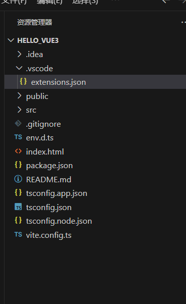

# 额外介绍


## 1.vue-cli、vite介绍

**1.1 什么是脚手架？**

> **脚手架**（Scaffolding）在软件开发中是指一类工具，它能够自动生成项目的基本结构、配置文件和必要的依赖，使开发者能够快速启动项目，专注于业务逻辑的实现。脚手架工具通常提供命令行界面，用于创建和配置新项目。
>
> **经典的脚手架工具**：
>
> - **Vue CLI**：用于生成 Vue.js 项目，自动配置 Webpack、Babel 等工具。
> - **Create React App**：用于生成 React 项目，自动配置 Webpack、Babel 等工具。
> - **Angular CLI**：用于生成 Angular 项目，自动配置 TypeScript、Webpack 等工具。
> - **Yeoman**：一个通用的脚手架工具，可以通过各种生成器创建不同类型的项目。
>

**1.2 Vue CLI 与Webpack？**

> - **Vue CLI** 是一个脚手架工具。它用于生成 Vue.js 项目，提供了预配置的项目结构、开发环境和构建工具，使开发者能够快速启动 Vue.js 项目。
>
> - **Webpack** 不是脚手架工具。Webpack 是一个模块打包工具（module bundler），用于将项目中的各种资源（如 JavaScript 文件、CSS 文件、图片等）打包成一个或多个文件，以便于在浏览器中运行。Webpack 本身不生成项目结构，它主要负责构建过程中的资源处理。
>

**1.3 Vite 为什么不是脚手架？**

> **Vite** 主要是一个构建工具，它专注于提供快速的开发体验和高效的生产构建。尽管 Vite 也可以用于生成项目并提供开发服务器，但它本质上不是一个脚手架工具。以下是 Vite 和 Vue CLI 的主要区别：
>
> - **Vite 的特点**：
>   - 提供快速启动的开发服务器。
>   - 支持即时热更新（HMR）。
>   - 使用 Rollup 进行生产构建，提供高效的代码拆分和优化。
>   - 配置相对简单，主要关注构建和开发体验。
>
> - **Vue CLI 的特点**：
>   - 提供项目生成功能，可以通过交互式命令行生成预配置的 Vue.js 项目。
>   - 配置和管理 Webpack，提供许多开箱即用的功能和插件。
>   - 支持 Vue 项目的全生命周期管理，包括开发、测试和构建。
>   - 提供插件机制，可以扩展项目功能（如 TypeScript 支持、PWA 支持等）。
>

> **总结**：
>
> - **脚手架工具**：主要功能是生成项目结构和配置，帮助开发者快速启动新项目。典型的例子有 Vue CLI、Create React App 和 Angular CLI。
> - **构建工具**：主要功能是处理项目的依赖和资源，提供开发和构建支持。Vite 和 Webpack 都属于构建工具。
>
> Vite 之所以不被称为脚手架，是因为它的主要目标是提供快速的开发和高效的构建体验，而不是生成项目结构和配置。因此，Vite 更适合作为构建工具，而 Vue CLI 则是一个完整的脚手架工具，帮助开发者从零开始搭建和管理项目。

<br>

## 2.Typescript

**TypeScript 是什么**

> TypeScript 是由微软开发和维护的一种开源编程语言。它是 JavaScript 的一个超集，扩展了 JavaScript 的语法，使得在开发大型应用时更加可控和可靠。TypeScript 主要增加了对静态类型的支持，允许开发者在编写代码时指定变量、函数和对象的类型。
>


**TypeScript 与 JavaScript 的区别**

> 1. **类型系统**：TypeScript 是静态类型语言，而 JavaScript 是动态类型语言。在 TypeScript 中，变量的类型在编译时确定，可以在代码编写过程中发现并修正类型错误。
>
> 2. **编译**：TypeScript 需要经过编译（transpile）成 JavaScript 代码才能在浏览器或 Node.js 环境中运行。JavaScript 是解释执行的，不需要编译。
>
> 3. **现代特性**：TypeScript 支持现代 JavaScript 特性，并且可以在旧的运行环境中使用这些特性，因为编译器会将这些特性转换为兼容的 JavaScript 代码。
>
> 4. **IDE 支持**：TypeScript 提供了更好的代码补全、重构、导航等开发工具支持，极大提高了开发者的生产力。
>


**TypeScript 的历史**

> TypeScript 由微软在 2012 年首次发布，旨在解决 JavaScript 在开发大型复杂应用程序时的不足。由于 JavaScript 的灵活性和弱类型特性，开发大型应用程序时容易出现类型相关的错误和维护难题。TypeScript 的出现提供了一种在编写代码时确保类型安全的方法，帮助开发者在早期发现并修复错误。
>


**TypeScript 的优缺点**

> 优点
>
> 1. **类型安全**：提供静态类型检查，减少运行时错误，提高代码的健壮性和可维护性。
> 2. **开发工具支持**：增强的代码编辑体验，包括代码补全、类型提示、重构工具等。
> 3. **现代特性支持**：可以使用最新的 JavaScript 特性，并在旧环境中运行。
> 4. **大型项目的可维护性**：更好的模块化和类型定义，使大型项目的代码更加易于理解和维护。
> 5. **社区和生态系统**：有庞大的社区和丰富的第三方库的类型定义（通过 DefinitelyTyped 项目）。
>
> 缺点
>
> 1. **学习曲线**：对于没有类型语言经验的开发者来说，可能需要一些时间来学习和适应 TypeScript 的类型系统。
> 2. **编译步骤**：需要一个编译步骤来将 TypeScript 转换为 JavaScript，增加了构建过程的复杂性。
> 3. **开发速度**：在小型项目或原型开发中，可能会因为需要额外的类型定义而降低开发速度。
>


**TypeScript 的应用场景**

> 场景一：大型企业应用
>
> 大型企业应用通常包含成千上万行代码和多个模块，维护难度大。TypeScript 的类型检查和模块化特性可以帮助开发团队在编写代码时发现错误，并且提高代码的可维护性。例如，微软的 Visual Studio Code 编辑器就是用 TypeScript 编写的。
>
> 场景二：团队合作
>
> 在团队合作中，不同开发者编写的代码需要整合在一起。TypeScript 的类型定义使得接口和模块的约定更加明确，减少了因为类型不匹配导致的错误，增强了团队之间的协作效率。
>
> 场景三：前端开发
>
> 在前端开发中，尤其是使用框架（如 Angular、React、Vue）时，TypeScript 提供了更好的开发体验和工具支持。例如，Angular 框架是完全使用 TypeScript 编写的，提供了强类型的开发体验。
>


**使用 TypeScript 的故事展现**

> 故事背景
>
> 假设有一个中型科技公司，负责开发一款复杂的项目管理工具。这个工具涉及用户管理、任务分配、时间跟踪等功能，代码库已经发展到几万行，并且有多个开发者同时在项目上工作。
>
> 面临的问题
>
> - **频繁的运行时错误**：由于 JavaScript 的动态类型特性，许多类型相关的错误只能在运行时发现，导致了许多线上故障。
> - **开发和维护成本高**：随着代码库的增长，代码的可维护性变差，开发者需要花费大量时间理解和修复代码。
> - **团队协作效率低**：不同开发者编写的代码接口不统一，导致集成过程中出现许多问题。
>
> 引入 TypeScript
>
> 为了提高代码的健壮性和可维护性，技术负责人决定引入 TypeScript：
>
> 1. **类型检查**：开发者在编写代码时立即能发现类型错误，减少了运行时错误的发生。
> 2. **模块化**：使用 TypeScript 的模块和接口特性，将代码拆分成多个模块，每个模块有明确的接口定义，增强了代码的可维护性。
> 3. **开发工具支持**：使用 TypeScript 后，开发工具（如 Visual Studio Code）提供了更好的代码补全、类型提示和重构工具，提高了开发效率。
> 4. **团队协作**：定义了统一的接口和类型规范，团队成员之间的协作更加顺畅，减少了集成过程中出现的问题。
>
> 结果
>
> 引入 TypeScript 后，项目管理工具的开发效率显著提高，运行时错误大幅减少，代码的可维护性和团队协作也得到了改善。整个开发团队对 TypeScript 的引入给予了积极的反馈，项目进展更加顺利。
>


<br>

**总结**

> TypeScript 是一种增强版的 JavaScript，通过引入静态类型检查和现代特性，帮助开发者编写更加健壮、可维护的代码。它特别适用于大型项目和团队协作的场景，通过类型系统提高代码的质量和开发效率。虽然引入 TypeScript 需要一定的学习成本，但其带来的长期收益使得它在许多项目中成为了首选的开发语言。

## 3. JavaScript箭头函数

JavaScript的箭头函数（Arrow Functions）是ES6（ECMAScript 2015）引入的一种更简洁的函数定义方式。下面是对箭头函数的详细介绍：

**基本语法**

> 箭头函数使用箭头符号 `=>` 定义。基本形式如下：
>
> ```javascript
> (param1, param2, ..., paramN) => { 
>   // 函数体
> }
> ```
>
> 如果只有一个参数，参数括号可以省略：
>
> ```javascript
> param => {
>   // 函数体
> }
> ```
>
> 如果函数体只有一个表达式，可以省略大括号 `{}` 和 `return` 关键字：
>
> ```javascript
> (param1, param2) => expression
> ```
>


**示例**

> 无参数箭头函数
>
> ```javascript
> () => console.log('Hello, world!');
> ```
>
> 单参数箭头函数
>
> ```javascript
> x => x * x
> ```
> 等同于：
> ```javascript
> function(x) {
>   return x * x;
> }
> ```
>
> 多参数箭头函数
>
> ```javascript
> (a, b) => a + b
> ```
> 等同于：
> ```javascript
> function(a, b) {
>   return a + b;
> }
> ```
>
> 复杂函数体
>
> 如果函数体包含多条语句，需要使用大括号 `{}` 并显式返回值：
> ```javascript
> (a, b) => {
>   const result = a + b;
>   return result;
> }
> ```
>

**箭头函数的特点**

> `this` 绑定
>
> 箭头函数不创建自己的 `this`，它会捕获其所在上下文的 `this` 值（即封闭作用域内的 `this` 值）。这一特性使得箭头函数特别适用于回调函数和需要保持上下文 `this` 的场景。
>
> 示例：
> ```javascript
> function Person() {
>   this.age = 0;
> 
>   setInterval(() => {
>     this.age++; // this正确地指向了Person对象
>   }, 1000);
> }
> 
> let p = new Person();
> ```
>
> 不绑定 `arguments` 对象
>
> 箭头函数没有自己的 `arguments` 对象。如果需要访问参数对象，可以使用 `rest` 参数：
>
> ```javascript
> const sum = (...args) => {
>   return args.reduce((total, current) => total + current, 0);
> };
> ```
>
> 不能作为构造函数
>
> 箭头函数不能使用 `new` 关键字调用，因为它们没有 `[[Construct]]` 方法和 `prototype` 属性。
>
> 没有 `prototype` 属性
>
> 箭头函数没有 `prototype` 属性，因此不能用作构造函数。

**适用场景**

> - 简单的回调函数
> - 不需要绑定 `this` 的函数
> - 一行函数（使代码更简洁）
>
> 示例总结
>
> ```javascript
> // 无参数
> const greet = () => console.log('Hello, world!');
> 
> // 单参数
> const square = x => x * x;
> 
> // 多参数
> const add = (a, b) => a + b;
> 
> // 复杂函数体
> const multiply = (a, b) => {
>   const result = a * b;
>   return result;
> };
> 
> // 使用箭头函数保持上下文的this
> function Timer() {
>   this.seconds = 0;
> 
>   setInterval(() => {
>     this.seconds++;
>     console.log(this.seconds);
>   }, 1000);
> }
> 
> const timer = new Timer();
> ```
>
> 箭头函数使代码更简洁易读，特别适合简短的函数和需要保持上下文 `this` 的情况。不过在使用箭头函数时，需要了解它的一些限制和特性，以避免意外行为。

<br>

## 4.回顾TS中的接口/泛型/自定义类型

```vue
// js写法
let person = {id:'ege',name:'ligne',age:66}
```

上面这种数据定义方法容易将英文拼写错误，导致在文件多次传送的时候，在最终文件无法通过.访问想要的内部数据

可以使用ts的接口来限制具体属性

```vue
//定义一个接口，用于限制person对象的具体属性
export interface PersonInter {
    id:string,
    name:string,
    age:number
}
```

在对应的person.vue中引入并应用

```vue
<script lang="ts" setup name="person">
//由于PersonInter不是值，而是一种规范，所以要加type
import {type PersonInter } from '@/types'

// js写法
let person:PersonInter = {id:'ege',name:'ligne',age:66}

</script>
```

当key键和值格式对应不上时，会报错

如果要应用数组对象，需要使用泛型

方法一：使用泛型

```vue
//将规范应用于数组
let personList:Array<PersonInter> = [
    { id: 'ege', name: 'ligne', age: 66 },
    { id: 'king', name: 'ligne2', age: 66 },
    { id: 'exeg', name: 'ligne3', age: 66 }
]
```

方法二：自定义类型+泛型

```vue

//定义一个接口，用于限制person对象的具体属性
export interface PersonInter {
    id:string,
    name:string,
    age:number
}

//一个自定义类型
// export type Persons = Array<PersonInter>
export type Persons = PersonInter[]
```

```vue
<script lang="ts" setup name="person">
//由于PersonInter不是值，而是一种规范，所以要加type
import { type Persons} from '@/types'

// js写法
// let person:PersonInter = {id:'ege',name:'ligne',age:66}


//将规范应用于数组
let personList:Persons = [
    { id: 'ege', name: 'ligne', age: 66 },
    { id: 'king', name: 'ligne2', age: 66 },
    { id: 'exeg', name: 'ligne3', age: 66 }
]

```


<br>

##  5.axios

### axios介绍

Axios 是一个基于 Promise 的 HTTP 客户端，适用于浏览器和 Node.js。它由 Matt Zabriskie 开发，并在 GitHub 上开源发布，受到前端开发者的广泛欢迎。Axios 的出现背景主要是为了解决以下几个问题：

1. **简化 AJAX 请求**：在使用原生 JavaScript 进行 AJAX 请求时，代码通常比较冗长且不够直观。Axios 提供了一个更简洁和直观的 API，使得发送 HTTP 请求变得更加简单。
2. **Promise 支持**：原生的 XMLHttpRequest 不支持 Promise，而 Promise 是现代 JavaScript 中处理异步操作的标准方式。Axios 内置了对 Promise 的支持，使得处理异步请求更加方便。
3. **统一的 API**：无论是在浏览器还是在 Node.js 环境中，Axios 提供了统一的 API，这使得代码可以在不同环境中无缝运行。
4. **更好的错误处理**：Axios 提供了更好的错误处理机制，相比于原生的 XMLHttpRequest，更加易于捕获和处理请求错误。

<br>

> Promise 基础
>
> 在开始之前，先了解一下 Promise。Promise 是 JavaScript 异步编程的一种解决方案，用来处理异步操作（如网络请求）。一个 Promise 有三种状态：
>
> 1. **Pending**（进行中）：操作尚未完成。
> 2. **Fulfilled**（已成功）：操作完成，且成功。
> 3. **Rejected**（已失败）：操作完成，但失败。
>
> Promise 可以通过 `then` 方法来处理成功的结果，通过 `catch` 方法来处理错误。
>
> **Axios 使用 Promise**
>
> Axios 的每个请求方法（如 `get`, `post` 等）都会返回一个 Promise，因此你可以使用 `then` 和 `catch` 方法来处理请求的结果。
>
> `then` 方法
>
> `then` 方法用于处理成功的响应。它接受两个参数：
>
> 1. **onFulfilled**（可选）：当 Promise 状态变为 `fulfilled` 时调用的函数。
> 2. **onRejected**（可选）：当 Promise 状态变为 `rejected` 时调用的函数。
>
> ```javascript
> axios.get('https://jsonplaceholder.typicode.com/posts/1')
>   .then(response => {
>     // 当请求成功时，这里的代码会被执行
>     console.log(response.data);
>   })
>   .catch(error => {
>     // 当请求失败时，这里的代码会被执行
>     console.error('Error:', error);
>   });
> ```
>
> 在上面的例子中，当 GET 请求成功时，`then` 方法会接收到一个 `response` 对象。这个对象包含许多属性，比如：
>
> - `data`：服务器返回的数据。
> - `status`：HTTP 状态码（如 200 表示成功）。
> - `statusText`：HTTP 状态文本（如 "OK"）。
> - `headers`：响应头。
> - `config`：请求的配置信息。
> - `request`：表示请求的 XMLHttpRequest 对象（浏览器）或 http.ClientRequest 对象（Node.js）。
>
> `catch` 方法
>
> `catch` 方法用于处理错误。它只接受一个参数，即错误处理函数：
>
> ```javascript
> axios.get('https://jsonplaceholder.typicode.com/posts/1')
>   .then(response => {
>     console.log(response.data);
>   })
>   .catch(error => {
>     // 错误处理
>     console.error('Error:', error);
>   });
> ```
>
> 在上面的例子中，如果 GET 请求失败，`catch` 方法会被调用，并接收到一个 `error` 对象。这个对象包含许多属性，比如：
>
> - `message`：错误消息。
> - `response`：服务器返回的响应（如果有的话）。
> - `request`：表示请求的 XMLHttpRequest 对象（浏览器）或 http.ClientRequest 对象（Node.js）（如果请求已发送）。
> - `config`：请求的配置信息。
>
> 更详细的错误处理
>
> 在 `catch` 方法中，你可以对不同类型的错误进行详细处理：
>
> ```javascript
> axios.get('https://jsonplaceholder.typicode.com/posts/1')
>   .then(response => {
>     console.log(response.data);
>   })
>   .catch(error => {
>     if (error.response) {
>       // 请求已发出，但服务器响应了状态码不在 2xx 范围内
>       console.error('Error data:', error.response.data);
>       console.error('Error status:', error.response.status);
>       console.error('Error headers:', error.response.headers);
>     } else if (error.request) {
>       // 请求已发出，但没有收到响应
>       console.error('Error request:', error.request);
>     } else {
>       // 发生了一些错误，在设置请求时触发
>       console.error('Error message:', error.message);
>     }
>     console.error('Error config:', error.config);
>   });
> ```
>
> 链式调用
>
> 你可以链式调用多个 `then` 和 `catch` 方法来处理多个异步操作：
>
> ```javascript
> axios.get('https://jsonplaceholder.typicode.com/posts/1')
>   .then(response => {
>     console.log('First request:', response.data);
>     return axios.get('https://jsonplaceholder.typicode.com/posts/2');
>   })
>   .then(response => {
>     console.log('Second request:', response.data);
>   })
>   .catch(error => {
>     console.error('Error:', error);
>   });
> ```
>
> 在上面的例子中，第一个 `then` 方法处理了第一个 GET 请求并返回第二个 GET 请求的 Promise，第二个 `then` 方法处理第二个 GET 请求的结果。`catch` 方法会捕获所有请求中的错误。
>
> 总结
>
> - **`then` 方法**：用于处理成功的响应，接受两个参数（成功回调和失败回调）。
> - **`catch` 方法**：用于处理错误，接受一个参数（错误回调）。
> - **`response` 对象**：包含服务器返回的各种信息（如数据、状态码、状态文本、响应头等）。
> - **`error` 对象**：包含错误的详细信息（如错误消息、响应、请求、配置信息等）。
>
> 通过这些内容，你应该能够更好地理解如何使用 Axios 处理 HTTP 请求及其响应。

好的，下面我们详细介绍 Axios 中配置请求的参数。你可以在全局配置、实例配置、或单个请求中使用这些配置参数。


### axios基本使用


**配置请求参数**

Axios 的配置选项可以在创建实例时设置，也可以在单个请求中设置。常用的配置选项包括：

- `url`: 请求的地址
- `method`: 请求的方法（如 `get`, `post`, `put`, `delete` 等）
- `baseURL`: 将自动加在 `url` 前面，除非 `url` 是一个绝对 URL
- `headers`: 自定义 HTTP 头
- `params`: URL 查询参数对象
- `data`: 请求体数据
- `timeout`: 请求超时时间（毫秒）
- `auth`: 基本认证 `{ username: '', password: '' }`
- `responseType`: 服务器响应的数据类型，如 `json`, `blob`, `document`, `arraybuffer`, `text`, `stream`
- `cancelToken`: 用于取消请求的标记
- `withCredentials`: 跨域请求时是否需要使用凭证

全局配置

你可以在创建 Axios 实例时设置全局配置：

```javascript
const axiosInstance = axios.create({
  baseURL: 'https://api.example.com',
  timeout: 1000,
  headers: {'X-Custom-Header': 'foobar'}
});
```

单个请求配置

你也可以在每个请求中单独设置这些配置：

配置示例

```javascript
axios({
  method: 'post', // 请求方法
  url: 'https://jsonplaceholder.typicode.com/posts', // 请求地址
  baseURL: 'https://api.example.com', // 基础 URL
  headers: {
    'Content-Type': 'application/json',
    'Authorization': 'Bearer your-token'
  }, // 自定义头部
  params: {
    userId: 1
  }, // URL 查询参数
  data: {
    title: 'foo',
    body: 'bar',
    userId: 1
  }, // 请求体数据
  timeout: 1000, // 超时时间
  responseType: 'json', // 响应类型
  withCredentials: true, // 跨域请求时是否使用凭证
  cancelToken: new axios.CancelToken(cancel => {
    // 取消请求的标记
  })
})
.then(response => {
  console.log(response.data);
})
.catch(error => {
  console.error('Error:', error);
});
```

配置选项详解

- **`url`**: 请求的地址。如果设置了 `baseURL`，并且 `url` 是相对地址，则 `baseURL` 会加在 `url` 前面。

  ```javascript
  axios({
    url: '/posts',
    baseURL: 'https://jsonplaceholder.typicode.com'
  });
  ```

- **`method`**: 请求的方法。默认是 `get`。

  ```javascript
  axios({
    method: 'post',
    url: '/posts'
  });
  ```

- **`baseURL`**: 将自动加在 `url` 前面，除非 `url` 是一个绝对 URL。这有助于为 Axios 实例设置一个基础 URL。

  ```javascript
  const axiosInstance = axios.create({
    baseURL: 'https://jsonplaceholder.typicode.com'
  });
  ```

- **`headers`**: 自定义 HTTP 头。可以用于设置认证信息、内容类型等。

  ```javascript
  axios({
    url: '/posts',
    headers: {
      'Authorization': 'Bearer your-token',
      'Content-Type': 'application/json'
    }
  });
  ```

- **`params`**: URL 查询参数对象。会自动转换为查询字符串并附加到 URL 后面。

  ```javascript
  axios({
    url: '/posts',
    params: {
      userId: 1
    }
  });
  ```

- **`data`**: 请求体数据。用于 `post`, `put`, `patch` 等请求方法。

  ```javascript
  axios({
    method: 'post',
    url: '/posts',
    data: {
      title: 'foo',
      body: 'bar',
      userId: 1
    }
  });
  ```

- **`timeout`**: 请求超时时间（毫秒）。如果请求超过这个时间，Promise 会被 `reject`。

  ```javascript
  axios({
    url: '/posts',
    timeout: 1000
  });
  ```

- **`auth`**: 基本认证 `{ username: '', password: '' }`。会自动设置 `Authorization` 头。

  ```javascript
  axios({
    url: '/posts',
    auth: {
      username: 'user',
      password: 'pass'
    }
  });
  ```

- **`responseType`**: 服务器响应的数据类型。默认是 `json`。

  ```javascript
  axios({
    url: '/posts',
    responseType: 'json'
  });
  ```

- **`cancelToken`**: 用于取消请求的标记。

  ```javascript
  const CancelToken = axios.CancelToken;
  const source = CancelToken.source();

  axios({
    url: '/posts',
    cancelToken: source.token
  });

  // 取消请求
  source.cancel('Operation canceled by the user.');
  ```

- **`withCredentials`**: 跨域请求时是否需要使用凭证。默认是 `false`。

  ```javascript
  axios({
    url: '/posts',
    withCredentials: true
  });
  ```


拦截器（interceptors）是 Axios 提供的一个强大功能，用于在发送请求或响应到达 then 或 catch 之前拦截它们。拦截器允许你在请求或响应被处理前对它们进行改变或者执行额外的操作。让我来详细解释一下拦截器和 `.then/.catch` 的区别和作用：

### 拦截器（Interceptors）

在 Axios 中，拦截器允许你在请求或响应被处理前对它们进行拦截和转换。主要有两种类型的拦截器：

1. **请求拦截器**：在请求被发送之前执行的操作，比如添加认证信息、设置请求头等。
   
2. **响应拦截器**：在接收到响应之前执行的操作，比如处理数据格式、统一处理错误等。

示例代码：

```javascript
// 添加请求拦截器
axios.interceptors.request.use(config => {
    // 在请求发送之前做些什么
    console.log('请求拦截器:', config);
    return config;
}, error => {
    // 对请求错误做些什么
    console.error('请求拦截器错误:', error);
    return Promise.reject(error);
});

// 添加响应拦截器
axios.interceptors.response.use(response => {
    // 对响应数据做些什么
    console.log('响应拦截器:', response);
    return response;
}, error => {
    // 对响应错误做些什么
    console.error('响应拦截器错误:', error);
    return Promise.reject(error);
});

// 发送请求
axios.get('https://api.example.com/data')
  .then(response => {
    // 处理成功的情况
    console.log('请求成功:', response.data);
  })
  .catch(error => {
    // 处理失败的情况
    console.error('请求失败:', error);
  });
```

`.then` 和 `.catch`

`.then` 和 `.catch` 是 Promise 提供的方法，用于处理异步操作的成功和失败情况。它们不是拦截器，而是 Promise 链式调用的一部分，用于在请求成功或失败时执行相应的操作。

- **`.then` 方法**：用于处理请求成功时的逻辑，接收一个成功回调函数作为参数。
  
- **`.catch` 方法**：用于处理请求失败时的逻辑，接收一个错误回调函数作为参数。

示例代码：

```javascript
axios.get('https://api.example.com/data')
  .then(response => {
    console.log('请求成功:', response.data);
    // 处理成功逻辑
  })
  .catch(error => {
    console.error('请求失败:', error);
    // 处理失败逻辑
  });
```

**区别和作用**

- **拦截器（interceptors）**：
  - 允许在请求或响应被处理前对它们进行拦截和处理。
  - 可以在请求或响应被发送或接收之前，对其进行全局性的处理，比如添加认证信息、统一处理错误等。

- **`.then` 和 `.catch`**：
  - 是 Promise 的方法，用于处理异步操作的成功和失败情况。
  - 只能在单个请求的链式调用中使用，处理特定请求的成功或失败。

总结

拦截器（interceptors）和 `.then/.catch` 都是 Axios 提供的处理请求和响应的重要机制，但它们的作用和使用方式有所不同。拦截器用于全局处理请求和响应的中间过程，而 `.then/.catch` 用于处理单个请求的成功和失败结果。

<br>

# 6.localStorage

localStorage 是 Web Storage API 的一部分，是一种在客户端（浏览器）中存储数据的方式。它允许你将数据以键值对的形式存储在浏览器中，即使浏览器关闭并重新打开，这些数据仍然保留。这使得 localStorage 成为一种持久化存储数据的简单方式。

localStorage 的特点

- **持久性**: 数据会在浏览器会话中持久存在，直到显式删除它。
- **存储容量**: 通常每个域名可以存储 5-10MB 的数据。
- **数据类型**: 只能存储字符串数据，如果需要存储复杂数据类型，需要先将其转换为 JSON 字符串。
- **同源策略**: localStorage 遵循同源策略，不同域名下的数据互不可见。

常见方法

localStorage 提供了一些方法来进行数据存取和管理：

- **setItem(key, value)**: 将数据存储到 localStorage 中。
- **getItem(key)**: 从 localStorage 中读取数据。
- **removeItem(key)**: 从 localStorage 中删除数据。
- **clear()**: 清除所有存储在 localStorage 中的数据。
- **key(index)**: 获取存储中的第 `index` 个键名。

使用示例

存储数据

将一个对象存储到 localStorage 中：
```javascript
let user = {
  name: "Alice",
  age: 25
};

// 将对象转换为 JSON 字符串并存储到 localStorage 中
localStorage.setItem('user', JSON.stringify(user));
```

读取数据

从 localStorage 中读取并解析对象：
```javascript
let storedUser = localStorage.getItem('user');
if (storedUser) {
  let user = JSON.parse(storedUser);
  console.log(user.name); // 输出: Alice
}
```

删除数据

从 localStorage 中删除数据：
```javascript
localStorage.removeItem('user');
```

清空所有数据

清空 localStorage 中的所有数据：
```javascript
localStorage.clear();
```

实际应用

localStorage 通常用于以下场景：
- **保存用户偏好**: 例如主题设置、语言选择等。
- **保存表单数据**: 用户在填写表单过程中关闭页面，再次打开时可以恢复填写的数据。
- **缓存数据**: 缓存一些不会频繁改变的数据，减少服务器请求。

localStorage 与 sessionStorage 的区别

- **localStorage**: 数据持久存在，直到显式删除。
- **sessionStorage**: 数据在页面会话期间存在，关闭浏览器或标签页后数据被清除。

安全性

需要注意的是，localStorage 中存储的数据对同源下的所有脚本都是可见的，因此不要存储敏感数据，例如用户密码、敏感的个人信息等。对于这些数据，应使用更安全的存储方式（如服务器端存储）并确保数据传输的安全性（如使用 HTTPS）。


# 0.课程介绍

本文件是bilibili尚硅谷的Vue3课程笔记，发布时间是2023年12月


<br>

# 1.Vue3 简介

Vue3在2020年9月18日发布，代号one piece

## 1.1 性能的提升

- 打包大小减少41%
- 初次渲染快55%，更新渲染快133%
- 内存减少54%

<br>

## 1.2 源码的提升

- 使用Proxy代替defineProperty实现响应式
- 重写虚拟DOM的实现和Tree-Shaking

<br>


## 1.3 拥抱TypeScript

- Vue3可以更好的支持TypeScript

<br>


## 1.4新的特性

1. Composition APi（组合式API）

   - setup

   - ref与reactive

   - computed与watch

     ...

2. 新的内置组件：

   - Fragment

   - Teleport

   - Suspense

     ...

3. 其他改变：

   - 新的生命周期钩子

   - data选项应始终被声明为一个函数

   - 移除keyCode支持作为v-on的修饰符

     ...

<br>


# 2.创建Vue3工程

## 2.1 基于vue-cli创建

ps：目前vue-cli已处于维护模式，官方推荐基于vite创建项目

``` 
## 查看@vue/cli版本，确保@vue/cli版本在4.5.0以上
vue --version

## 安装或者升级你的@vue/cli
npm install -g @vue/cli

## 执行创建命令
vue create vue_test

##	随后选择3.x
##	choose a version of vue.js that you want to start the project with (use arrow keys)
## >3.x
##  2.x

## 启动
cd vue_test
npm run server

```


<br>


## 2.2 基于vite创建（推荐）

vite是新一代前端构建工具，官网地址：`https//vitejs.cn` ,vite的优势如下：

- 轻量快速的热重载（HMR），能实现极速的服务启动。
- 对TypeScript，JSX、CSS等支持开箱即用
- 真正的按需编译，不再等待整个应用编译完成
- 具体操作如下

``` vue
## 1.创建命令
npm create vue@latest

## 2.具体配置
## 配置项目名称
Project name: vue3_test
## 是否添加TypeScript支持
Add TypeScript？ Yes
## 是否添加JSX支持
Add JSX Support？ No
## 是否添加路由环境
Add Vue Router for Single Page Application development? No
## 是否添加pinia环境
Add Pinia for state management? No
## 是否添加单元测试
Add Vitest for Unit Testing? No
## 是否添加端到端测试方案
Add an End-to-End Testing Solution?  No
## 是否添加Prettiert代码化
Add EsLint for code quality? No
```

创建的项目目录如下图所示（vscode打开）



介绍相关目录和文件

- .vscode里面有个extensions.json文件，负责提示vscode是否安装里面的默认插件
- public里面只有个favicon.ico文件，即页签图标
- src里面是所有前端工程师的工作目录（写js、css和vue的）
- .gitignore，这个是git的忽略文件，负责在提交时候决定忽略什么文件
- env.d.ts，此时只有一条代码且报错，需要允许`npm i `安装所有依赖，本文件的具体功能是
  - 让你的项目可以认识txt、ts等文件，否则导入文件会失败

​		之所以爆红是由于要使用一些依赖，因此需要执行`npm i`创建node_module目录

- index.html，入口文件（区别于vue-cli的main.js）
- package-lock.json和package.json都是包的管理文件
- tsconfig.app.json、tsconfig.json、tsconfig.node.json都是js的配置文件
- vite.config.ts是整个工程的配置文件

 想要执行该前端项目，可以查询package.json，寻找短命令

` npm run dev` 

查看到的效果就是index.html效果，该页面中引入了src的main.ts


<br>

#### 2.2.1 编写App组件

本节开始详细介绍src目录的文件

- main.ts 的内容如下

``` typescript
import './assets/main.css'

import { createApp } from 'vue'		//创建应用（相当于种花的花盆）
import App from './App.vue'			//组件（相当于种花的根）

createApp(App).mount('#app')		//创建应用且传入根组件，并将挂载在id为app的div内（把花插到花盆上）
									//id=app的地方在index.html中

```

- App.vue就是根组件，是根
- components是所有的子组件，树叶

由此上述可知，src重要的两个文件App.vue和main.ts

App.vue要写三种结构

- template里面写html
- script里面写Js或Ts代码
- style里面写样式

``` vue
<template>
    <!-- html -->
    <div class="app">
        <h1>你好</h1>
    </div>

</template>

<script lang="ts">
  // JS 或 TS
    export default{
        name:'App'      //组件名
    }

</script>

<style>
    /* 样式 */
    .app {
        background-color: #ddd;
        box-shadow: 0 0 10px;
        border-radius: 10px;
        padding:20px;
    }

</style>
```

总结：

- vite项目中，index.html是项目的入口我呢见，在项目最外层

- 加载index.html后，vite解析`<script type="module" src="xxx">`指向的JavaScript

- Vue3中式通过createApp函数创建一个应用实例

  


<br>

## 2.3 一个简单的效果

首先编写一个Person组件，并且在App中注册

```vue
<template>
    <!-- html -->
    <div class="person">
        <h2>姓名:{{ name }}</h2>
        <h2>年龄:{{ age }}</h2>
        <button @click="showTel">查看联系方式</button>
    </div>

</template>

<script lang="ts">
  // JS 或 TS
    export default{
        name:'Person',      //组件名
        data(){
            return {
                name:'张三',
                age:18,
                tel:1232142141,
            }
        },
        methods:{
            showTel(){
                alert(this.tel)
            }
        }
    }

</script>

<style>
    /* 样式 */
    .person {
        background-color: skyblue;
        box-shadow: 0 0 10px;
        border-radius: 10px;
        padding:20px;
    }

</style>
```

```vue
<template>
    <!-- html -->
    <div class="app">
        <h1>你好</h1>
        <Person/>
    </div>

</template>

<script lang="ts">
  // JS 或 TS 
    import Person from './components/Person.vue'
    export default{
        name:'App',      //组件名
        components:{Person} //注册组件
    }

</script>

<style>
    /* 样式 */
    .app {
        background-color: #ddd;
        box-shadow: 0 0 10px;
        border-radius: 10px;
        padding:20px;
    }

</style>
```

上述使用的是vue2的语法，这是由于vue3支持向下兼容


<br>


# 3.Vue核心语法

上述简单效果使用vue2，其中配置data、methods属于是选项式API

## 3.1 OptionsAPI与CompositionAPI

- Vue2的API设计式Options（配置）风格的
- Vue3的API设计式Composition（组合）风格的


**Options API的弊端**

Options类型的API，数据、方法、计算属性等，是分散在data、methods、computed中的，若向新增或修个一个需求，

就需要分别修改data、methods、computed，不便于维护和复用

> 具体的详细分析[做了一夜动画，就为让大家更好的理解Vue3的Composition Api - 哔哩哔哩 (bilibili.com)](https://www.bilibili.com/read/cv10685553/)
>


**Composition的优势**

可以用函数的方式，更加优雅的组织代码，让相关功能的代码更加有序的组织在一起

<br>

## 3.2 拉开序幕的setup

set是Vue3中一个新的配置项，值是一个函数，他是Composition API “表演的舞台”，组件中所用到的：数据、方法、计算属性、监视...等等，均配置在setup中。

特点如下：

- setup函数返回的对象中的内容，可以直接在模板中使用
- setup中访问this是undefined
- setup函数会在beforeCreate之前调用，他是“领先”所有钩子函数执行的
- setup的返回值可以是一个渲染函数

```vue
<template>
    <!-- html -->
    <div class="person">
        <h2>姓名:{{ name }}</h2>
        <h2>年龄:{{ age }}</h2>
        <button @click="changeName">修改名字</button>
        <button @click="changeAge">修改年龄</button>
        <button @click="showTel">查看联系方式</button>
    </div>

</template>

<script lang="ts">
  // JS 或 TS
    export default{
        name:'Person',      //组件名
        setup(){
            //数据
            let name = '张三'
            let age  = 18
            let tel  = '1546489855'


            //方法
            function changeName(){
                name = 'zhang-han'
            }
            function changeAge(){
                age += 1
            }
            function showTel(){
                alert(tel)
            }

            return {name,age,changeName,changeAge,showTel}
        }
    }

</script>

<style>
    /* 样式 */
    .person {
        background-color: skyblue;
        box-shadow: 0 0 10px;
        border-radius: 10px;
        padding:20px;
    }

</style>
```

setup里面的函数不能使用this，此外如果直接使用let定义数据，那么数据就不是响应式的，即点击数据页面不会同步更新
ps：响应式，修改数据会更新用到的地方

``` vue
return {name,age,changeName,changeAge,showTel}

//另一种返回
// return ()=>'哈哈'
// 相当于 return function (){ return '哈哈'}
```

<br>

**setup与OptionAPI**

在vue3中，组合式写法和选项式写法可以共存。

setup由于执行是最早的（比data、methods更早），所以在OptionApi的写法中可以读取setup函数里面定义的数据（this.xx）,但setup中不能够读取选项式写法中的data数据。

```vue
export default{
        name:'Person',      //组件名
        data(){
            return {
                a:100,
                c:this.name
            }
        },
        methods:{
            b(){
                console.log('b')
            }
        },
        setup(){
            //数据
            let name = '张三'
            let age  = 18
            let tel  = '1546489855'


            //方法
            function changeName(){
                name = 'zhang-han'
            }
            function changeAge(){
                age += 1
            }
            function showTel(){
                alert(tel)
            }

            return {name,age,changeName,changeAge,showTel}
            
            // return ()=>'哈哈'
            // 相当于 return function (){ return '哈哈'}
        }
    }

```

上面的混合写法不推荐

<br>

**setup的语法糖**

```vue
<template>
    <!-- html -->
    <div class="person">
        <h2>姓名:{{ name }}</h2>
        <h2>年龄:{{ age }}</h2>
        <button @click="changeName">修改名字</button>
        <button @click="changeAge">修改年龄</button>
        <button @click="showTel">查看联系方式</button>
    </div>

</template>

<script lang="ts">
  // JS 或 TS
    export default {
        name:'Person',      //组件名
        
    }

</script>

<!-- 相当于setup()，且会自动return -->
<script lang="ts" setup>
    //数据
    let name = '张三'
    let age  = 18
    let tel  = '1546489855'


    //方法
    function changeName(){
        name = 'zhang-han'
    }
    function changeAge(){
        age += 1
    }
    function showTel(){
        alert(tel)
    }
 
</script>


<style scoped>
    /* 样式 */
    .person {
        background-color: skyblue;
        box-shadow: 0 0 10px;
        border-radius: 10px;
        padding:20px;
    }

</style>
```

可以通过scirpt setup  实现定义数据自动返回（既不用写return）

注意不能将export default和 script setup写到一起

<br>

为了避免每次为了写个name，额外写出script里面的export  ...，可以使用一个插件，安装如下

1. ` npm i vite-plugin-vue-setup-extend -D `

2. 安装完成后，还要在vite.config.ts中import引入，引入名字可以任意

```
` import xxx from 'vite-plugin-vue-setup-extend'`
```

3. vite.config.ts中追加调用

   ` plugins:[vue(),xx()]`

4. 在script中应用

``` vue
<script lang="ts" setup name="person">
 ...
</script>
```

此外，如果工作中组件名和文件名相同，可以不写组件名

<br>

## 3.3 ref创建：基本类型的响应式数据

vue2中，只要在data中配置，那么就是响应式数据

vue3中，有两个东西定义响应式数据

- ref
- reactive


本小节使用ref进行介绍

1.首先使用需要在vue中引入ref（命名导入）

 ` import {ref} from 'vue' `

2.将想要变成响应式的数据，使用ref包裹

```vue
let name = ref('king')
let age  = ref(18)
```

打印数据，得到的是某个对象的实例化（实际的数据包在.value中，但是在template中自动调用.value，即直接使用变量名）

但是有个关键在于，在js中操作的时候必须操作变量名.value的值

3.修改对应的方法

```vue
function changeName(){
name.value = 'zhang-han'
}
function changeAge(){
age.value += 1
}
```

<br>

## 3.4 `reactive`创建：对象类型的响应式数据

```vue
<template>
    <!-- html -->
    <div class="person">
        <h2>一辆{{ car.brand }}车，价值{{car.price  }}万</h2>
        <button @click="changPrice">修改汽车价格</button>
    </div>

</template>


<!-- 相当于setup()，且会自动return -->
<script lang="ts" setup name="person223">
    import { reactive } from 'vue';

    let car = reactive({brand:"宝马",price:100})


    function changPrice(){
        car.price += 10
    }

</script>


<style scoped>
    /* 样式 */
    .person {
        background-color: skyblue;
        box-shadow: 0 0 10px;
        border-radius: 10px;
        padding:20px;
    }

</style>
```

打印`reactive`包含的对象，得到是`Proxy`对象（原生js就有的），`Proxy`是代理

只要用`reacitve`包裹，里面对象所有的变量都是响应式的，无论有多少层（就算是100层字典也一样）


<br>

## 3.5 ref创建：对象类型的响应式数据

reactive只能定义：对象类型的响应式数据

ref可以定义基本类型，还可以定义对象类型的

但是在ref创建对象的时候，在js中同样需要使用.value 来访问数据

``` vue
<template>
    <!-- html -->
    <div class="person">
        <h2>汽车信息：一辆{{ car.brand }}车，价值{{car.price  }}万</h2>
        <button @click="changPrice">修改汽车价格</button>
        
        <h2>游戏列表：</h2>
        <ul>
            <li v-for="g in games" :key="g.id">{{ g.name }}</li>
        </ul>
        <button @click="changeFirstGame">修改游戏名字</button>
    </div>

</template>


<!-- 相当于setup()，且会自动return -->
<script lang="ts" setup name="person223">
    import { ref } from 'vue';

    let car = ref({brand:"宝马",price:100})

    let games = ref([
        {id:'1',name:'backrooms'},
        {id:'2',name:'fata'},
        {id:'3',name:'shit'}
    ])


    function changPrice(){
        car.value.price += 10
    }
    function changeFirstGame(){
        games.value[0].name = 'shenme'
    }
</script>


<style scoped>
    /* 样式 */
    .person {
        background-color: skyblue;
        box-shadow: 0 0 10px;
        border-radius: 10px;
        padding:20px;
    }

</style>
```

为什么ref也可以定义对现象？

这个是因为，在ref对象对应的RefImpl对象中的value值会被封装成Proxy对象（reactive定义对象类生成的实例化对象）

即ref其实是通过reactive实现的

<br>

## 3.6 ref 对比reactive

宏观角度看

1. ref用来定义：基本类型数据、对象类型数据
2. reactive用来定义：对象类型数据

区别

1. ref创建的变量必须使用`.value`(js中)，也可使用volar插件自动添加

2. reactive重新分配一个新对象，就会失去响应式（可以使用object.assign去整体替换)，这个是局限性

   ``` vue
   let car = reactive({brand:'baoma',price:100})
   
   function changeCar(){
   	car = {brand:"tgge",price:100}
   }
   ```

   上述函数操作后，car不再是响应式数据（即使再加reactive也不行）

   正确用法如下

   ```vue
       function changeCar(){
           //object.assign(obj1,obj2,obj3)
           Object.assign(car.{brand:"kebi",price:1})
       }
   ```

   对于ref，可以直接赋值（这是由于value相当于是响应式数据的内部数据）


使用原则

1. 若需要一个基本类型的响应式数据，必须使用ref
2. 若需要一个响应式对象，层级不深，ref、reactive都可以
3. 若需要一个响应式对象，且层级较深，推荐使用reactive


<br>

## 3.7 toRefs与toRef


```vue
let person = reactive({
name:"king",
age:18
})

let {name,age} = person
```

上述方法进行赋值后，对name和age的数据不再是响应式

如何让解构后数据变成响应式的？

引入toRefs即可

```vue
import{reactive,toRefs} from 'vue' 
let person = reactive({
name:"king",
age:18
})

let {name,age} = toRefs(person)
```

此时name和age变成ObjectRefImpl对象，所以修改需要添加`.value`，此时修改name和age也会同时修改person对应的数据（类似引用）

<br>

除了toRefs外，还有toRef，这个是基本类型转换（toRefs是对象解构）

<br>

## 3.8 computed计算属性

在vue2中，计算属性使用如下

```vue
<script>
export default{
    computed:{
        
    }
}
</script>	
```

在vue3中，使用方法如下

```vue
<template>
    <!-- html -->
    <div class="person">
        姓：<input type=text v-model="firstname"> <br>
        名：<input type=text v-model="lastname"> <br>
        全名：<span>{{fullname }}</span>
    </div>

</template>


<script lang="ts" setup name="person223">
import {ref,computed} from 'vue'
let firstname = ref('king')
let lastname  = ref('shit')

//定义计算属性，只读
let fullname  = computed(()=>{
  return firstname.value.slice(0,1).toUpperCase() + firstname.value.slice(1) + '-' + lastname.value
})

```

只要计算属性发生变化，就会调用一次，但是如果多次调用相同的计算属性，只会调用一次

计算属性是有缓存的（另外方法没有缓存）

上述方法的计算数学是只读的，如何让计算属性可读可写？操作如下

```vue
let fullname = computed({
    get(){
        return firstname.value.slice(0,1).toUpperCase() + firstname.value.slice(1) + '-' + lastname.value
    },
    set(val){
        console.log('set',val)
    }
})

```

设置set和get函数，只要对fullname（计算属性）进行赋值，那么就会调用set函数，并传入fullname当前值

注意：即使赋值改变了fullname的数据，计算属性相关的firstname和lastname不变，当前页面展示的函数老的fullname

所以要确实改变计算属性，需要对set进行操作

```	vue
    set(val){
		const [str1,str2] = val.split('-')
        firstname.value = str1
		lastname.value  = str2
    }
```

<br>

## 3.9 watch监视

```vue

import {watch} from 'vue'

//监视
watch(监视谁,回调函数)
```


- 作用：监视数据的变化（和vue2的watch作用一致）
- 特点：Vue3中的watch只能监视以下四种数据
  1. ref定义的数据
  2. reactive定义的数据
  3. 函数返回一个值(getter函数)
  4. 一个包含上述内容的数组

我们在vue3中使用watch的时候，通常会遇到以下几种情况：

### 情况一

监听ref定义的【基本类型】数据：直接写数据名即可，监视的是其value值的改变。

```vue
<template>
    <!-- html -->
    <div class="person">
        <h1>情况一：监视【ref】定义的基本类型数据</h1>
        <h2>目前求和为:{{ sum }}</h2>
        <button @click="changSum">点击sum+1</button>
    </div>

</template>


<script lang="ts" setup name="person223">
import { ref,watch} from 'vue';


//数据
let sum = ref(0)

//方法
function changSum(){
    sum.value+=1
}

//监视
watch(sum,(newValue,oldValue)=>{
    console.log('sum改变了',newValue,oldValue)
})

</script>
```

监视器的sum不用使用.value


如何解除监视（例如sum大于10时候，解除监视）？

```vue
const stopWatch = watch(sum,(newValue,oldValue)=>{
    console.log('sum改变了',newValue,oldValue)
	if(nelValue){
		stopWatch()
	}
})
```

<br>

### 情况二

监视ref定义的【对象类型】数据：直接写数据名，监视的是对象的【地址值】，若像监视对象内部的数据，要手动开启深度监视

> 注意：
>
> - 若修改的是ref定义的对象中的属性，newVaule和oldValue都是新值，因为他们是同一个对象
> - 若修改整个ref定义的对象，newValue是新值，oldValue是旧值，因为不是同一个对象了

```vue
<template>
    <!-- html -->
    <div class="person">
        <h1>情况二:监视【ref】定义的对象类型数据</h1>
        <h2>姓名：{{person.name}}</h2>
        <h2>年龄：{{person.age}}</h2>
        <button @click="changeName">修改名字</button>
        <button @click="changeAge">修改年龄</button>
        <button @click="changePerson">修改人</button>

    </div>

</template>


<script lang="ts" setup name="person223">

import { ref, watch } from 'vue'
let person = ref({
    name: 'king',
    age: 18
})

function changeName(){
    person.value.name+='~'
}

function changeAge(){
    person.value.age+=1
}

function changePerson(){
    person.value = {name:'lgeg',age:1545}
}


//监视，情况一，监视ref的对象类型的数据，监视的是对象的地址值
watch(person,(newValue,oldValue)=>{
    console.log('person变化了',newValue,oldValue)
})


</script>
```

直接监视，是对对象类型的地址进行监视（即只有changePerson才调用watch）

若想监视对象内部属性的变化，则要手动开启深度监视。

```vue
//监视，情况一，监视ref的对象类型的数据，监视的是对象的地址值
watch(person,(newValue,oldValue)=>{
    console.log('person变化了',newValue,oldValue)
},{deep:true})
```

即在第三个参数进行配置deep：true（此外这里还能配置其他东西）


<bt>

### 情况三

监视reactive定义的【对象类型】数据，且默认开启了深度监视（不能关闭）

注意与ref的不同，就是对象赋值是不成立的（即不可整体修改）

此外使用assign修改整个对象，本质是修改原有对象的内部数据，而ref的对象赋值则是整个对象修改

```vue
    <!-- html -->
    <div class="person">
        <h1>情况三:监视【reactive】定义的对象类型数据</h1>
        <h2>姓名：{{person.name}}</h2>
        <h2>年龄：{{person.age}}</h2>
        <button @click="changeName">修改名字</button>
        <button @click="changeAge">修改年龄</button>
        <button @click="changePerson">修改人</button>

    </div>

</template>


<script lang="ts" setup name="person223">

import { reactive,watch} from 'vue'
let person = reactive({
    name: 'king',
    age: 18
})

function changeName(){
    person.name+='~'
}

function changeAge(){
    person.age+=1
}

function changePerson(){
    Object.assign(person,{name:"kingseg",age:150})
}

watch(person,(newValue,oldValue)=>{
    console.log('person改变了',newValue,oldValue)
})

</script>

```


<br>

### 情况四

监视ref或reactive定义的【对象类型】数据中的**某个属性**，注意点如下：

1. 若该属性值不是【对象类型】，需要写成函数形式
2. 若该属性值依然是【对象类型】，可以直接编，也可以写成函数，不过建议写成函数

结论：监视对象里的属性，最好写函数式，

基本结构

```vue
<template>
    <!-- html -->
    <div class="person">
        <h1>情况四:监视【reactive】定义的对象类型数据</h1>
        <h2>姓名：{{ person.name }}</h2>
        <h2>年龄：{{ person.age }}</h2>
        <h2>汽车：{{ person.car.c1 }}、{{ person.car.c2 }}</h2>

        <button @click="changeName">修改名字</button>
        <button @click="changeAge">修改年龄</button>
        <button @click="changeC1">修改第一台车</button>
        <button @click="changeC2">修改第二台车</button>
        <button @click="changeCar">修改整个车</button>

    </div>

</template>


<script lang="ts" setup name="person223">
import {reactive} from 'vue'

let person = reactive({
    name:'gkge',
    age:15,
    car:{
        c1:'ege',
        c2:'geg'
    }
})

//方法
function changeName(){
    person.name+='~'
}

function changeAge(){
    person.age+=1
}

function changeC1(){
    person.car.c1 = 'king'
}

function changeC2(){
    person.car.c2 = 'shit'
}

function changeCar(){
    person.car = {c1:'no',c2:'yes'}
}


</script>


```

监视对象内部的基本类型

```vue
watch(()=>{return person.name},(newvalue,oldValue)=>{
    console.log('person.name变化了',newvalue,oldValue)
})
```

要用箭头函数嵌套的原因在于，watch只能监控四种值（不用person.name)


监视对象内部的对象类型

```vue
watch(person.car,(newValue,oldValue)=>{
    console.log('person.car变化了',newValue,oldValue)
})
```

可以直接传入，但是此时只能监视car内部属性，不能监视car本身（即car本身改变不会调用watch），原因在于car改变后，监视会丢失

```vue
watch(()=>person.car,(newValue,oldValue)=>{
    console.log('person.car变化了',newValue,oldValue)
})
```

这种使用函数返回值的监视，监视的是对象的地址，此时不能监视对象内部（即car内部），但是可以监视car本身的变化

因此如何实现修改内部和整体都能监视？

可以在函数返回值监视的基础上，添加deep：true，即开启深度监视即可实现

<br>


### 情况五

监视上述多个数据

```vue
watch([()=>person.name,()=>person.car.c1],(newValue,oldValue)=>{
    console.log('person.car变化了',newValue,oldValue)
},{deep:true})
```

使用[]包含需要监视的数据

<br>


## 3.10 watchEffect

watchEffect的监视，会立即执行（类似设置了immediate）

官网：立即允许一个函数，同时响应式地追踪其依赖，并在依赖更改时重新执行函数

watch对比watchEffect

1. 都能监听响应式数据，不同的时建通数据的方式不同
2. watch：要明确监听的数据
3. watchEffect：不用明确监听的数据

```vue
//watch实现
// watch([temp, height], (newValue, oldValue) => {
//     //从value中获取最新的水温和水位
//     let [newTemp, newHeight] = newValue
//     if (newTemp >= 60 || newHeight >= 80) {
//         console.log("给服务器发请求")
//     }
// })

//watchEffect实现
watchEffect(()=>{
    if(temp.value>=60 || height.value>=80){
        console.log('给服务器发请求')
    }
})
```

上述对于两个数据的监视，分别使用了watch和watchEffect实现

watch需要实现声明要监视的值，而watchEffect则是使用了多少个就监视多少个

<br>


## 3.11 标签中的ref属性

作用：用于注册模板引用

- 用在普通的DOM标签上，获取的时DOM节点
- 用在组件标签上，获取的时组件实例对象

下面是原生js获取DOM节点的方法（通过id和getElementById方法）

```vue
<template>
    <!-- html -->
    <div class="person">
        <h1>中国</h1>
        <h2 id="city">北京</h2>
        <h3>广东</h3>
        <button @click="showLog">点我输出h2这个元素</button>
 

    </div>

</template>


<script lang="ts" setup name="person223">

function showLog(){
    //原生js获取DOM节点
    console.log(document.getElementById('city'))
}
```

但在实际生产环境中，不推荐使用id，这个是由于不同文件的id可能是相同的

解决的方法就是不用id，使用ref

```vue
<template>
    <!-- html -->
    <div class="person">
        <h1>中国</h1>
        <!-- 将整个h2节点存储在ref容器里 -->
        <h2 ref="city">北京</h2>
        <h3>广东</h3>
        <button @click="showLog">点我输出h2这个元素</button>
 

    </div>

</template>


<script lang="ts" setup name="person">
import { ref } from 'vue'

//创建一个city，用于存储ref标记的内容
let city = ref()

function showLog(){
    console.log(city.value)
}
```

这个方法就可以解决id重复的问题

此外，在person.vue通过ref标签输出内容的时候，会有一个data-xxx，而在App.vue中则没有
这个是局部样式，是由于本文件是css样式（有scoped），固定了选择自己本文件中的某个标签或元素

<br>

上述的ref都是加在html标签上，下面介绍一种加在组件标签上的使用

App.vue中

```vue
<template>
    <!-- html -->
      <Person ref="people"/>
      <h2 ref="city">南京</h2>
      <button @click="showLog">测试</button>
</template>

<script lang="ts" setup name="APP">
  // JS 或 TS 
    import Person from './components/Person.vue'
    import { ref } from 'vue'

    let city = ref()
    let people = ref()

    function showLog(){
      console.log(people.value)
    }

</script>

<style>
    /* 样式 */
   

</style>
```

peron.vue中

```vue
<template>
    <!-- html -->
    <div class="person">
        <h1>中国</h1>
        <!-- 将整个h2节点存储在ref容器里 -->
        <h2 ref="city">北京</h2>
        <h3>广东</h3>
        <button @click="showLog">点我输出h2这个元素</button>
 

    </div>

</template>


<script lang="ts" setup name="person">
import { ref,defineExpose} from 'vue'

//创建一个city，用于存储ref标记的内容
let city = ref()
let a = ref(0)
let b = ref(1)
let c = ref(2)

function showLog(){
    console.log(city.value)
}

defineExpose({a,b,c})


</script>
<style scoped>
/* 样式 */
.person {
    background-color: skyblue;
    box-shadow: 0 0 10px;
    border-radius: 10px;
    padding: 20px;
}

button {
    margin-right: 10px;
}
</style>
```

打印ref组件，得到的是组件实例，如果想要获取组件内部的定义对象，那么需要在内部定义defineExpose


ref添加标签，情况如下：

| html    | component |
| ------- | --------- |
| DOM节点 | 组件实例  |

<br>


## 3.12 props的使用

在Vue.js中，`prop`（property 的缩写）是用于父组件向子组件传递数据的一种机制。`props`使得组件之间的数据传递更加灵活和直观。通过使用`props`，父组件可以将数据和方法传递给子组件，子组件通过访问这些`props`来进行渲染和操作

如何在父组件传递参数给子组件？如下示例

App.vue中传入字符串a，传入list变量值为personList变量

```vue
<template>
    <!-- html -->
      <Person a="哈哈" :list="personList"/>
</template>

<script lang="ts" setup name="APP"> 
    import Person from './components/Person.vue'
    import {reactive} from 'vue'
    import { type Persons } from './types';

    let personList = reactive<Persons>([
        {id:'1',name:'shit',age:15},
        {id:'2',name:'sheeit',age:125},
        {id:'3',name:'shiteg',age:153},
    ])

</script>
```

在Person.vue中接受参数

```vue
<template>
    <!-- html -->
    <div class="person">
        <h2>{{ a }}</h2>
        <h2>{{ list }}</h2>

    </div>

</template>


<script lang="ts" setup name="person">
import { defineProps } from 'vue'

//接受
defineProps(['a','list'])

//接受并将props保存起来保存
//let x = defineProps(['a','list'])

</script>

```

只接受参数，不对参数进行校验是不适合的，因此下面有种新的接受+限制类型

```vue
//接受list+限制类型
//传入泛型，传入list且符合Persons规范
defineProps<{list:Persons}>()
```

下面是接受list+限制类型+限制必要性

```vue
//接收list + 限制类型 +限制必要性 + 指定默认值
//?必要性，withDefaults设置默认值
//withDefault第二个参数设置不能直接赋值，而要是函数返回值
withDefaults(defineProps<{list?:Persons}>(),{
    list:()=>[{id:"0",name:"king",age:18}]
})
```

最后说明一下，含define关键字的，一般不用手动引入，因为是宏函数（例如defineExpose、defineProps）

<br>

## 3.13 vue生命周期

人的生命周期

- 出生
- 经历
- 死亡

组件的生命周期

- 创建
- 挂载
- 更新
- 销毁

<br>

### vue2的生命周期

四个阶段，八个关键钩子函数：

创建（创建前，创建完毕）

- beforeCreate
- created

挂载（挂载前，挂载完毕）

- beforeMount
- mounted

更新（更新前，更新完毕）

- beforeUpdate
- updated

销毁（销毁前，销毁完毕）

- beforeDestroy

- destroyed


### vue3的生命周期

vue3相关的钩子生命周期函数需要传入回调函数

具体函数名称的如下：

```vue
import { ref,onBeforeMount,onMounted,onBeforeUpdate,onUpdated,onBeforeUnmount,onUnmounted} from 'vue'

//创建
console.log('创建')

//挂载前,并传递回调函数
onBeforeMount(()=>{
    console.log('挂载前')
})

//挂载完毕
onMounted (()=>{
    console.log('挂载完毕')
})

//更新前
onBeforeUpdate(()=>{
    console.log('更新前')
})

//更新完毕
onUpdated(()=>{
    console.log('更新完毕')
})

//卸载前
onBeforeUnmount(()=>{
    console.log('卸载前')
})

//卸载完毕
onUnmounted(()=>{
    console.log('卸载完毕')
})


```

注意：vue3没有销毁，而是卸载。创建的两个合成了setup

所有的组件都有生命周期。

对于复合组件的生命周期

- 先挂载子组件，后挂载父组件

vue3常用的钩子：挂载完毕、更新完毕、卸载之前


<br>

## 3.14 自定义Hooks

作用：让一个功能的数据和方法贴在一起

首先要新建一个hooks文件夹，里面的ts文件命名规则是use+要操作的对象

新建一个useDog.ts文件放在hooks文件夹里面，文件里面使用export暴露一个匿名函数

```vue
import { reactive} from 'vue';
import axios from 'axios';

//https://dog.ceo/api/breed/pembroke/images/random ,一个接口，随机返回一个狗图片


export default function (){
    let dogList = reactive([''])

    async function  addDog(){
        try {
            let result = await axios.get('https://dog.ceo/api/breed/pembroke/images/random')
            dogList.push(result.data.message)
        } catch(error){
            alert(error)
        }
    
    }

    //向外部提供东西
    return {dogList,addDog}
}
```

在主要的vue文件中引入

```vue
<script lang="ts" setup name="person">
import useSum from '@/hooks/useSum';
import useDog from '@/hooks/useDog';

const {sum,add} = useSum()
const {dogList,addDog} = useDog()


</script>
```

<br>


# 4.路由

对路由的理解：

- 路由就是一组key-value的对应关系
- 多个路由，需要经过路由器的管理

前端里面需要路由，是为了实现SPA（单页面应用），即一个html

<br>

