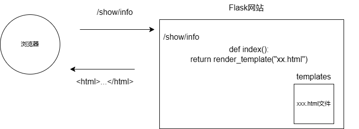

目的：开发网站

- 前端开发：html css javascript
- Web框架：接受请求并处理
- 数据库：存储数据的地方

快速上手：

​	基于Flask Web框架

深入学习：

​	基于Django框架（主要）


# 1.快速开发网站

首先python安装flask框架

` pip install flask` 

 

下面是一些补充说明

- 第一：网站需要很多标签

 - 第二：`Flask`框架为例写标签方便，支持将字符串写入到文件里


# 2 标签学习

head区域

- 编码 `<meat>`

- title `<title>`

body区域

- 标题 h系类

- div和span（可以结合css）
  - `div`，一个人占一行，块级标签
  - `span`，自己有多大占多少，行内标签（可能在同一行）

- 超链接：a标签

  ``` 
  #跳转到其他网站
  <a href="xxx"></>
  
  #跳转到自己网站其他的地址
  <a href="http://127.0.0.1:5000/get/news"></a>
  <a href="/get/news"></a>
  
  #默认是当前页面跳转
  target="_blank"放入a标签可以创建新页面跳转
  ```

  在自己的html中添加跳转自身网站的地址，需要在web.py执行文件中，添加相应的函数行为

- 图片img（行级）

  图片标签是一个自密合的标签

  ``` 
  
  
  #可以直接使用别人的图片地址（但可能有防盗链
  
  
  #可以显示自己的图片
  #Flask要求：自己项目创建static目录，图片放入其中
  
  ```

  ps 可以设置图片的高度合宽带

- 列表

  ```
  #无序标签
  <ul>
  	<li></li>
  </ul>
  ```

  ```
  #有序标签
  <ol>
  	<li></li>
  </ol>
  ```

- 表格标签

  ```html
  <table>
  	<thead>
          <tr> <th>ID</th> <th>姓名</th> <th>年龄</th> </tr>
      </thead>
      <tbody>
          <tr> <td>13</td> <td>kesi</td> <td>19</td> </tr>
      	<tr> <td>13</td> <td>无讼</td> <td>19</td> </tr>
          <tr> <td>13</td> <td>送容</td> <td>19</td> </tr>
          <tr> <td>13</td> <td>龙容</td> <td>19</td> </tr>
          <tr> <td>13</td> <td>送哦</td> <td>19</td> </tr>
          <tr> <td>13</td> <td>新机</td> <td>19</td> </tr>
          <tr> <td>13</td> <td>如果</td> <td>19</td> </tr>
      </tbody>
  </table>
  ```

- input 系列（7个）

  ```html
  <input type="text">			#文本框
  <input type="password">		#密码框
  <input type="file">			#上传文件
  
  <input type="radio" name="n1">男			#单选框
  <input type="radio" name="n1">女      	#通过name实现互斥
  
  #下面是复选框
  <input type="checkbox">篮球
  <input type="checkbox">足球
  <input type="checkbox">乒乓球
  <input type="checkbox">棒球
  
  #下面是两种按钮
  <input type="button" value="提交">      # 普通的按钮
  <input type="submit" value="提交">	  # 提交表单
  ```

- 下拉框

  ```html
  <select>
      <option>北京</option>
      <option>上海</option>
      <option>深圳</option>
  </select>
  
  #下面为多选下拉框
  <select multiple>
      <option>北京</option>
      <option>上海</option>
      <option>深圳</option>
  </select>
  
  ```

- 多行文本

  ```html
  <textarea></textarea>
  
  #下面默认三行
  <textarea row="3"></textarea>
  ```

- form表单

  ```html
  #method选择提交的方式get or post，而action选择提交的地址
  <form method="" action="">
  
  #form中的input标签，type为submit，则点击会提交数据，会提交表单中的name值
  <input type="button" value="submit按钮">
  
  #而type为button则为普通的按钮
  <input type="button" value="button按钮">    
  
  </form>
  ```

  ```
  #对于get提交的数据
      #接受用户通过GET形式发送过来的数据
      print(request.args)
      
  #对于post提交的数据
      #接受用户通过POST形式发送过来的数据
      print(request.form)
      #或者如果是json格式 request.json
  ```

  


小结

- 学习的标签
- 标签的划分：行级和块级
  - 块：h、div 、ul、ol
  - 行：span、a、img、input
- 标签可以嵌套


知识回顾

1. 网站请求流程




2. 一大堆标签

3. 网络请求本质

   1. 在浏览器的URL中写入地址，点击回车，访问

      ```
      浏览器会发送数据过去，本质上发送的是字符串
      "GET /explore http1.1\r\nhost:...\nuser-agent\r\n..\r\n"
      
      浏览器会发送数据过去，本质上发送的是字符串
      "POST /explore http1.1\r\nhost:...\nuser-agent\r\n..\r\n数据库"
      ```

   2. 浏览器向后端发送请求时

      - GET请求【URL方法/表单提交】

        - 现象：GET请求、跳转、向后台传入数据数据会拼接到URL上

          ```
          #注意提交的数据query=安卓&age=19&name=xx
          https://www.sogou.com/web?query=安卓&age=19&name=xx
          ```

          注意：GET请求数据会在URL中体现

        - POST请求【表单提交】

          - 现象：提交数据不在URL中而是在请求体中


# 3. 案例

## 3.1 创建用户列表


## 3.2 用户注册-1

无表单提交功能

```html
<!DOCTYPE html>
<html lang="en">
<head>
    <meta charset="UTF-8">
    <title>Title</title>
</head>
<body>
  <h1>用户注册</h1>
  <div>
    <label for="user_name">用户名:</label>
      <input type="text" id="user_name"/>
  </div>
  <div>
    <label for="user_password">密码:</label>
      <input type="password" id="user_password"/>
  </div>
  <div>
    <label>性别</label>
        <input type="radio" name="n1" id="user_sex_man"/>
          <label for="user_sex_man">男</label>
        <input type="radio" name="n1" id="user_sex_woman"/>
          <label for="user_sex_woman">女</label>
  </div>
  <div>
    <label>爱好:</label>
        <input type="checkbox" id="1"><label for="1">篮球</label>
        <input type="checkbox" id="2"><label for="2">羽毛球</label>
        <input type="checkbox" id="3"><label for="3">乒乓球</label>
  </div>
  <div>
    <label for="select_city">城市:</label>
    <select name="city" id="select_city">
      <option value="beijing">北京</option>
      <option value="shanghai">上海</option>
      <option value="shenzhen">深圳</option>
    </select>
  </div>
  <div>
    <label for="select_love">擅长领域:</label>
    <select multiple id="select_love">
      <option value="eat" id="eat_food"><label for="eat_food">吃饭</label></option>
      <option value="sleep" id="sleeping"><label for="sleeping">睡觉</label></option>
      <option value="game" id="play_game"><label for="play_game">玩游戏</label></option>
    </select>
  </div>
  <div>
    <label for="text_area">备注:</label>
    <textarea rows="3" id="text_area"></textarea>
  </div>
  <div>
    <input type="button" value="button按钮">
    <input type="button" value="submit按钮">
  </div>
</body>
</html>
```


## 3.3 用户注册-2

有表单提交

步骤

- 新创建一个项目
- 创建Flask代码


上述逻辑简化成一个函数
```python
#methods规定智能接受get、POST请求
@app.route("/register",methods=['GET','POST'])
def register():
    if request.method =="GET":
        return render_template("register.html")
    else:
        # 1.接受用户通过POST形式发送过来的数据
        #这里的post请求是register.html页面传送的
        print(request.form)

        user = request.form.get("user")
        pwd = request.form.get("pwd")
        gender = request.form.get("gender")
        hobby_list = request.form.getlist("hobby")
        city = request.form.get("city")
        skill_list = request.form.getlist("skill")
        more = request.form.get("more")

        # 将用户信息写入文件中实现注册、写入到excel中实现注册、写入到数据库中实现注册

        # 2.给用户返回结果
        return "注册成功"
```


页面上的数据，想要提交到后台：

1. form标签包裹需要提交的数据的标签
   - 提交方式：method=“”
   - 提交地址：action=“”
   - form标签里面必须要有一个type=sumbit的input标签
2. 在form里面的标签input/select
   - 必须要有name属性
   - 对于不需要写的标签，需要添加value值来区分（比如单选框）
   - 下拉框和下拉多选框，只在select中添加name，而在具体的选项中无需加name，但具体的选项需要添加valu区分


## 3.4 用户登录

基本逻辑与3.3用户注册基本一致


# 4. 总结

1. HTML标签

   ```
   HTML是超文本传输语言
   HTML默认格式样式可以修改
   ```

2. HTML标签与编程语言无关

   1. java+HTML
   2. C# + HTML
   3. php + HTML
   4. python + HTML
